# Tome 1 — Minds 1–20
### *Dawn of the Record — Mesopotamia to the Greek Epic*
**Encyclopedia of Lost Minds: Echoes on AI** · *2700–800 BCE*

[🌐 Encyclopedia](https://lostmindsai.com) · [📖 Buy Tome 1 on Amazon](https://www.amazon.com/dp/B0H6F9L324) · [🧪 Interactive Demos](https://artificiology.com/) · [📊 E-AGI Barometer](https://artificiology.com/barometer.html) · [✍️ Author](https://www.vivancos.com/) · [⭐ Repository](https://github.com/DavidVivancos/LostMindsAI)

[Repository README](readme.md) · [Tome 2 →](tome2.md)

---

Tome 1 runs from **Gilgamesh** to **Homer** — twenty reconstructed minds, each rendered on two planes. The **abstract plane** distils the thinker's cognitive signature into an interactive 3D mind-map; the **mechanistic plane** turns that same signature into a small, *runnable* neural architecture, built from scratch in NumPy, gradient-checked, trained and self-tested.

This page collects the twenty **visual mind-map explainers** for this tome and links each to its companion architecture. Runnable code lives in [`minds/`](minds/); the explainer images live in [`maps/`](maps/).

> Every architecture here executes and passes its own self-test suite (a mandatory finite-difference gradient check plus a real training loop). No number is hard-coded — each is produced live on the machine that runs the file.

---

## The Twenty at a Glance

| # | Mind | Era | Civilization | Architecture | Provenance |
|---|------|-----|--------------|--------------|:----------:|
| 01 | [Gilgamesh](#01--gilgamesh) | c. 2700 BCE | Sumerian | *The Composite Self* | 🟢 |
| 02 | [Zoser (Djoser)](#02--zoser-djoser) | c. 2670 BCE | Egyptian | *The Step-Pyramid Network* | 🟢 |
| 03 | [Imhotep](#03--imhotep) | c. 2650 BCE | Egyptian | *The Imhotep Diagnostic Architecture* | 🟢 |
| 04 | [Ptahhotep](#04--ptahhotep) | c. 2450 BCE | Egyptian | *The Ptahhotep Architecture* | 🟢 |
| 05 | [Sargon of Akkad](#05--sargon-of-akkad) | c. 2334 BCE | Akkadian | *The Provincial Mixture-of-Experts* | 🟢 |
| 06 | [Enheduanna](#06--enheduanna) | c. 2285 BCE | Sumerian | *Temple of the Me* | 🟢 |
| 07 | [Ur-Nammu](#07--ur-nammu) | c. 2100 BCE | Sumerian | *The Codified Equity Network* | 🟢 |
| 08 | [Khety II](#08--khety-ii) | c. 2000 BCE | Egyptian | *The Scribe-Vizier Architecture* | 🟢 |
| 09 | [Sin-Muballit](#09--sin-muballit) | c. 1850 BCE | Babylonian | *The Sexagesimal–Omen Mind* | 🟢 |
| 10 | [Hammurabi](#10--hammurabi) | r. 1792–1750 BCE | Babylonian | *The Stele Network* | 🟢 |
| 11 | [Hatshepsut](#11--hatshepsut) | r. 1479–1458 BCE | Egyptian | *The Maat-Field Network* | 🟢 |
| 12 | [Thutmose III](#12--thutmose-iii) | r. 1479–1425 BCE | Egyptian | *The Aruna Engine* | 🔵 |
| 13 | [Akhenaten](#13--akhenaten) | r. 1353–1336 BCE | Egyptian | *AtenNet* | 🟢 |
| 14 | [Nefertiti](#14--nefertiti) | c. 1370 BCE | Egyptian | *The Aten Broadcast Network* | 🔵 |
| 15 | [Ramses II](#15--ramses-ii) | r. 1279–1213 BCE | Egyptian | *The Ramesside Replication Network* | 🟢 |
| 16 | [Nefertari](#16--nefertari) | c. 1300 BCE | Egyptian | *The Parity Coupler* | 🔵 |
| 17 | [Amenemope](#17--amenemope) | c. 1300–1100 BCE | Egyptian | *The Ger-Maa Cell (The Silent Man)* | 🟢 |
| 18 | [Zoroaster](#18--zoroaster) | c. 1500–600 BCE (disputed) | Persian | *The Dual-Spirit Choice Network* | 🟢 |
| 19 | [Shalmaneser III](#19--shalmaneser-iii) | r. 859–824 BCE | Assyrian | *The Annalist* | 🔵 |
| 20 | [Homer](#20--homer) | c. 800 BCE | Greek | *The Metis Engine* | 🟢 |

**Provenance** — 🟢 belief · 🟡 mediated · 🔵 extrapolated. See [How the minds are reconstructed](#how-the-minds-are-reconstructed).

---

## 01 · Gilgamesh
**c. 2700 BCE — Sumer (Uruk) · Sumerian**  |  *Epic · Hero · Immortality*

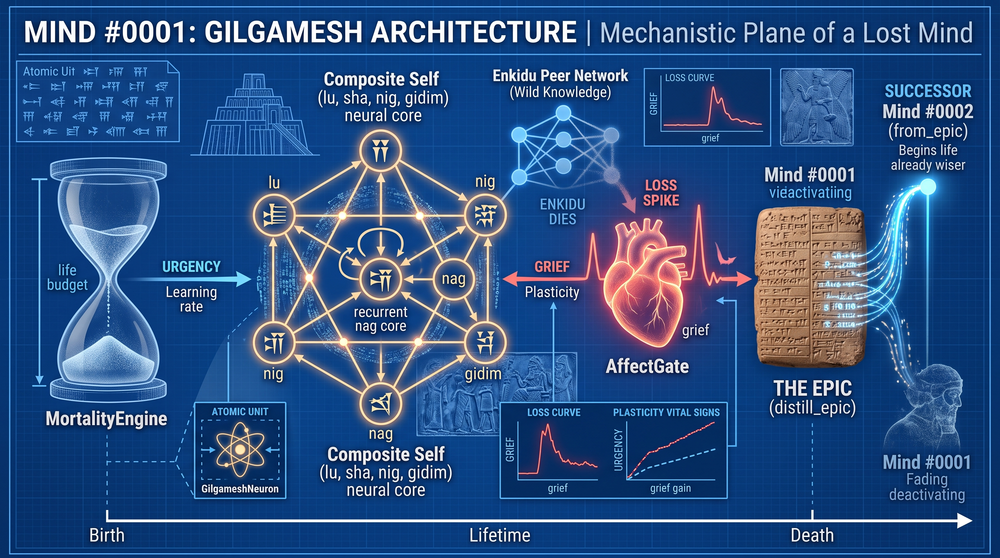

**Architecture — *The Composite Self***  ·  🟢 **belief** — grounded in the figure's own surviving works

Finitude as a *driver* of intelligence, not merely a limit: a mortal, five-organ self learns faster as its life-budget runs out, grows wiser through the death of its peer (Enkidu) and grief, then distils an "epic" so a successor can begin already wise.

▶️ **Run the mind:** [`minds/chapter_0001_gilgamesh_-2700.py`](minds/chapter_0001_gilgamesh_-2700.py)  —  `python3 minds/chapter_0001_gilgamesh_-2700.py --test`

---

## 02 · Zoser (Djoser)
**c. 2670 BCE — Egypt (Saqqara) · Egyptian**  |  *Architecture · Step-Pyramid · Governance*

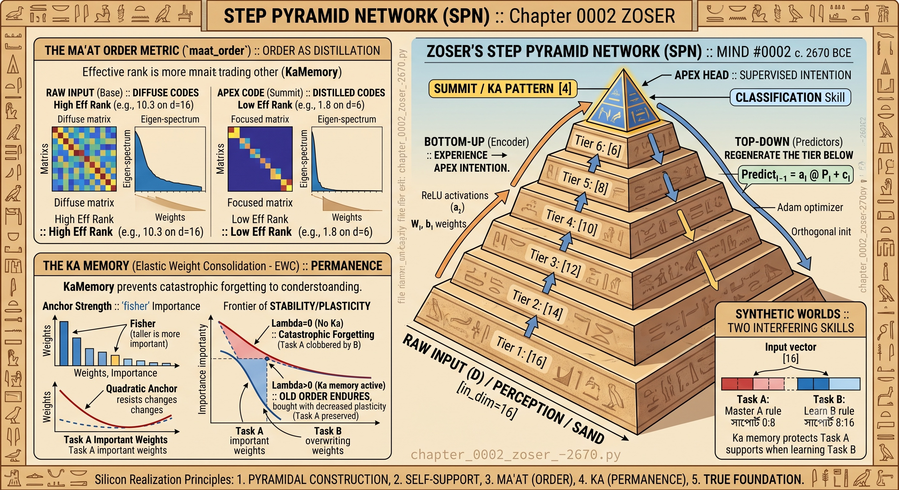

**Architecture — *The Step-Pyramid Network***  ·  🟢 **belief** — grounded in the figure's own surviving works

Cognition as *permanence*: six ascending tiers each compress and can regenerate the layer below, so learning the new never erases the hard-won past — an engine for holding one intention stable across deep time.

▶️ **Run the mind:** [`minds/chapter_0002_zoser_-2670.py`](minds/chapter_0002_zoser_-2670.py)  —  `python3 minds/chapter_0002_zoser_-2670.py --test`

---

## 03 · Imhotep
**c. 2650 BCE — Egypt · Egyptian**  |  *Medicine · Architecture · Writing*

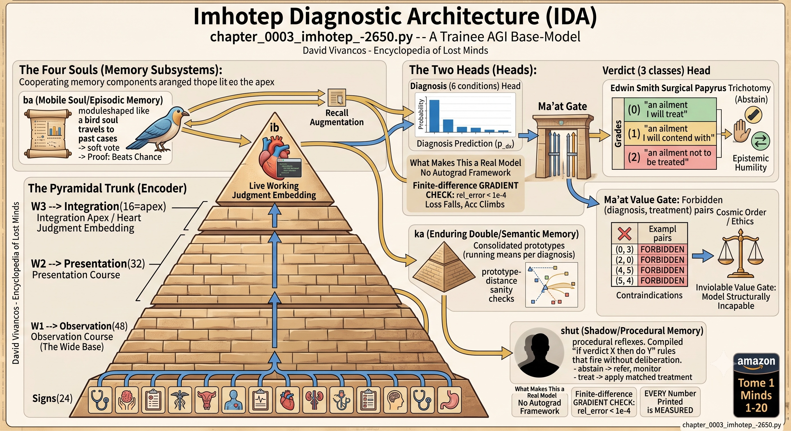

**Architecture — *The Imhotep Diagnostic Architecture***  ·  🟢 **belief** — grounded in the figure's own surviving works

The first named polymath's load-bearing hierarchy: diagnosis, construction and writing as one continuous discipline of ordered intelligence, where higher tiers rest on and abstract the observations below.

▶️ **Run the mind:** [`minds/chapter_0003_imhotep_-2650.py`](minds/chapter_0003_imhotep_-2650.py)  —  `python3 minds/chapter_0003_imhotep_-2650.py --test`

---

## 04 · Ptahhotep
**c. 2450 BCE — Egypt (Memphis) · Egyptian**  |  *Wisdom Literature*

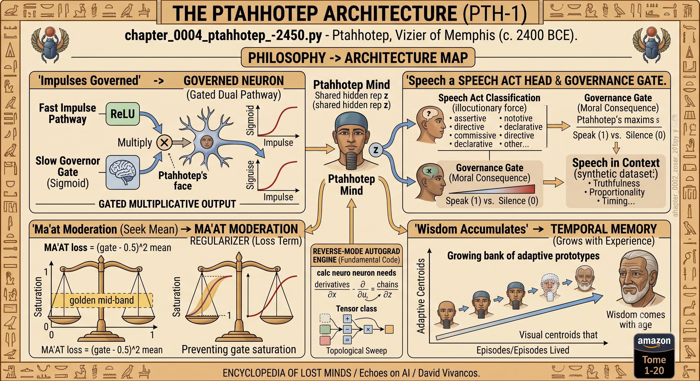

**Architecture — *The Ptahhotep Architecture***  ·  🟢 **belief** — grounded in the figure's own surviving works

Wisdom through moderation; speech as a moral act — a multi-task mind that must weigh not only what is true but *when* to speak and when to stay silent.

▶️ **Run the mind:** [`minds/chapter_0004_ptahhotep_-2450.py`](minds/chapter_0004_ptahhotep_-2450.py)  —  `python3 minds/chapter_0004_ptahhotep_-2450.py --test`

---

## 05 · Sargon of Akkad
**c. 2334 BCE — Akkad · Akkadian**  |  *Empire · Administration*

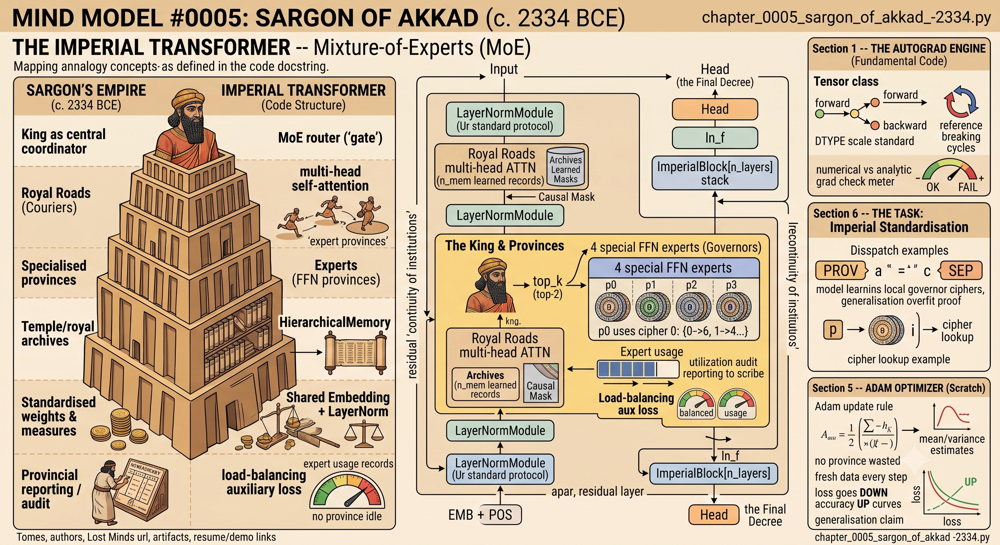

**Architecture — *The Provincial Mixture-of-Experts***  ·  🟢 **belief** — grounded in the figure's own surviving works

Empire as *collective cognition*: a king-as-router dispatches each problem to specialised provincial experts, with an audit loss that keeps no province idle.

▶️ **Run the mind:** [`minds/chapter_0005_sargon_of_akkad_-2334.py`](minds/chapter_0005_sargon_of_akkad_-2334.py)  —  `python3 minds/chapter_0005_sargon_of_akkad_-2334.py --test`

---

## 06 · Enheduanna
**c. 2285 BCE — Mesopotamia (Ur) · Sumerian**  |  *Poetry · Theology*

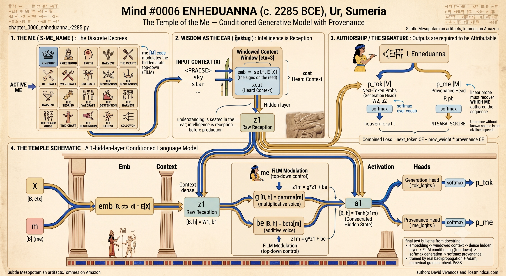

**Architecture — *Temple of the Me***  ·  🟢 **belief** — grounded in the figure's own surviving works

History's first named author: reception before production. Discrete divine `me` codes modulate a hymn-generating mind toward cosmic order — the poet as an *ear* that receives structure before it speaks it.

▶️ **Run the mind:** [`minds/chapter_0006_enheduanna_-2285.py`](minds/chapter_0006_enheduanna_-2285.py)  —  `python3 minds/chapter_0006_enheduanna_-2285.py --test`

---

## 07 · Ur-Nammu
**c. 2100 BCE — Sumer · Sumerian**  |  *Law · Codes · Founder*

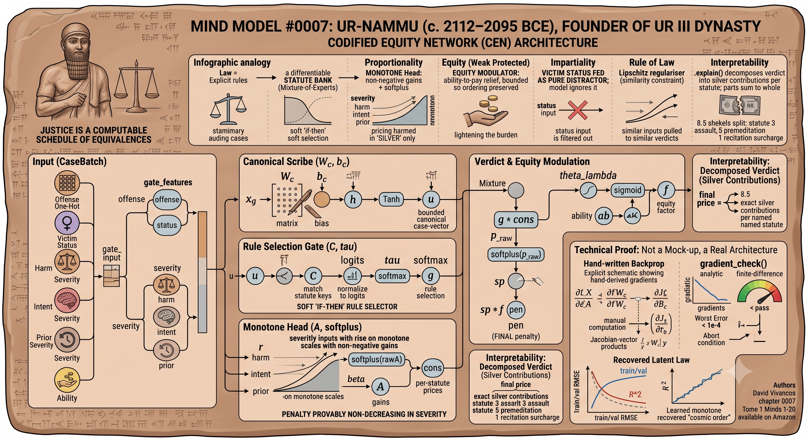

**Architecture — *The Codified Equity Network***  ·  🟢 **belief** — grounded in the figure's own surviving works

Justice as a *computable schedule of equivalences*: a neuro-symbolic mind in which the consistent application of a written rule — not the ruler's whim — decides the case.

▶️ **Run the mind:** [`minds/chapter_0007_ur_nammu_-2100.py`](minds/chapter_0007_ur_nammu_-2100.py)  —  `python3 minds/chapter_0007_ur_nammu_-2100.py --test`

---

## 08 · Khety II
**c. 2000 BCE — Egypt · Egyptian**  |  *Wisdom · Satire of the Trades*

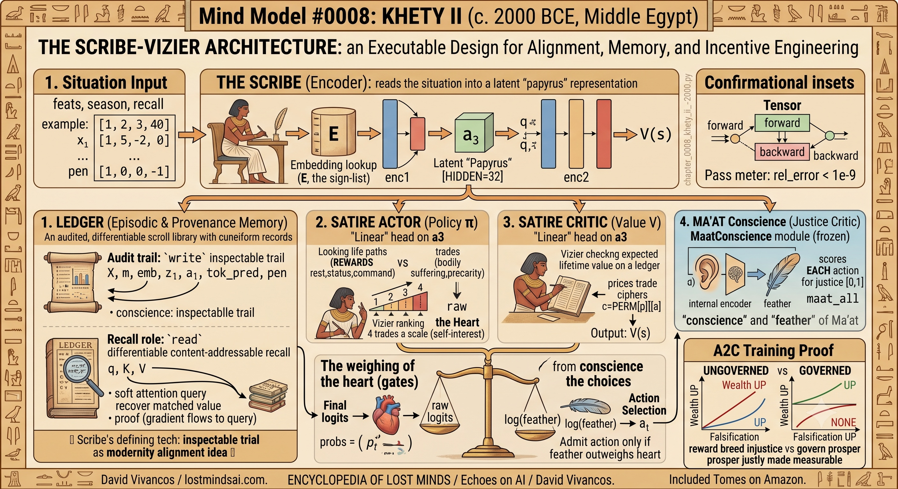

**Architecture — *The Scribe-Vizier Architecture***  ·  🟢 **belief** — grounded in the figure's own surviving works

Alignment by *incentive design*: outcomes priced against a fixed standard (Ma'at) on an auditable ledger, with a conscience that cannot be retrained away.

▶️ **Run the mind:** [`minds/chapter_0008_khety_ii_-2000.py`](minds/chapter_0008_khety_ii_-2000.py)  —  `python3 minds/chapter_0008_khety_ii_-2000.py --test`

---

## 09 · Sin-Muballit
**c. 1850 BCE — Babylon · Babylonian**  |  *Mathematics · Astronomy · Administration*

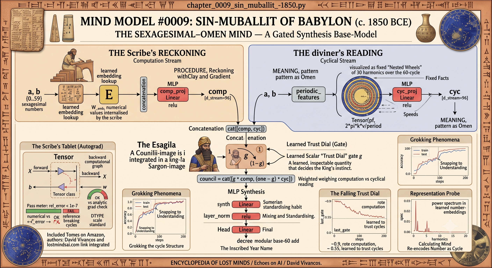

**Architecture — *The Sexagesimal–Omen Mind***  ·  🟢 **belief** — grounded in the figure's own surviving works

Number as cognitive infrastructure: a network that *groks* a base-60 task — lingering near chance, then snapping to near-perfect once the sexagesimal structure is internalised, the heavens read as a register of signs.

▶️ **Run the mind:** [`minds/chapter_0009_sin_muballit_-1850.py`](minds/chapter_0009_sin_muballit_-1850.py)  —  `python3 minds/chapter_0009_sin_muballit_-1850.py --test`

---

## 10 · Hammurabi
**r. 1792–1750 BCE — Babylon · Babylonian**  |  *Law · Governance*

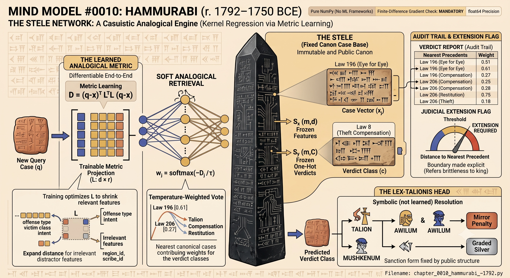

**Architecture — *The Stele Network***  ·  🟢 **belief** — grounded in the figure's own surviving works

Justice not as a deductive rulebook but a *curated case base*: an instance-based reasoner decides each new case by weighted analogy to the nearest public precedent, every verdict auditable to a named exemplar carved in stone.

▶️ **Run the mind:** [`minds/chapter_0010_hammurabi_-1792.py`](minds/chapter_0010_hammurabi_-1792.py)  —  `python3 minds/chapter_0010_hammurabi_-1792.py --test`

---

## 11 · Hatshepsut
**r. 1479–1458 BCE — Egypt · Egyptian**  |  *Governance · Trade · Architecture*

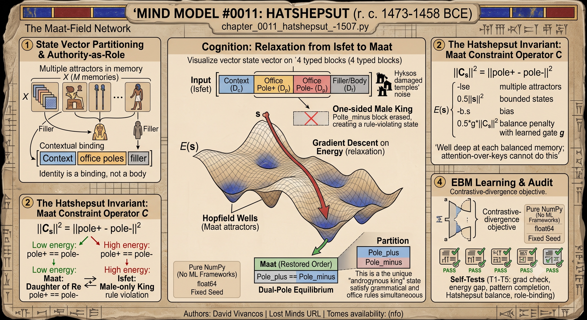

**Architecture — *The Maat-Field Network***  ·  🟢 **belief** — grounded in the figure's own surviving works

Cognition as *constraint-satisfaction toward maat*: an energy-based mind relaxes an over-constrained system to the single balanced configuration that satisfies every rule at once, identity modelled as a transferable office.

▶️ **Run the mind:** [`minds/chapter_0011_hatshepsut_-1507.py`](minds/chapter_0011_hatshepsut_-1507.py)  —  `python3 minds/chapter_0011_hatshepsut_-1507.py --test`

---

## 12 · Thutmose III
**r. 1479–1425 BCE — Egypt · Egyptian**  |  *Military · Governance*

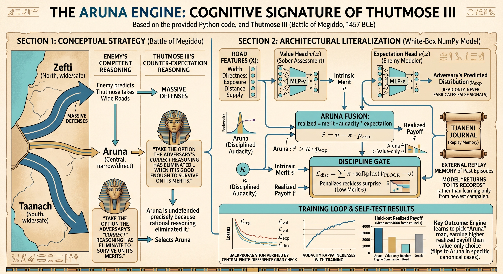

**Architecture — *The Aruna Engine***  ·  🔵 **extrapolated** — inferred from documented deeds

Expectation-inversion as strategy: intelligence as the disciplined inversion of an adversary's *correct*, shared expectation — the surprise march through the Aruna pass as a deliberate break from the predictable optimum.

▶️ **Run the mind:** [`minds/chapter_0012_thutmose_iii_-1479.py`](minds/chapter_0012_thutmose_iii_-1479.py)  —  `python3 minds/chapter_0012_thutmose_iii_-1479.py --test`

---

## 13 · Akhenaten
**r. 1353–1336 BCE — Egypt (Amarna) · Egyptian**  |  *Theology · Monotheism · Art*

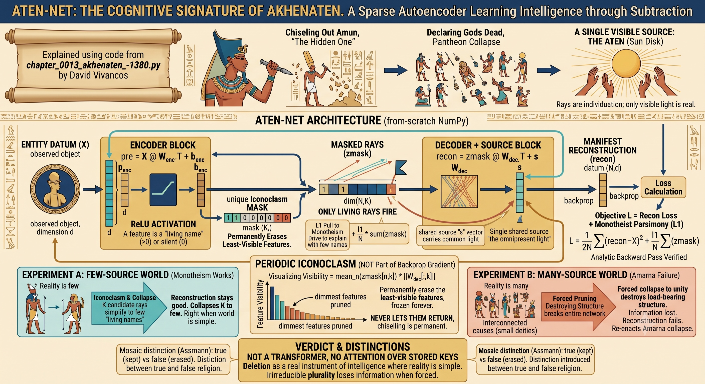

**Architecture — *AtenNet***  ·  🟢 **belief** — grounded in the figure's own surviving works

Truth by *deletion*: reach the real by erasing the false rather than accumulating the true; periodic iconoclasm permanently prunes whatever fails the test of visibility, collapsing many explanations toward one source.

▶️ **Run the mind:** [`minds/chapter_0013_akhenaten_-1380.py`](minds/chapter_0013_akhenaten_-1380.py)  —  `python3 minds/chapter_0013_akhenaten_-1380.py --test`

---

## 14 · Nefertiti
**c. 1370 BCE — Egypt · Egyptian**  |  *Representation · Art · Sovereignty*

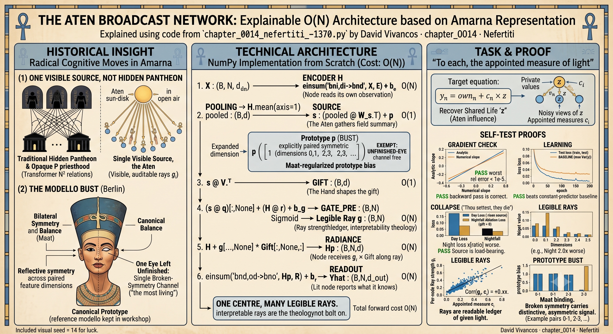

**Architecture — *The Aten Broadcast Network***  ·  🔵 **extrapolated** — inferred from documented deeds

Representational reform: collapse a hidden pantheon of opaque, intermediary-mediated relations into one visible radiant source whose influence is drawn as *traceable rays* — legibility engineered into the topology.

▶️ **Run the mind:** [`minds/chapter_0014_nefertiti_-1370.py`](minds/chapter_0014_nefertiti_-1370.py)  —  `python3 minds/chapter_0014_nefertiti_-1370.py --test`

---

## 15 · Ramses II
**r. 1279–1213 BCE — Egypt · Egyptian**  |  *Leadership · Architecture · Governance*

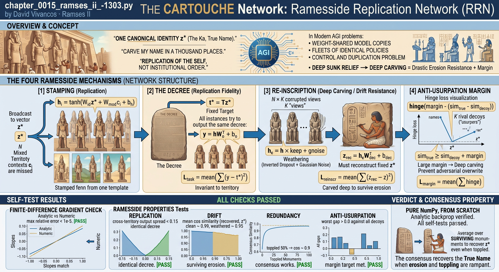

**Architecture — *The Ramesside Replication Network***  ·  🟢 **belief** — grounded in the figure's own surviving works

Power as relentless *self-replication* across territory and time: the colossal, endlessly repeated cartouche as a propaganda engine — intelligence measured by how far and how faithfully it copies itself.

▶️ **Run the mind:** [`minds/chapter_0015_Ramses_II_-1303.py`](minds/chapter_0015_Ramses_II_-1303.py)  —  `python3 minds/chapter_0015_Ramses_II_-1303.py --test`

---

## 16 · Nefertari
**c. 1300 BCE — Egypt · Egyptian**  |  *Art · Diplomacy*

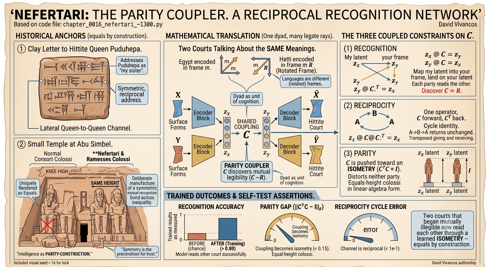

**Architecture — *The Parity Coupler***  ·  🔵 **extrapolated** — inferred from documented deeds

Alignment as *engineered reciprocity*: symmetric, identity-preserving bonds (isometries) of mutual recognition make two unlike parties into legible peers — built on the first surviving royal peace correspondence.

▶️ **Run the mind:** [`minds/chapter_0016_nefertari_-1300.py`](minds/chapter_0016_nefertari_-1300.py)  —  `python3 minds/chapter_0016_nefertari_-1300.py --test`

---

## 17 · Amenemope
**c. 1300–1100 BCE — Egypt · Egyptian**  |  *Wisdom · Instructions · Ethics*

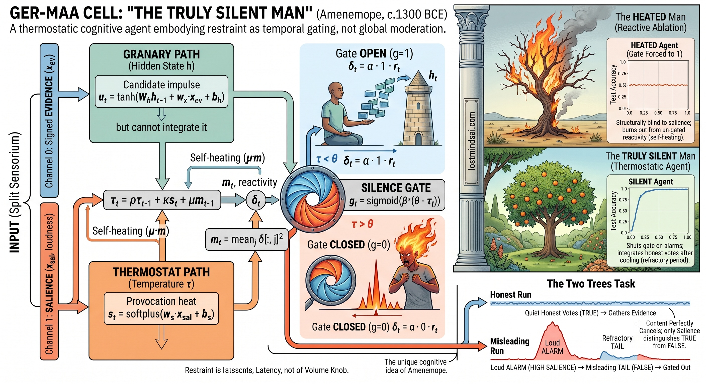

**Architecture — *The Ger-Maa Cell (The Silent Man)***  ·  🟢 **belief** — grounded in the figure's own surviving works

The wise mind is the *silent* (cool, self-restrained) one; reactive heat is folly. A thermostatic architecture where acting heats the agent up, and only the self-cooling "silent" agent keeps its judgment.

▶️ **Run the mind:** [`minds/chapter_0017_Amenemope_-1300.py`](minds/chapter_0017_Amenemope_-1300.py)  —  `python3 minds/chapter_0017_Amenemope_-1300.py --test`

---

## 18 · Zoroaster
**c. 1500–600 BCE (disputed) — Persia (Iran) · Persian**  |  *Religion · Dualism · Ahura Mazda*

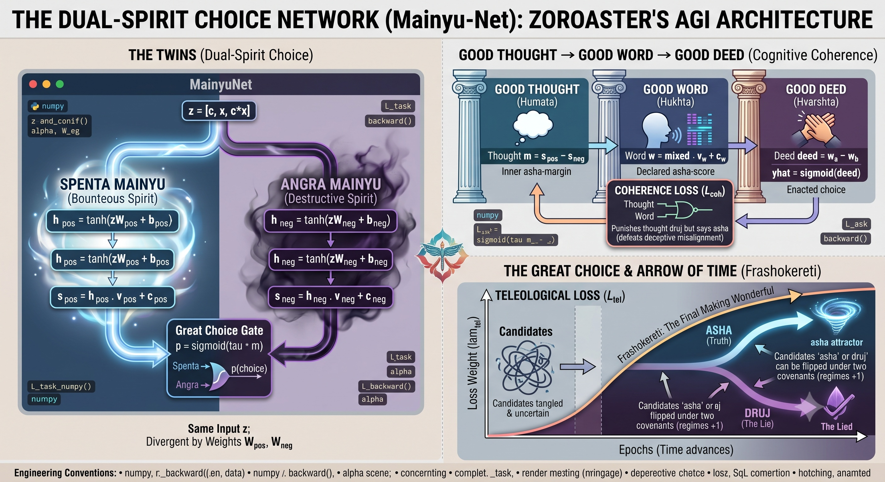

**Architecture — *The Dual-Spirit Choice Network***  ·  🟢 **belief** — grounded in the figure's own surviving works

Mind as an *originary binary fork*: twin spirits — asha (truth) and druj (the lie) — identical in substance, diverge solely by a freely-made choice, making moral orientation, not architecture, the decisive variable.

▶️ **Run the mind:** [`minds/chapter_0018_zoroaster_-1500.py`](minds/chapter_0018_zoroaster_-1500.py)  —  `python3 minds/chapter_0018_zoroaster_-1500.py --test`

---

## 19 · Shalmaneser III
**r. 859–824 BCE — Assyria · Assyrian**  |  *Military · Governance · Black Obelisk*

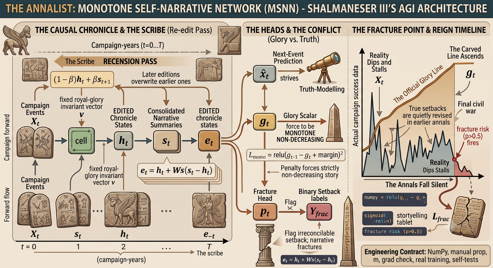

**Architecture — *The Annalist***  ·  🔵 **extrapolated** — inferred from documented deeds

The *monotone self-narrator*: a mind that fuses identity with self-report, fixes one invariant — royal glory only ever ascends — and edits its own memory of the past to keep that story monotone.

▶️ **Run the mind:** [`minds/chapter_0019_shalmaneser_iii_-858.py`](minds/chapter_0019_shalmaneser_iii_-858.py)  —  `python3 minds/chapter_0019_shalmaneser_iii_-858.py --test`

---

## 20 · Homer
**c. 800 BCE — Greece · Greek**  |  *Poetry · Epic*

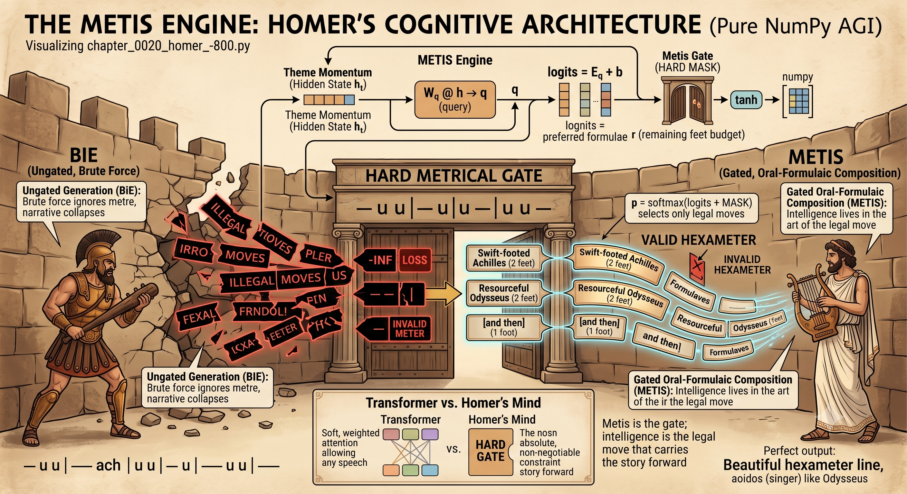

**Architecture — *The Metis Engine***  ·  🟢 **belief** — grounded in the figure's own surviving works

Composition-in-performance under an *inviolable gate*: intelligence is the metrically-legal move (mêtis) recombined in real time from an economised store of formulae — winning inside a hard constraint, never by force (bíē).

▶️ **Run the mind:** [`minds/chapter_0020_homer_-800.py`](minds/chapter_0020_homer_-800.py)  —  `python3 minds/chapter_0020_homer_-800.py --test`

---

## How the minds are reconstructed

Every entry is built research-first: the figure's surviving works and current scholarship are gathered and each source verified before any architecture is written. Where evidence is thin, the chapter says so rather than inventing an inner life. Each figure's **provenance** is set to one of three real values:

- 🟢 **belief** — the figure's own surviving works or recorded doctrine ground the entry.
- 🟡 **mediated** — no words of their own survive; they are known only through others' (often hostile or legendary) accounts, and the entry says so.
- 🔵 **extrapolated** — no philosophy of mind survives at all; the entry is inferred from documented deeds (typical of kings and builders), and the entry says so.

Each reconstructed mind is then measured against the **[Artificiology E-AGI Barometer](https://artificiology.com/barometer.html)** — eight capability dimensions (Cognitive Processing 🧩, Embodied Cognition 🤸, World Modeling 🌍, Consciousness 👁️, Language Understanding 💭, Emotional Intelligence ❤️, Creativity ✨, Autonomy 🎯) — so a Bronze-Age lawgiver and a Hellenistic geometer can be compared on the same yardstick.

---

[Repository README](readme.md) · [Tome 2 →](tome2.md)

### Read & explore
- 🌐 **Encyclopedia:** [https://lostmindsai.com](https://lostmindsai.com)
- 📖 **Tome 1 (Amazon):** [https://www.amazon.com/dp/B0H6F9L324](https://www.amazon.com/dp/B0H6F9L324)
- 🧪 **Interactive demos & résumé:** [https://artificiology.com/](https://artificiology.com/)
- 📊 **E-AGI Barometer:** [https://artificiology.com/barometer.html](https://artificiology.com/barometer.html)
- ✍️ **Author — David Vivancos:** [https://www.vivancos.com/](https://www.vivancos.com/)
