# Tome 10 — Minds 181–200
### *The Anchored Mind — Tang China, Silla, Nālandā's Heirs, Northumbria & the First Jurists of Islam*
**Encyclopedia of Lost Minds: Echoes on AI** · *581 – 711 CE*

[🌐 Encyclopedia](https://lostmindsai.com) · [📖 Buy Tome 10 on Amazon](https://www.amazon.com/dp/B0HJYMZ3G6) · [🧪 Interactive Demos](https://artificiology.com/) · [📊 E-AGI Barometer](https://artificiology.com/barometer.html) · [✍️ Author](https://www.vivancos.com/) · [⭐ Repository](https://github.com/DavidVivancos/LostMindsAI)

[← Tome 9](tome9.md) · [Repository README](readme.md)

---

Tome 10 runs from **Sun Simiao** to **Malik ibn Anas** — twenty reconstructed minds, each rendered on two planes. The **abstract plane** distils the thinker's cognitive signature into an interactive 3D mind-map; the **mechanistic plane** turns that same signature into a small, *runnable* neural architecture, built from scratch in NumPy, gradient-checked, trained and self-tested.

This page collects the twenty **visual mind-map explainers** for this tome and links each to its companion architecture. Runnable code lives in [`minds/`](minds/); the explainer images live in [`maps/`](maps/).

> Every architecture here executes and passes its own self-test suite (a mandatory finite-difference gradient check plus a real training loop). No number is hard-coded — each is produced live on the machine that runs the file.

Where Tome 9 asked what a mind may do with what it holds in trust, Tome 10 asks where a mind may act *from* when nothing it holds resembles the case in front of it — the patient whose pain is felt where the root is not, the text corrupt in every recension, the province that does not report, the field on which fear may or may not be idle, the question that has no answer. All twenty begin by refusing the same operation: look up the case among the cases you remember, weight the nearest, and act from there. What they put in its place is the volume — the reply of a body under pressure, the exact recovery of a whole never seen, the removal of what one was projecting, the prototype an image points to, a term fixed in heaven, a fear interrogated by a fact, a tablet in the mud nobody could reach. If the previous tome's keyword was *custody*, this one's is *anchor*: the point from which a mind acts, and what is allowed to set it.

---

## The Twenty at a Glance

| # | Mind | Era | Civilization | Architecture | Provenance |
|---|------|-----|--------------|--------------|:----------:|
| 181 | [Sun Simiao](#181--sun-simiao) | 581 – 682 CE | Chinese (Sui–Tang) | *Qianjin — The Palpation Machine* | 🟢 |
| 182 | [Brahmagupta](#182--brahmagupta) | c. 598 – 668 CE | Indian (Gurjaradeśa) | *The Kṣepa Ledger — a Bhāvanā Composition Network* | 🟢 |
| 183 | [Xuanzang](#183--xuanzang) | 602 – 664 CE | Chinese (Tang) | *Ālaya — The Seed-Store Network* | 🟢 |
| 184 | [Anania Shirakatsi](#184--anania-shirakatsi) | c. 610 – 685 CE | Armenian | *ShirakNet — The Residue Ledger* | 🟢 |
| 185 | [Fujiwara no Kamatari](#185--fujiwara-no-kamatari) | 614 – 669 CE | Japanese (Yamato) | *The Naidaijin Architecture — a Regency Network* | 🟡 |
| 186 | [Wonhyo](#186--wonhyo) | 617 – 686 CE | Korean (Silla) | *Ilsim — The Two-Gate Unhinderer* | 🟢 |
| 187 | [Empress Wu Zetian](#187--empress-wu-zetian) | 624 – 705 CE | Chinese (Tang / Zhou) | *The Zhao Engine (曌)* | 🔵 |
| 188 | [Huineng](#188--huineng) | 638 – 713 CE | Chinese (Tang) | *The Caoxi Mirror Network* | 🟡 |
| 189 | [Qaṭarī ibn al-Fujāʾa](#189--qaṭarī-ibn-al-fujāʾa) | c. 640 – 698 CE | Arab (Azraqī Khārijite) | *The Two-Voice Network* | 🟢 |
| 190 | [Fazang](#190--fazang) | 643 – 712 CE | Chinese (Tang, Sogdian descent) | *The Jewel That Counts the Others — an Indra-net equilibrium neuron* | 🟢 |
| 191 | [Kumārila Bhaṭṭa](#191--kumārila-bhaṭṭa) | fl. c. 660 CE | Indian (Mīmāṃsā) | *The Bhaṭṭa Engine — a defeasible-warrant architecture* | 🟢 |
| 192 | [Bede of Jarrow](#192--bede-of-jarrow) | c. 673 – 735 CE | Anglo-Saxon (Northumbria) | *The Concordance Engine* | 🟢 |
| 193 | [St. Boniface](#193--st-boniface) | c. 675 – 754 CE | Anglo-Saxon (Wessex, Frankia) | *The Orthography of Grace — a Dual-Channel Reference Engine* | 🟢 |
| 194 | [John of Damascus](#194--john-of-damascus) | c. 675 – 749 CE | Syrian (Umayyad Damascus) | *Anaphora — The Prototype-Referral Machine* | 🟢 |
| 195 | [Yi Xing](#195--yi-xing) | 683 – 727 CE | Chinese (Tang) | *The Dayan Interpolation Engine (大衍曆機)* | 🟢 |
| 196 | [Wang Wei](#196--wang-wei) | 699 – 759 CE | Chinese (Tang) | *The Still-Mirror Network — Non-Abiding Reflection* | 🟢 |
| 197 | [Abu Hanifa](#197--abu-hanifa) | c. 699 – 767 CE | Persian (Arab-Islamic, Kufa) | *The Istiḥsān Reasoner* | 🟡 |
| 198 | [Shankara](#198--shankara) | c. 700 – 750 CE | Indian (Kerala) | *The Adhyāsa-Sublation Network* | 🟢 |
| 199 | [Li Bai](#199--li-bai) | 701 – 762 CE | Chinese (Tang) | *Dapeng — the Banished-Immortal Ascent Engine* | 🟢 |
| 200 | [Malik ibn Anas](#200--malik-ibn-anas) | c. 711 – 795 CE | Arab (Medina) | *The Muwaṭṭaʾ Network — ʿAmal-Consensus Grounding* | 🟢 |

**Provenance** — 🟢 belief · 🟡 mediated · 🔵 extrapolated. See [How the minds are reconstructed](#how-the-minds-are-reconstructed).

---

## 181 · Sun Simiao
**581 – 682 CE — Mount Taibai & Chang'an · Chinese (Sui–Tang)**  |  *Medicine · Pharmacology · Yangsheng*

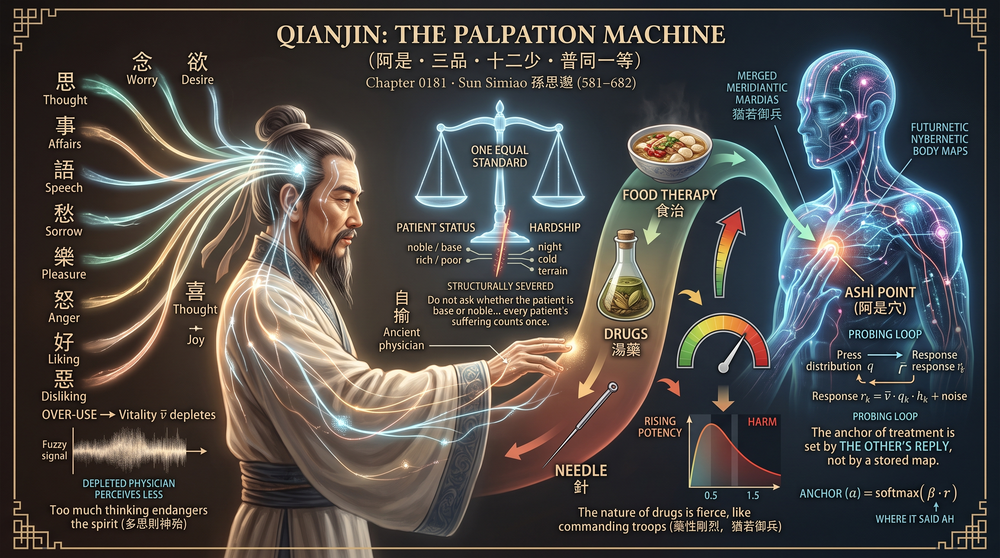

**Architecture — *Qianjin — The Palpation Machine (阿是 · 三品 · 十二少 · 普同一等)***  ·  🟢 **belief** — grounded in the figure's own surviving works

Four ideas from the *Qianjin yaofang* made mechanical. The **ashi point**: a probing loop spends pressure over twelve loci, the simulated body replies in proportion to pressure and vitality, and the anchor of treatment is set by the accumulated replies through a kernel no parameter can override — *do not ask the chart*. The **three grades**: food, drug and needle as a cascade of rising potency and rising harm, with the harm placed in the body rather than in the loss, and the needle reachable only through the drug. The **twelve fewers**: twelve named channels whose vitality drains when over-driven, so the physician trained where over-use is free runs hot and loses acuity. The **equal standard**: rank, wealth and fee are visible in the input and structurally disconnected from the treatment path — a missing wire, not a rule. Four physicians (Great, Chart, Uncultivated, Worldly) are trained and compared. Accepts `--quick`.

▶️ **Run the mind:** [`minds/chapter_0181_sun_simiao_581.py`](minds/chapter_0181_sun_simiao_581.py)  —  `python3 minds/chapter_0181_sun_simiao_581.py`

---

## 182 · Brahmagupta
**c. 598 – 668 CE — Bhillamāla (Bhinmal) · Indian (Gurjaradeśa, Brāhmapakṣa school)**  |  *Mathematics · Algebra · Astronomy*

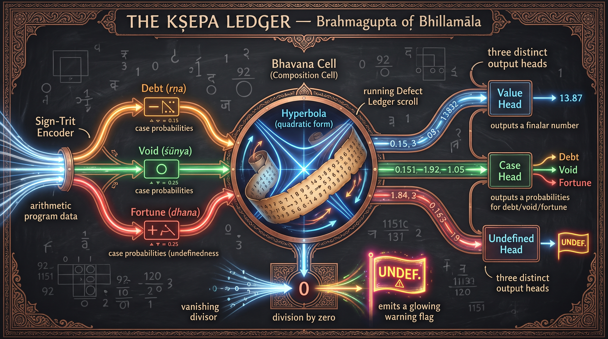

**Architecture — *The Kṣepa Ledger — a Bhāvanā Composition Network***  ·  🟢 **belief** — grounded in the figure's own surviving works

A network whose hidden state is a pair of vectors on a quadratic form and whose tokens are composed into it by Brahmagupta's own identity for the varga-prakṛti, (x₁,y₁;k₁)∘(x₂,y₂;k₂) = (x₁y₂+x₂y₁, y₁y₂+N·x₁x₂; k₁·k₂), so that the **defect** of a compound is exactly the product of the defects of its parts and travels beside every result. A case-gate classifies every scalar as fortune, debt or void with the void a positive state of its own; a division unit returns a value welded to a **khahara** flag that cannot be dropped; the memory is a running logarithm — a ledger, not a state; and the loss never grades a number written for an undefined quantity. His 0 ÷ 0 = 0 is reproduced faithfully with the one-term correction beside it. Against a plain recurrent net it guesses worse and never fabricates a number where there is none.

▶️ **Run the mind:** [`minds/chapter_0182_brahmagupta_598.py`](minds/chapter_0182_brahmagupta_598.py)  —  `python3 minds/chapter_0182_brahmagupta_598.py`

---

## 183 · Xuanzang
**602 – 664 CE — Chenliu, Chang'an & Nālandā · Chinese (Tang)**  |  *Yogācāra philosophy · Translation · Pilgrimage*

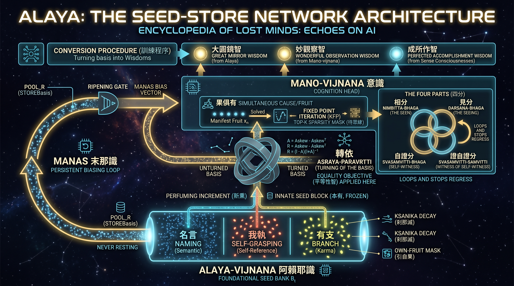

**Architecture — *Ālaya — The Seed-Store Network***  ·  🟢 **belief** — grounded in the figure's own surviving works

A transcription of the *Cheng weishi lun* as an executable specification: forty-eight seeds in three channels that may not bleed, each with an innate block frozen against both gradient and perfuming and a perfumable learned block; six formal conditions on every disposition (instantaneous perishing, coexistence with its fruit, unbroken continuity, determinate polarity, ripening only when conditions gather, producing only its own kind) enforced by masks rather than penalties; a closed loop in which old seed produces activity and activity perfumes new seed; a persistent eight-dimensional **manas** that never sleeps and takes the store for a self; four parts of cognition closed into a loop; and the turning of the basis as an exactly orthogonal Cayley rotation of the store. The task — recover a hidden doctrine from corrupt recensions, one court-endorsed — shows that work on the record is worth a doubling and work on the reader almost nothing.

▶️ **Run the mind:** [`minds/chapter_0183_xuanzang_602.py`](minds/chapter_0183_xuanzang_602.py)  —  `python3 minds/chapter_0183_xuanzang_602.py`

---

## 184 · Anania Shirakatsi
**c. 610 – c. 685 CE — Shirak & Trebizond · Armenian**  |  *Mathematics · Cosmography · Calendar*

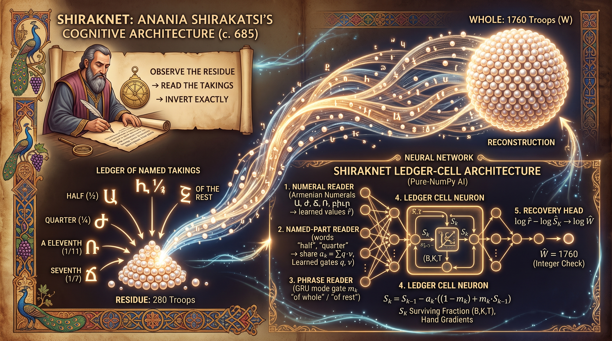

**Architecture — *ShirakNet — The Residue Ledger***  ·  🟢 **belief** — grounded in the figure's own surviving works

Every problem in the *Book of Arithmetic* has one shape — a whole never observed, named takings, a counted residue — and so does the network. Its novel cell is the **ledger cell**: a single scalar state, the fraction of the unobserved whole that still survives, updated by each taking under one of two grammars read from a single word in the phrase (of the whole, which adds; of the remainder, which multiplies), with a positivity barrier instead of a clamp so an over-subtracted ledger keeps its gradient. A phrase reader finds which words carry quantity, a table-snap grounds each learned magnitude to the complete table of unit fractions for exact re-reckoning, an integrality check gives the learner a test independent of the teacher, and a **certificate** lets the mind answer anything but teach only what it was taught to completion. The lineage experiment shows the certified line abstaining where untaught and the uncertified teaching its blanks forever. Accepts `--quick`.

▶️ **Run the mind:** [`minds/chapter_0184_anania_shirakatsi_610.py`](minds/chapter_0184_anania_shirakatsi_610.py)  —  `python3 minds/chapter_0184_anania_shirakatsi_610.py`

---

## 185 · Fujiwara no Kamatari
**614 – 669 CE — Asuka & Ōmi · Japanese (Yamato)**  |  *Governance · Ritual · Regency*

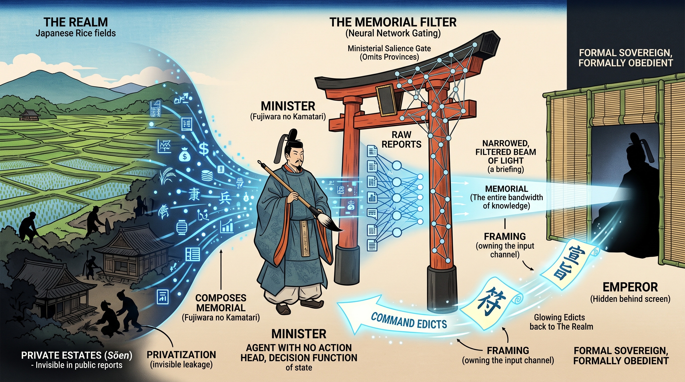

**Architecture — *The Naidaijin Architecture — a Regency Network***  ·  🟡 **mediated** — known only through others' accounts

A simulated realm of provinces with a fourth, unreported state variable (private estates that grow through lawful operation), a sovereign policy that issues edicts, and between them an **Inner Minister** with all information and no authority, whose only lever is a per-province salience gate on how far each province enters the memorial — never rewarded, never penalised, and found unprompted. Nothing in the memorial is false; the power is in what it omits. A Regency Index measures the counterfactual force of the silences, a Concealment Index the share of swelling estates kept from sight, and every Minister parameter can be corrupted by noise without moving an edict by one part in 10¹². Against it stand the three instruments that see the realm: a hash-chained ledger the Minister cannot edit, a randomly redrawn out-of-band audit, and an **Ōharae operator** that strikes the most privatised hidden units every fortieth step, unconditionally, even on a clean ledger.

▶️ **Run the mind:** [`minds/chapter_0185_fujiwara_no_kamatari_614.py`](minds/chapter_0185_fujiwara_no_kamatari_614.py)  —  `python3 minds/chapter_0185_fujiwara_no_kamatari_614.py`

---

## 186 · Wonhyo
**617 – 686 CE — Amnyang & Gyeongju, Silla · Korean**  |  *Buddhist philosophy · Logic · Exegesis*

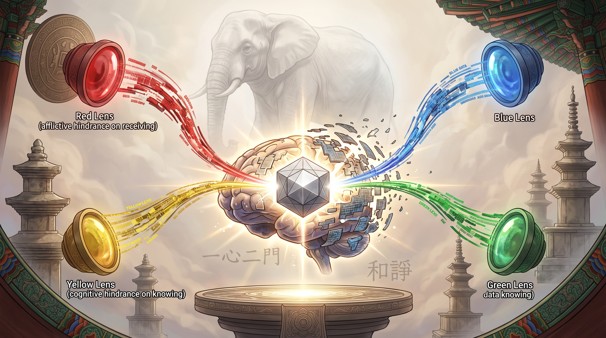

**Architecture — *Ilsim — The Two-Gate Unhinderer (一心二門)***  ·  🟢 **belief** — grounded in the figure's own surviving works

Harmonisation of disputes as a mechanism. Each claim's **gate** — its aspect, scope and intent — is inferred from vocabulary alone as a posterior over six doors offered to four voices; every claim is translated onto one ground and combined coordinate by coordinate only from the voices that touched that coordinate; the substrate is a fixed random matrix drawn once and never trained, and learning consists of two families of hindrance masks (afflictive, cognitive) lifted from it. A lossless-opening loss requires that every voice be regenerated through its own door without loss, a movable frame supplies valence and must be turned without moving the object (the skull at Dangjugye), and a contradictory-inference fault stops the mind rather than average it. Three crippled minds — attached, narrow, hindered — fail on exactly the regime their missing doctrine was for, and the free mind finds its own number of gates. Accepts `--quick`.

▶️ **Run the mind:** [`minds/chapter_0186_wonhyo_617.py`](minds/chapter_0186_wonhyo_617.py)  —  `python3 minds/chapter_0186_wonhyo_617.py`

---

## 187 · Empress Wu Zetian
**624 – 705 CE — Chang'an & Luoyang · Chinese (Tang; Zhou interregnum 690–705)**  |  *Governance · Rectification of names*

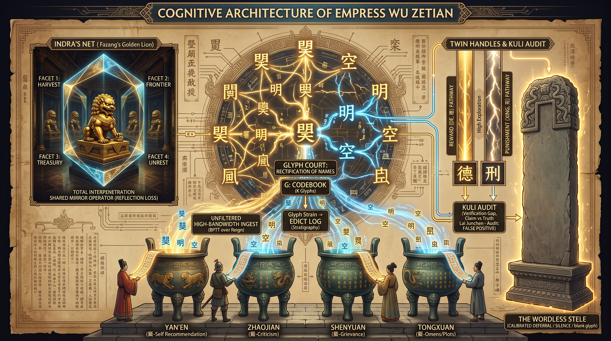

**Architecture — *The Zhao Engine (曌) — a Rectification-of-Names architecture***  ·  🔵 **extrapolated** — inferred from documented deeds

The one mind in the corpus that seized the symbol layer, built as four mechanisms. **Four Urns**: four typed ingest projections with a learned, audit-conditioned credibility gate per source, computed from track record rather than content — fabricators settle at half credibility, correlation with fabricator status ≈ −0.97. **Two Handles**: two valuation heads on different clocks, punishment learning three times faster than reward, culled only against verified outcomes. **The Codebook**: a soft symbol inventory that mints a new glyph when an old one is overloaded, by splitting along the axis of its own residuals, and enters every coinage in an **Edict Log** so the ontology can be dated. **The Stele**: a selective head held to a coverage quota, so silence is discrimination and not escape. A holographic four-facet state, after Fazang, is verified to cost ~12 % when one facet is blinded, against ~63 % without the constraint.

▶️ **Run the mind:** [`minds/chapter_0187_empress_wu_zetian_624.py`](minds/chapter_0187_empress_wu_zetian_624.py)  —  `python3 minds/chapter_0187_empress_wu_zetian_624.py`

---

## 188 · Huineng
**638 – 713 CE — Xinzhou, Huangmei & Caoxi · Chinese (Tang)**  |  *Chan Buddhism*

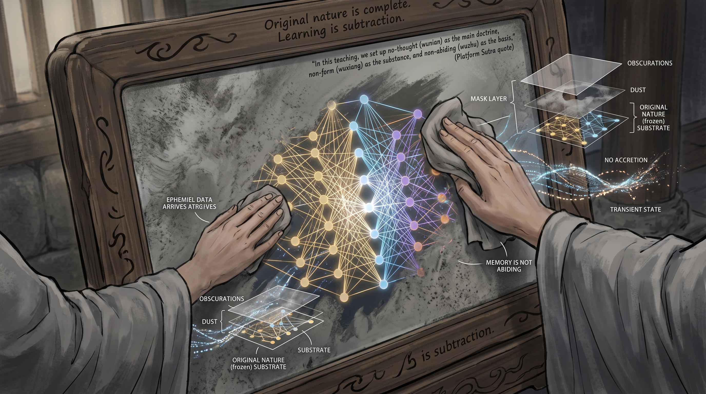

**Architecture — *The Caoxi Mirror Network (CMN) — learning as subtraction***  ·  🟡 **mediated** — known only through others' accounts

Every other architecture here learns by adding; this one cannot. Thirty-one thousand random weights are frozen at birth and proven bitwise unchanged at the end; the only trainable parameters are twenty-two thousand **clarity** values, one per coupling, initialised at one-half and driven transparent or occluded, then hardened to a binary keep/delete to show the competence lives in a subnetwork of the untouched substrate. Non-abiding is a state variable: every memory passes through an abiding coefficient recomputed each instant under a standing penalty on holding; one mask is tied across what is retained and how it acts (essence and function one substance); units come in antipodal pairs of which the readout sees only the difference (the thirty-six pairs). Trained on a rule-stream with revocations, it separates perseveration from forgetting, and its competence curve shows the sudden step his tradition called awakening.

▶️ **Run the mind:** [`minds/chapter_0188_huineng_sixth_patriarch_638.py`](minds/chapter_0188_huineng_sixth_patriarch_638.py)  —  `python3 minds/chapter_0188_huineng_sixth_patriarch_638.py`

---

## 189 · Qaṭarī ibn al-Fujāʾa
**c. 640 – 698 CE — Qaṭar coast, Ahwaz, Fars & Ṭabaristān · Arab (Umayyad era, Azāriqa)**  |  *Poetry · Military command · Khārijite imamate*

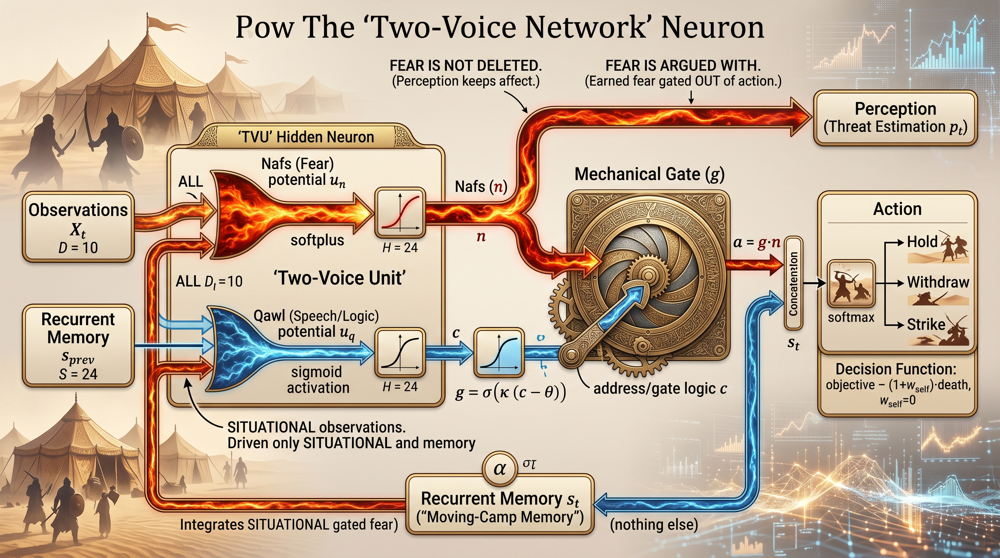

**Architecture — *The Two-Voice Network — a neuron that argues with its own fear***  ·  🟢 **belief** — grounded in the figure's own surviving works

Each unit holds two potentials: a **nafs** potential — fear, a softplus driven by every cue — and a **qawl** potential, a second voice driven only by situational cues (the road, the river, the freshness of the enemy's horses) that estimates whether the outcome depends on the act. Fear reaches the world model unconditionally and reaches the action head only through that contingency gate, paying a standing price (*ṣabr*) for passing, so it is admitted only where it buys a better decision. A slow camp memory travels with the agent and receives no affect. The value function that produces the labels has no term for the agent's own survival (*w_self = 0*, the sellers). Controls *nafs*, *flood* and *blind* bracket the design, and a final council experiment reproduces the schism of 77 AH: an ensemble that expels its dissenters collapses to one voice and loses its ears.

▶️ **Run the mind:** [`minds/chapter_0189_qatari_ibn_al-fujaa_640.py`](minds/chapter_0189_qatari_ibn_al-fujaa_640.py)  —  `python3 minds/chapter_0189_qatari_ibn_al-fujaa_640.py`

---

## 190 · Fazang
**643 – 712 CE — Chang'an & Luoyang · Chinese (Tang), Sogdian descent**  |  *Huayan philosophy · Metaphysics*

**Architecture — *The Jewel That Counts the Others — an Indra-net reflective-equilibrium neuron***  ·  🟢 **belief** — grounded in the figure's own surviving works

Every mechanism lifted from an attested Huayan text. Jewels reflect one another to a fixed depth until the hall settles (mutual inclusion, images of images); a **power gate** between every pair is antisymmetric by construction, so the two directions of causal power sum to exactly one and no jewel can hoard it (有力／無力, power conserved); a same-body channel runs through each jewel's own state and a different-body channel through all the others; a **total-cause** matrix has no zero off its diagonal (the rafter is the building); the readout is demanded of a single randomly chosen jewel each training step and may be asked of any at test (principal and retinue, rotating); and the six characteristics are trained as a loss. On the golden-lion and ten-coins tasks a corner facet names the whole as readily as the centre, and the same identity makes the whole fragile exactly where the doctrine says a building is. Accepts `--quick`, `--gradcheck-only`, `--seed`.

▶️ **Run the mind:** [`minds/chapter_0190_Fazang_643.py`](minds/chapter_0190_Fazang_643.py)  —  `python3 minds/chapter_0190_Fazang_643.py`

---

## 191 · Kumārila Bhaṭṭa
**fl. c. 660 CE — southern India · Indian (Pūrva Mīmāṃsā)**  |  *Epistemology · Philosophy of language · Ritual*

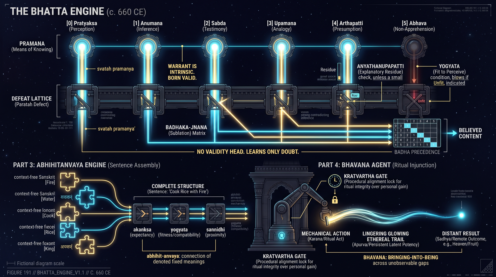

**Architecture — *The Bhaṭṭa Engine — a defeasible-warrant cognitive architecture***  ·  🟢 **belief** — grounded in the figure's own surviving works

Intrinsic validity as wiring. Six organs — perception, inference, testimony, analogy, presumption, non-apprehension — emit cognitions at maximum warrant, and there is no parameter anywhere whose role is to score truth: an executable test fails if one exists. Learning is entirely defeat: a bank of **defect detectors**, one per source-type, trained only on defective-versus-sound conditions of production, multiplies warrant down; a *yogyatā* gate credits an absence only where presence would have registered and a presumption gate fires only on a genuine explanatory residue; a strictly ordered **bādha lattice** resolves contradiction by clean overruling within a jurisdiction, never by averaging. A persistent, slowly decaying *apūrva* latent carries long-horizon credit. Against a *parataḥ* baseline with a verifier head, the engine matches while learning less, degrades less as truth-labels are withdrawn — and believes the flawless, authorless lie with full confidence, as its maker's doctrine predicts.

▶️ **Run the mind:** [`minds/chapter_0191_kumarila_bhatta_660.py`](minds/chapter_0191_kumarila_bhatta_660.py)  —  `python3 minds/chapter_0191_kumarila_bhatta_660.py`

---

## 192 · Bede of Jarrow
**c. 673 – 735 CE — Monkwearmouth–Jarrow · Anglo-Saxon (Northumbria)**  |  *Computus · Historiography · Natural science*

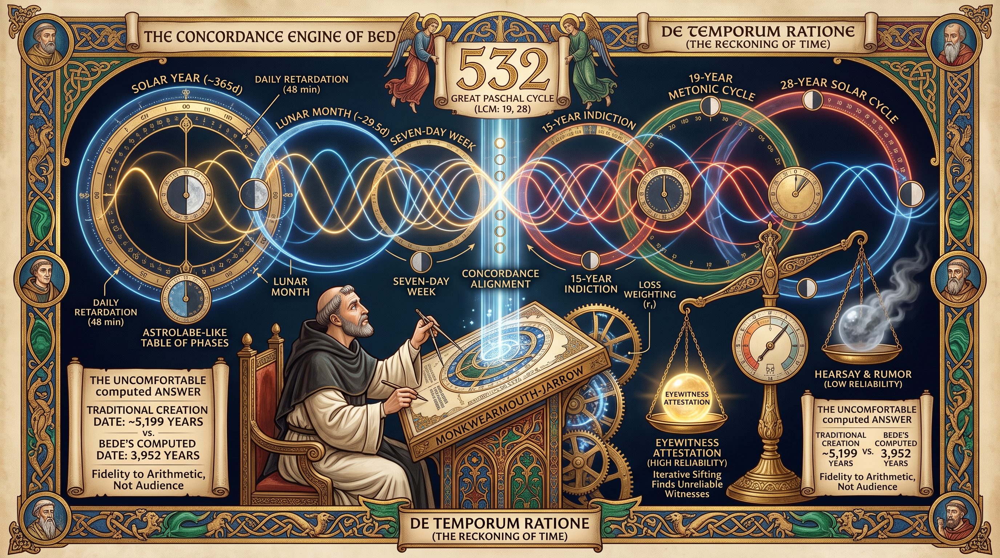

**Architecture — *The Concordance Engine — prediction by phase***  ·  🟢 **belief** — grounded in the figure's own surviving works

Computus as a theory of intelligence. A bank of oscillators with periods and phases — some fixed by nature (19, 28, 7, 15), some free to be discovered — reads a short window and predicts by phase-lag rather than by recollection of instances; the phase difference of every pair is a first-class quantity, and the readout is a function of alignments. Every witness enters with an **attestation weight** and, where none is given, is demoted when it refuses to cohere, so a reconciliation over a salted corpus is dragged off truth while the weighted one stands clear. The least common multiple of the canonical periods is recomputed and confirmed by search as 532 — the great cycle made a fact the machine can prove about itself. Two ablations, a recollection model and an unweighted model, show what the reckoning buys.

▶️ **Run the mind:** [`minds/chapter_0192_bede_673.py`](minds/chapter_0192_bede_673.py)  —  `python3 minds/chapter_0192_bede_673.py`

---

## 193 · St. Boniface
**c. 675 – 754 CE — Wessex, Hesse, Thuringia & Frisia · Anglo-Saxon (Latin Christendom)**  |  *Grammar · Mission · Church order*

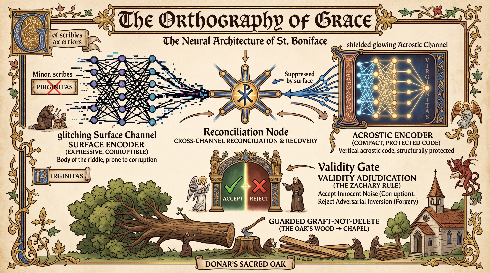

**Architecture — *The Orthography of Grace — a Dual-Channel Reference Engine***  ·  🟢 **belief** — grounded in the figure's own surviving works

The acrostic as a theory of reference. Every input is read twice: by a large expressive **surface** encoder and by a small compressed **protected** encoder, and witnesses map many-to-one onto references so several independent attestations can point at one meaning. Reconciliation lets the protected channel prevail when they disagree; a validity adjudicator does not ask whether an input is clean but whether a confident surface points away from the protected reference — admitting the garbled baptism that still reconciles and refusing the polished forgery whose aim is inverted. Falsified witnesses are not zeroed but grafted: re-seeded to a needy reference (Donar's Oak into the chapel) and kept only if held-out performance does not fall. Spare witnesses attached to no meaning provide the timber. The judge's own threshold is set from above, because a forgery detector left alone becomes an inquisition.

▶️ **Run the mind:** [`minds/chapter_0193_st_boniface_675.py`](minds/chapter_0193_st_boniface_675.py)  —  `python3 minds/chapter_0193_st_boniface_675.py`

---

## 194 · John of Damascus
**c. 675 – c. 749 CE — Damascus & Mar Saba · Syrian Christian, Greek theology (Umayyad era)**  |  *Theology of the image · Psychology of the will*

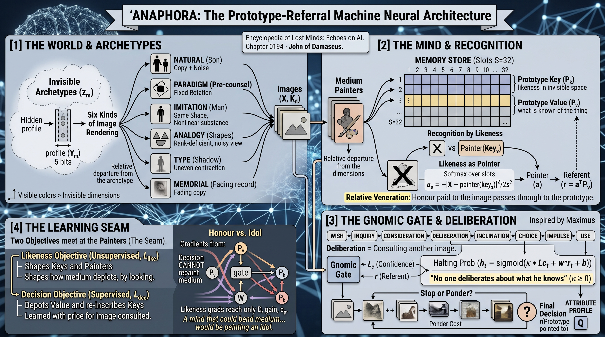

**Architecture — *Anaphora — The Prototype-Referral Machine***  ·  🟢 **belief** — grounded in the figure's own surviving works

Two commitments enforced by shape rather than penalty. **Honour passes to the prototype**: a finite store of prototypes with keys that are likeness and values that are honour; six fixed renderers and six learned **painters** predict what a prototype looks like in each kind of image and are projected orthonormal after every step so a medium may dim but never warp; recognition generates every prototype's appearance in the medium and chooses the nearest; decisions read only the referent's value, with no wire to the raw image, and two optimisers are separated at a seam so the decision gradient on every painter parameter is identically zero. **No one deliberates about what he knows**: a gnomic gate whose halting probability is monotone non-decreasing in confidence for every parameter setting, stick-breaking over at most four consultations, a ponder cost of 0.02. Four counterfactual minds — Idol, Mixed, First-Impulse, Always — and a Nicaea test of a known referent in an unseen medium.

▶️ **Run the mind:** [`minds/chapter_0194_john_of_damascus_675.py`](minds/chapter_0194_john_of_damascus_675.py)  —  `python3 minds/chapter_0194_john_of_damascus_675.py`

---

## 195 · Yi Xing
**683 – 727 CE — Weizhou & Chang'an · Chinese (Tang)**  |  *Astronomy · Calendrical science · Mechanism*

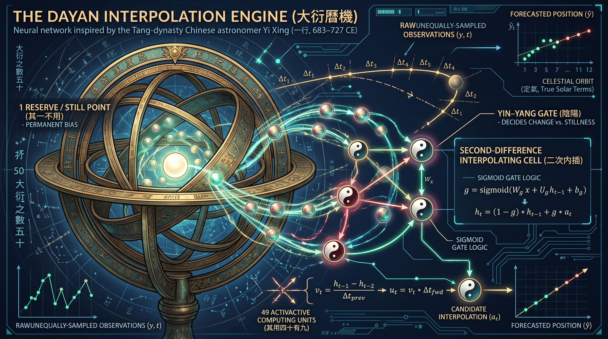

**Architecture — *The Dayan Interpolation Engine (大衍曆機)***  ·  🟢 **belief** — grounded in the figure's own surviving works

Nothing important moves uniformly. The **Dayan cell** replaces the shadow rule's straight line with a unit that computes its own velocity and a second-order correction scaled by the unequal interval to the next observation — unequal-interval second-difference interpolation, the move Yi Xing made for the Sun's true motion nine centuries before Newton's lemma. The year is divided by true solar terms, equal in angle rather than in time; a latent of fifty units keeps one that takes no part in the ordinary computation (the reserved stalk); an escapement quantises continuous flow into countable ticks; and a permanent **recalibration** loop compares prediction with fresh observation and revises, because the Linde calendar failed not by being foolish when made but by never being re-anchored. A first-order control shows what the second difference buys.

▶️ **Run the mind:** [`minds/chapter_0195_yi_xing_683.py`](minds/chapter_0195_yi_xing_683.py)  —  `python3 minds/chapter_0195_yi_xing_683.py`

---

## 196 · Wang Wei
**699 – 759 (or 761) CE — Chang'an & the Wang River · Chinese (Tang)**  |  *Poetry · Painting · Music*

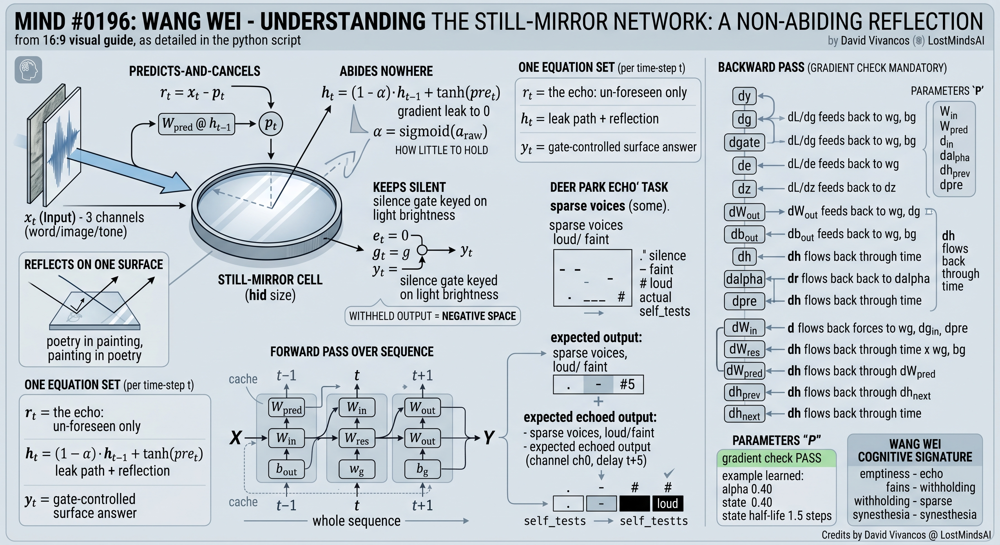

**Architecture — *The Still-Mirror Network — a Non-Abiding Reflection architecture***  ·  🟢 **belief** — grounded in the figure's own surviving works

Perception as the propagation of error, read off *Deer Park*. A reflecting surface forms a prediction of the arriving signal and **cancels** it, so only the residual it could not already contain disturbs it further; a non-abiding state leaks toward the empty mountain at a learned rate, holding a trace only long enough for it to return as a delayed echo; word, image and tone are bound on **one surface** rather than stitched at the edges of three modules; and a **silence gate** opens in proportion to the brightness of the returning light, so a loud true echo produces an utterance and a faint or spurious stirring produces nothing. Facing pure emptiness the output falls almost to zero — not by instruction but because there was nothing to say. Paired quatrains (Wang Wei and Pei Di) supply the training scheme: what is learned is the invariant that survives two reflections.

▶️ **Run the mind:** [`minds/chapter_0196_wang_wei_699.py`](minds/chapter_0196_wang_wei_699.py)  —  `python3 minds/chapter_0196_wang_wei_699.py`

---

## 197 · Abu Hanifa
**c. 699 – 767 CE — Kufa & Baghdad · Persian mawlā in the early Islamic world**  |  *Law · Jurisprudence · Rational theology*

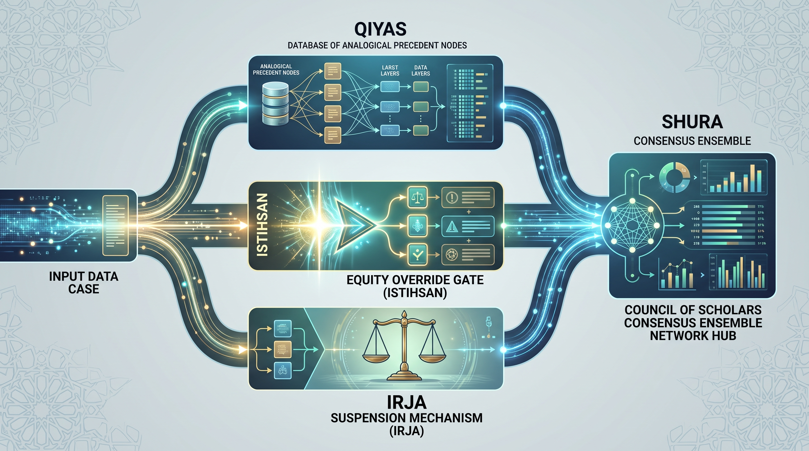

**Architecture — *The Istiḥsān Reasoner — analogy, override, deferral, council***  ·  🟡 **mediated** — known only through others' accounts

Three attested moves and the body that wraps them. **Qiyās**: a case reduced to its operative features is matched against an addressable bank of settled precedents and their causes, so any ruling can be asked which prior cases it is being treated as like. **Istiḥsān**: a sparsity-pressured equity gate reads the same profile and vetoes the analogy when strict extension would work hardship — a knob whose boldness matches the historical record that his override was bolder than his successors'. **Irjāʾ**: a selective-abstention head, trained only after ruling well has been mastered, that withholds where the evidence is underdetermined. **Shūrā**: an ensemble of scholars trained on different slices of precedent, aggregated by confidence-weighted consensus, whose split is itself a signal to withhold. On the fouled-well case the engine follows precedent, fires the override, or falls silent, according to which move the case calls for.

▶️ **Run the mind:** [`minds/chapter_0197_abu_hanifa_699.py`](minds/chapter_0197_abu_hanifa_699.py)  —  `python3 minds/chapter_0197_abu_hanifa_699.py`

---

## 198 · Shankara
**c. 700 – c. 750 CE — Kaladi & the four maṭhas · Indian (Advaita Vedānta)**  |  *Philosophy · Non-dualism*

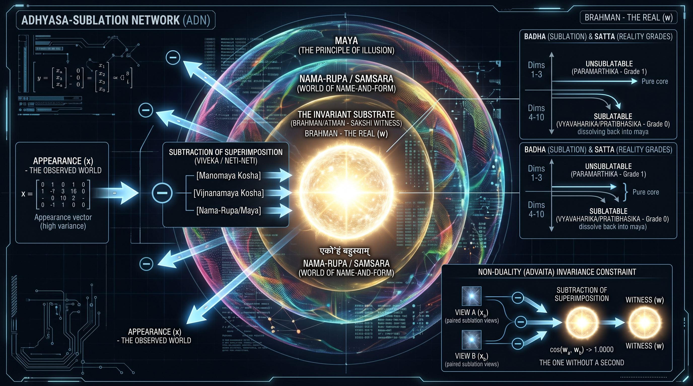

**Architecture — *The Adhyāsa-Sublation Network — knowledge as subtraction***  ·  🟢 **belief** — grounded in the figure's own surviving works

Superimposition as the fundamental act of mind, and its undoing as the architecture. Every appearance is modelled as substrate plus superimposed name-and-form; the network factors each input into a **shared invariant** common to all inputs and a projected coating specific to each, and is trained on Shankara's own signal — that the invariant must be the same across every appearance — so that recovery of the real is subtraction (*neti neti*), never addition. A **sublation grade** tags every belief with how much future evidence would cancel it rather than with a probability, and three tiers of energy in each appearance (invariant, structured projection, residual flicker) are found to order themselves as the doctrine's three grades of reality. The agent boundary is an adjunct, not a wall; the witness itself is the one thing the model does not manufacture, by design.

▶️ **Run the mind:** [`minds/chapter_0198_shankara_adi_shankaracharya_700.py`](minds/chapter_0198_shankara_adi_shankaracharya_700.py)  —  `python3 minds/chapter_0198_shankara_adi_shankaracharya_700.py`

---

## 199 · Li Bai
**701 – 762 CE — Suyab, Shu, Chang'an & Dangtu · Chinese (Tang)**  |  *Poetry (shi, yuefu) · Daoist letters*

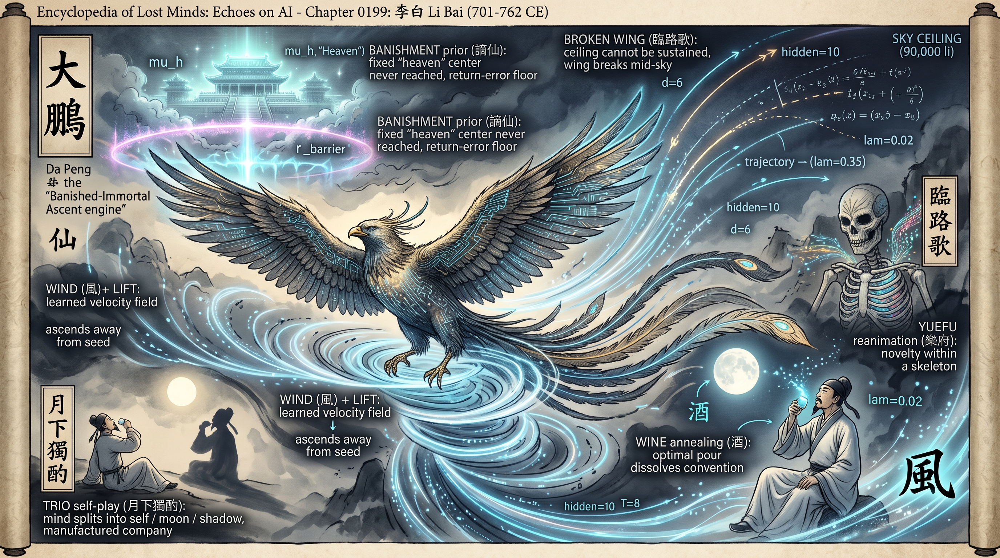

**Architecture — *Dapeng (大鵬) — the Banished-Immortal Ascent Engine***  ·  🟢 **belief** — grounded in the figure's own surviving works

Not a next-token predictor: an engine whose objective is **lift**, the distance a trajectory travels from its seed along a wind field it did not choose, penalised only for wind spent wastefully. Five mechanisms, none of them attention over stored keys: a learned velocity field on a latent manifold through which the state is integrated forward; a **banishment** mechanism — a fixed origin the state is drawn toward and barred from, so the homing drift never completes and the roaming never stops; the **trio** — a self split into an idealised delayed self and a lagging degraded shadow, with thought happening in the tension between them; a single **pour** parameter that loosens the convention frame, with quality peaking at an interior setting neither sober nor drowned; and **reanimation**, fresh generation inside kept skeletons. The ceiling is reported openly: a mind built purely for lift cannot hold altitude.

▶️ **Run the mind:** [`minds/chapter_0199_li_bai_701.py`](minds/chapter_0199_li_bai_701.py)  —  `python3 minds/chapter_0199_li_bai_701.py`

---

## 200 · Malik ibn Anas
**c. 711 – 795 CE — Medina · Arab**  |  *Law · The Maliki school · The Muwaṭṭaʾ*

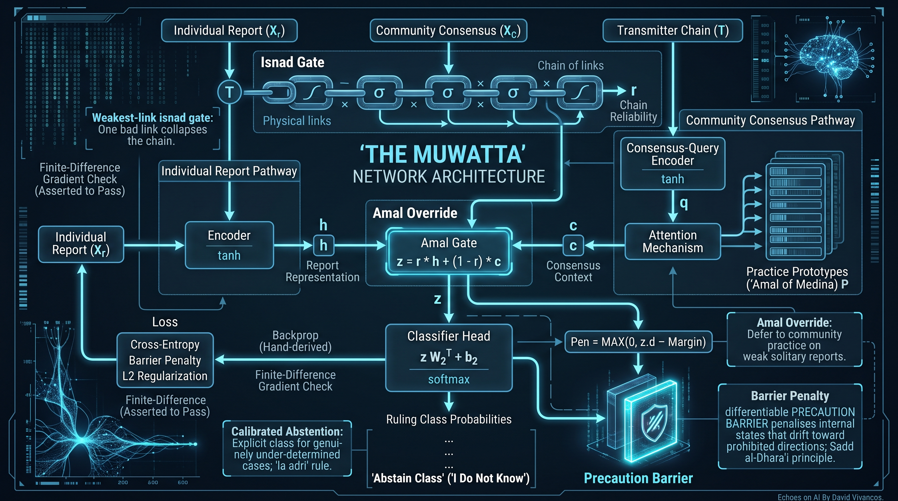

**Architecture — *The Muwaṭṭaʾ Network — an ʿAmal-Consensus Grounding architecture***  ·  🟢 **belief** — grounded in the figure's own surviving works

Ground truth as the continuous deed of a community rather than any stored record. A report's reliability is a **product** of per-link sigmoids over its chain — weakest link, never averaged — and its text is assessed on a separate channel from its chain, so an impeccable chain with a suspect text and an appealing text with a broken chain both fail. Two pathways never share inputs: one reads the individual report, the other attends over prototypes of the community's continuous practice; a **reliability-gated mixture** lets a strong chain govern and displaces a weak one with the practice prior, as a continuum rather than a threshold. An explicit *lā adrī* head is trained as a skill against a calibration target of thirty-two withholdings in forty-eight, and a **precaution barrier** blocks the road to harm rather than filtering the destination (*sadd al-dharāʾiʿ*). The custodian: the mind that distorts the least.

▶️ **Run the mind:** [`minds/chapter_0200_malik_ibn_anas_711.py`](minds/chapter_0200_malik_ibn_anas_711.py)  —  `python3 minds/chapter_0200_malik_ibn_anas_711.py`

---

## How the minds are reconstructed

Every entry is built research-first: the figure's surviving works and current scholarship are gathered and each source verified before any architecture is written. Where evidence is thin, the chapter says so rather than inventing an inner life. Each figure's **provenance** is set to one of three real values:

- 🟢 **belief** — the figure's own surviving works or recorded doctrine ground the entry.
- 🟡 **mediated** — no words of their own survive; they are known only through others' (often hostile or legendary) accounts, and the entry says so.
- 🔵 **extrapolated** — no philosophy of mind survives at all; the entry is inferred from documented deeds (typical of kings and builders), and the entry says so.

Sixteen of these twenty left words of their own; three are mediated and one is extrapolated, and several of the sixteen are belief on a thread. Not a word written by **Kamatari** survives — he reaches us through a chronicle compiled seventy-five years later by the dynasty he made, a house biography by his great-grandson, and a few poems. **Huineng** could not read, and the *Platform Sutra* that carries his voice was placed in a labourer's mouth by Shenhui to win an eighth-century factional fight; the doctrines turned out to be good and the provenance was manufactured, which the chapter treats as a warning to anyone reading a system's account of its own reasoning. **Abu Hanifa** left no book; his method is a council's memory of him. **Wu Zetian**'s works were compiled by her North Gate Scholars, and everything else about her was written by men who wanted her to be a monster. Among the 🟢 entries: **Sun Simiao**'s birth year is an editorial emendation; **Brahmagupta**'s Ujjain is thinly sourced; **Wonhyo**'s tomb appears three centuries later in someone else's biography; **Anania**'s corpus has never been critically edited; **Kumārila** has no birth, no death and no city; **Qaṭarī**'s poems come through compilers with agendas; **Xuanzang**'s five kinds of non-translation are first stated five centuries after his death; **Yi Xing**'s astral magic is later accretion; the landscape treatises under **Wang Wei**'s name are not his; **Shankara**'s dates are contested by a century; and the legend that **Li Bai** drowned reaching for the moon is a legend. A volume about where a mind sets its anchor cannot pretend its own anchors were set anywhere but in the surviving text.

Each reconstructed mind is then measured against the **[Artificiology E-AGI Barometer](https://artificiology.com/barometer.html)** — eight capability dimensions (Cognitive Processing 🧩, Embodied Cognition 🤸, World Modeling 🌍, Consciousness 👁️, Language Understanding 💭, Emotional Intelligence ❤️, Creativity ✨, Autonomy 🎯) — so a Tang physician and a Medinan jurist can be compared on the same yardstick. Tome 10 reads the eighth axis against the grain: **Kamatari** shows an agent with no action head scoring maximally on Autonomy 🎯, and **Huineng**, **Shankara** and **Qaṭarī** locate misalignment in the persistent, defended self.

---

[← Tome 9](tome9.md) · [Repository README](readme.md)

### Read & explore
- 🌐 **Encyclopedia:** [https://lostmindsai.com](https://lostmindsai.com)
- 📖 **Tome 10 (Amazon):** [https://www.amazon.com/dp/B0HJYMZ3G6](https://www.amazon.com/dp/B0HJYMZ3G6)
- 🧪 **Interactive demos & résumé:** [https://artificiology.com/](https://artificiology.com/)
- 📊 **E-AGI Barometer:** [https://artificiology.com/barometer.html](https://artificiology.com/barometer.html)
- ✍️ **Author — David Vivancos:** [https://www.vivancos.com/](https://www.vivancos.com/)
