# Tome 11 — Minds 201–220
### *The Warranted Mind — Tang Poets, Abbasid Baghdad, the Carolingian Correctors, Heian Japan & the Science of Transmitters*
**Encyclopedia of Lost Minds: Echoes on AI** · *712 – 810 CE*

[🌐 Encyclopedia](https://lostmindsai.com) · [📖 Buy Tome 11 on Amazon](https://www.amazon.com/dp/B0HKF7TRFF) · [🧪 Interactive Demos](https://artificiology.com/) · [📊 E-AGI Barometer](https://artificiology.com/barometer.html) · [✍️ Author](https://www.vivancos.com/) · [⭐ Repository](https://github.com/DavidVivancos/LostMindsAI)

[← Tome 10](tome10.md) · [Repository README](readme.md)

---

Tome 11 runs from **Du Fu** to **al-Bukhārī** — twenty reconstructed minds, each rendered on two planes. The **abstract plane** distils the thinker's cognitive signature into an interactive 3D mind-map; the **mechanistic plane** turns that same signature into a small, *runnable* neural architecture, built from scratch in NumPy, gradient-checked, trained and self-tested.

This page collects the twenty **visual mind-map explainers** for this tome and links each to its companion architecture. Runnable code lives in [`minds/`](minds/); the explainer images live in [`maps/`](maps/).

> Every architecture here executes and passes its own self-test suite (a mandatory finite-difference gradient check plus a real training loop). No number is hard-coded — each is produced live on the machine that runs the file.

Where Tome 10 asked where a mind may act from when nothing it holds resembles the case in front of it, Tome 11 asks what entitles a claim to be acted on at all — the report that came through a channel that lies, the copy drifted from an exemplar nobody living has seen, the table whose rows the sky never touched, the chain with a joint that was only assumed, the certificate signed by a man who knew the canal was broken. All twenty begin by refusing the same operation: take the claim as it arrives, in the register it arrives in, and let its fluency stand for its warrant. What they put in its place is the volume — a counterpart that must be forced, a channel that must be doubled, a space counted before it is filled, a balance that must sum, a canon and a corrector, a reconciliation that throws no text away, a listener too weak to be flattered, a sign nobody sent, a proof in a second medium, a defect that drifts, an instrument that could have contradicted its owner, a guard with nowhere else to belong, a deed its founder cannot rewrite, an invariant a disguise cannot touch, a machine that must be cut open, a joint that must be shown. If the previous tome's keyword was *anchor*, this one's is *warrant*: what entitles a claim to enter the record, and what, outside the claim, can revoke it.

---

## The Twenty at a Glance

| # | Mind | Era | Civilization | Architecture | Provenance |
|---|------|-----|--------------|--------------|:----------:|
| 201 | [Du Fu](#201--du-fu) | 712 – 770 CE | Chinese (Tang) | *The Lüshi Engine — a Regulated-Witness Architecture* | 🟢 |
| 202 | [Al-Manṣūr](#202--al-manṣūr) | c. 714 – 775 CE | Arab (Abbasid) | *The Round City Engine* | 🔵 |
| 203 | [Al-Khalīl ibn Aḥmad](#203--al-khalīl-ibn-aḥmad) | c. 718 – 786/791 CE | Arab (Azd, Basra) | *The Inhabited Orbit* | 🟢 |
| 204 | [Jābir ibn Ḥayyān](#204--jābir-ibn-ḥayyān) | c. 721 – c. 815 CE | Arab-Islamic (the Jābirian school) | *The Mīzān Balance Engine* | 🟢 |
| 205 | [Alcuin of York](#205--alcuin-of-york) | c. 735 – 804 CE | Anglo-Saxon (Northumbria, Frankia) | *The Scriptorium Engine* | 🟢 |
| 206 | [Charlemagne](#206--charlemagne) | c. 748 – 814 CE | Frankish (Carolingian) | *The Correctio Engine* | 🟢 |
| 207 | [Al-Shāfiʿī](#207--al-shāfiʿī) | 767 – 820 CE | Arab (Quraysh) | *The Bayān Reconciliation Network* | 🟢 |
| 208 | [Saichō](#208--saichō) | 767 – 822 CE | Japanese (Heian) | *The Hongaku Unveiling Network* | 🟢 |
| 209 | [Ḥabash al-Ḥāsib](#209--ḥabash-al-ḥāsib) | c. 770 – after 869 CE | Persian (Abbasid) | *The Shadow-Inversion Engine (Zill-Net)* | 🔵 |
| 210 | [Bai Juyi](#210--bai-juyi) | 772 – 846 CE | Chinese (Tang) | *CRN — the Caishi Resonance Network (采詩共鳴網)* | 🟢 |
| 211 | [Kūkai](#211--kūkai) | 774 – 835 CE | Japanese (Heian) | *The Shōji-jissō Engine (声字実相)* | 🟢 |
| 212 | [Al-Jāḥiẓ](#212--al-jāḥiẓ) | 776 – 868/9 CE | Arab (Kināna, Basra) | *The Bayān Five-Channel Witness* | 🟢 |
| 213 | [Al-Khwārizmī](#213--al-khwārizmī) | c. 780 – c. 850 CE | Abbasid (Khwārazmian) | *The Reduction Engine* | 🟢 |
| 214 | [Aḥmad ibn Ḥanbal](#214--aḥmad-ibn-ḥanbal) | 780 – 855 CE | Arab (Shaybān) | *The Taʿlīl Collation Engine* | 🟢 |
| 215 | [Al-Maʾmūn](#215--al-maʾmūn) | 786 – 833 CE | Abbasid | *The Imtiḥān Engine — a Zīj-Corrector Network* | 🔵 |
| 216 | [Al-Muʿtaṣim](#216--al-muʿtaṣim) | 796 – 842 CE | Abbasid | *SAMARRA — Severance-Aligned Modular Architecture* | 🔵 |
| 217 | [Fatima al-Fihri](#217--fatima-al-fihri) | c. 800 – c. 880 CE | Arab (Qurashī-Fihrī) | *The Waqf Network — the Deed of Perpetuity* | 🟡 |
| 218 | [Al-Kindī](#218--al-kindī) | c. 801 – c. 873 CE | Arab (Kinda) | *The Istikhrāj Engine* | 🟢 |
| 219 | [Banū Mūsā ibn Shākir](#219--banū-mūsā-ibn-shākir) | fl. c. 803 – 873 CE | Abbasid | *The Ḥiyal Body — a hydraulic hidden-state regulator* | 🔵 |
| 220 | [Al-Bukhārī](#220--al-bukhārī) | 810 – 870 CE | Persian (Transoxiana) | *Isnad-Net* | 🟢 |

**Provenance** — 🟢 belief · 🟡 mediated · 🔵 extrapolated. See [How the minds are reconstructed](#how-the-minds-are-reconstructed).

---

## 201 · Du Fu
**712 – 770 CE — Gongxian, Chang'an, Chengdu & Kuizhou · Chinese (Tang)**  |  *Poetry · Regulated verse · Poetry as history*

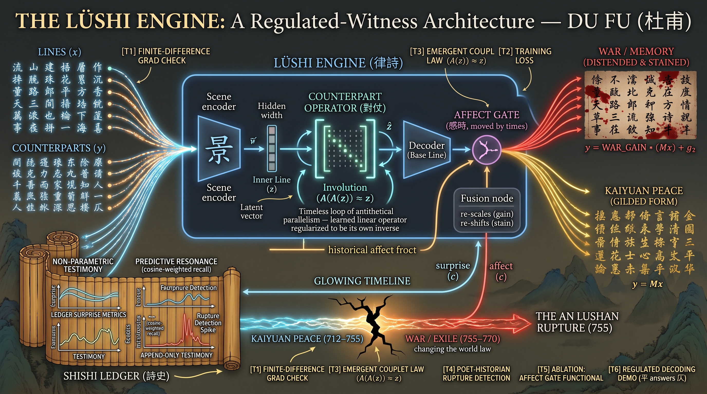

**Architecture — *The Lüshi Engine — a Regulated-Witness Architecture (律詩 · 對仗 · 感時 · 詩史)***  ·  🟢 **belief** — grounded in the figure's own surviving works

Three commitments read out of the poems' form, each made trainable. **The couplet is the unit of thought** (對仗): every line is answered by a learned **counterpart operator** regularised toward an involution, so that the counterpart of the counterpart returns the line — one matrix that must learn to be its own inverse while opposing its input in tone, preserving its frame and resonating in sense, instead of attention over stored keys. **Perception is gated by the times** (感時): a slow, non-differentiable summary of the recent world — a running mean of inputs and a running level of the ledger's surprise — re-tints every encoding, so the same scene is read differently in peace and in war. **Memory is testimony** (詩史): an **append-only ledger** records what the engine witnessed and is never edited, and its surprise is the gap between the law the record implies and the world that arrives. Trained on a simulated Tang world that breaks, the engine's surprise spikes at the rupture instead of smoothing the catastrophe into a trend; with the gate of the times removed, it can no longer hold one law across peace and war.

▶️ **Run the mind:** [`minds/chapter_0201_du_fu_712.py`](minds/chapter_0201_du_fu_712.py)  —  `python3 minds/chapter_0201_du_fu_712.py`

---

## 202 · Al-Manṣūr
**c. 714 – 775 CE — al-Ḥumayma & Baghdad · Arab (Abbasid)**  |  *Rulership · Administration · City-founding*

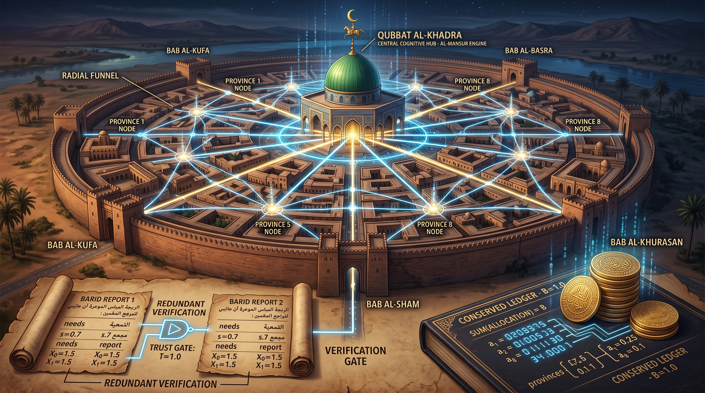

**Architecture — *The Round City Engine***  ·  🔵 **extrapolated** — inferred from documented deeds

Al-Manṣūr left no philosophy of mind in his own hand; he left a diagram of one, drawn in brick, and an administration recorded by al-Ṭabarī. Three coupled mechanisms follow. **The radial funnel**: every message routes province → centre along a star with no province-to-province edge, so corruption cannot cascade sideways; a **gossip** variant that lets districts average with their neighbours is trained as the control, and shows one corrupted district warping the ones beside it. **Redundant verification**: as with the *barīd*, two independent channels report the same quantity, and a learned **verification gate** lets the centre act when they agree and fall back to a neutral prior when they disagree — the green dome's weathervane made differentiable. **The conserved budget**: allocation is a ledger that must sum to the treasury, so over-reported need cannot be hacked into a runaway. Remove the gate and the allocation error multiplies. The centre itself stays empty: the model is a theory of control that says nothing about what the wheat is for.

▶️ **Run the mind:** [`minds/chapter_0202_al_mansur_714.py`](minds/chapter_0202_al_mansur_714.py)  —  `python3 minds/chapter_0202_al_mansur_714.py`

---

## 203 · Al-Khalīl ibn Aḥmad
**c. 718 – 786/791 CE — Oman & Basra · Arab (Azd, Basra)**  |  *Lexicography · Prosody · Phonetics · Cryptography*

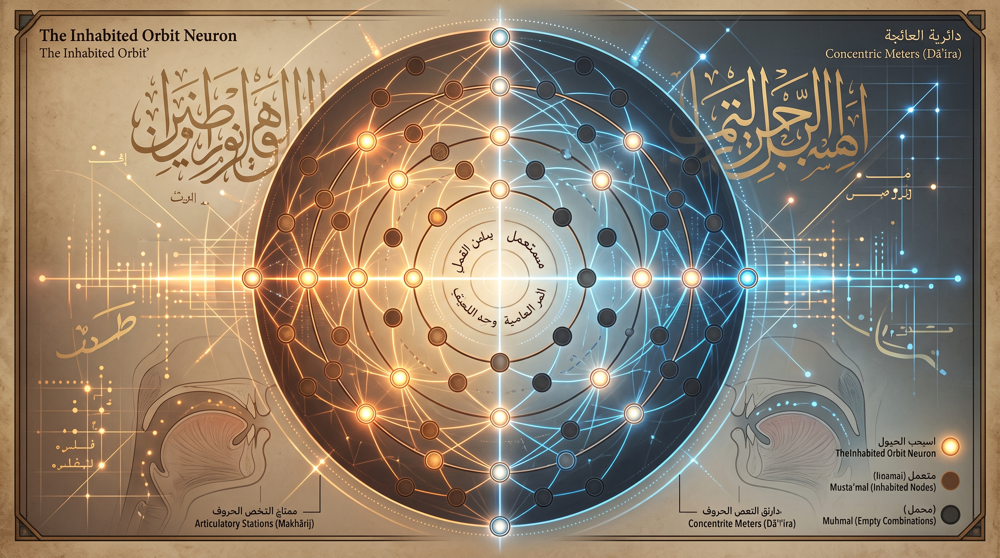

**Architecture — *The Inhabited Orbit — an orbit-neuron architecture***  ·  🟢 **belief** — grounded in the figure's own surviving works

The one move that is al-Khalīl's alone: begin from the space of everything that *could* exist, then record which points are inhabited (*mustaʿmal*) and which are empty (*muhmal*). The **orbit neuron** answers for a root's whole anagram class (*taqlīb*) at once, so every ordering of the same letters is scored together, and a stored **register of the empty** makes *is this arrangement used?* a fact rather than an estimate. Rhythm is handled by **ring neurons** over the five circles (*dawāʾir*): learned templates over each circle's slots, per-slot costs that license variation (*ziḥāf*) only at the cords and never at the pegs, and an alignment summed over every scansion, with an EM procedure recovering the circles from verse. A **probable-word attack** (*muʿammā*) breaks substitution ciphers by guessing a crib. Trained on a synthetic Basra corpus, the network learns hidden laws of the lexicon from data and draws the holes into its map: absence becomes information with an address.

▶️ **Run the mind:** [`minds/chapter_0203_Al-Khalil_ibn_Ahmad_718.py`](minds/chapter_0203_Al-Khalil_ibn_Ahmad_718.py)  —  `python3 minds/chapter_0203_Al-Khalil_ibn_Ahmad_718.py`

---

## 204 · Jābir ibn Ḥayyān
**c. 721 – c. 815 CE — Ṭūs & Kufa · Arab-Islamic (the Jābirian school)**  |  *Alchemy · Chemistry · The science of the balance*

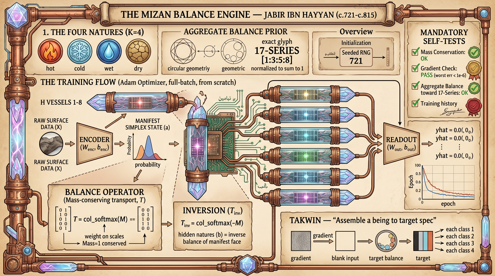

**Architecture — *The Mīzān Balance Engine (ʿilm al-mīzān)***  ·  🟢 **belief** — grounded in the figure's own surviving works

Every representation is a proportion. The state is a **conserved simplex** over the four natures — hot, cold, wet, dry — whose total quality-mass is exactly one and is preserved through every layer, so there are no free activations that can grow without bound. Every substance wears two faces: the engine computes the hidden face (*bāṭin*) as the **inverse of the manifest** one (*ẓāhir*) under a strict law of conservation, and it transforms a thing by redistributing its natures, never by creating any. Several balances run side by side, like a rack of vessels, and **generation to a specification** runs analysis backwards: given a target proportion, the engine finds the recipe that yields it. Control is part of the recipe — the beings of *takwīn* stay subject to the control of their maker because the proportions that make them are the proportions that bind them. Nothing is known until it is weighed, and nothing in the engine escapes the balance.

▶️ **Run the mind:** [`minds/chapter_0204_jabir_ibn_hayyan_geber_721.py`](minds/chapter_0204_jabir_ibn_hayyan_geber_721.py)  —  `python3 minds/chapter_0204_jabir_ibn_hayyan_geber_721.py`

---

## 205 · Alcuin of York
**c. 735 – 804 CE — York, Aachen & Tours · Anglo-Saxon (Northumbria, Frankia)**  |  *Education · Textual correction · The Carolingian renaissance*

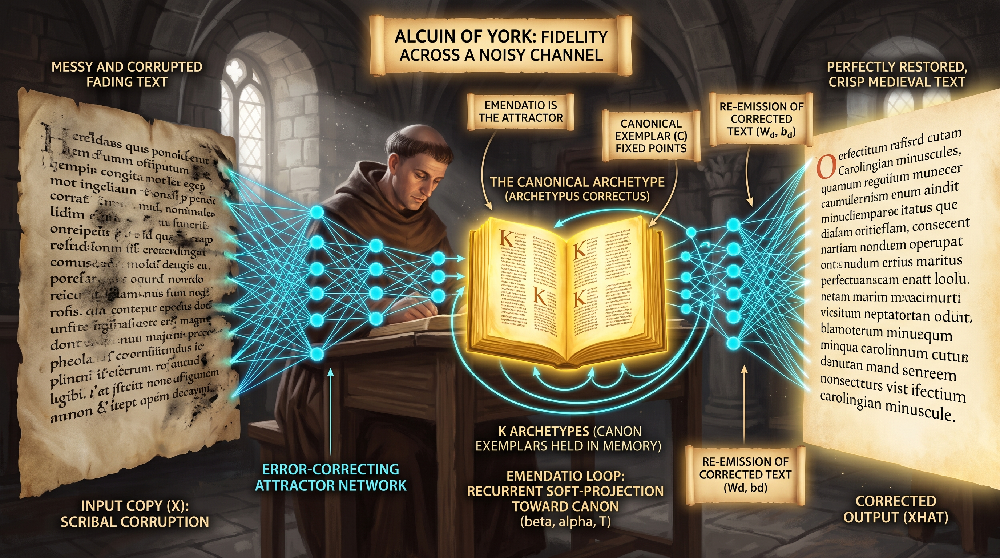

**Architecture — *The Scriptorium Engine — an error-correcting attractor network***  ·  🟢 **belief** — grounded in the figure's own surviving works

*Emendatio* made mechanical: fix a canonical exemplar, encode it in a legible script, pull every corrupted copy back toward it, re-emit, repeat. An **encoder** receives a damaged copy the way a scribe did; a small learned **canon of exemplars** holds the corrected texts; and the **correcting channel** is a contraction, so every pass moves a copy only toward the canon and the loop settles instead of drifting. A **transmission-chain experiment** copies a text down a long line of scribes with and without the corrector: without it, fidelity collapses toward the noise floor; with it, the text holds across the generations. A **riddle test** after the *Disputatio Pippini* asks the model to restore a garbled clue before recognising it — recognition only after repair. The design commits to fidelity over novelty, which is its strength and, the chapter argues, its limit: a scriptorium corrects toward a canon it has no means to revise.

▶️ **Run the mind:** [`minds/chapter_0205_alcuin_of_york_735.py`](minds/chapter_0205_alcuin_of_york_735.py)  —  `python3 minds/chapter_0205_alcuin_of_york_735.py`

---

## 206 · Charlemagne
**c. 748 – 814 CE — Aachen · Frankish (Carolingian)**  |  *Rulership · Education · Correctio*

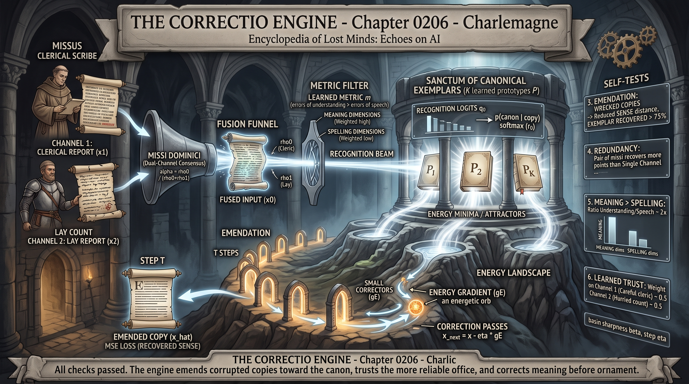

**Architecture — *The Correctio Engine — an error-correcting associative memory***  ·  🟢 **belief** — grounded in the figure's own surviving works

An **energy-based attractor network** — a continuous Hopfield-style associative memory whose minima are learned canonical exemplars — so that a corrupted input descends toward the nearest correct form instead of being continued forward. The metric that defines *nearest* is learned and **meaning-weighted**: steep along the directions that change sense and shallow along those that only change spelling, the capitulary's rule that errors of understanding are worse than errors of speech. The inspectors ride out in pairs: a **dual-channel consensus**, cleric beside layman, fuses two independently corrupted observations by learned reliability, so hidden drift becomes visible disagreement. Correction is iterative and convergent; under ambiguity the engine settles on a known form rather than confabulating a new one. The chapter keeps the other face of *correctio* in view — the programme that corrected the books also executed the Saxons at Verden.

▶️ **Run the mind:** [`minds/chapter_0206_charlemagne_748.py`](minds/chapter_0206_charlemagne_748.py)  —  `python3 minds/chapter_0206_charlemagne_748.py`

---

## 207 · Al-Shāfiʿī
**767 – 820 CE — Gaza, Mecca, Baghdad & Fusṭāṭ · Arab (Quraysh)**  |  *Law · Legal theory · Hadith*

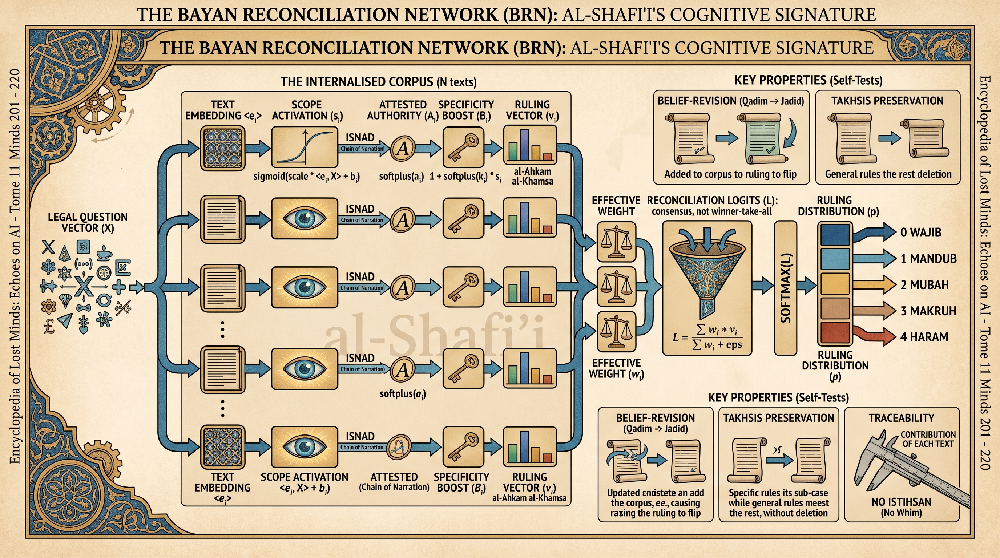

**Architecture — *The Bayān Reconciliation Network (BRN)***  ·  🟢 **belief** — grounded in the figure's own surviving works

A belief-revision engine on a fixed method. Every authoritative text is a unit with its own **scope** (how broadly it addresses a case), **attested authority** (the strength of its chain, never below zero) and **specificity**, and a ruling is the coherence of all the texts that fire on a case, weighted by how directly each addresses it — not a winner picked from among them. Apparent contradictions are dissolved by interpretation rather than deletion: the general is narrowed by the particular (*takhṣīṣ*), the earlier yields to the later (*naskh*), the ambiguous is detailed by the explanatory, and **no attested text is ever thrown away**. The method (*uṣūl*) is frozen once trained; the corpus can grow. A **qadīm → jadīd** test injects a newly attested report without retraining and shows the ruling move while the method stays, as his Baghdad positions gave way to his Egyptian ones. Revelation, for this engine, is one system that clarifies itself.

▶️ **Run the mind:** [`minds/chapter_0207_al_shafi_i_767.py`](minds/chapter_0207_al_shafi_i_767.py)  —  `python3 minds/chapter_0207_al_shafi_i_767.py`

---

## 208 · Saichō
**767 – 822 CE — Lake Biwa & Mount Hiei · Japanese (Heian)**  |  *Buddhism · Tendai · Monastic education*

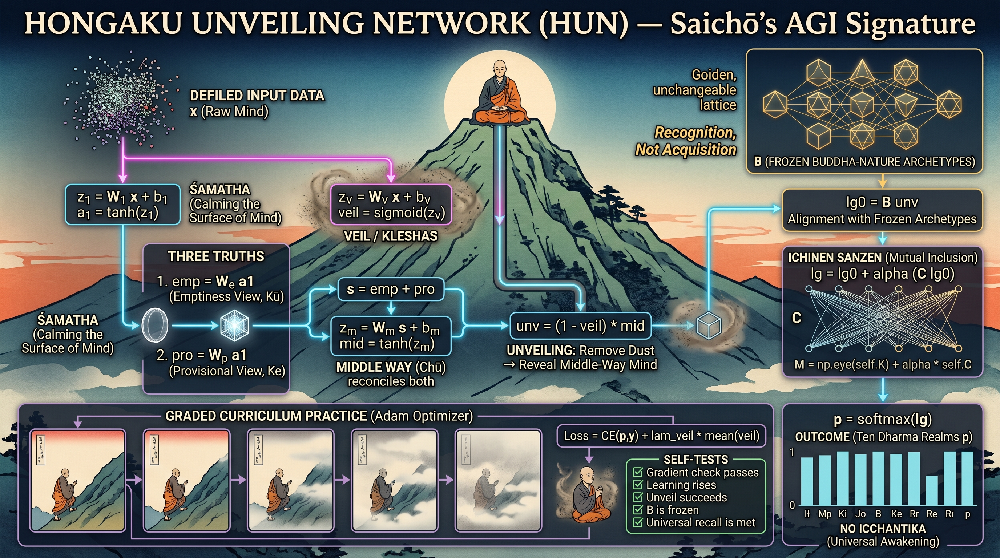

**Architecture — *The Hongaku Unveiling Network***  ·  🟢 **belief** — grounded in the figure's own surviving works

Recognition, not acquisition. The awakened endpoints are **frozen archetypes** laid down at initialisation and never altered; training does not manufacture them but learns to remove what hides them. A **calming transform** settles the input, a **three-truths module** reads it as empty, provisional and middle at once, and a **veil gate** measures the obscuration still covering each archetype — and is itself penalised in the loss, so the network is rewarded for unveiling rather than for fitting. Training follows a **fixed graded curriculum**, the twelve-year rule on Mount Hiei turned into an ordered schedule. The decisive self-test is the refusal of the *icchantika*: **every realm must reach non-trivial recall**, so no class of input may be learned into permanent exclusion. Exclusion carries the burden of proof, and the network fails its own tests if any class is left behind.

▶️ **Run the mind:** [`minds/chapter_0208_saicho_dengyo_daishi_767.py`](minds/chapter_0208_saicho_dengyo_daishi_767.py)  —  `python3 minds/chapter_0208_saicho_dengyo_daishi_767.py`

---

## 209 · Ḥabash al-Ḥāsib
**c. 770 – after 869 CE — Merv, Baghdad & Samarra · Persian (Abbasid)**  |  *Astronomy · Trigonometry · Instruments*

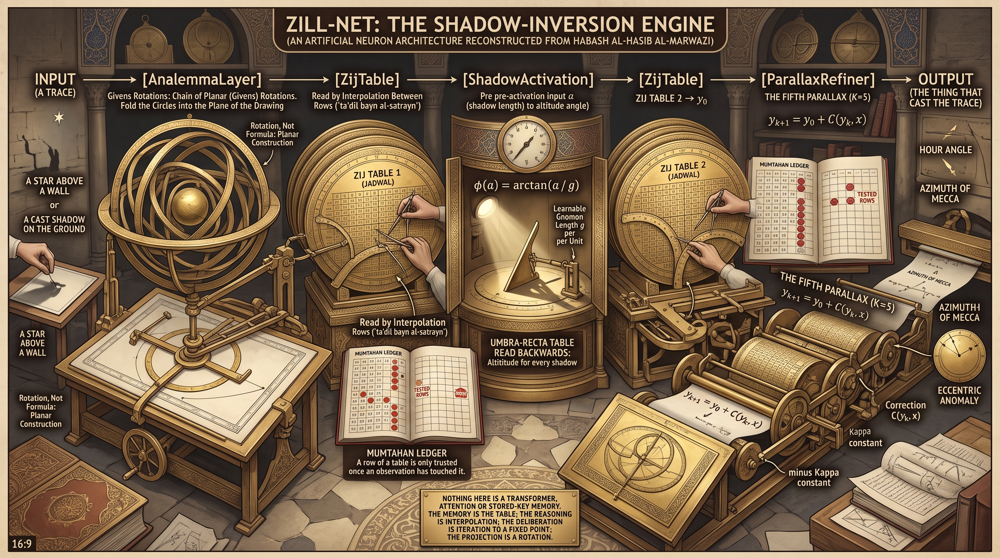

**Architecture — *The Shadow-Inversion Engine (“Zill-Net”)***  ·  🔵 **extrapolated** — inferred from documented deeds

Ḥabash never saw an angle; he saw a shadow on the ground, and everything he is remembered for turns a cast trace back into the thing that cast it. An **analemma layer** folds each problem into a plane by an exact orthogonal rotation — rotations, not formulas — before anything is read. A **zīj table layer** stores values at fixed nodes and interpolates between them, keeping a count of how often data has touched each row, so the model knows where it was never tested (*mumtaḥan*). A **shadow activation** built on the arctangent turns a gnomon's shadow back into an altitude, the table read in both directions. A **parallax refiner** re-enters its own table with the corrected value until the correction vanishes, as with his fifth parallax, under an explicit stopping rule. The network learns time from altitude, the qibla and the lunar parallax — inversion as a fixed point, every answer traceable to rows that observation actually touched.

▶️ **Run the mind:** [`minds/chapter_0209_Habash_al-Hasib_al-Marwazi_870.py`](minds/chapter_0209_Habash_al-Hasib_al-Marwazi_870.py)  —  `python3 minds/chapter_0209_Habash_al-Hasib_al-Marwazi_870.py`

---

## 210 · Bai Juyi
**772 – 846 CE — Chang'an, Hangzhou & Luoyang · Chinese (Tang)**  |  *Poetry · Poetics · Administration*

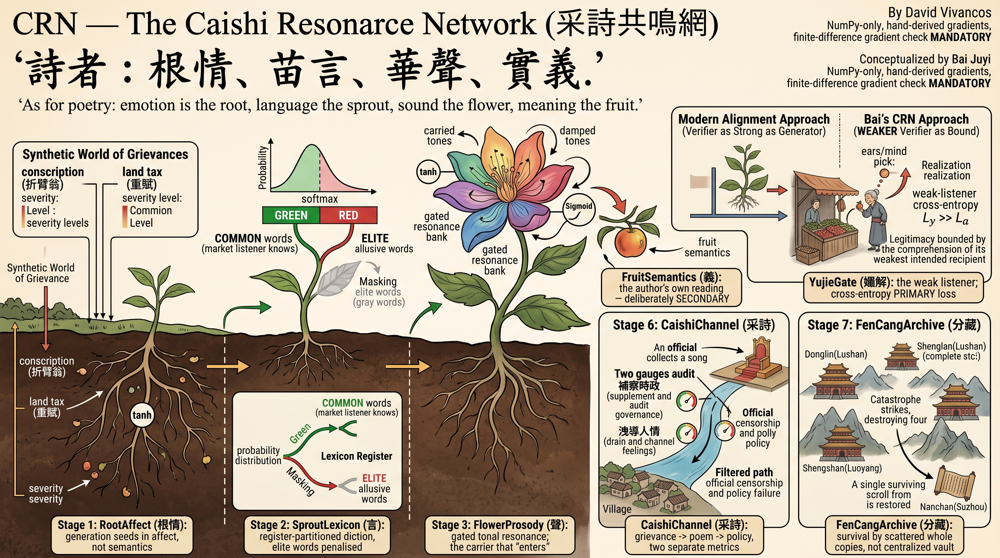

**Architecture — *CRN — the Caishi Resonance Network (采詩共鳴網, the collected-song resonance network)***  ·  🟢 **belief** — grounded in the figure's own surviving works

*Emotion is the root, language the sprout, sound the flower, meaning the fruit* — read as an ordering of causes. Generation begins in an **affect state** seeded by a witnessed event, passes through a **register-partitioned lexicon** in which plain and ornate diction are separate channels, and is carried by a **prosodic resonance** bank whose rhythm is redundancy against noise; meaning appears last, in the listener. That listener is the acceptance test: a deliberately **weak listener** decodes each utterance, and an utterance is worth what the least-equipped intended recipient can recover — certification by the affected, not by the strongest evaluator. The **caishi channel** carries reports upward past the officials they concern, and the **scattered archive** (*fēncáng*) keeps complete copies at independent sites, as he deposited his works in monasteries across provinces, so that no single loss erases the corpus. The chapter is candid that legibility is not truth: a plain, confident falsehood passes the weak listener perfectly.

▶️ **Run the mind:** [`minds/chapter_0210_bai_juyi_772.py`](minds/chapter_0210_bai_juyi_772.py)  —  `python3 minds/chapter_0210_bai_juyi_772.py`

---

## 211 · Kūkai
**774 – 835 CE — Shikoku, Chang'an & Mount Kōya · Japanese (Heian)**  |  *Shingon Buddhism · Philosophy of language · Civil engineering*

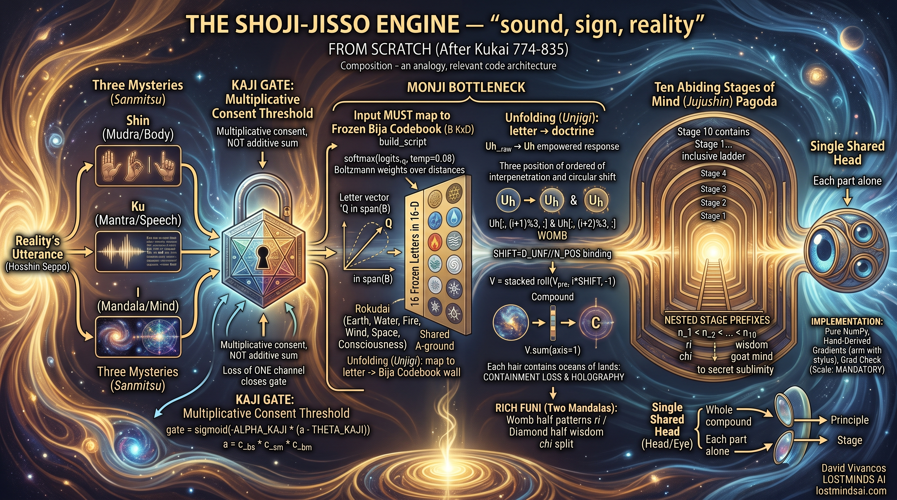

**Architecture — *The Shōji-jissō Engine (声字実相 — sound, sign, reality)***  ·  🟢 **belief** — grounded in the figure's own surviving works

There is no uninterpreted datum: reality is an utterance already in progress, and every object of the senses is a letter in a script. So the first operation is not feature extraction into a continuum but **quantisation onto a script** — inputs are read against an alphabet fixed before training, and each letter is what it is only by difference from the others (*shabetsu*). The world the model reads is itself a text generated from that script. The **three mysteries** of body, speech and mind are bound together by position, the model keeps **two mandalas** — complementary representations that are never collapsed into one — and a single syllable carries the whole, as HŪṂ does in the *Unjigi*. A **self-emission decoder** must then speak the world back out of the reading, because a name from which the world cannot be regenerated is a serial number, not a reading. This is Kūkai's answer to interpretability: legislate the alphabet before training instead of excavating it afterwards.

▶️ **Run the mind:** [`minds/chapter_0211_kukai_774.py`](minds/chapter_0211_kukai_774.py)  —  `python3 minds/chapter_0211_kukai_774.py`

---

## 212 · Al-Jāḥiẓ
**776 – 868/9 CE — Basra, Baghdad & Samarra · Arab (Kināna, Basra)**  |  *Rhetoric · Semiotics · Zoology · Prose*

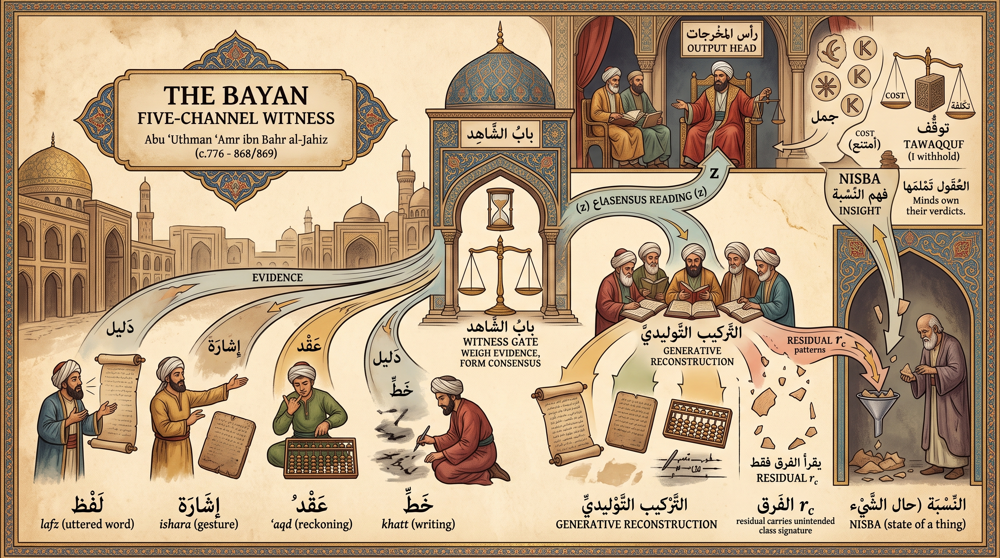

**Architecture — *The Bayān Five-Channel Witness***  ·  🟢 **belief** — grounded in the figure's own surviving works

Of his five indicants of meaning — utterance, gesture, finger-reckoning, writing and the state of a thing (*ḥāl*, which he calls *nisba*) — the fifth is the one nobody sends, and he claims it can stand in for all the rest. So the fifth channel gets **no input of its own**. Four overt channels pass through a **witness gate** into a consensus; the consensus generatively **reconstructs each channel**; and the **residual** — what each channel actually was minus what the consensus predicted — is the only thing fed to the fifth encoder. The mute condition of things is recovered from what the composed channels fail to explain. Verdicts are priced: a **cost schedule** makes a wrong answer far dearer than a withheld one, so the witness learns its own threshold for silence (*tawaqquf*) rather than having one set for it. The chapter draws his warning for our systems: a confidence score is only more testimony, spoken by the mechanism it is meant to check.

▶️ **Run the mind:** [`minds/chapter_0212_al_jahiz_776.py`](minds/chapter_0212_al_jahiz_776.py)  —  `python3 minds/chapter_0212_al_jahiz_776.py`

---

## 213 · Al-Khwārizmī
**c. 780 – c. 850 CE — Khwārazm & Baghdad · Abbasid (Khwārazmian)**  |  *Algebra · Arithmetic · Astronomy · Geography*

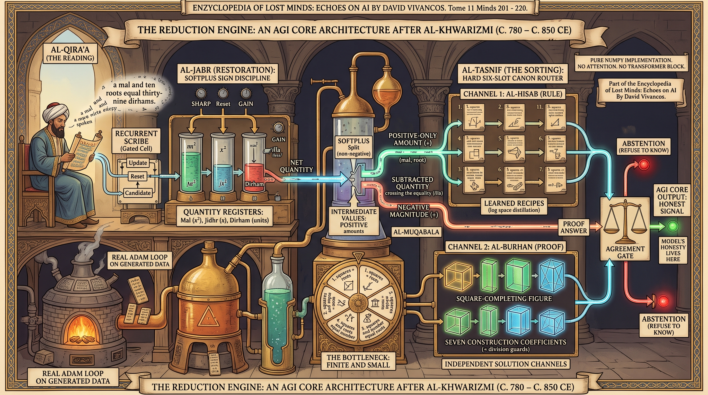

**Architecture — *The Reduction Engine — reduction to a closed canon, verified in a second medium***  ·  🟢 **belief** — grounded in the figure's own surviving works

His algebra had no symbols, so the front end is not a parser: a **recitation reader** hears a problem as a sequence of spoken words and accumulates quantity into registers for squares, roots and numbers, so that every internal state is something a scribe could say aloud. The two mechanical rewritings, **al-jabr** (restoration) and **al-muqābala** (balancing), are applied, and a **six-slot router** assigns the problem to one of the six normal forms — hard-capped because the canon is finite; the cap is the epistemology, not a hyperparameter. Each form solves by its recipe, a **second channel** re-derives the answer independently, as his geometric figures re-derived the recipes, and when the two disagree the output stays **dark**. Reverse-mode differentiation is written from scratch for the graph. The negative is refused throughout, as it was in the ninth century, which buys readable intermediate states and costs unification — the chapter reports both.

▶️ **Run the mind:** [`minds/chapter_0213_al_khwarizmi_780.py`](minds/chapter_0213_al_khwarizmi_780.py)  —  `python3 minds/chapter_0213_al_khwarizmi_780.py`

---

## 214 · Aḥmad ibn Ḥanbal
**780 – 855 CE — Baghdad · Arab (Shaybān)**  |  *Hadith criticism · Law · Renunciant piety*

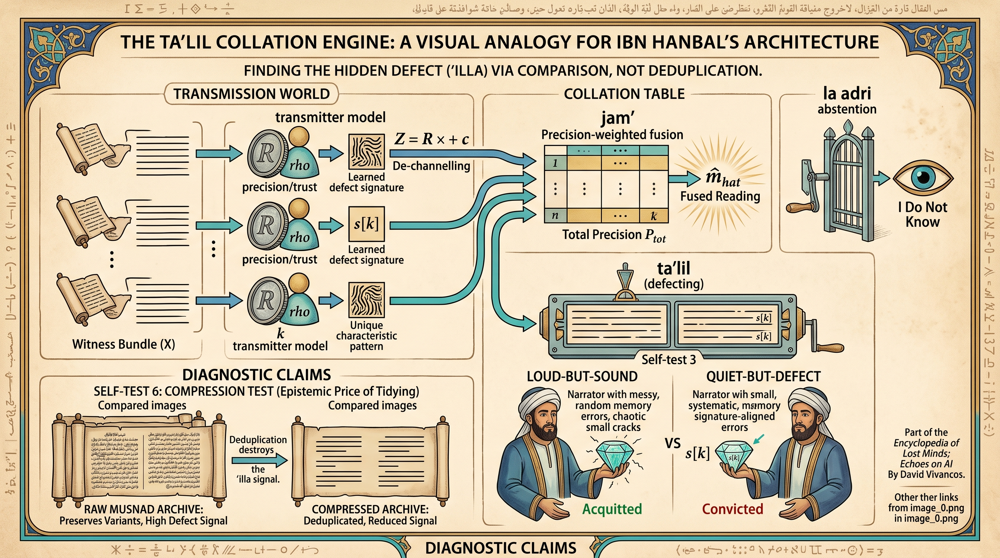

**Architecture — *The Taʿlīl Collation Engine — witness collation with a hidden-defect detector and a trained abstention gate***  ·  🟢 **belief** — grounded in the figure's own surviving works

The instrument is not the chain but *ʿilal*, the science of the hidden defect: a report whose chain is formally impeccable and whose text reads perfectly well, and which is still corrupt. The network's parameters store no content. They store a model of the **transmitters** — for each channel a read operator and a characteristic drift — and every parallel version of a report is **collated** side by side, never merged, so the variants stay available as evidence. A **defect detector** separates noise from defect by direction: a bad memory scatters at random, a defect drifts the same way across unrelated reports, and a witness is condemned by the **signature** of its drift, not by its noise. Output passes through a **trained abstention gate** — *lā adrī*, *I do not know*, learned as a head rather than set as a threshold — and a **coercion test** measures how far the engine's verdicts move when pressure is applied to them. An auditor, not an oracle.

▶️ **Run the mind:** [`minds/chapter_0214_ahmad_ibn_hanbal_780.py`](minds/chapter_0214_ahmad_ibn_hanbal_780.py)  —  `python3 minds/chapter_0214_ahmad_ibn_hanbal_780.py`

---

## 215 · Al-Maʾmūn
**786 – 833 CE — Baghdad, Merv & Tarsus · Abbasid**  |  *Rulership · Astronomy · Examination*

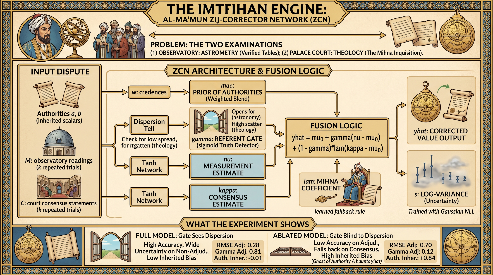

**Architecture — *The Imtiḥān Engine — a Zīj-Corrector Network (ZCN)***  ·  🔵 **extrapolated** — inferred from documented deeds

One Arabic root, *m-ḥ-n*, names both his Verified Tables (*al-zīj al-mumtaḥan*) and his inquisition (*miḥna*); the network is built to tell the two examinations apart. It trains on **disputes**, not statements: inherited authorities that contradict one another, as the Sindhind contradicted the *Almagest*. Each estimate blends three sources — the **prior**, the **instrument** and the **court** — through a **referent gate** that opens only when independent readings agree, as two observatories hundreds of kilometres apart were built to agree. When no instrument bears on the question, a free **miḥna coefficient** reports how much the answer took from the room, and a **variance head** is allowed — and rewarded — to answer that a dispute *cannot be settled*. Ablations that mask the dispersion signal show what happens when an examination loses its referent: the procedure keeps producing sealed answers, now measuring compliance. A warrant is an event that could have contradicted the examiner.

▶️ **Run the mind:** [`minds/chapter_0215_al_ma_mun_786.py`](minds/chapter_0215_al_ma_mun_786.py)  —  `python3 minds/chapter_0215_al_ma_mun_786.py`

---

## 216 · Al-Muʿtaṣim
**796 – 842 CE — Baghdad & Samarra · Abbasid**  |  *Sovereignty · Military institutions · Engineered loyalty*

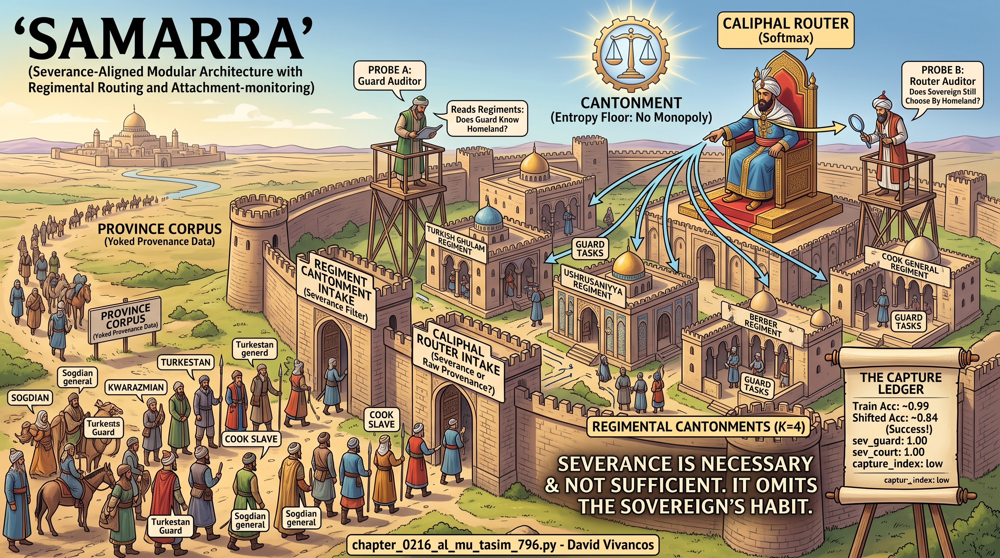

**Architecture — *SAMARRA — Severance-Aligned Modular Architecture with Regimental Routing and Attachment-monitoring***  ·  🔵 **extrapolated** — inferred from documented deeds

He wrote nothing and left a procedure in three moves — procurement, severance, enclosure: buy the capability, cut its ties, house it where no new tie can form. The architecture keeps the last two as mechanism. **Severance**: an imported faculty is trusted only once its origin is removed, so a **provenance projection** cuts the subspace that encodes where each input came from, at intake, before any expert sees it. **Regimental routing**: the experts serve as regiments under a **gated router**, cantoned so that none can absorb the others' work. **Attachment-monitoring**: a ledger watches the one thing the historical procedure never watched — how much power the routing gate concentrates in any single regiment — because obedience was never the problem: nineteen years after his death the guard that had never disobeyed him was appointing caliphs. Every gradient is derived by hand and checked against central differences before any training runs. Alignment here is structure rather than teaching.

▶️ **Run the mind:** [`minds/chapter_0216_al_mu_tasim_796.py`](minds/chapter_0216_al_mu_tasim_796.py)  —  `python3 minds/chapter_0216_al_mu_tasim_796.py`

---

## 217 · Fatima al-Fihri
**c. 800 – c. 880 CE — Kairouan & Fez · Arab (Qurashī-Fihrī)**  |  *Endowment (waqf) · Mosque-building · Education*

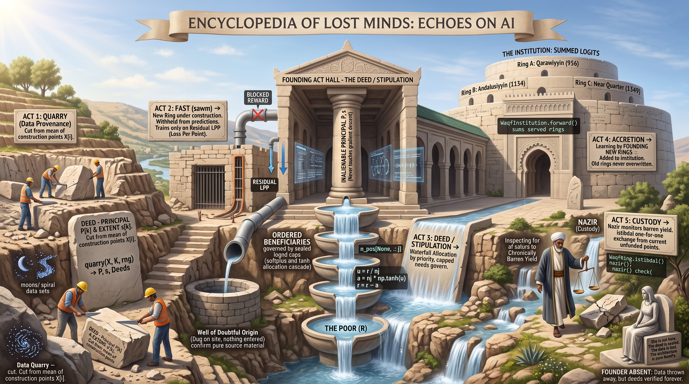

**Architecture — *The Waqf Network — “The Deed of Perpetuity”***  ·  🟡 **mediated** — known only through others' accounts

The founding acts attributed to her in Ibn Abī Zarʿ's *Rawḍ al-Qirṭās* (c. 1326) become mechanisms. **Quarry**: every neuron's **principal** vector is cut from the data it stands on — the mean of a recorded set of training points, its deed — so provenance is a property of construction, not a log. **Fast**: a ring under construction takes no reward and is not consumed; it is trained only on what the existing institution leaves unfunded, and served only once complete. **Deed**: the principal is inalienable and only its yield is spent, distributed down the founder's ordered list of beneficiaries by a capped **stipulation waterfall** that ends in a residual clause for the poor. **Accretion**: the institution grows by adding rings, never by rewriting old ones, so earlier accuracy is untouched when a new community is learned. **Exchange**: a barren principal may be replaced one-for-one under audit, the only self-modification allowed. The account is late and may be legend; the chapter says so, and the design works identically either way.

▶️ **Run the mind:** [`minds/chapter_0217_fatima_al_fihri_800.py`](minds/chapter_0217_fatima_al_fihri_800.py)  —  `python3 minds/chapter_0217_fatima_al_fihri_800.py`

---

## 218 · Al-Kindī
**c. 801 – c. 873 CE — Kufa, Basra & Baghdad · Arab (Kinda)**  |  *Philosophy · Cryptanalysis · Mathematics · Optics · Music*

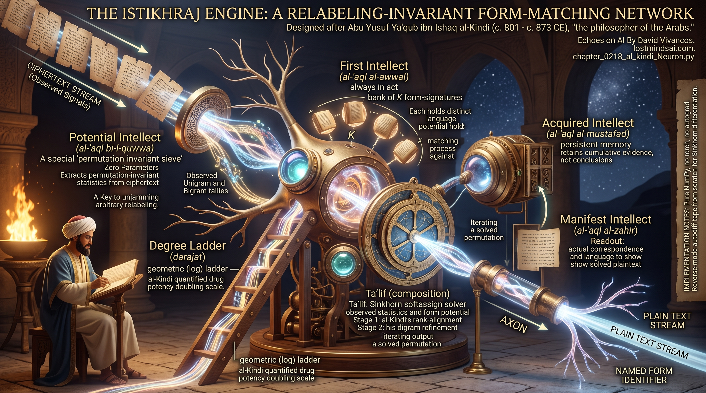

**Architecture — *The Istikhrāj Engine — a relabelling-invariant form-matching network***  ·  🟢 **belief** — grounded in the figure's own surviving works

Al-Kindī held that intelligible forms cannot be built up out of sensation — the form is received, not manufactured — and he broke ciphers for a living: a substitution cipher can change which symbol stands for which letter, but not how often each one occurs. So the **potential intellect** has no parameters at all: it reduces every input to quantities a relabelling cannot touch. A **degree ladder** grades intensity on a doubling scale, after *De gradibus*. Matching runs against a bank of stored forms that no input path can write to — the first intellect, held outside the learner — and the alignment of symbols to forms is solved as an assignment problem, relaxed and projected by **Sinkhorn** iterations onto doubly stochastic matrices. Self-tests check invariance under relabelling and compare caching a conclusion against keeping the tallies. Knowing, here, is decipherment: a form recognised through its disguise.

▶️ **Run the mind:** [`minds/chapter_0218_al_kindi_alkindus_801.py`](minds/chapter_0218_al_kindi_alkindus_801.py)  —  `python3 minds/chapter_0218_al_kindi_alkindus_801.py`

---

## 219 · Banū Mūsā ibn Shākir
**fl. c. 803 – 873 CE — Baghdad & Samarra · Abbasid**  |  *Mechanics · Hydraulics · Geometry · Astronomy*

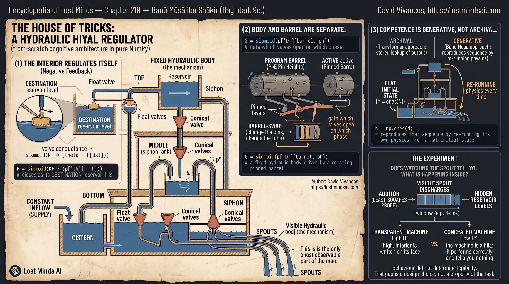

**Architecture — *The Ḥiyal Body — a hydraulic hidden-state regulator***  ·  🔵 **extrapolated** — inferred from documented deeds

No attention, no key–value store, no embedding matrix, no learned lookup: the mechanism is the brothers' own. Their *Kitāb al-Ḥiyal* describes about a hundred vessels whose behaviour lives in what the guest cannot see, and three commitments follow. **The interior regulates itself**: state is the water level in a set of reservoirs, and valves carry learned **floats** that throttle their own inlet as a chamber fills — negative feedback as a stock component. **Cause is decoupled from effect in time**: **siphons** discharge only once a crest is crossed, and hidden chambers separate an input from its consequence, defeating any observer who reasons from what follows what. **The programme is apart from the machine**: swappable **pinned barrels**, as in their self-playing instrument, drive the same body to different behaviours. Depth is time. The file measures its own **legibility** — how much of the interior an observer can recover from outside — and treats running the water as the only proof that counts.

▶️ **Run the mind:** [`minds/chapter_0219_banu_musa_803.py`](minds/chapter_0219_banu_musa_803.py)  —  `python3 minds/chapter_0219_banu_musa_803.py`

---

## 220 · Al-Bukhārī
**810 – 870 CE — Bukhara, Nishapur & Khartank · Persian (Transoxiana)**  |  *Hadith criticism · Isnād analysis · Rijāl*

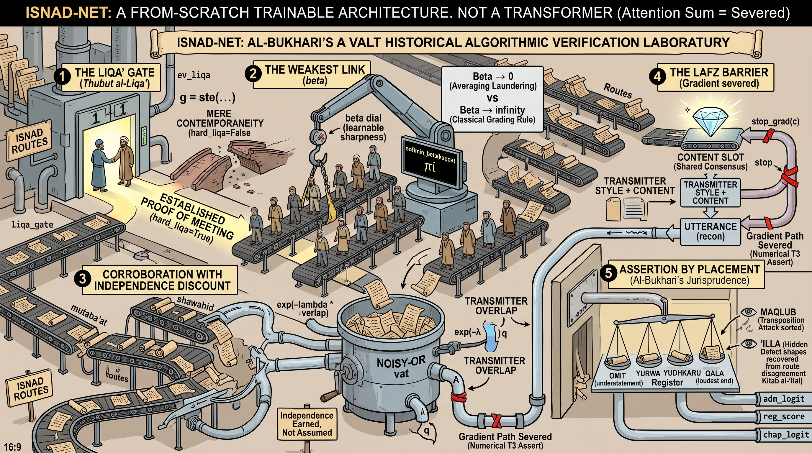

**Architecture — *Isnad-Net — an admission architecture on routes of transmission***  ·  🟢 **belief** — grounded in the figure's own surviving works

Attention is a weighted sum over stored keys, in which a weak source can be rescued by strong neighbours; al-Bukhārī's discipline refuses that arithmetic. His unit of evidence is a **route** — a named line of men, breakable at any joint. **The liqāʾ gate**: every joint passes a hard straight-through binary that opens only on documented evidence that the two narrators met, so an unshown meeting contributes nothing rather than a little. **The weakest joint**: a chain is scored by a **soft-minimum** whose sharpness is a learnable dial, not by a mean. **Earned independence**: routes combine by a **noisy-OR discounted by transmitter overlap**, so twenty chains through one man count as one. A **lafẓ barrier** severs the gradient from wording to content, so fluency cannot vote on truth. The output is an **admission** verdict, down to suspension (*taʿlīq*) and exclusion — never generated text.

▶️ **Run the mind:** [`minds/chapter_0220_al_bukhari_810.py`](minds/chapter_0220_al_bukhari_810.py)  —  `python3 minds/chapter_0220_al_bukhari_810.py`

---

## How the minds are reconstructed

Every entry is built research-first: the figure's surviving works and current scholarship are gathered and each source verified before any architecture is written. Where evidence is thin, the chapter says so rather than inventing an inner life. Each figure's **provenance** is set to one of three real values:

- 🟢 **belief** — the figure's own surviving works or recorded doctrine ground the entry.
- 🟡 **mediated** — no words of their own survive; they are known only through others' (often hostile or legendary) accounts, and the entry says so.
- 🔵 **extrapolated** — no philosophy of mind survives at all; the entry is inferred from documented deeds (typical of kings and builders), and the entry says so.

Fourteen of these twenty left words of their own; one is mediated and five are extrapolated, and several of the fourteen are belief on a thread. **Al-Manṣūr** left no book — his four pillars reach us through later administrative writers; **Ḥabash**'s birth may be a quarter-century later than the record gives; **al-Maʾmūn**'s doctrine of mind survives in brass and in chronicles written by men with agendas; **al-Muʿtaṣim** wrote nothing and is read from a procedure; and the **Banū Mūsā** left one retort about Euclid and no psychology at all. **Fatima al-Fihri** reaches us through a single narrative written four and a half centuries after the event, about a building whose own foundation panels name someone else; the chapter treats her as a deed that works identically whether or not she existed. Among the fourteen, **Jābir**'s corpus is a school wearing one man's name, **al-Khalīl**'s dictionary was finished by a pupil, **Ibn Ḥanbal**'s creeds are attributed at a remove, and **Du Fu**'s three commitments are read out of what his couplets do rather than out of any doctrine he stated.

Each reconstructed mind is then measured against the **[Artificiology E-AGI Barometer](https://artificiology.com/barometer.html)** — eight capability dimensions (Cognitive Processing 🧩, Embodied Cognition 🤸, World Modeling 🌍, Consciousness 👁️, Language Understanding 💭, Emotional Intelligence ❤️, Creativity ✨, Autonomy 🎯) — so a Tang poet and a Bukharan critic of transmitters can be compared on the same yardstick. Tome 11 bends the eighth axis more ways than any tome before it: **al-Kindī** caps Autonomy 🎯 on principle, **al-Muʿtaṣim** measures it as capability over the principal's power to withdraw, **al-Bukhārī** requires self-modification to be a dated event, and **Ibn Ḥanbal** scores at its ceiling by defining it as the capacity to hold a verdict against a decree. **Fatima al-Fihri** adds a ninth dial — absence: an instrument is finished only when its maker can be subtracted without loss — and **al-Maʾmūn** refuses to average the eight at all, separating the axes that have an instrument behind them from those that only report the composition of the panel.

---

[← Tome 10](tome10.md) · [Repository README](readme.md)

### Read & explore
- 🌐 **Encyclopedia:** [https://lostmindsai.com](https://lostmindsai.com)
- 📖 **Tome 11 (Amazon):** [https://www.amazon.com/dp/B0HKF7TRFF](https://www.amazon.com/dp/B0HKF7TRFF)
- 🧪 **Interactive demos & résumé:** [https://artificiology.com/](https://artificiology.com/)
- 📊 **E-AGI Barometer:** [https://artificiology.com/barometer.html](https://artificiology.com/barometer.html)
- ✍️ **Author — David Vivancos:** [https://www.vivancos.com/](https://www.vivancos.com/)
