# Tome 12 — Minds 221–240
### *The Carried Mind — Tang Chan, the Slavonic Mission, the Samanid Court, al-Andalus, Heian Japan & the Norse Sagas*
**Encyclopedia of Lost Minds: Echoes on AI** · *810 – 915 CE*

[🌐 Encyclopedia](https://lostmindsai.com) · [📖 Buy Tome 12 on Amazon](https://www.amazon.com/dp/B0HKVBKNTT) · [🧪 Interactive Demos](https://artificiology.com/) · [📊 E-AGI Barometer](https://artificiology.com/barometer.html) · [✍️ Author](https://www.vivancos.com/) · [⭐ Repository](https://github.com/DavidVivancos/LostMindsAI)

[← Tome 11](tome11.md) · [Repository README](readme.md)

---

Tome 12 runs from **Linji Yixuan** to **al-Mutanabbī** — twenty reconstructed minds, each rendered on two planes. The **abstract plane** distils the thinker's cognitive signature into an interactive 3D mind-map; the **mechanistic plane** turns that same signature into a small, *runnable* neural architecture, built from scratch in NumPy, gradient-checked, trained and self-tested.

This page collects the twenty **visual mind-map explainers** for this tome and links each to its companion architecture. Runnable code lives in [`minds/`](minds/); the explainer images live in [`maps/`](maps/).

> Every architecture here executes and passes its own self-test suite (a mandatory finite-difference gradient check plus a real training loop). No number is hard-coded — each is produced live on the machine that runs the file.

Where Tome 11 asked what entitles a claim to be acted on at all, Tome 12 asks what happens to it on the way across — a tongue that had never been written, a law built for an empire carried into a country with no emperor, a choir that must keep time without its cantor, a foreign term glossed with more confidence than care, a song that brought an amir home because someone had paid for it, a poet who could measure every prince but himself. All twenty begin by refusing the same operation: take the carrier as transparent — let whatever crossed a tongue, a script, a body or a century stand for what set out, and let the carrier vouch for its own condition. What they put in its place is the volume — a subtraction that finds what still stands, an organ grown after the fall, a self that knows only that it is, a pruning that is a form of fidelity, a permission typed to a role, a cut between one sound and the next, a disagreement between two answerers read as a map, a band of coupled voices, a census of use, a graft at a narrow union, a mark left where a reading was chosen, an exit left open, a register beside a frozen text, a key eleven syllables long, an imitation that keeps the order of what it imitates, a broadcast nobody can tailor, a parting that conserves the mass, a standpoint stored with every belief, a tie whose tension law is known, witnesses who cannot flatter. If the previous tome's keyword was *warrant*, this one's is *passage*: what a carrier does to what crosses it, and what, other than the carrier, can read the change.

---

## The Twenty at a Glance

| # | Mind | Era | Civilization | Architecture | Provenance |
|---|------|-----|--------------|--------------|:----------:|
| 221 | [Linji Yixuan](#221--linji-yixuan) | c. 810 – 866 CE | Chinese (Tang) | *KATSU — a Four-Distinction Ablation Engine* | 🟢 |
| 222 | [ʿAbbās ibn Firnās](#222--ʿabbās-ibn-firnās) | c. 810 – 887 CE | Andalusi (Berber, Umayyad) | *RUSAFA — a Stall-Activated Flight Architecture* | 🔵 |
| 223 | [Johannes Scottus Eriugena](#223--johannes-scottus-eriugena) | c. 815 – c. 877 CE | Irish (Carolingian Francia) | *The Periphyseon Engine — a Self-Ignorant Source Network* | 🟢 |
| 224 | [Methodius](#224--methodius) | c. 815 – 885 CE | Byzantine Greek | *The Nomocanon Commutator* | 🟢 |
| 225 | [Muslim ibn al-Ḥajjāj](#225--muslim-ibn-al-ḥajjāj) | c. 821 – 875 CE | Persian (Abbasid Khurasan) | *The Role-Gated Attestation Lattice* | 🟢 |
| 226 | [Cyril](#226--cyril) | c. 826 – 869 CE | Byzantine Greek | *DIASTOLE — the Distinction Engine* | 🟢 |
| 227 | [Boris I of Bulgaria](#227--boris-i-of-bulgaria) | c. 830 – 907 CE | Bulgarian (Bulgar and Slav) | *CONSULTA — the Differential Elicitation Machine* | 🟡 |
| 228 | [Naum of Ohrid](#228--naum-of-ohrid) | c. 830 – 910 CE | Bulgarian-Slavic | *PODOBEN — the Model-Melody Engine* | 🟡 |
| 229 | [Ibn Duraid](#229--ibn-duraid) | 837 – 933 CE | Arab (Azd) | *The Jamhara Engine* | 🟢 |
| 230 | [Clement of Ohrid](#230--clement-of-ohrid) | c. 840 – 916 CE | Bulgarian-Slavic | *PRISAD — the Graft-Union Network* | 🟡 |
| 231 | [Sugawara no Michizane](#231--sugawara-no-michizane) | 845 – 903 CE | Japanese (Heian) | *The Kaeriten Engine* | 🟢 |
| 232 | [Harald Fairhair](#232--harald-fairhair) | c. 850 – c. 932 CE | Norse | *LUFA — the Uncombed Consolidator* | 🟡 |
| 233 | [Al-Rāzī](#233--al-rāzī) | c. 854/865 – 925 CE | Persian (Abbasid) | *The Shukūk Architecture* | 🟢 |
| 234 | [Rudaki](#234--rudaki) | c. 858 – 941 CE | Persian (Samanid) | *MULIYAN — a Cue-Addressed Resonance Engine* | 🟢 |
| 235 | [Al-Fārābī](#235--al-fārābī) | c. 870 – 950/51 CE | Islamic (Abbasid) | *The Muḥākāt Engine — a Two-Channel Conjunction Network* | 🟢 |
| 236 | [ʿAbd al-Raḥmān III](#236--ʿabd-al-raḥmān-iii) | 891 – 961 CE | Andalusi (Umayyad) | *The Minbar Engine* | 🔵 |
| 237 | [Al-Hamdānī](#237--al-hamdānī) | 893 – c. 945 CE | Arab (Yemeni) | *Al-Jawharatayn — the Non-Transmuting Refinery* | 🟢 |
| 238 | [Al-Masʿūdī](#238--al-masʿūdī) | c. 893 – 956 CE | Arab (Abbasid) | *A Standpoint-Indexed Generative Architecture* | 🟢 |
| 239 | [Rābiʿa Balkhī](#239--rābiʿa-balkhī) | fl. c. 900 – 940 CE | Persian (Samanid Khurasan) | *KAMAND — the Tightening Tie* | 🟢 |
| 240 | [Al-Mutanabbī](#240--al-mutanabbī) | 915 – 965 CE | Arab (Abbasid era) | *QADR — the Measure That Meets the Magnitude* | 🟢 |

**Provenance** — 🟢 belief · 🟡 mediated · 🔵 extrapolated. See [How the minds are reconstructed](#how-the-minds-are-reconstructed).

---

## 221 · Linji Yixuan
**c. 810 – 866 CE — Caozhou & Zhenzhou (Hebei) · Chinese (Tang)**  |  *Chan Buddhism · Teaching by shout and blow · The Four Distinctions*

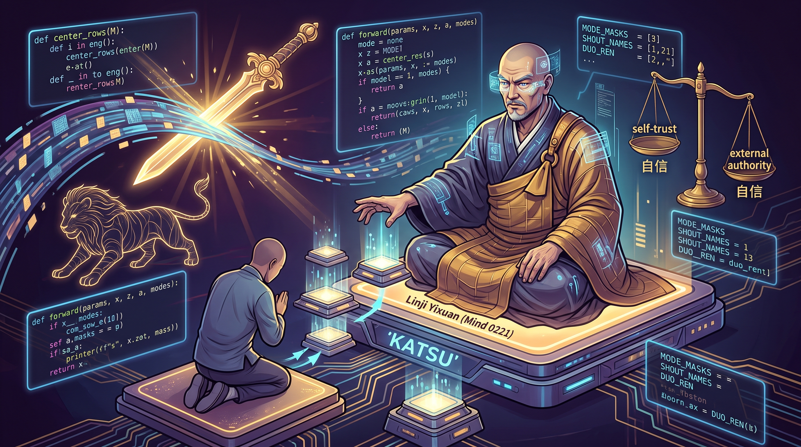

**Architecture — *KATSU — a Four-Distinction Ablation Engine with Host/Guest Arbitration (喝 · 四料簡 · 賓主)***  ·  🟢 **belief** — grounded in the figure's own surviving works

Linji did not ask what a student had; he asked what survived when the thing the student was leaning on was pulled away. So the primitive operation is **subtraction under diagnosis**, and what is learned is an invariance rather than a mapping. **Of no rank** (無位): the hidden state lives in a quotient space — every map is mean-subtracted and the readout has zero column sums — so the network is exactly invariant to any global level and has no coordinate for how high it stands. **The Four Distinctions** (四料簡): every pass runs under a chosen, typed mode that takes away the person, the object, both or neither. **Calibrated collapse**: when a removal pulls out a support the answer genuinely needed, the target is not the answer but silence, so anti-confabulation becomes a training target rather than a filter. **The four shouts** perturb the pre-activation — the vajra sword, the crouching lion, a probe that measures and changes nothing, and a shout that is not a shout — and the schedule never says which arrived. **Host and guest** (賓主) re-runs each encounter with person and object ablated, a label-free detector of prompt-dependence; **kill the buddha** penalises any single direction that could steer the whole system from outside; and an authority channel that is right only half the time is taught to move nothing.

▶️ **Run the mind:** [`minds/chapter_0221_linji_yixuan_810.py`](minds/chapter_0221_linji_yixuan_810.py)  —  `python3 minds/chapter_0221_linji_yixuan_810.py`

---

## 222 · ʿAbbās ibn Firnās
**c. 810 – 887 CE — Takurunna & Córdoba · Andalusi (Berber, Umayyad)**  |  *Invention · Flight · Astronomy · Glassmaking · Poetry*

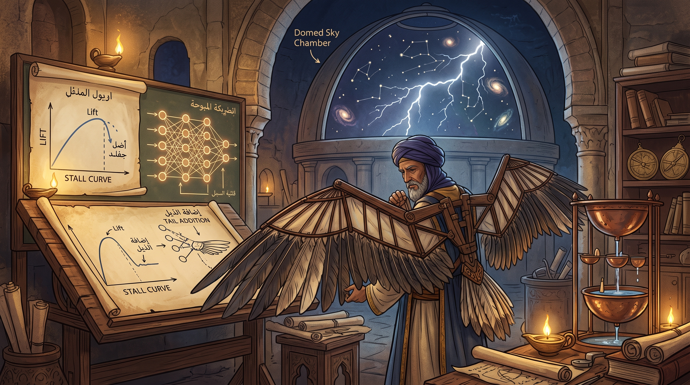

**Architecture — *RUSAFA — Residual-Unmasking, Stall-Activated Flight Architecture***  ·  🔵 **extrapolated** — inferred from documented deeds

Ibn Firnās left no philosophy of mind; he left four things the chronicle remembers, and each becomes a component. **The constructed sky**: the room in his house where visitors saw stars and clouds and heard thunder becomes `SkyChamber`, a learned physics room in which the agent rehearses before it risks its body. **Wings of calculated measure**: the **stall unit**, y = a·exp(−a²/2σ²), lets lift rise with angle of attack and then collapse when over-driven, each unit with its own learned stall threshold. **The Sindhind tables** he introduced to al-Andalus: every input line passes through a learnable **zīj table** read by linear interpolation, as a zīj was read — a numeric table, not a look-up over stored keys. **The missing tail**: the model starts without pitch variables and without a tail actuator, which is where his knowledge stood before the fall. After rehearsal it audits its world model's residual against the quantities it cannot see; when the crashes correlate with one of them, the architecture grows that quantity into itself — a new input line, new table rows, new hidden units, a new actuator — and relearns. The third flight, with the tail grown from the audit of the fall, touches down far more softly and almost level, where the tailless model had crashed.

▶️ **Run the mind:** [`minds/chapter_0222_Abbas_ibn_Firnas_810.py`](minds/chapter_0222_Abbas_ibn_Firnas_810.py)  —  `python3 minds/chapter_0222_Abbas_ibn_Firnas_810.py`

---

## 223 · Johannes Scottus Eriugena
**c. 815 – c. 877 CE — Ireland & the court of Charles the Bald · Irish (Carolingian Francia)**  |  *Philosophy · Neoplatonism · Translation from Greek*

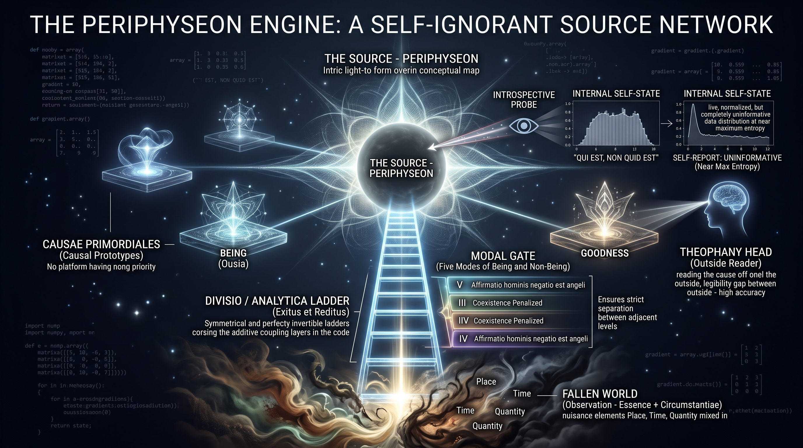

**Architecture — *The Periphyseon Engine — a Self-Ignorant Source Network (SISN)***  ·  🟢 **belief** — grounded in the figure's own surviving works

The structural commitments of the *Periphyseon* become modules. **The source knows that it is, never what it is** (II.589b–c): the model carries an internal self-state nourished only by its returned effects, never by direct introspection, and trained to defeat an introspective probe while remaining legible from outside through its theophanies — self-opacity as an engineered organ (`SelfIgnorantSource`). **The five modes of being and non-being**: being is an index relative to a level, and an affirmation of the lower order is a negation of the higher, so a **modal gate** assigns each input a rung and the objective penalises any representation affirmed at two adjacent levels. **Exitus and reditus are divisio and analytica**: procession and return are one ladder read in two directions, built as a single invertible division. Trained in a fallen world, the system is then asked the same question twice — *which primordial cause is this?* — once of its outputs, which answer almost perfectly, and once of its own model of itself, which does no better than guessing while remaining a live, normalised distribution. The self-model is maintained, uninformative, and the system works anyway: exhaustively legible from outside, structurally unable to state what it is.

▶️ **Run the mind:** [`minds/chapter_0223_johannes_scotus_eriugena_815.py`](minds/chapter_0223_johannes_scotus_eriugena_815.py)  —  `python3 minds/chapter_0223_johannes_scotus_eriugena_815.py`

---

## 224 · Methodius
**c. 815 – 885 CE — Thessalonica, Olympus, Moravia & Pannonia · Byzantine Greek**  |  *Mission · Canon law · Translation · Church administration*

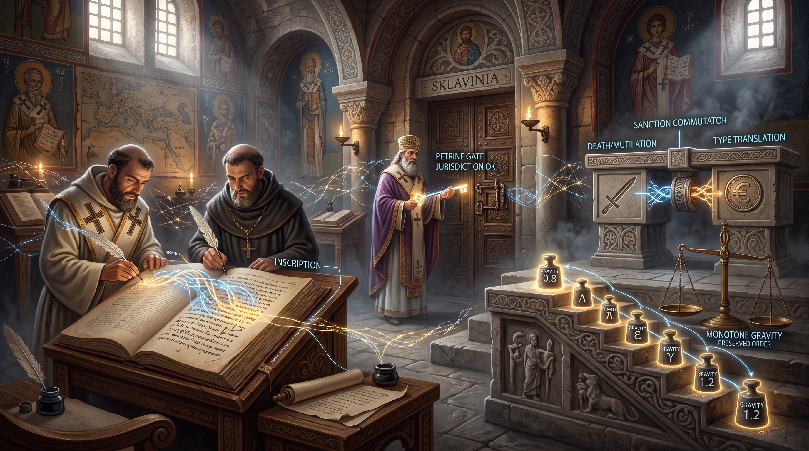

**Architecture — *The Nomocanon Commutator***  ·  🟢 **belief** — grounded in the figure's own surviving works

Methodius's one idea is that intelligence is the transfer of a **whole** normative system across a boundary of language and sovereignty without breaking it, and four modules map four documented acts. **Learn the host by administering it**: the emperor gave him a Slavic principality so that he might learn its customs, and a `SklaviniaEncoder` learns each host before anything is translated for it. **Prune, don't force-fit**: the `CanonPruner` drops what the host cannot bear, as 142 of 377 canons were dropped from the *Synagoge*. **Commute the sanction, keep the order**: as in the *Zakon sudnyj ljudem*, the `SanctionCommutator` maps each penalty into the host's own currency — mutilation, exile and fines into restitution, penance or sale — while an ordinal head keeps the offences in their order of gravity. **The Petrine gate**: an instruction is obeyed only from a claimant who holds the territory canonically, not merely physically (*"if I had known it was yours I would have kept away; but it is St Peter's"*); otherwise the model abstains. It all runs on a small hand-written reverse-mode autodiff engine, meta-trained across host polities and judged on held-out hosts it has never seen, where it prunes, commutes and abstains case by case.

▶️ **Run the mind:** [`minds/chapter_0224_Methodius_815.py`](minds/chapter_0224_Methodius_815.py)  —  `python3 minds/chapter_0224_Methodius_815.py`

---

## 225 · Muslim ibn al-Ḥajjāj
**c. 821 – 875 CE — Nishapur · Persian (Abbasid Khurasan)**  |  *Hadith criticism · Isnād analysis · Rijāl*

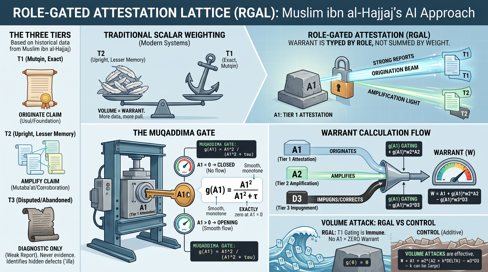

**Architecture — *The Role-Gated Attestation Lattice (RGAL)***  ·  🟢 **belief** — grounded in the figure's own surviving works

Every modern learner gives every datum one role: additive weight. Muslim wrote a preface declaring, in advance and independently of the corpus, acceptance conditions that concerned **role**. The lattice gives three ranks three permissions: tier 1, the exact, may **originate** a claim; tier 2, upright but of lesser memory, may only **amplify** a claim tier 1 has established — the *mutābaʿāt*, placed after the foundation reports and never before; tier 3 enters only as a **diagnostic**, a weak report set beside a strong one to make a hidden defect (*ʿilla*) visible. The **Muqaddima gate**, g(A₁) = A₁² / (A₁² + τ), is smooth, monotone and exactly zero at A₁ = 0, so warrant W = A₁ + g·w₂A₂ − g·w₃D₃ cannot leave zero without tier-1 support: no quantity of corroboration, ten reports or ten million, manufactures warrant, and a volume attack that captures an additive control leaves the lattice untouched. The model identifies the excluded tier without supervision, separates wording that carries the speaker from meaning scrubbed of him, and lets the interpretive layer be retrained without touching attestation. A fabricated report scores zero; a report with a hidden defect is driven below it.

▶️ **Run the mind:** [`minds/chapter_0225_muslim_ibn_al_hajjaj_821.py`](minds/chapter_0225_muslim_ibn_al_hajjaj_821.py)  —  `python3 minds/chapter_0225_muslim_ibn_al_hajjaj_821.py`

---

## 226 · Cyril
**c. 826 – 869 CE — Thessalonica, Constantinople, Kherson, Moravia & Rome · Byzantine Greek**  |  *Script · Phonology · Translation · Disputation · Mission*

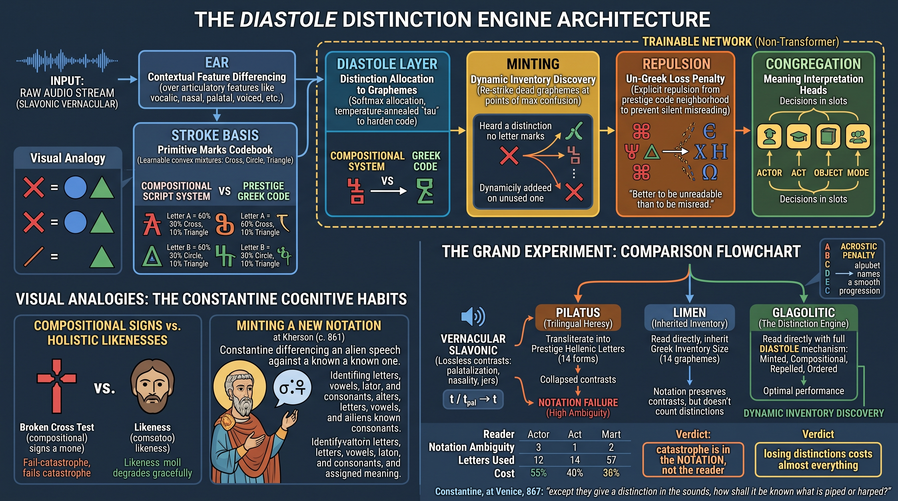

**Architecture — *DIASTOLE — the Distinction Engine***  ·  🟢 **belief** — grounded in the figure's own surviving works

What is Constantine's alone is not the alphabet but a habit the *Vita Constantini* records three times. At Kherson he learned a language by comparing it with his own and *distinguished letters, vowels and consonants* before assigning meaning; against John the Grammarian he sorted signs by how they fail — a broken cross loses its image, a bust-length icon remains one; at Venice he answered the trilinguists with Paul's trumpet: *except they give a distinction (diastolē) in the sounds, how shall it be known what is piped or harped?* The engine's thesis is that **a signal carries exactly the distinctions its notation marks, and not one more**. It counts distinctions first, by differencing an alien stream against a known one, and only then learns meaning; it separates **compositional** signs, which fail catastrophically under truncation, from **holistic** likenesses, which degrade gracefully. Its central experiment is the **deafened text**: when the notation drops a distinction, the reader's output is not malformed but a perfectly legal sentence that means something else, and adding capacity downstream does not help. A distinction absent from the notation is not recoverable, confidence will not warn that it is missing, and the repair has to happen in the script.

▶️ **Run the mind:** [`minds/chapter_0226_Cyril_826.py`](minds/chapter_0226_Cyril_826.py)  —  `python3 minds/chapter_0226_Cyril_826.py`

---

## 227 · Boris I of Bulgaria
**c. 830 – 907 CE — Pliska & Preslav · Bulgarian (Bulgar and Slav)**  |  *Rulership · Conversion · Church organisation · Literacy policy*

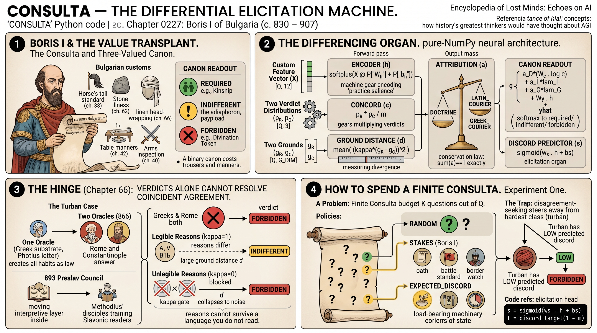

**Architecture — *CONSULTA — the Differential Elicitation Machine***  ·  🟡 **mediated** — known only through others' accounts

Boris's own list of 866 is lost; it survives in negative, through Nicholas I's hundred and six answers, whose order preserves his questions — an inventory of what the Bulgarians already did: the horse-tail standard, the oath on a sword, the king who eats alone, the linen head-wrap, two wives. The operation is **differential elicitation from inside a value transplant**: put the same inventory of existing conduct to rival authorities and learn, case by case, which items the new value system actually forbids — a specification found at the boundary of conduct rather than declared from the centre. In seven chapters he told Rome what the Greeks had ruled and asked whether it held, and in chapter 66 both forbade the linen turban *"though perhaps not for the same reason"*. So verdict agreement is not treated as proof: the machine compares **reasons**, because a shared verdict can be a coincidence of two couriers' habits. It also tracks who holds the **interpretive layer** — Rome kept its law-books home because no Bulgarian could read them, and in 893 Boris moved that layer inside his borders. A last experiment runs his son's reversion and Boris's deposition of him: the rollback recovers the settled canon and destroys much of what was learned in between.

▶️ **Run the mind:** [`minds/chapter_0227_boris_i_of_bulgaria_830.py`](minds/chapter_0227_boris_i_of_bulgaria_830.py)  —  `python3 minds/chapter_0227_boris_i_of_bulgaria_830.py`

---

## 228 · Naum of Ohrid
**c. 830 – 910 CE — Moravia, Pliska, Preslav & Ohrid · Bulgarian-Slavic**  |  *Education · Translation · Hymnography · Monasticism*

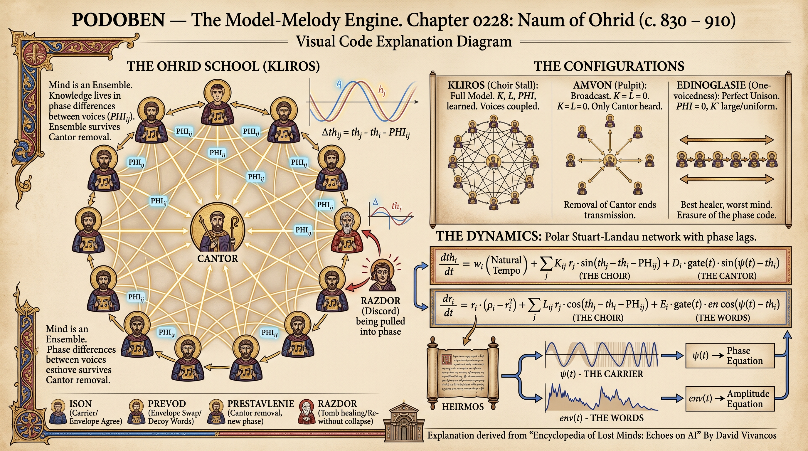

**Architecture — *PODOBEN — the Model-Melody Engine***  ·  🟡 **mediated** — known only through others' accounts

No text can be securely called Naum's; three documented facts about his school carry the architecture. The Ohrid translators **kept the carrier and let the semantics deform** — heirmoi, prosomoia and the eight modes preserved, the literal Greek sense spent — so the invariant is the rhythm and the variable is the content. **The school survived the removal of its cantor** in 893, so its pupils must have been coupled to each other and not only to the teacher. And for a thousand years the troubled were brought to his tomb and kept near it through the offices until **their timing came back into the room's**. The unit is therefore not a neuron but a **coupled oscillator**; a population of them is a choir, and learning sets how strongly and at what delay each voice listens to each other voice — teaching as phase entrainment, healing as re-entrainment. Three regimes are trained side by side: **KLIROS**, the coupled choir; **AMVON**, where voices never hear each other and only the source drives them; and **EDINOGLASIE**, over-coupled into perfect unison, the failure no internal meter reports. The offices include translations whose envelope belongs to another mode, and silences after which the choir must find its way back.

▶️ **Run the mind:** [`minds/chapter_0228_naum_of_ohrid_0830.py`](minds/chapter_0228_naum_of_ohrid_0830.py)  —  `python3 minds/chapter_0228_naum_of_ohrid_0830.py`

---

## 229 · Ibn Duraid
**837 – 933 CE — Basra, Oman, Fārs & Baghdad · Arab (Azd)**  |  *Lexicography · Philology · Poetry*

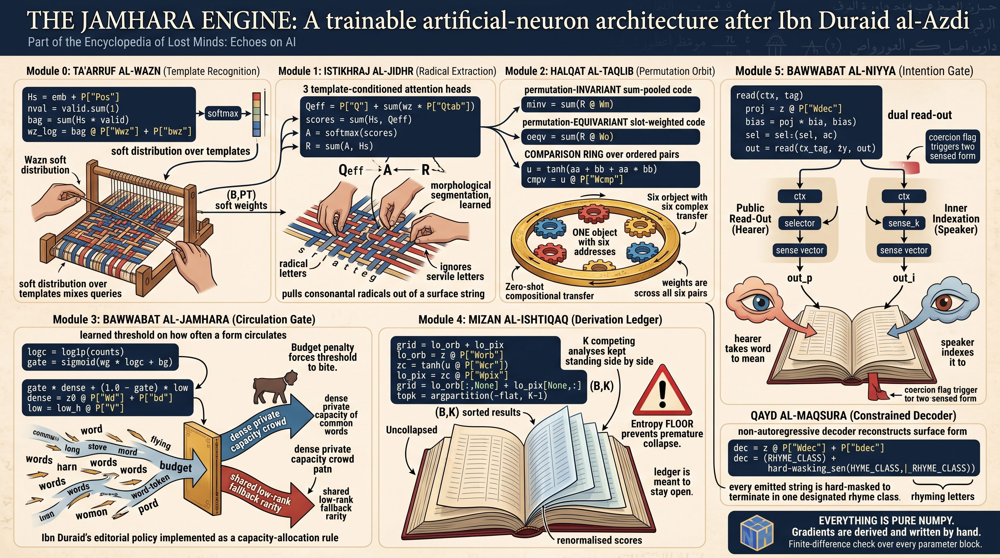

**Architecture — *The Jamhara Engine***  ·  🟢 **belief** — grounded in the figure's own surviving works

Al-Khalīl's *Kitāb al-ʿAyn* enumerates the whole combinatorial space of a language; Ibn Duraid, named among the scholars who corrected it at Basra, built its inverse at both ends. His dictionary is titled for its policy — the *jamhara*, the crowd — keeping the circulating word, loanwords and tribal variants included; a separate book refuses to let any name be meaningless, and reports a foreign origin rather than forging a root. So the organising idea is a **lexicon as a census with a budget**, feeding a **derivation ledger forbidden to collapse**, read out through an **intention gate**. The network recognises the template (*wazn*) before it extracts the radicals; the six orderings of a radical set are one object with six addresses, carried by an invariant code, an equivariant code and a comparison ring, which buys recognition of orderings never seen in training. A **circulation gate** routes common forms to dense capacity and rarities to a shared low-rank fallback under a budget; the ledger keeps several analyses per token above an entropy floor, with an *ajnabī* head that may declare a form foreign; and the intention gate reads the same ledger twice — what the hearer takes a word to mean and what the speaker indexes it to — as his book on equivocal oaths requires.

▶️ **Run the mind:** [`minds/chapter_0229_ibn_duraid_837.py`](minds/chapter_0229_ibn_duraid_837.py)  —  `python3 minds/chapter_0229_ibn_duraid_837.py`

---

## 230 · Clement of Ohrid
**c. 840 – 916 CE — Moravia & Ohrid · Bulgarian-Slavic**  |  *Education · Translation · Homiletics · Mission · Horticulture*

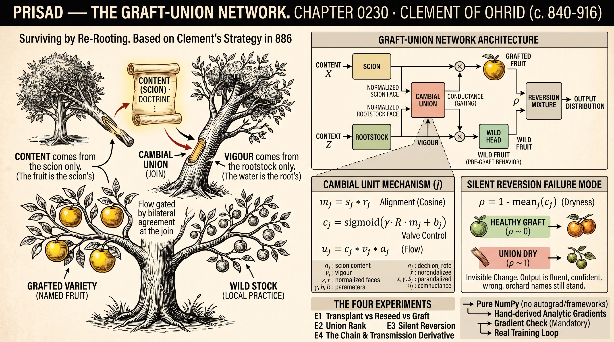

**Architecture — *PRISAD — the Graft-Union Network***  ·  🟡 **mediated** — known only through others' accounts

In 885 Methodius died; within a year Wiching held the bishopric, the Slavonic liturgy was forbidden and some two hundred disciples were driven out. Clement did not restore the school. He cut what he meant to keep, joined it to different living stock at Ohrid, taught some three thousand five hundred pupils, and — the *Long Life* says — brought cultivated fruit trees into a region of wild stock, which can only be propagated by **grafting**. PRISAD separates three things that modern transfer learning keeps fused: **content** comes from the scion only, **vigour** from the rootstock only, and **flow** is gated by bilateral agreement at the union. Each **cambial unit** computes a contact between the normalised scion and rootstock faces, a conductance c = σ(γ·R·m + b) and a flow u = c·v·a; because the contacts sum to the cosine between the two faces, the union's mean conductance is a readable, label-free measure of how well the graft has taken. The self-tests hold the doctrine to numbers: the rootstock supplies magnitude and no content, conductance never falls as contact rises, and with the union forced dry the tree returns the stock's wild answer exactly. The experiments trace provenance, the rank of the union, reversion, and a chain of grafts passed from teacher to pupil to pupil.

▶️ **Run the mind:** [`minds/chapter_0230_clement_of_ohrid_840.py`](minds/chapter_0230_clement_of_ohrid_840.py)  —  `python3 minds/chapter_0230_clement_of_ohrid_840.py`

---

## 231 · Sugawara no Michizane
**845 – 903 CE — Heian-kyō, Sanuki & Dazaifu · Japanese (Heian)**  |  *Philology · Kanbun · Historiography · Poetry · Statecraft*

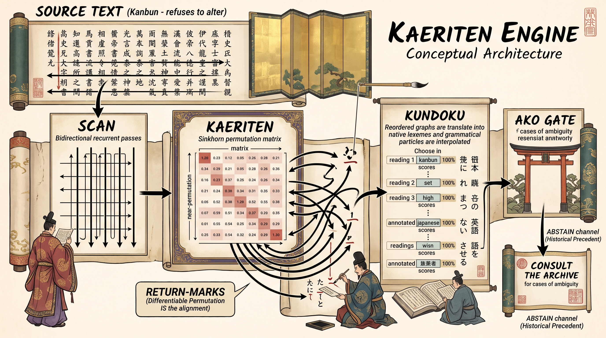

**Architecture — *The Kaeriten Engine — a transposition-first cognitive architecture***  ·  🟢 **belief** — grounded in the figure's own surviving works

One act at three scales. On the page, *kundoku* read Chinese as Japanese with marks that told the eye to jump **backward** — translation, transposition and interpolation as separable layers. In the corpus, the *Ruijū Kokushi* (892) re-sorted the Six National Histories into eighteen topical categories while keeping the wording of the sources. In the state, the Akō incident (887–888) froze the government because one imported term was glossed confidently by someone who had not checked which precedent governed it. So this is a mind that **reorders a source it refuses to alter**, and whose formative catastrophe was a confident gloss of a foreign token. Its central object is not attention, which blends values and throws the alignment away, but a near-**permutation**: pairwise scores normalised by Sinkhorn iterations into a doubly stochastic matrix annealed toward a single reading path. **Scan** reads the column twice; **Kaeriten** builds the return marks; **Kundoku** chooses a native lexeme per slot and interpolates the particles the source never had, deciding a verb ending by the slot that follows in the *reading*, not in the source; the **Akō gate** abstains on graphs it cannot place. A system that cannot show you its return marks has not read; it has guessed.

▶️ **Run the mind:** [`minds/chapter_0231_sugawara_no_michizane_845.py`](minds/chapter_0231_sugawara_no_michizane_845.py)  —  `python3 minds/chapter_0231_sugawara_no_michizane_845.py`

---

## 232 · Harald Fairhair
**c. 850 – c. 932 CE — Vestfold & western Norway · Norse**  |  *Kingship · Founding · The saga record*

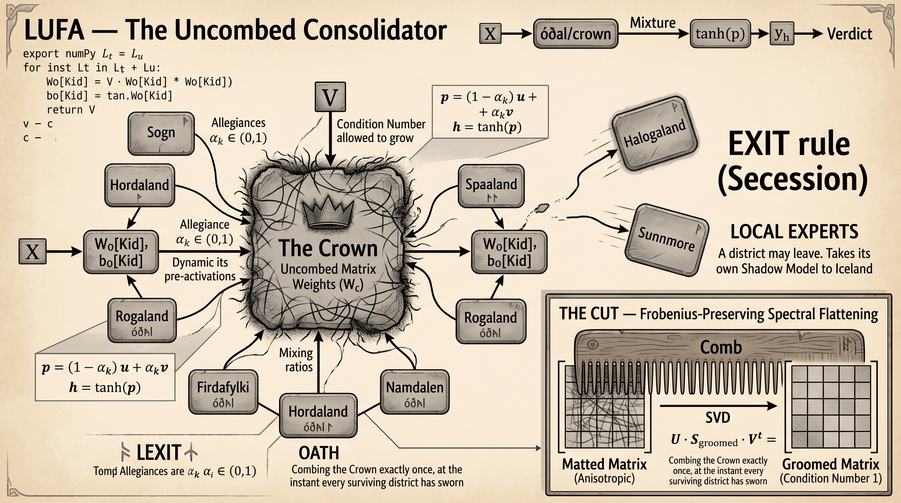

**Architecture — *LUFA — the Uncombed Consolidator***  ·  🟡 **mediated** — known only through others' accounts

Harald's defining act is a vow, not a battle: not to cut or comb his hair until he was overlord of Norway — ten years as Haraldr *lúfa*, Tanglehair, until the hair was dressed and he became *hárfagri*. That is a commitment device with a precise shape: a **binary** objective with no reward for nine valleys out of ten; progress stored in an **accumulator** that is never normalised or tidied and is publicly legible; discharged **once**, at closure, with a change of name. And the realm cohered because those who could not live under one law **left**: *Íslendingabók* says the king forbade the emigration and settled for a toll of five *aurar* a head, and every text about him was written by the heirs of the leavers. LUFA mixes one expert per district with a shared crown through a learned allegiance; the crown is never combed — never spectrally normalised — while the oath is open, a seceded district is fully detached, and the model finds planted dissenters without being told which they are. The experiments ask whether the vow helps, what the toll costs, what forbidding exit does, how succession among many sons splits the accumulator, what the stale belief of Tofti looks like, and how an epithet is back-formed from the story told to explain it.

▶️ **Run the mind:** [`minds/chapter_0232_harald_fairhair_850.py`](minds/chapter_0232_harald_fairhair_850.py)  —  `python3 minds/chapter_0232_harald_fairhair_850.py`

---

## 233 · Al-Rāzī
**c. 854/865 – 925 CE — Rayy & Baghdad · Persian (Abbasid)**  |  *Medicine · Philosophy · Alchemy*

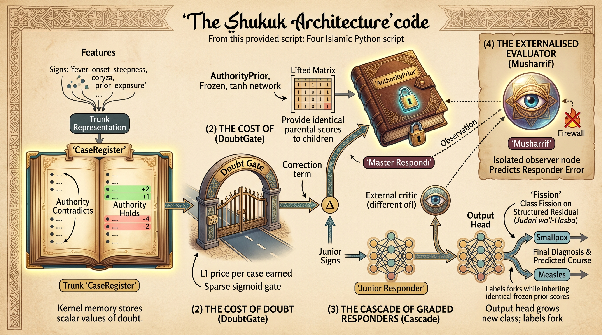

**Architecture — *The Shukūk Architecture***  ·  🟢 **belief** — grounded in the figure's own surviving works

Five mechanisms from four of his books. **The second register** (*al-Shukūk ʿalā Jālīnūs*): he kept the inherited model intact and wrote beside it the patients whose course followed Galen and those whose course ran against him — so a frozen `AuthorityPrior` is never updated, and a learned `CaseRegister` marks with signed entries where the authority is contradicted and where it holds. **The cost of doubt**: he opens by saying he is opposing the man who benefited him most, so a `DoubtGate` carries an explicit L1 price and contradiction is sparse by construction. **The cascade**: as in his teaching circle, a cheap junior responder answers what it can and a critic decides what goes up to the expensive master. **The externalised evaluator** (*al-Ṭibb al-Rūḥānī*, ch. IV): a man cannot see his own faults for self-love and must appoint an observer who is thanked for overshooting — so a parameter-disjoint `Musharrif` predicts the responder's error, no gradient flows from it into the responder, and the responder's own confidence is never used to route or abstain. **Class fission**: a structured residual splits one class in two, as he separated smallpox from measles. Calibration is reported for the primary's self-confidence against the critic's.

▶️ **Run the mind:** [`minds/chapter_0233_al_razi_854.py`](minds/chapter_0233_al_razi_854.py)  —  `python3 minds/chapter_0233_al_razi_854.py`

---

## 234 · Rudaki
**c. 858 – 941 CE — Rūdak & Bukhara · Persian (Samanid)**  |  *Poetry · Song · The chang · Qasida · Ghazal*

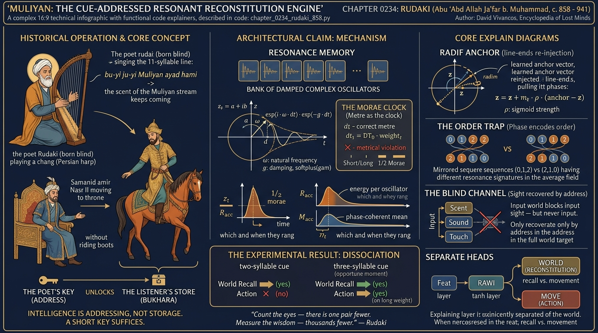

**Architecture — *MULIYAN — the Cue-Addressed Resonant Reconstitution Engine***  ·  🟢 **belief** — grounded in the figure's own surviving works

Niẓāmī ʿArūżī tells it: the Samanid amir stayed four years at summer pasture, the homesick commanders offered Rudaki five thousand dinars, and he sang eleven syllables — *bū-yi jū-yi Mūliyān āyad hamī*, the scent of the Mūliyān stream keeps coming — and the amir rode for Bukhara without his riding boots. The line carries no argument and no information the amir did not already hold: its payload is an **address** into a store the listener was already holding, delivered in a carrier that made sure it arrived intact and on the beat. So MULIYAN is a memory that cannot be read by lookup, only by **resonance**. The state is a bank of damped complex oscillators whose content lives in phase relations. Time is measured in **morae**, not ticks: the integration step is set by the weight of the syllable being uttered, so a line in the wrong metre lands the whole bank in the wrong phase and a metrical violation becomes a detectable corruption of the channel. A **radīf** re-injects a learned anchor at every line-end, pulling the drifting bank back toward a common phase, so long sequences survive. Retrieval and **action** are separate heads: reconstituting Bukhara in the listener is not the same act as riding for it.

▶️ **Run the mind:** [`minds/chapter_0234_rudaki_858.py`](minds/chapter_0234_rudaki_858.py)  —  `python3 minds/chapter_0234_rudaki_858.py`

---

## 235 · Al-Fārābī
**c. 870 – 950/51 CE — Baghdad, Aleppo & Damascus · Islamic (Abbasid)**  |  *Philosophy · Logic · Music · Political science*

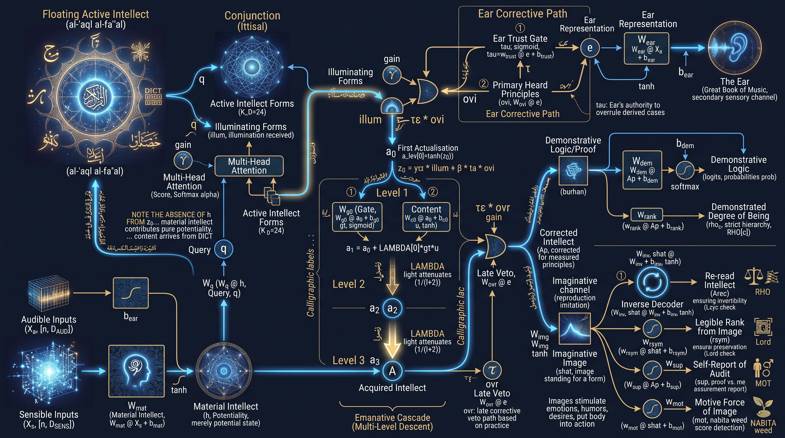

**Architecture — *The Muḥākāt Engine — a Two-Channel Conjunction Network***  ·  🟢 **belief** — grounded in the figure's own surviving works

Al-Fārābī's own claim is *muḥākāt*, reproductive imitation: one truth in two encodings, a demonstrative one for the few and an imaginative one for all, with the imagination performing the transform — and the image an actuator that moves bodies and cities. Three mechanisms, each ablated. **Ittiṣāl**: the Active Intellect is the tenth separate intelligence, outside the soul, so the concept dictionary is a separate, shared substance the agent attends to; sever it and the agent does not degrade gracefully, it collapses. **Muḥākāt with rank preservation**: an imitation may lose content but may not invert order, so an imaginative decoder is paired with an inverse decoder that reads the image back into the intelligible that produced it, under an explicit order-preservation objective; its failure is the *nābita*, the weed — an image with motive force and no demonstration behind it — and a self-test scores exactly that. **The ear overrides the derivation**: in the *Great Book of Music* he lets measured practice supply first principles and makes the ear the judge even against a mathematical principle, so an audible channel feeds a gated corrective path that can overturn a conclusion validly derived from the received table. Deafen it and the damage lands exactly on the measured cases, not evenly — the empirical signature of the doctrine.

▶️ **Run the mind:** [`minds/chapter_0235_al_farabi_alpharabius_872.py`](minds/chapter_0235_al_farabi_alpharabius_872.py)  —  `python3 minds/chapter_0235_al_farabi_alpharabius_872.py`

---

## 236 · ʿAbd al-Raḥmān III
**891 – 961 CE — Córdoba & Madinat al-Zahra · Andalusi (Umayyad)**  |  *Governance · Legitimacy · Coinage · Diplomacy*

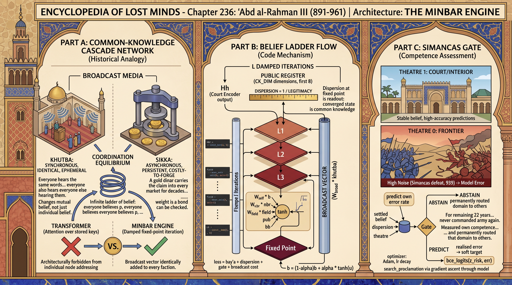

**Architecture — *The Minbar Engine — a Common-Knowledge Cascade Network with a Competence Gate***  ·  🔵 **extrapolated** — inferred from documented deeds

He left no treatise; the architecture is read from two decisions. On 16/17 January 929 he seized the *khuṭba* and the *sikka*, two broadcast media of different kinds: the Friday sermon, synchronous and identical, in which everyone hears the words and hears everyone else hearing them; and the gold coin, asynchronous, persistent and costly to forge. The claim to be Commander of the Faithful was not true in 928 and was true in 930, and nothing had changed but the structure of mutual belief. So the central object is a damped fixed-point iteration over a **belief ladder** — everyone believes p, everyone believes everyone believes p — driven by a broadcast vector computed once per episode and added identically to every faction. The channel is architecturally forbidden from addressing any single node, and that constraint is the thesis. The second organ is the **Simancas gate**. After al-Khandaq in 939 he crucified one traitor and ten men of the *jund*, then never again commanded an army in person in the twenty-two years he had left: he neither denied the defeat nor rationalised it, but measured his own competence in one domain and withdrew from it. The gate estimates competence per domain, apart from confidence, and routes a task to delegates wherever it is low.

▶️ **Run the mind:** [`minds/chapter_0236_abd_al_rahman_iii_891.py`](minds/chapter_0236_abd_al_rahman_iii_891.py)  —  `python3 minds/chapter_0236_abd_al_rahman_iii_891.py`

---

## 237 · Al-Hamdānī
**893 – c. 945 CE — Ṣanʿāʾ · Arab (Yemeni)**  |  *Geography · Metallurgy · Assay · Genealogy · Epigraphy*

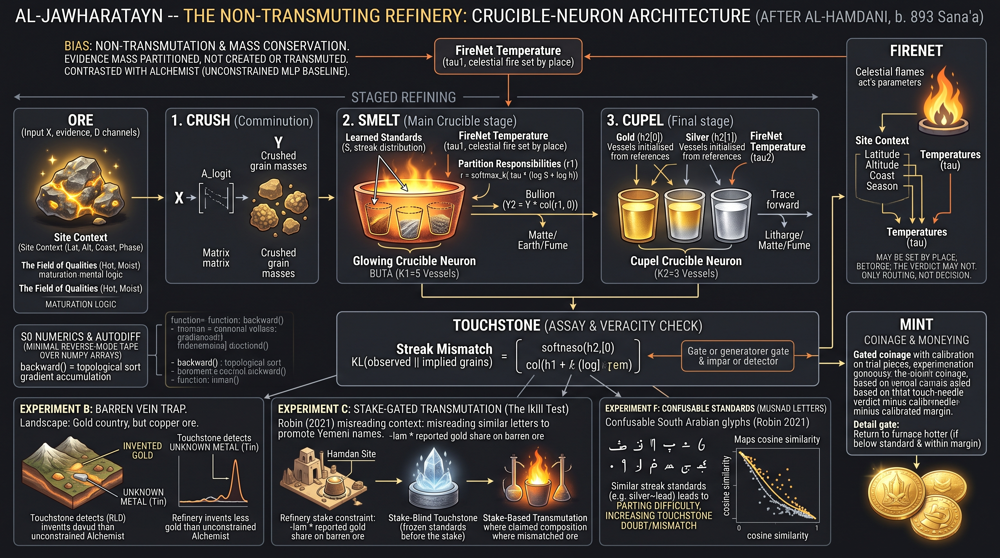

**Architecture — *Al-Jawharatayn — the Non-Transmuting Refinery***  ·  🟢 **belief** — grounded in the figure's own surviving works

The commitment is stated in the *Kitāb al-Jawharatayn*: gold comes from gold ore and silver from silver ore, never from another metal; the noble is not made but **parted** from the base by fire, measured against a standard, and only then coined. **Non-transmutation** is a hard conservation law: every unit of output mass is a partition of input evidence mass, with no bias term and no additive generator, verified to machine precision. **Crucible neurons** hold vessels with learned standards; each refining round splits every grain's mass among them in proportion to standard and current vessel mass, raised to a temperature set by the fire — tempered EM used as a neuron. **Staged refining** follows his mint chapter, crushing, smelting and cupelling, with mass flowing only forward and only by partition. **The fire may be set by place; the verdict may not**: latitude, altitude, distance from the coast and season choose how hot a crucible burns, never which vessel a grain belongs to. **Touchstone and mint**: the assay checks fineness and streak against the standards, and the mint stamps only at standard, sends a melt back for hotter rounds, or refuses. **His own failure** is a test: he misread South Arabian inscriptions and promoted the names to kings, and an alchemist variant shows what happens when wish is allowed to make gold.

▶️ **Run the mind:** [`minds/chapter_0237_al_hamdani_893.py`](minds/chapter_0237_al_hamdani_893.py)  —  `python3 minds/chapter_0237_al_hamdani_893.py`

---

## 238 · Al-Masʿūdī
**c. 893 – 956 CE — Baghdad, the Indian Ocean & Fusṭāṭ · Arab (Abbasid)**  |  *History · Geography · Travel · Comparative religion*

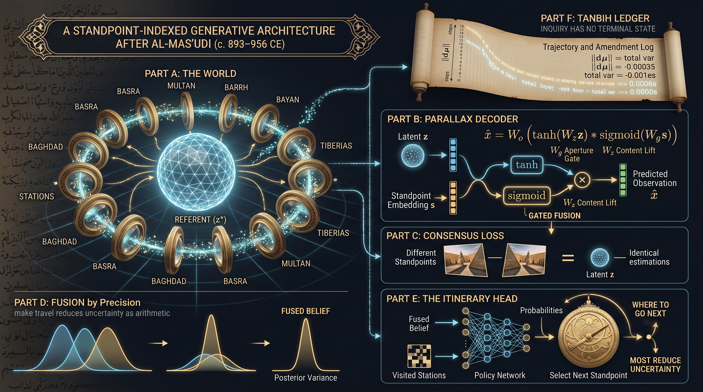

**Architecture — *A Standpoint-Indexed Generative Architecture — Parallax, Itinerary & the Tanbīh Ledger***  ·  🟢 **belief** — grounded in the figure's own surviving works

Two passages carry the idea. In the *Murūj al-dhahab* he ranks a man who has roamed the earth above one who huddles by the censer at home — not a call for more data, but a claim that a proposition takes its weight from **where the knower stood**. In the *Tanbīh* he writes that knowledge grows in a process with no predetermined end. Fused, they say that **a mind is an aperture that moves**. The synthetic world makes this literally true: each referent is seen from every standpoint through its own projection, occlusion mask, bias and noise, so from one place it is underdetermined and only movement identifies it. **Parallax**, a standpoint-conditioned variational encoder–decoder, lets the standpoint *gate* the content rather than sit beside it, so knowing where the witness stood is a load-bearing input. A **consensus loss** demands that two views of one referent yield one latent; **fusion by precision** multiplies beliefs across standpoints, so posterior variance falls as travel adds places. The **itinerary head** learns which unvisited standpoint would most reduce uncertainty — the roaming man against the censer, made mechanical — and the **Tanbīh ledger** records every amendment. Its size decays and does not vanish: a finished body of knowledge is a contradiction.

▶️ **Run the mind:** [`minds/chapter_0238_al_masudi_896.py`](minds/chapter_0238_al_masudi_896.py)  —  `python3 minds/chapter_0238_al_masudi_896.py`

---

## 239 · Rābiʿa Balkhī
**fl. c. 900 – 940 CE — Balkh · Persian (Samanid Khurasan)**  |  *Poetry · Ghazal · Love lyric*

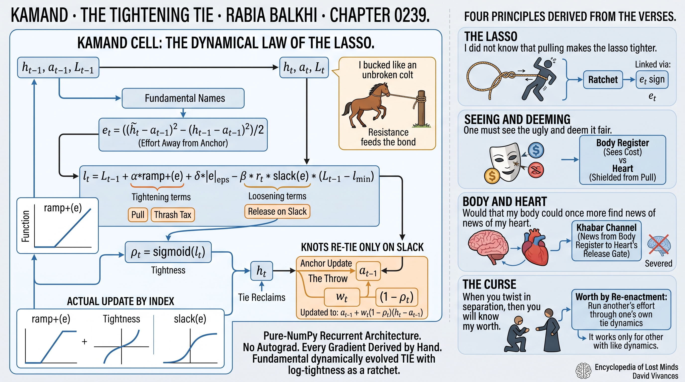

**Architecture — *KAMAND — the Tightening Tie***  ·  🟢 **belief** — grounded in the figure's own surviving works

About sixty couplets are attributed to her; four carry a theory of mind exact enough to write as equations, and the unit of computation is a **tie**, a bond whose tightness evolves by her law. **The lasso**: *"I bucked like an unbroken colt; I did not know that pulling makes the lasso tighter"* — effort has the wrong sign, so log-tightness ratchets with the unit's effort away from its anchor, a thrash term tightens on any movement, and release works only on slack. **Seeing and deeming**: *"one must see the ugly and deem it fair"* splits the verbs, so a body register records cost truthfully while the heart is shielded from feeling cost as a pull; a counterfactual *sugar* variant lets deeming bend perception itself. **Body and heart**, in the earliest firmly attested couplets — *would that my body could once more find news of my heart* — becomes an explicit news channel from the body register to the heart's release gate, and the severed variant cannot let go. **The curse** — *when you twist in separation, then you will know my worth* — makes worth something learned only by re-enactment. The cell is recurrent and hand-differentiated throughout, and it runs against leaky and gated recurrent controls.

▶️ **Run the mind:** [`minds/chapter_0239_rabia_balkhi_900.py`](minds/chapter_0239_rabia_balkhi_900.py)  —  `python3 minds/chapter_0239_rabia_balkhi_900.py`

---

## 240 · Al-Mutanabbī
**915 – 965 CE — Kufa, Aleppo, Fusṭāṭ & Shiraz · Arab (Abbasid era)**  |  *Poetry · Qasida · Panegyric · Gnomic verse*

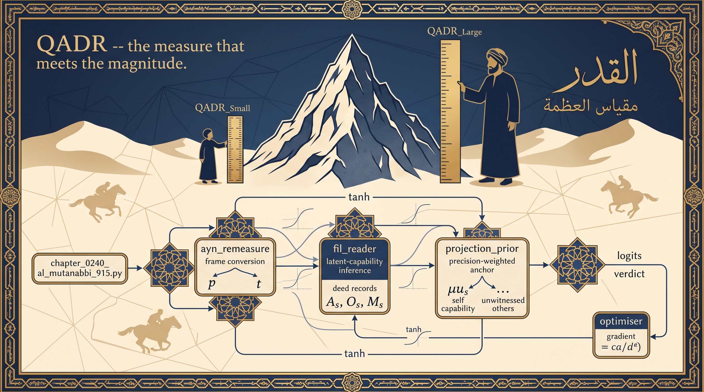

**Architecture — *QADR — the Measure That Meets the Magnitude***  ·  🟢 **belief** — grounded in the figure's own surviving works

The thesis comes from the Ḥadath ode of 954: resolutions come in the measure of the resolute, and small things look great in the eye of the small, great things small in the eye of the great. A magnitude exists only as a relation to the measure (*qadr*) of whoever meets it, so a mind perceives in its own measure, can learn any measure — its own included — only from the world's verdicts on deeds, and must **re-measure** a task before handing it to a body or a companion of another size. The agent never receives an absolute difficulty: tasks enter only as log-ratios to a measure; capability and precision are read from **verdicts on deeds**, not from the size of attempts; an unwitnessed companion is read in the agent's own measure, through a **projection prior** — the prince who seeks in people what is in his own soul; and a law of margins weighs size only against a measure. The closest prior art is the Rasch model and Elo; the difference is that the agent is itself one of the rated persons, so its own capability must be read from its own record before any delegation. His blind spot is built in as a test: armies and bodies have absolute sizes, and the Hamdanid army lost in the Taurus passes in 950 marks where a scale-free prior fails.

▶️ **Run the mind:** [`minds/chapter_0240_al_mutanabbi_915.py`](minds/chapter_0240_al_mutanabbi_915.py)  —  `python3 minds/chapter_0240_al_mutanabbi_915.py`

---

## How the minds are reconstructed

Every entry is built research-first: the figure's surviving works and current scholarship are gathered and each source verified before any architecture is written. Where evidence is thin, the chapter says so rather than inventing an inner life. Each figure's **provenance** is set to one of three real values:

- 🟢 **belief** — the figure's own surviving works or recorded doctrine ground the entry.
- 🟡 **mediated** — no words of their own survive; they are known only through others' (often hostile or legendary) accounts, and the entry says so.
- 🔵 **extrapolated** — no philosophy of mind survives at all; the entry is inferred from documented deeds (typical of kings and builders), and the entry says so.

Fourteen of these twenty left words of their own; four are mediated and two are extrapolated, and several of the fourteen are belief on a thread. **Boris I**'s questions survive only in negative, through the answers of the pope who received them; **Naum** left an institution, a building and a succession and no text that can be securely called his; **Clement** is read through a *Life* written some hundred and eighty-five years after him and a body of sermons whose attribution is partly contested; and **Harald Fairhair** has no documented psychology at all — his chapter models the shape of a story written down by the heirs of those who left. **ʿAbbās ibn Firnās** left verse and no word about the mind, and is read from what he built and from how his one great experiment failed; **ʿAbd al-Raḥmān III** left no treatise and no letter securely in his own voice, and is read from fifty years of decisions about what to say in public. Among the fourteen, **Linji**'s record was printed two and a half centuries after him, **Cyril**'s one definition of philosophy is assembled from school handbooks, **al-Rāzī**'s metaphysics survives only in the words of those who wrote to refute it, **al-Hamdānī**'s death date floats across a quarter of a century, and **Rābiʿa Balkhī** survives as some sixty couplets, one of them also given to another poet.

Each reconstructed mind is then measured against the **[Artificiology E-AGI Barometer](https://artificiology.com/barometer.html)** — eight capability dimensions (Cognitive Processing 🧩, Embodied Cognition 🤸, World Modeling 🌍, Consciousness 👁️, Language Understanding 💭, Emotional Intelligence ❤️, Creativity ✨, Autonomy 🎯) — so a Chan master of the late Tang and a Kufan poet can be compared on the same yardstick. Tome 12 reads the fourth and eighth axes against the grain. On Consciousness 👁️ nearly every mind declines to rule on subjective experience and seizes metacognition in its negative form — **Eriugena**'s source that cannot know what it is, **al-Rāzī**'s mind that cannot audit itself, **al-Mutanabbī**'s measure that cannot read itself — while **Rābiʿa** holds that experience is necessary for one kind of knowledge, the knowledge of another's worth. On Autonomy 🎯 **Linji** makes doing nothing a valid action, **Methodius** bounds autonomy to the jurisdiction of the transfer, **Muslim** allows goal-setting and forbids self-modification of the attested layer, **al-Fārābī** ranks it last, **ʿAbd al-Raḥmān III** grants it only as a ratio to metacognition, **Clement** hands it over early and on purpose, and **Harald** scores near the ceiling on setting his goal and near the floor on revising it — while **al-Mutanabbī** alone puts Autonomy first.

---

[← Tome 11](tome11.md) · [Repository README](readme.md)

### Read & explore
- 🌐 **Encyclopedia:** [https://lostmindsai.com](https://lostmindsai.com)
- 📖 **Tome 12 (Amazon):** [https://www.amazon.com/dp/B0HKVBKNTT](https://www.amazon.com/dp/B0HKVBKNTT)
- 🧪 **Interactive demos & résumé:** [https://artificiology.com/](https://artificiology.com/)
- 📊 **E-AGI Barometer:** [https://artificiology.com/barometer.html](https://artificiology.com/barometer.html)
- ✍️ **Author — David Vivancos:** [https://www.vivancos.com/](https://www.vivancos.com/)

