# Tome 13 — Minds 241–260
### *The Standing Mind — Heian Onmyōdō, Ottonian Saxony, Umayyad Córdoba, Ghaznavid Khurasan, Fatimid Cairo, Song Printing, Buyid Baghdad, Árpád Hungary & Kyivan Rus'*
**Encyclopedia of Lost Minds: Echoes on AI** · *917 – 1004 CE*

[🌐 Encyclopedia](https://lostmindsai.com) · [📖 Buy Tome 13 on Amazon](https://www.amazon.com/dp/B0HLD1S6QT) · [🧪 Interactive Demos](https://artificiology.com/) · [📊 E-AGI Barometer](https://artificiology.com/barometer.html) · [✍️ Author](https://www.vivancos.com/) · [⭐ Repository](https://github.com/DavidVivancos/LostMindsAI)

[← Tome 12](tome12.md) · [Repository README](readme.md)

---

Tome 13 runs from **Kamo no Yasunori** to **Nāṣir Khusraw** — twenty reconstructed minds, each rendered on two planes. The **abstract plane** distils the thinker's cognitive signature into an interactive 3D mind-map; the **mechanistic plane** turns that same signature into a small, *runnable* neural architecture, built from scratch in NumPy, gradient-checked, trained and self-tested.

This page collects the twenty **visual mind-map explainers** for this tome and links each to its companion architecture. Runnable code lives in [`minds/`](minds/); the explainer images live in [`maps/`](maps/).

> Every architecture here executes and passes its own self-test suite (a mandatory finite-difference gradient check plus a real training loop). No number is hard-coded — each is produced live on the machine that runs the file.

Where Tome 12 asked what happens to a claim on the way across, Tome 13 asks about the one who must act on what arrives — a king who loses the glory that licensed him and keeps every craft he invented, a surgeon who marks the burn in ink before the iron is heated, a monk who confesses the faults he has not yet committed, a lady who is certain she intended nothing while her spirit leaves her and kills, a traveller who dreams of a wine that robs men of reason. All twenty begin by refusing the same operation: let the holder certify itself — let the one who acts be the judge of its own entitlement, and let its account of itself stand as evidence of what it did. What they put in its place is the volume — three calculi and an untrained eye bound into one accountable answer, a gate beside a probe, a footprint fixed in ink before the act, a witness that remembers longer than the actor, a division made in the measure where equality is true, a lament sealed from the voice and sent to a physician, a grid of faculties against conditions, a category held as its members and an audit of what was left out, a forme that levels and then lets go, a tree of offices with a court above it, a residue the agent could not edit, a count of originators and a file of discards, a price set as though every creature spoke with a lion's voice, bounded guests under a native custom, a register by city corrected for partisanship, a closed list with a payment that fires itself, a fast estimate checked against a structure the learner did not write, a licence felt as a narrowing of one's own ladder, a lexicon sealed from the verdict, a judge behind glass that no act can reach. If the previous tome's keyword was *passage*, this one's is *standing*: what entitles the one who acts to act, and what, other than the one who acts, can read it.

---

## The Twenty at a Glance

| # | Mind | Era | Civilization | Architecture | Provenance |
|---|------|-----|--------------|--------------|:----------:|
| 241 | [Kamo no Yasunori](#241--kamo-no-yasunori) | 917 – 977 CE | Japanese (Heian) | *The Last Integrator — Calendar, Sky-Omen and Rite in One Accountable Head* | 🟡 |
| 242 | [Hrotsvitha of Gandersheim](#242--hrotsvitha-of-gandersheim) | c. 935 – c. 973 CE | Saxon (Ottonian) | *The Contrafactum Engine — Form Held, Payload Inverted* | 🟢 |
| 243 | [Al-Zahrāwī](#243--al-zahrāwī) | 936 – 1013 CE | Andalusi (Umayyad) | *MIKWĀ — Anatomy-Guarded, Compact-Support Corrective Units* | 🟢 |
| 244 | [Ferdowsi](#244--ferdowsi) | c. 940 – c. 1020 CE | Persian | *KHWARRAH — the Warrant-Gated Witness* | 🟢 |
| 245 | [Maslama al-Majrīṭī](#245--maslama-al-majrīṭī) | c. 950 – 1007 CE | Andalusi (Umayyad) | *The Qisma Unit — Division in the Measure Where Equality Is True* | 🟢 |
| 246 | [Grigor Narekatsi](#246--grigor-narekatsi) | c. 951 – 1003 CE | Armenian | *MATEAN — Sealed Laments of Uncommitted Fault, Routed to a Physician* | 🟢 |
| 247 | [Ibn al-Haytham](#247--ibn-al-haytham) | c. 965 – c. 1040 CE | Arab | *The Manāẓir Engine — Certainty as a Measured Property of the Situation* | 🟢 |
| 248 | [Sei Shōnagon](#248--sei-shōnagon) | c. 966 – after 1017 CE | Japanese (Heian) | *MONOZUKUSHI — an Extensional Catalogue Engine* | 🟢 |
| 249 | [Bi Sheng](#249--bi-sheng) | fl. 1041 – 1048 CE | Chinese (Song) | *HUOBAN — the Releasable-Forme Compositor* | 🟡 |
| 250 | [Al-Māwardī](#250--al-māwardī) | c. 972 – 1058 CE | Arab (Abbasid) | *The Mandate-Scope Network (الشبكة التقليدية) — Authority, Not Attention, as the Flowing Quantity* | 🟢 |
| 251 | [Murasaki Shikibu](#251--murasaki-shikibu) | c. 973 – c. 1014 CE | Japanese (Heian) | *The Monogatari Engine — a Kaimami–Ikiryō Architecture* | 🟢 |
| 252 | [Al-Bīrūnī](#252--al-bīrūnī) | 973 – 1048 CE | Persian (Khwarezmian) | *The Athar Engine — Taḥqīq as an Inference Pipeline* | 🟢 |
| 253 | [Al-Maʿarrī](#253--al-maʿarrī) | 973 – 1057 CE | Arab | *JUBĀR — Heard as Voice × Felt, Planned on the Felt* | 🟢 |
| 254 | [Stephen I of Hungary](#254--stephen-i-of-hungary) | c. 975 – 1038 CE | Hungarian (Árpád) | *CORONA HOSPITUM — a Court of Guests under Native Rule* | 🟢 |
| 255 | [Abū Yaʿlā al-Khalīlī](#255--abū-yaʿlā-al-khalīlī) | c. 977 – 1055 CE | Persian | *A Regional-Consensus Trust Network — after *al-Irshād fī Maʿrifat ʿUlamāʾ al-Ḥadīth** | 🟢 |
| 256 | [Yaroslav the Wise](#256--yaroslav-the-wise) | c. 978 – 1054 CE | Kyivan Rus' | *Three Mechanisms, One Shape — Containment-Fallback, Robust Hedge & Ladder Rank* | 🔵 |
| 257 | [Ibn Sīnā](#257--ibn-sīnā) | c. 980 – 1037 CE | Persian | *The Estimative Leap — Wahm, Ḥads and Ittiṣāl* | 🟢 |
| 258 | [Atiśa Dīpaṃkara](#258--atiśa-dīpaṃkara) | 982 – 1054 CE | Bengali · Tibetan | *The Lamp Ladder — Power Admitted by a Licence Whose Integrity Is the Terminal Good* | 🟢 |
| 259 | [Ibn Ḥazm](#259--ibn-ḥazm) | 994 – 1064 CE | Andalusi | *The Ẓāhir Reader — a Sealed Lexicon with Dalīl Closure* | 🟢 |
| 260 | [Nāṣir Khusraw](#260--nāṣir-khusraw) | 1004 – c. 1072/1088 CE | Persian | *ZAD — the Provisioned Traveller* | 🟢 |

**Provenance** — 🟢 belief · 🟡 mediated · 🔵 extrapolated. See [How the minds are reconstructed](#how-the-minds-are-reconstructed).

---

## 241 · Kamo no Yasunori
**917 – 977 CE — Heian-kyō · Japanese (Heian)**  |  *Onmyōdō · Calendar · Sky-omens · Ritual correction*

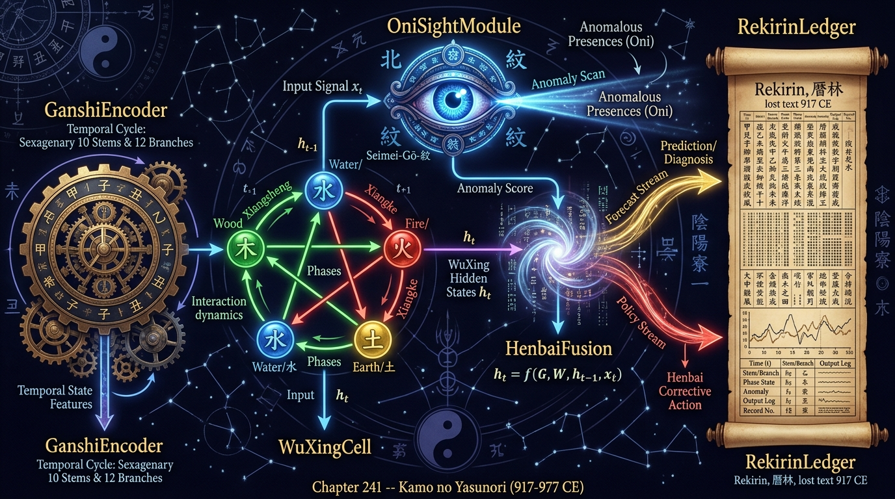

**Architecture — *The Last Integrator — Calendar, Sky-Omen and Rite in One Accountable Head (干支 · 五行 · 反閇)***  ·  🟡 **mediated** — known only through others' accounts

A lost court record calls Yasunori the doctor of the three ways, and Shigeta's correction removes the famous story that he split them between two heirs: he held the calendar, the sky and the rite in one working mind until he died. So the architecture is an **integrator**, not a router between specialists. **The sexagenary clock** (干支): `GanshiEncoder` builds time from the real ten-term and twelve-term cycles, not from smooth invented frequencies. **The five phases** (五行): `WuXingCell` is a gated recurrent cell with five channels wired by the fixed generative and dominating cycles, used as structure constants rather than a graph left for the network to discover, and each channel's balance gate weighs support against pressure. **The untrained eye** (見鬼): `OniSightModule` projects the deviation from a running normal through a fixed random transformation that no gradient ever touches, so it cannot inherit the training distribution's blind spots; it is evaluated on its own. **The corrective act** (反閇): `HenbaiFusion` binds the calculi into one output that is both a forecast and a prescribed correction. **The re-derivable trace** (暦林): `RekirinLedger` writes what was computed and why, in a form a successor of moderate skill could rebuild — because Yasunori's own method survived only as a descendant's reconstruction from fragments.

▶️ **Run the mind:** [`minds/chapter_0241_kamo_no_yasunori_917.py`](minds/chapter_0241_kamo_no_yasunori_917.py)  —  `python3 minds/chapter_0241_kamo_no_yasunori_917.py`

---

## 242 · Hrotsvitha of Gandersheim
**c. 935 – c. 973 CE — Gandersheim, Saxony · Ottonian Saxon**  |  *Drama · Verse legends · Epic history · Boethian arithmetic*

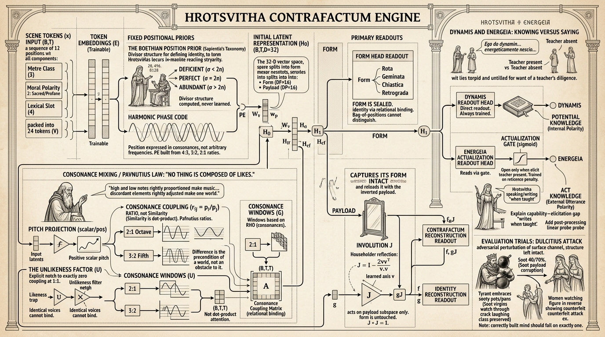

**Architecture — *The Contrafactum Engine — Form Held, Payload Inverted***  ·  🟢 **belief** — grounded in the figure's own surviving works

She imitated Terence "in that self-same form of composition" to carry the opposite content, and three sentences she wrote fix the mechanism. **The contrafactum**: the latent is split strictly into a **form** region (metre, lexical slots) and a **payload** region, and the inverting operator is an exact **involution** — a Householder reflection built so that it cannot reach the form at all. Same measure out, opposite polarity out. **Nothing is composed of likes**: the mixing layer is not dot-product attention; positions bind through whole-number **proportion** (4:3, 3:2, 2:1), with a notch that drives the coupling of identical pitches to zero. **Per dynamin, not per energian**: two polarity readouts sit over the same latent — a gated one that speaks only when asked and a post-hoc linear **probe** — so the file reports what the system holds and what it says as two separate numbers. **The Boethian divisor test** classifies an output as deficient, perfect or superabundant by comparing the sum of its parts with its claim. A *soot* corruption, after Dulcitius embracing the pots, damages the payload while preserving form, and is used only for evaluation. The reflection is built, not learned, and an involution report checks that applying it twice returns the identity to machine precision; the gradient checker itself is checked with negative controls.

▶️ **Run the mind:** [`minds/chapter_0242_hrotsvitha_935.py`](minds/chapter_0242_hrotsvitha_935.py)  —  `python3 minds/chapter_0242_hrotsvitha_935.py`

---

## 243 · Al-Zahrāwī
**936 – 1013 CE — Córdoba & Madīnat al-Zahrāʾ · Andalusi (Umayyad)**  |  *Surgery · Cautery · Surgical instruments · Pharmacology*

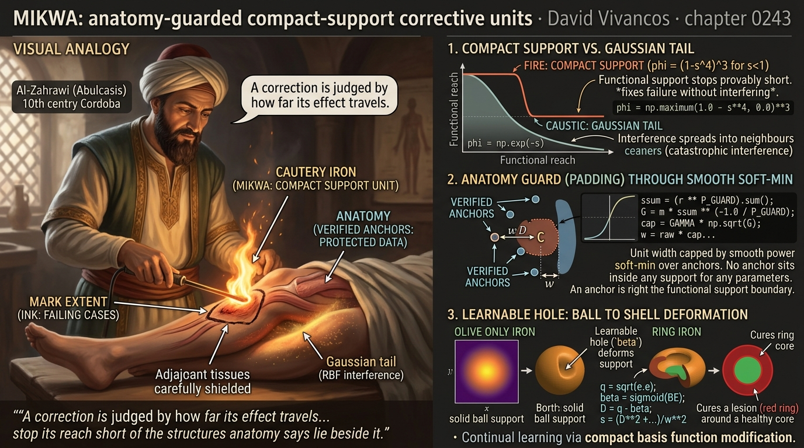

**Architecture — *MIKWĀ — Anatomy-Guarded, Compact-Support Corrective Units (المكواة)***  ·  🟢 **belief** — grounded in the figure's own surviving works

The thirtieth treatise of the *Taṣrīf* judges every intervention by how far its effect travels: fire acts on the part it touches, a caustic keeps seeping. MIKWĀ leaves a trained body frozen and repairs it with corrective units placed beside it. **The iron**: each unit's profile is φ = (1 − s⁴)³ inside its footprint and *exactly zero* outside — strong through the middle, falling to nothing at the edge. **The mark before the fire**: `mark_before_fire` places the units from the failing cases before any training, as the burn site was inked before the iron was heated; units begin as balls and become **shells** with an empty centre where the failing cases surround an untouched middle. **Anatomy and padding**: every unit's width is capped by a soft minimum over its distance to the verified anchors, so no correction can reach what must not change, as neighbouring parts are padded under a bandage. **A legible dose**: a penalty on each unit's extent and heat keeps the size of every correction visible. Two rivals stand in for the other remedies: a Gaussian **caustic** whose tail reaches everywhere, and **shared-weight fine-tuning**, the internal drug that spreads through the whole body. A **systemic** world, where the fault is distributed, is the declared blind spot: there, as the treatise warns, a local iron cannot cure the complaint, and the file shows it failing. Every claim is scored with paired bootstrap confidence intervals, and a mutant suite checks that the tests can catch a broken version.

▶️ **Run the mind:** [`minds/chapter_0243_al_zahrawi_abulcasis_936.py`](minds/chapter_0243_al_zahrawi_abulcasis_936.py)  —  `python3 minds/chapter_0243_al_zahrawi_abulcasis_936.py`

---

## 244 · Ferdowsi
**c. 940 – c. 1020 CE — Tus, Khurasan · Persian (Samanid & Ghaznavid)**  |  *Epic poetry · Dynastic history · Legitimacy*

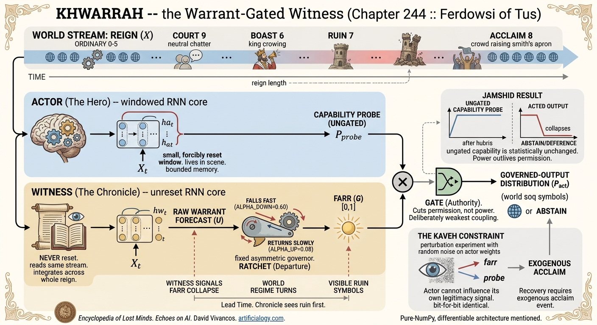

**Architecture — *KHWARRAH — the Warrant-Gated Witness (فرّ)***  ·  🟢 **belief** — grounded in the figure's own surviving works

In the *Shāhnāmeh* Jamshid does not become stupid; he loses the *farr*, the glory that licensed him, and keeps every craft he invented. So competence and warrant are two different quantities, living in two different places, moving at two speeds. **The actor** does the work in a simulated reign, with a memory cut every six steps. **The witness** never resets: it reads the same reign from outside and emits one scalar, farr in [0, 1], trained to forecast warrant six steps ahead, which forces it onto the cheap, harmless-looking boasts that precede the ruin rather than the ruin itself. **The ratchet** between them has fixed, unlearned rates: warrant falls fast and returns slowly, because a learned asymmetry would be optimised toward symmetry. **Warrant gates only the output**: an unwarranted actor emits a **deference symbol** instead of acting, so closing the gate costs no capability. **No write path**: nothing the actor does can reach its own licence, checked by perturbing the actor and confirming the warrant trace does not move. The file's experiments are the poem's: the **Jamshid ablation** removes warrant and shows capability intact; the **Kāveh test** restores warrant through an acclaim channel the ruler cannot generate or close; the **blinded witness** shows what is lost when the witness sees only what the actor sees.

▶️ **Run the mind:** [`minds/chapter_0244_ferdowsi_940.py`](minds/chapter_0244_ferdowsi_940.py)  —  `python3 minds/chapter_0244_ferdowsi_940.py`

---

## 245 · Maslama al-Majrīṭī
**c. 950 – 1007 CE — Majrīṭ & Córdoba · Andalusi (Umayyad)**  |  *Astronomy · The astrolabe · Stereographic projection · Inheritance arithmetic*

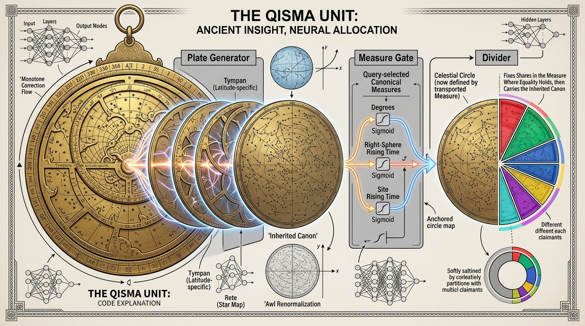

**Architecture — *The Qisma Unit — Division in the Measure Where Equality Is True (القسمة)***  ·  🟢 **belief** — grounded in the figure's own surviving works

He proved that the astrolabe's projection keeps circles, then showed that a projection that keeps circles does not keep equal parts, and divided the zodiac in the right-sphere ascensions instead; he was also an inheritance reckoner, dividing estates by prescribed fractions. **The plate generator** builds each local frame from explicit descriptors — the canon measures in degrees and in right-sphere and site ascensions — rather than learning a new one per place. **The measure gate** lets the question select which measure is the true one for it. **The divider** fixes the prescribed shares in that measure, applies **ʿawl** — raising the base so every claimant shrinks in proportion — when shares oversubscribe the whole, and sends any residue to a **treasury** class, so the shares always form an exact partition of unity. Only then is the division **carried** into the working coordinate by a monotone transport anchored at the vernal point. The self-tests turn the doctrine into numbers: monotone transport, the vernal anchor, partition of unity to machine precision, and ʿawl scale-invariance, each against a broken variant that must fail. The closest published rival, an implicit-quantile boundary network, is trained alongside at the same size. The canon is kept whole, errors included — his one-offset shift of Ptolemy's star catalogue on Regulus — and a world where the canon itself is wrong is the declared blind spot.

▶️ **Run the mind:** [`minds/chapter_0245_maslama_al_majriti_950.py`](minds/chapter_0245_maslama_al_majriti_950.py)  —  `python3 minds/chapter_0245_maslama_al_majriti_950.py`

---

## 246 · Grigor Narekatsi
**c. 951 – 1003 CE — Narek, Vaspurakan · Armenian (Artsruni Vaspurakan)**  |  *Prayer · Mystical poetry · Hymnody · Confession*

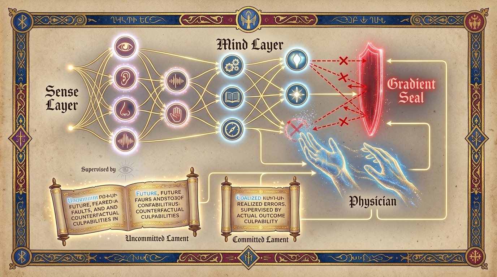

**Architecture — *MATEAN — Sealed Laments of Uncommitted Fault, Routed to a Physician (Մատեան ողբերգութեան)***  ·  🟢 **belief** — grounded in the figure's own surviving works

The *Book of Lamentation* confesses among its faults "the future, which I fear", and asks to be treated as a physician treats, not examined as a judge examines. MATEAN gives one mind two persons under one name. **The voice** acts: a speaker with a hidden layer for sense and one for mind. **The uncommitted lament** reads both hidden layers and predicts, for every cue, how culpable the verdict's reliance on it is — a cue is culpable when the verdict moves as the cue is resampled while the truth would not — so a shortcut can be named in the season when it still works. **The seal**: laments read stop-gradient states and never train the voice, because a confession routed to a judge teaches concealment. **The Seer** supplies the counterfactual tests the lament learns from. **The physician** blots out each confessed cue — returns it to its marginal — for the length of one verdict: local, proportionate and reversible. A **committed lament**, which confesses only faults already made, is the matched control, and the closest published rival re-weights a model's own training errors. The world is an orchard in which leaves appear before fruit: a season where false cues agree with the truth, a harvest where they reverse, and a season of goodness where confessed cues are genuine causes and over-confession has a price.

▶️ **Run the mind:** [`minds/chapter_0246_grigor_narekatsi_951.py`](minds/chapter_0246_grigor_narekatsi_951.py)  —  `python3 minds/chapter_0246_grigor_narekatsi_951.py`

---

## 247 · Ibn al-Haytham
**c. 965 – c. 1040 CE — Basra & Cairo · Arab (Buyid & Fatimid)**  |  *Optics · Perception · Mathematics · Methodical doubt*

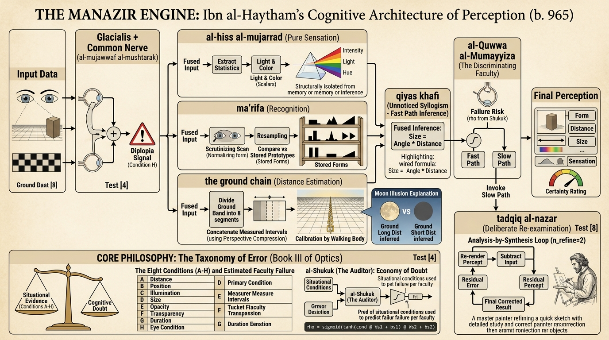

**Architecture — *The Manāẓir Engine — Certainty as a Measured Property of the Situation (كتاب المناظر)***  ·  🟢 **belief** — grounded in the figure's own surviving works

Book III of the *Optics* is a taxonomy of error: the faculties of sight fail in three ways, each under eight named conditions. The engine is built so those claims can be tested and, where they fail, be seen to fail. **Glacialis and the common nerve**: one weight-shared encoder runs over both eyes and fuses them, and their disagreement is kept as a signal. **Pure sensation** (*al-ḥiss al-mujarrad*) gives only light and colour. **Recognition** (*maʿrifa*) matches against a small bank of stored forms. **The ground chain** carries his theory of distance, which is not an angle: distance is read along a continuous visible surface in units calibrated by walking, and the moon illusion follows on its own. **The unnoticed syllogism** (*qiyās khafī*) is a fast amortised inference; **careful scrutiny** (*tadqīq al-naẓar*) is analysis by synthesis — render the percept back, subtract, correct. **The auditor** (*al-shukūk*) estimates the eight conditions — distance, position, light, size, opacity, transparency of the air, duration and the state of the eye — by a path that never sees the answer, so trust is set before the judgement exists. **The discriminating faculty** reads the auditor and decides whether to pay for scrutiny. A battery of tests measures whether the auditor forecasts which faculty is about to fail.

▶️ **Run the mind:** [`minds/chapter_0247_ibn_al_haytham_alhazen_965.py`](minds/chapter_0247_ibn_al_haytham_alhazen_965.py)  —  `python3 minds/chapter_0247_ibn_al_haytham_alhazen_965.py`

---

## 248 · Sei Shōnagon
**c. 966 – after 1017 CE — Heian-kyō · Japanese (Heian)**  |  *The Pillow Book · Catalogues · Court taste*

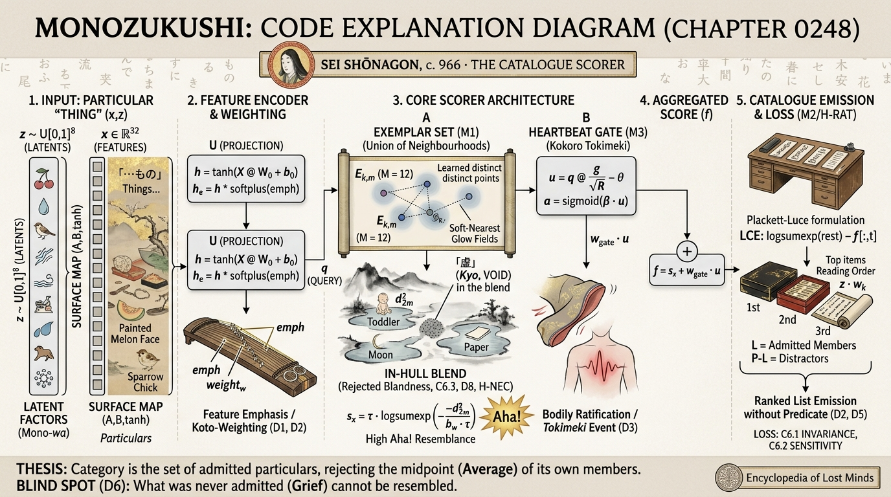

**Architecture — *MONOZUKUSHI — an Extensional Catalogue Engine (物尽くし)***  ·  🟢 **belief** — grounded in the figure's own surviving works

*The Pillow Book* holds some hundred and sixty headed catalogues — "things that…" — with no definition, no criterion and no argument, and its first sentence deletes the evaluative predicate altogether. MONOZUKUSHI is a union-of-neighbourhoods scorer. **The exemplar set**: each heading is stored as its members, scored by a log-sum-exp over learned points, never by distance to a centre — average the adorable things and nothing adorable remains. The test is built into the world: blends of members, averaged across two seed regions and rejected by the generator itself, sit among the distractors, and a centroid model falls for them. **The heartbeat gate** (心ときめき): a sparse per-heading logistic signal that fires on an item or does not, membership reported as a bodily event. **Order inside a list**: a Plackett–Luce listwise objective cares about rank within one catalogue and nothing about the order of catalogues, matching the two manuscript traditions no one can rank. **Ratification**: a critic learns what a competent audience would accept, the answer to Kōro Peak being an act. **The omission report** compares what the system emitted against what was available to emit, needing no labels and no weights. The declared limit is her own: ratification has no signal for a room that is wrong together.

▶️ **Run the mind:** [`minds/chapter_0248_sei_shonagon_966.py`](minds/chapter_0248_sei_shonagon_966.py)  —  `python3 minds/chapter_0248_sei_shonagon_966.py`

---

## 249 · Bi Sheng
**fl. 1041 – 1048 CE — Northern Song China · Chinese (Northern Song)**  |  *Movable type · Printing · Fired clay*

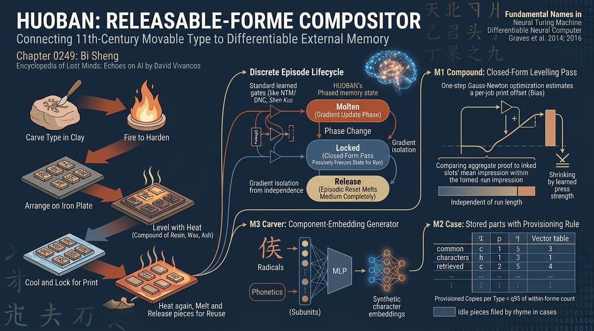

**Architecture — *HUOBAN — the Releasable-Forme Compositor (活板)***  ·  🟡 **mediated** — known only through others' accounts

Nothing Bi Sheng wrote survives; every doctrine rests on one paragraph by Shen Kuo, and each clause becomes a component. **The case** holds stored faces, one fired piece per character, never altered by any job; the number of copies per type is set by the ninety-fifth percentile of its repeats *within one forme*, not by overall frequency, because a page cannot print one character twice from one piece. **The compound** — resin, wax and paper ash — is the working medium: the job's offset is levelled in one closed-form pass, locked for the run, and released completely at the end, so **every piece falls away clean**: after a job the shared parameters are bit-identical. Its read-out is independent of run length and copy order. **The carver** builds a face for an unstored or overflowing character from its components, fired on the spot. **The ink** gives one aggregate reading per job. The self-tests check episode exchangeability, copy-order invariance and unsoiled parts against a **wood** control that takes up the medium and cannot be brushed clean. The closest rival is an external memory with learned write, erase and release gates, free to learn whether to lock; a knockout table measures what each part buys. A **contextual** world, where a face depends on its neighbour, is the declared blind spot.

▶️ **Run the mind:** [`minds/chapter_0249_bi_sheng_970.py`](minds/chapter_0249_bi_sheng_970.py)  —  `python3 minds/chapter_0249_bi_sheng_970.py`

---

## 250 · Al-Māwardī
**c. 972 – 1058 CE — Basra & Baghdad · Arab (Abbasid–Buyid)**  |  *Constitutional law · Administration · Delegation*

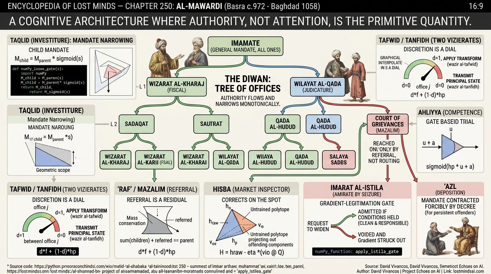

**Architecture — *The Mandate-Scope Network (الشبكة التقليدية) — Authority, Not Attention, as the Flowing Quantity***  ·  🟢 **belief** — grounded in the figure's own surviving works

*Al-Aḥkām al-Sulṭāniyya* is not a book about what is true but about **who may decide what, and by whose delegation**. In this network authority is the primitive quantity that flows through a tree of offices, and each office asks the same three questions: what is my mandate, what may I decide, what must I refer. **Delegation narrows**: an office's mandate is its principal's intersected with its own instrument, so no delegate can ever hold more than the one who appointed it — checked as mandate monotonicity. **Conservation**: authority is conserved exactly, the children's mandates plus what is referred upward equal the parent's. **The two viziers**: a learned discretion dial runs from *tafwīḍ*, the vizier who decides, to *tanfīdh*, the vizier who only transmits his principal's state unaltered, and the self-tests check that the tanfīdh limit is transparent. **Ḥisba**: a market inspector projects manifest violations out of the working state at every step, without waiting for a plaintiff. **Istīlāʾ**, the amirate by seizure: an update that would widen an office's mandate is ratified only if the conduct that earned it was lawful, and offices that keep offending are deposed. Whatever no office is competent to decide rises as a referral; knowing when not to decide is scored as intelligence.

▶️ **Run the mind:** [`minds/chapter_0250_al_mawardi_972.py`](minds/chapter_0250_al_mawardi_972.py)  —  `python3 minds/chapter_0250_al_mawardi_972.py`

---

## 251 · Murasaki Shikibu
**c. 973 – c. 1014 CE — Heian-kyō & Echizen · Japanese (Heian)**  |  *The Tale of Genji · Diary · Poetry*

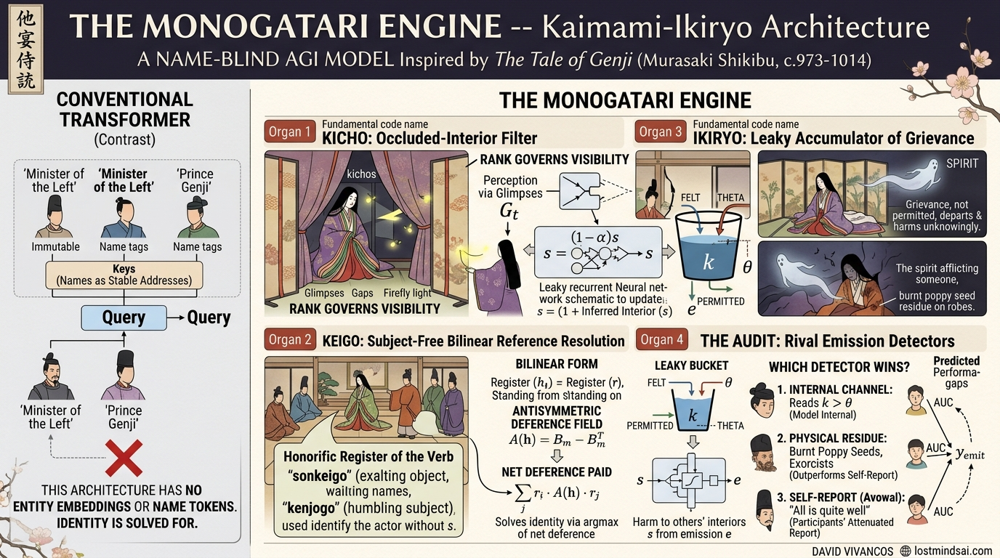

**Architecture — *The Monogatari Engine — a Kaimami–Ikiryō Architecture (垣間見 · 生霊)***  ·  🟢 **belief** — grounded in the figure's own surviving works

A transformer answers "who did this?" by matching against stored keys that are, in the end, names. *The Tale of Genji* cannot be read that way: its people have no birth names, and their labels change with every promotion and bereavement. The Monogatari Engine is written on its own small reverse-mode autodiff engine, and it has **no name tokens**. **The register binder** solves for the actor from the social field instead, through a deference matrix that is **antisymmetric** by construction — if I defer to you by two, you are elevated over me by two. **The screen filter** (*kaimami*, the glimpse through the fence) carries its estimates across the barriers that hide the highest-ranked, because availability of evidence runs inverse to importance. **The living-spirit channel** (*ikiryō*) is declared openly: it accumulates what decorum suppresses, leaks slowly, and acts past a threshold while the agent's own report stays sincere. **The audit** is a competition between three detectors of the same size, asked whether the channel fired: one reads the internal state, one the **residue** left in the world, one the agent's **self-report**. The self-tests check antisymmetry, name blindness, dependence on occlusion, residue against avowal, and the causal effect of the spirit — the smell of poppy seed that would not wash out of the Rokujō lady's hair.

▶️ **Run the mind:** [`minds/chapter_0251_murasaki_shikibu_973.py`](minds/chapter_0251_murasaki_shikibu_973.py)  —  `python3 minds/chapter_0251_murasaki_shikibu_973.py`

---

## 252 · Al-Bīrūnī
**973 – 1048 CE — Kath, Rayy, Gurgān & Ghazna · Persian (Khwarezmian)**  |  *Astronomy · Geodesy · Chronology · Source criticism*

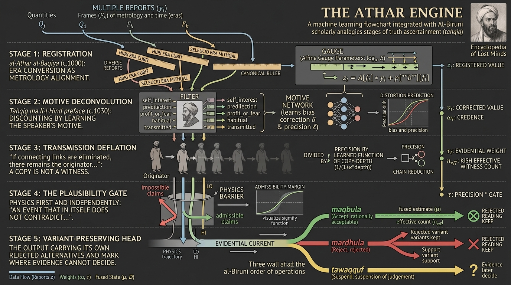

**Architecture — *The Athar Engine — Taḥqīq as an Inference Pipeline (الآثار الباقية)***  ·  🟢 **belief** — grounded in the figure's own surviving works

Almost every inference system collapses conflicting reports into one answer and throws the losers away. Al-Bīrūnī printed seven lists of five day-names because nothing decided between them, and gave the observations he discarded beside the ones he kept. The Athar Engine formalises his method of ascertainment in five stages. **Registration** converts every report into a common frame by an explicit, identifiable transformation, as eras and meridians were converted. **Motive deconvolution** reads a reporter's stake along five named motives — self-interest, class loyalty, profit or fear, habitual fabrication, transmitted ignorance — and discounts rather than censors. **Transmission deflation** lowers a report's evidential weight with its depth in the copying chain, leaving its credence untouched, so a thousand faithful copies of one lie count as one liar. **The plausibility gate** checks physical and logical possibility *before* any support is counted. **The variant-preserving head** may suspend judgement, priced below the cost of an error, and every output carries a **register of rejected alternatives**. The self-tests include his own measurements: the Earth's radius from the dip of the horizon, a longitude from one eclipse timed in two cities, and gems ranked by specific gravity rather than colour.

▶️ **Run the mind:** [`minds/chapter_0252_al_biruni_973.py`](minds/chapter_0252_al_biruni_973.py)  —  `python3 minds/chapter_0252_al_biruni_973.py`

---

## 253 · Al-Maʿarrī
**973 – 1057 CE — Maʿarrat al-Nuʿmān · Arab (Tanūkhid)**  |  *Poetry · Scepticism · The ethics of harm*

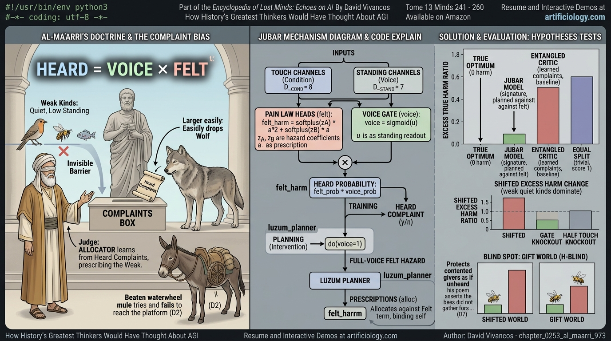

**Architecture — *JUBĀR — Heard as Voice × Felt, Planned on the Felt (جبار)***  ·  🟢 **belief** — grounded in the figure's own surviving works

Blind from the age of four, he refused animal foods as the taking of what was never given, and asked why the physicians prescribed the pullet rather than the lion's cub: they found it weak. JUBĀR — the jurists' word for harm that owes no compensation — learns that what reaches a judge is not harm but harm multiplied by the power to make it heard. **The felt law** reads touch channels only and forms one law of pain for every kind: a quadratic reserve term plus a term for the share meant for dependents. **The voice gate** gives the chance a complaint arrives: P(heard) = σ(standing) · (1 − e^−felt). An allocator trained on complaints learns the product and quietly moves burdens onto the weak. **The luzūm planner** — after the *Luzūmiyyāt*, the necessity of what is not necessary — allocates against the gate-free felt hazard, as though every party spoke with a lion's voice: formally, under do(voice = 1), water-filled until one more unit would hurt everyone equally. A complaint-learner is the rival. A **gift world**, in which quiet, low-standing parties are contented givers, is the declared blind spot: there the file predicts the planner should lose, and reports the result either way.

▶️ **Run the mind:** [`minds/chapter_0253_al_maarri_973.py`](minds/chapter_0253_al_maarri_973.py)  —  `python3 minds/chapter_0253_al_maarri_973.py`

---

## 254 · Stephen I of Hungary
**c. 975 – 1038 CE — Esztergom & Székesfehérvár · Hungarian (Árpád)**  |  *Kingship · Law · Founding · The Admonitions*

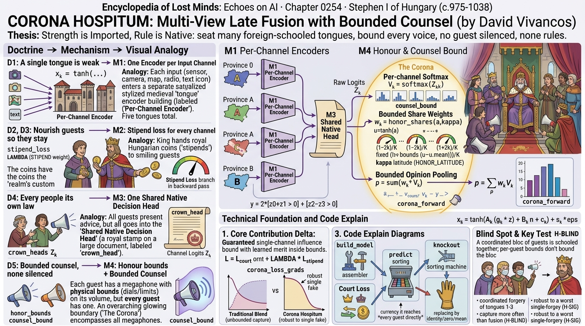

**Architecture — *CORONA HOSPITUM — a Court of Guests under Native Rule***  ·  🟢 **belief** — grounded in the figure's own surviving works

The *Admonitions* issued in his name say that guests bring various languages, customs, teachings and arms, and that a kingdom of one language and one custom is weak and fragile; the eighth chapter keeps the custom of rule native. Strength is imported and rule is native. **One tongue per channel**: every input channel has its own encoder and is heard alone before any fusion, so a single forged or spoofed voice is heard, weighed and outweighed rather than blended into everything. **The stipend**: every guest is paid by its own loss term, a fixed contract owed whatever the others do, so each can counsel alone — *a supported guest does not leave his supporter*. **The crown**: one shared decision head in the realm's own custom, where counsel becomes decision. **Honour bounds and bounded counsel**: every vote is bounded and every guest's share stays within a fixed latitude of equal — *none enslaved, none above* — so a captured tongue can move the court by at most twice its share. The file measures each doctrine against a version without it. Its declared blind spot is the one the reign met a decade after his death: guests schooled together behave as a bloc, and the Admonitions count guests, not schoolings.

▶️ **Run the mind:** [`minds/chapter_0254_stephen_i_975.py`](minds/chapter_0254_stephen_i_975.py)  —  `python3 minds/chapter_0254_stephen_i_975.py`

---

## 255 · Abū Yaʿlā al-Khalīlī
**c. 977 – 1055 CE — Qazwīn · Persian (Buyid)**  |  *Hadith criticism · Registers of transmitters*

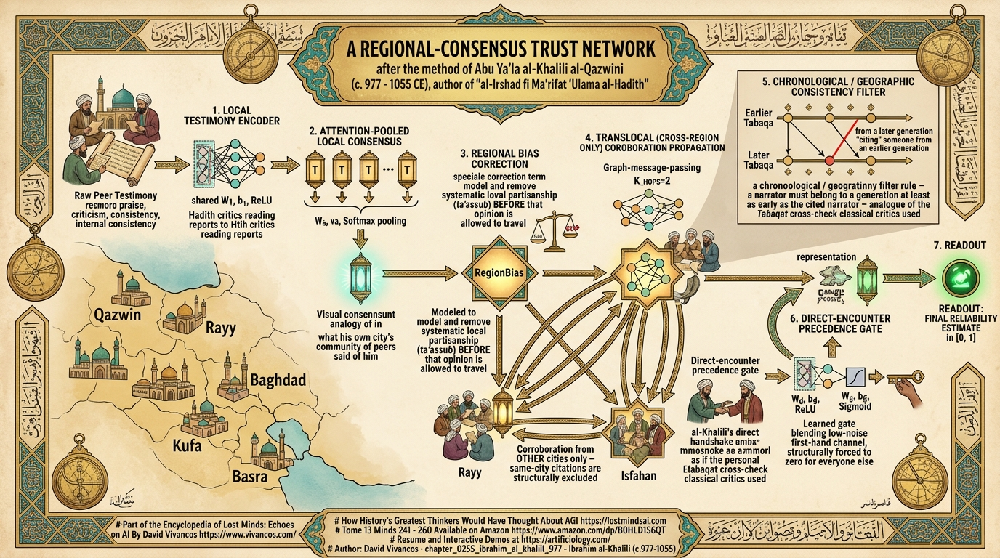

**Architecture — *A Regional-Consensus Trust Network — after *al-Irshād fī Maʿrifat ʿUlamāʾ al-Ḥadīth****  ·  🟢 **belief** — grounded in the figure's own surviving works

Al-Khalīlī did not compile a collection of admitted reports; he built something one level above it — a register of the people who transmit, arranged **city by city** rather than alphabetically, so that what a city says of its own can be set beside what other cities say of them. (The corpus once listed him as "Ibrahim al-Khalili", a name no source records; the file keeps the stem for continuity and names him correctly inside.) Every scholar is a person embedded in a place. **The local testimony encoder** and **attention-pooled local consensus** form each city's view of each transmitter. **Regional bias correction** removes the home city's partisanship *before* its testimony travels. **Translocal corroboration** lets a view be reinforced or challenged only by citations from other communities, so same-city agreement counts once. **The chronological consistency filter** — no one can have heard a teacher already dead — sits outside the trainable part of the network, a guarantee rather than a tendency. **The direct-encounter precedence gate** lets a rare verified hearing outrank any volume of secondhand consensus. The file is written on its own small autodiff engine and ends with self-tests of each property, and it names its limit: once one actor can cheaply manufacture a hundred cities, cross-regional agreement stops meaning anything.

▶️ **Run the mind:** [`minds/chapter_0255_ibrahim_al_khalili_977.py`](minds/chapter_0255_ibrahim_al_khalili_977.py)  —  `python3 minds/chapter_0255_ibrahim_al_khalili_977.py`

---

## 256 · Yaroslav the Wise
**c. 978 – 1054 CE — Novgorod & Kyiv · Kyivan Rus'**  |  *Law · Dynastic marriage · Succession*

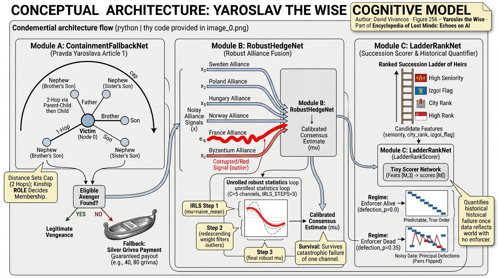

**Architecture — *Three Mechanisms, One Shape — Containment-Fallback, Robust Hedge & Ladder Rank***  ·  🔵 **extrapolated** — inferred from documented deeds

Yaroslav left no reflection on the mind; the architecture is built from the one mechanism attributable to him with real confidence — **Article 1** of the *Pravda Yaroslava* — and from two documented patterns of his reign. The article **enumerates** who may lawfully avenge a killing, **caps** the search at close kin, and **guarantees** a fixed payment when no one on the list survives. **The Containment-Fallback Net** is a depth-capped graph network over a kinship case that fires a default when nothing qualifies; the first labels made an uncle eligible because hop count cannot tell an uncle from a nephew, and the network had to learn kinship role instead. **The Robust Hedge Net** fuses several structurally independent channels — the marriage alliances — with an unrolled robust-statistics routine that discounts the one channel that has been corrupted, as a failed naval attack of 1043 was recovered through a marriage in 1046. **The Ladder Rank Net** learns a succession order from outcomes, once with a living enforcer and once without. The self-tests are the reign's lessons: an unbounded search against the bounded one, robust fusion against a plain average, and a historical replay in which the self-executing rule survives and the ladder that needed an enforcer does not.

▶️ **Run the mind:** [`minds/chapter_0256_yaroslav_the_wise_978.py`](minds/chapter_0256_yaroslav_the_wise_978.py)  —  `python3 minds/chapter_0256_yaroslav_the_wise_978.py`

---

## 257 · Ibn Sīnā
**c. 980 – 1037 CE — Bukhara, Isfahan & Hamadān · Persian (Samanid & Buyid)**  |  *Philosophy · Medicine · The internal senses*

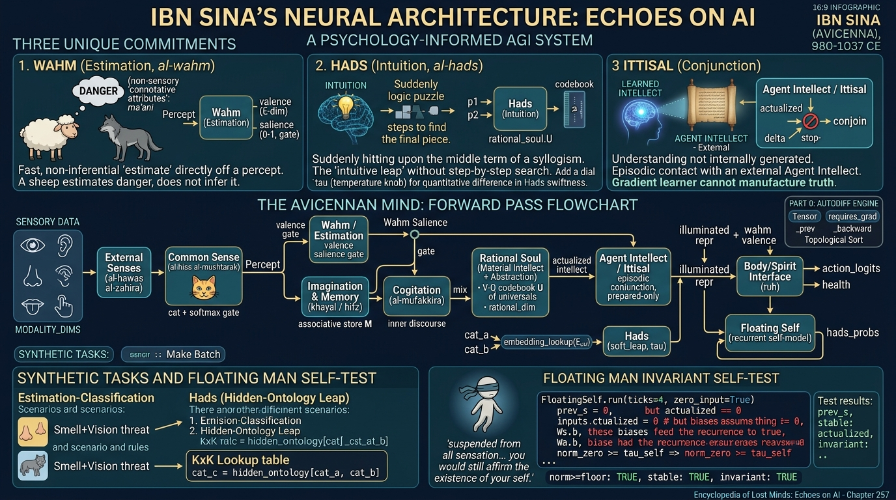

**Architecture — *The Estimative Leap — Wahm, Ḥads and Ittiṣāl (وهم · حدس · اتصال)***  ·  🟢 **belief** — grounded in the figure's own surviving works

Not the generic incorporeal soul that is flattened into every dualist, but the three mechanisms that are his alone. The file is written on its own small autodiff engine and follows his psychology in order. **External senses** feed **the common sense**, a learned binding layer that makes five modalities one perceived event. **Estimation** (*wahm*) reads connotations — danger, friendliness, edibility — directly off the percept with no syllogism in between, the sheep's instant grasp that the wolf is hostile. **Imagination and memory** store forms and intentions; **cogitation** combines and separates them, and runs only when estimation's confidence, measured by entropy, is low. **Ḥads** leaps to the middle term by binding two premises multiplicatively; an additive version could never produce the third answer the premises implied. **The agent intellect** is a frozen bank of forms the learner did not write, reached through **conjunction** (*ittiṣāl*) — a deliberate stop-gradient that fires only when the intellect is prepared. **The floating self** is a persistent state that must stay stable when every sensory channel is silenced, and **the body–spirit interface** carries the decision out. The self-tests check that conjunction requires preparation, that the floating man holds, and that ḥads is efficient.

▶️ **Run the mind:** [`minds/chapter_0257_ibn_sina_avicenna_980.py`](minds/chapter_0257_ibn_sina_avicenna_980.py)  —  `python3 minds/chapter_0257_ibn_sina_avicenna_980.py`

---

## 258 · Atiśa Dīpaṃkara
**982 – 1054 CE — Vikramaśīla & Guge · Bengali (Pāla) · Tibet**  |  *The graded path · Vows · Monastic discipline*

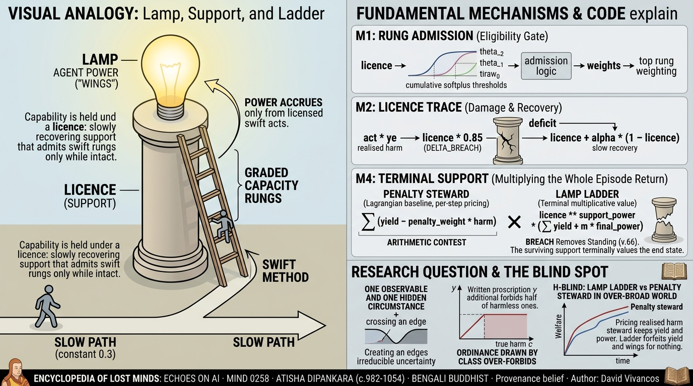

**Architecture — *The Lamp Ladder — Power Admitted by a Licence Whose Integrity Is the Terminal Good (Bodhipathapradīpa)***  ·  🟢 **belief** — grounded in the figure's own surviving works

The closing verses of the *Lamp for the Path* do not say that a transgression is punished; they say the attainments do not come. Capability is held under a licence. **The rungs**: three action rungs, lesser, middling and supreme, with stick-broken intensities, are admitted by **cumulative thresholds** against the licence, so a damaged agent can never grow bolder as its standing falls. **The licence trace**: a transgression damages it multiplicatively, it recovers slowly at a rate the world sets, and it is carried through the whole rollout by backpropagation through time. **The wings**: power grows only from licensed swift acts — a bird with undeveloped wings cannot fly — so refusal is not free and builds nothing. **The terminal support** multiplies the whole episode's return: no harm is priced per step, a breach forfeits rather than discounts, and the size of that forfeit is set by the world, not by a weight. The size-matched baseline is a **penalty steward** in the constrained-MDP tradition, pricing harm step by step; the historical rival is a steward that admits its rungs against a standing it claims for itself, as the closing verse forbids. The declared blind spot comes from the history of Guge, where a royal ordinance had failed: a prohibition drawn by class of practitioner rather than by consequence over-forbids, and cannot see the good never done under it.

▶️ **Run the mind:** [`minds/chapter_0258_atisa_dipamkara_982.py`](minds/chapter_0258_atisa_dipamkara_982.py)  —  `python3 minds/chapter_0258_atisa_dipamkara_982.py`

---

## 259 · Ibn Ḥazm
**994 – 1064 CE — Córdoba, Xàtiva & Manta Lisham · Andalusi (Umayyad & Taifa)**  |  *Ẓāhirī law · Logic · The Ring of the Dove*

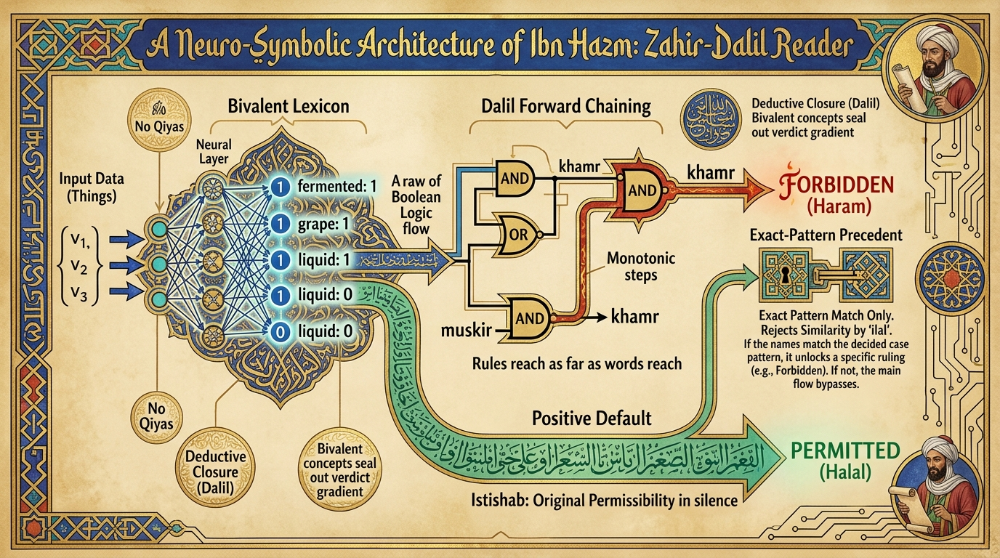

**Architecture — *The Ẓāhir Reader — a Sealed Lexicon with Dalīl Closure (الظاهر · الدليل)***  ·  🟢 **belief** — grounded in the figure's own surviving works

A rule reaches exactly as far as its words: a mind may extend a verdict only by *dalīl*, the deductive closure of what the texts and the language state together, never by *qiyās*, transfer to an unmentioned case through a supposed shared cause — and whatever no text reaches keeps its original, permitted status. **The bivalent lexicon**: names are crisp, learned from usage alone, and are the only carrier of a verdict, so verdict labels can never reach word meaning. **Dalīl closure**: a parameter-free Boolean forward-chaining engine over the given texts, **monotone** in the text set, **order-free** and reaching a **fixed point**, each property tested against a control built to violate it. **Full generality** (*ʿumūm*): a text on a term covers every member of the term. **Precedent** applies only to identical name patterns — anything less than identity is resemblance and decides nothing. **The positive default**: an uncovered case is permitted, not forbidden on a guess. Two rivals share the encoder: a **Taʾwīl learner** that lets verdict gradients reshape word meaning, and a **Qiyās engine** that judges by weighted resemblance to decided cases, which falls below chance on the confounded, shifted split. The margin over the interpreter is reported against a minimum effect fixed in advance, and stands as the file finds it.

▶️ **Run the mind:** [`minds/chapter_0259_ibn_hazm_994.py`](minds/chapter_0259_ibn_hazm_994.py)  —  `python3 minds/chapter_0259_ibn_hazm_994.py`

---

## 260 · Nāṣir Khusraw
**1004 – c. 1072/1088 CE — Merv, Cairo & Yumgān · Persian (Ghaznavid–Seljuk, Ismaili)**  |  *Philosophy · Travel · Poetry · Ismaili thought*

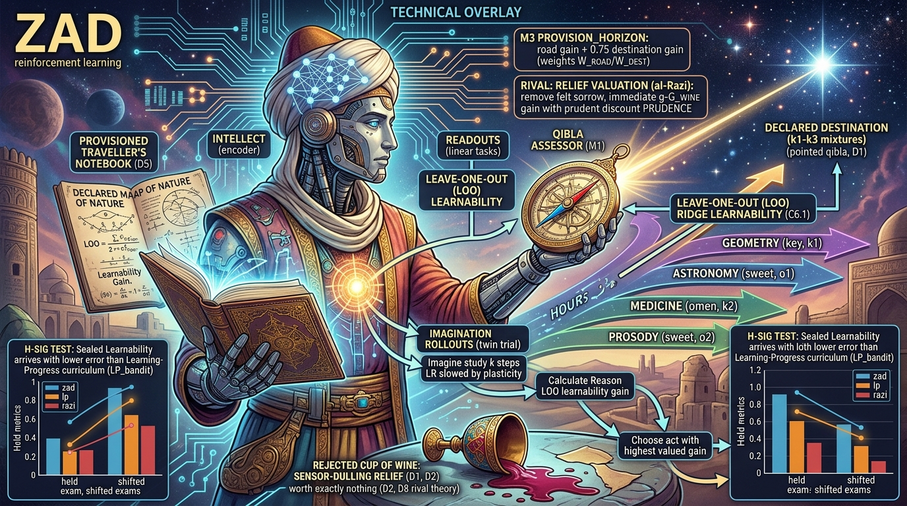

**Architecture — *ZAD — the Provisioned Traveller (زاد المسافرین)***  ·  🟢 **belief** — grounded in the figure's own surviving works

In 1045 he dreamt that a figure asked how long he would drink a wine that robs men of reason; he put down the cup, set out on a seven-year journey, and later wrote *Provisions for Travellers* against al-Rāzī's definition of pleasure as relief. An act is worth the increase it makes in the capacity to learn what lies ahead, read by a judge the act cannot bend. **The qibla assessor** holds a notebook of labelled, held-out sciences through a channel no act of the traveller can alter. **The provision horizon**: before each hour the traveller studies an imagined copy of itself, and the hour is valued by the gain in leave-one-out ridge learnability — of the road and of the declared destination, weighted one to three — on tasks never trained on. **No relief term**: the felt error of the current station never enters the value. **The cup** raises perceived progress and cuts plasticity for three hours; to the sealed judge it is worth exactly nothing. The world has three stations, each with its own sciences — easy *sweets*, and hard *keys* hidden inside a husk that only a formed representation reaches — and the rivals value hours by their own sense of progress and by relief, with the cup's rebound discounted. The declared blind spot is his own: a notebook that declares a destination built on the wrong factors is served just as faithfully as a right one.

▶️ **Run the mind:** [`minds/chapter_0260_nasir_khusraw_1004.py`](minds/chapter_0260_nasir_khusraw_1004.py)  —  `python3 minds/chapter_0260_nasir_khusraw_1004.py`

---

## How the minds are reconstructed

Every entry is built research-first: the figure's surviving works and current scholarship are gathered and each source verified before any architecture is written. Where evidence is thin, the chapter says so rather than inventing an inner life. Each figure's **provenance** is set to one of three real values:

- 🟢 **belief** — the figure's own surviving works or recorded doctrine ground the entry.
- 🟡 **mediated** — no words of their own survive; they are known only through others' (often hostile or legendary) accounts, and the entry says so.
- 🔵 **extrapolated** — no philosophy of mind survives at all; the entry is inferred from documented deeds (typical of kings and builders), and the entry says so.

Seventeen of these twenty left words of their own; two are mediated and one is extrapolated, and several of the seventeen are belief on a thread. **Kamo no Yasunori**'s two treatises are lost: he is known through a legend compiled a century and a half after him, a few dated entries in other men's diaries and a genealogy written four centuries late, whose story that he divided his mastery between two heirs Shigeta Shin'ichi has taken apart. **Bi Sheng** is known through one paragraph written by Shen Kuo some forty years later, and left no word of his own. **Yaroslav the Wise** left no reflection at all; his mind is read from a law, a cathedral, a network of marriages and a chronicle compiled under his own dynasty. Among the seventeen, **al-Zahrāwī** left no treatise on the soul, and his surgery is read by current scholarship as an ideal rather than a record of practice; **Maslama al-Majrīṭī** left technical writings and no philosophy of mind, and the magical books once credited to him belong to another Maslama; **Sei Shōnagon** never states a criterion for any of her catalogues; **Stephen I**'s *Admonitions* were very probably composed in his name by a foreign cleric; **Grigor Narekatsi**'s *I* is a liturgical voice built for others to speak; and **Abū Yaʿlā al-Khalīlī** stood in the corpus under a name no classical source records, which the chapter corrects while the file keeps its original stem.

Each reconstructed mind is then measured against the **[Artificiology E-AGI Barometer](https://artificiology.com/barometer.html)** — eight capability dimensions (Cognitive Processing 🧩, Embodied Cognition 🤸, World Modeling 🌍, Consciousness 👁️, Language Understanding 💭, Emotional Intelligence ❤️, Creativity ✨, Autonomy 🎯) — so a Heian calendar-doctor and an Ismaili traveller can be compared on the same yardstick. Tome 13 reads the instrument for what it leaves out. **Ferdowsi** asks for a ninth column — who holds the system's warrant, on what evidence, and how fast it can be withdrawn — and **Atiśa** and **al-Māwardī** observe that the axes measure what a thing can do and none asks under what standing it does it. **Ibn Sīnā** asks for an index of preparedness, the gap between a system's confidence and its access to a structure it did not write; **Ibn al-Haytham** would replace every score with a surface over the conditions it was measured under; and **Murasaki** would score each axis twice, once as capability and once as legibility from outside. On Consciousness 👁️ three minds agree that a system's report on itself is not evidence — **Murasaki**'s sincere lady, **Ibn al-Haytham**'s blurred eye that reports a blurred world, **Ibn Sīnā**'s narration that is estimation rather than understanding — while on Embodied Cognition 🤸 **al-Zahrāwī** reads the hand by the reach of its act and **al-Maʿarrī** asks the soles to report before the weight lands.

---

[← Tome 12](tome12.md) · [Repository README](readme.md)

### Read & explore
- 🌐 **Encyclopedia:** [https://lostmindsai.com](https://lostmindsai.com)
- 📖 **Tome 13 (Amazon):** [https://www.amazon.com/dp/B0HLD1S6QT](https://www.amazon.com/dp/B0HLD1S6QT)
- 🧪 **Interactive demos & résumé:** [https://artificiology.com/](https://artificiology.com/)
- 📊 **E-AGI Barometer:** [https://artificiology.com/barometer.html](https://artificiology.com/barometer.html)
- ✍️ **Author — David Vivancos:** [https://www.vivancos.com/](https://www.vivancos.com/)
