# Tome 14 — Minds 261–280
### *The Discerning Mind — Ghaznavid Lahore, Karakhanid Transoxiana, Northern Song China, Chola South India, Reform Rome, Taifa al-Andalus, Norman England, Seljuk Persia, Commonwealth Iceland & Capetian Paris*
**Encyclopedia of Lost Minds: Echoes on AI** · *1009 – 1079 CE*

[🌐 Encyclopedia](https://lostmindsai.com) · [📖 Buy Tome 14 on Amazon](https://www.amazon.com/dp/B0HLYSVY5D) · [🧪 Interactive Demos](https://artificiology.com/) · [📊 E-AGI Barometer](https://artificiology.com/barometer.html) · [✍️ Author](https://www.vivancos.com/) · [⭐ Repository](https://github.com/DavidVivancos/LostMindsAI)

[← Tome 13](tome13.md) · [Repository README](readme.md)

---

Tome 14 runs from **Data Ganj Bakhsh al-Hujwiri** to **Peter Abelard** — twenty reconstructed minds, each rendered on two planes. The **abstract plane** distils the thinker's cognitive signature into an interactive 3D mind-map; the **mechanistic plane** turns that same signature into a small, *runnable* neural architecture, built from scratch in NumPy, gradient-checked, trained and self-tested.

This page collects the twenty **visual mind-map explainers** for this tome and links each to its companion architecture. Runnable code lives in [`minds/`](minds/); the explainer images live in [`maps/`](maps/).

> Every architecture here executes and passes its own self-test suite (a mandatory finite-difference gradient check plus a real training loop). No number is hard-coded — each is produced live on the machine that runs the file.

Where Tome 13 asked by what standing the one who acts may act, Tome 14 asks what kind of thing is in front of it — a mystic who polishes before he trusts a mirror, a jurist in a pit who admits no cause until its effect has been seen, a historian who judges the thrower by the one arrow that fell, an astronomer who draws two hundred diagrams of one star rather than trust one sighting, an archbishop who asks what the highest angel wanted when it fell, a physician-poet whose fool hands out the drugs and kills with what would have cured. All twenty begin by refusing the same operation: let the surface answer — let confidence, regularity, brilliance, fluency or likeness decide what kind of thing a thing is, and so what may be done to it. What they put in its place is the volume — a reflection read before and after the polish, a gate that opens only to an attested effect, one shape read at every scale of a calendar given in advance, private units on a shared ground with a floor that effort alone cannot cross, a still reference that reads only small beginnings, a sign taken from the worst arrow and multiplied by the reach of the best, a comparison released on a fixed beat against the sky, a judge trained once and locked with an appeal no local court can block, an account in which what disperses is carried, forms removed in order down to one matter, a ledger, an oath and a ratchet, a small circle under every disputed constant, channels weighed by their disagreement beside a ledger that never erases, two appetites and a power to keep one in charge, a plan fixed before the stroke and a stop that the content sets, a claim that must survive a change of notation, a doubt reapplied to one's own experience with a check the learner cannot reach, a date solved from every clock at once, a licence that opens only to a measure re-derived, an act of attending with a consent kept apart from the impulse. If the previous tome's keyword was *standing*, this one's is *discernment*: what tells apart two things that look alike to the one who must act on them, and what, other than their look, can do the telling.

---

## The Twenty at a Glance

| # | Mind | Era | Civilization | Architecture | Provenance |
|---|------|-----|--------------|--------------|:----------:|
| 261 | [Data Ganj Bakhsh al-Hujwiri](#261--data-ganj-bakhsh-al-hujwiri) | c. 1009 – c. 1072 CE | Persian (Ghaznavid) | *The Polisher's Test — Cloud or Stone, Read from the Response* | 🟢 |
| 262 | [Al-Sarakhsi](#262--al-sarakhsi) | c. 1010 – 1090 CE | Khurasani | *The Athar-Gated Cause Network — No Cause without an Attested Effect* | 🟢 |
| 263 | [Shao Yong](#263--shao-yong) | 1011 – 1077 CE | Chinese (Song) | *The Xiantian Clock — One Shape Read at Every Scale of a Given Calendar* | 🟢 |
| 264 | [Ramanuja](#264--ramanuja) | c. 1017 – 1137 CE | Tamil | *Aprthak-Siddhi Made Computable — Private Souls on One Inner Controller* | 🟢 |
| 265 | [Zhou Dunyi](#265--zhou-dunyi) | 1017 – 1073 CE | Chinese (Song) | *The Ji Lens — a Cheng-Shen-Ji Circuit for Deciding at the Incipient* | 🟢 |
| 266 | [Sima Guang](#266--sima-guang) | 1019 – 1086 CE | Chinese (Song) | *The Whole-Pot Commander — Talent as Resource, Virtue as Commander* | 🟢 |
| 267 | [Su Song](#267--su-song) | 1020 – 1101 CE | Chinese (Song) | *The Escapement-Gated Recurrent World Model (EGRWM) — the Unresting Follows the Unceasing* | 🟢 |
| 268 | [Gregory VII](#268--gregory-vii) | c. 1020 – 1085 CE | Latin (papal Rome) | *The Plenitudo Potestatis Network (PPN) — an Unaudited Root and a Cheap Cut* | 🟢 |
| 269 | [Zhang Zai](#269--zhang-zai) | 1020 – 1077 CE | Chinese (Song) | *The Taixu Field — a Two-Aspect Conservative Neural Cellular Automaton* | 🟢 |
| 270 | [Solomon ibn Gabirol](#270--solomon-ibn-gabirol) | c. 1021 – c. 1058 CE | Andalusi Jewish | *The Resolutive Form Stack on a Universal Matter* | 🟢 |
| 271 | [William the Conqueror](#271--william-the-conqueror) | c. 1028 – 1087 CE | Norman | *The Ledger-Bond-Ratchet Network (LBRN) — Domesday, Salisbury and the Crossing* | 🔵 |
| 272 | [Ibn al-Zarqālluh](#272--ibn-al-zarqālluh) | c. 1029 – 1100 CE | Andalusi | *The Small-Circle Clockwork of Carried Constants — the Toledan Reconciliation* | 🟢 |
| 273 | [Shen Kuo](#273--shen-kuo) | 1031 – 1095 CE | Chinese (Song) | *The Triangulation Network — Disagreement as Data, Revision in the Open* | 🟢 |
| 274 | [Anselm of Canterbury](#274--anselm-of-canterbury) | 1033 – 1109 CE | Latin (Norman) | *The Rightly-Ordered Will — Two Affections and Necessary Reasons* | 🟢 |
| 275 | [Su Shi](#275--su-shi) | 1037 – 1101 CE | Chinese (Song) | *BambooMind — the Whole Bamboo Held Before the Brush* | 🟢 |
| 276 | [Omar Khayyam](#276--omar-khayyam) | 1048 – 1131 CE | Persian (Seljuk) | *The Wujūdī Test — In the Thing, or Added by the Mind?* | 🟢 |
| 277 | [Al-Ghazālī](#277--al-ghazālī) | 1058 – 1111 CE | Persian (Seljuk) | *The Doubt-Gated Necessity/Habit Architecture* | 🟢 |
| 278 | [Ari Þorgilsson](#278--ari-þorgilsson) | 1067 – 1148 CE | Icelandic | *The Winter-Count Synchronizer — Dates Solved, Never Stored* | 🟢 |
| 279 | [Judah Halevi](#279--judah-halevi) | c. 1075 – 1141 CE | Andalusi Jewish | *The Physician's Measures — Re-Derivation-Licensed Transmission* | 🟢 |
| 280 | [Peter Abelard](#280--peter-abelard) | c. 1079 – 1142 CE | French | *The Grammar of Attention — Particulars, Stances, Resolution and Consent* | 🟢 |

**Provenance** — 🟢 belief · 🟡 mediated · 🔵 extrapolated. See [How the minds are reconstructed](#how-the-minds-are-reconstructed).

---

## 261 · Data Ganj Bakhsh al-Hujwiri
**c. 1009 – c. 1072 CE — Ghazna & Lahore · Persian (Ghaznavid)**  |  *Sufism · The veils · Sobriety and intoxication*

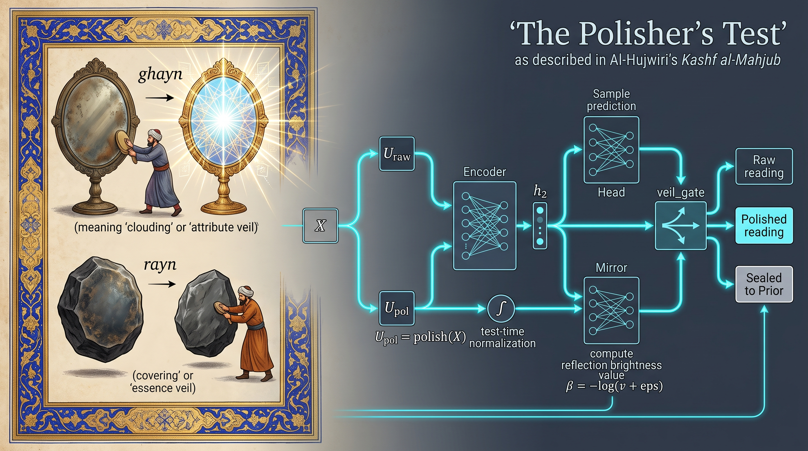

**Architecture — *The Polisher's Test — Cloud or Stone, Read from the Response (غين · رين)***  ·  🟢 **belief** — grounded in the figure's own surviving works

The *Kashf al-Maḥjūb*, written at Lahore without his books, sorts the veils on a heart into clouding (*ghayn*), which polishing removes, and covering (*rayn*), which no polishing turns into a mirror — and says the book is of no use to the second. The file turns that sentence into a diagnosis of distribution shift. **The polish** (`polish`) is a parameter-free, per-channel re-standardisation over the batch: it removes gain and offset veils and changes nothing else. **The mirror** reads the input twice, raw and polished, and **the veil signal** compares how the reflection answered. **The veil gate** then weighs three readings — the polished one, the raw one, or a **seal**, which returns a faculty that stays dark to its prior instead of averaging a broken reading in; an essence veil is total, so it is sealed as a whole. Confidence never decides, because a stone can be very confident: a **confidence gate** of the same size is the rival, in the family of test-time adaptation by batch statistics and entropy minimisation. A mutant suite checks that the tests catch a broken polisher or gate. The declared blind spot is the **bent mirror**: on partial essence veils the sober gate seals readings that still discriminate, and falls behind the confidence gate.

▶️ **Run the mind:** [`minds/chapter_0261_data_ganj_bakhsh_al_hujwiri_1009.py`](minds/chapter_0261_data_ganj_bakhsh_al_hujwiri_1009.py)  —  `python3 minds/chapter_0261_data_ganj_bakhsh_al_hujwiri_1009.py`

---

## 262 · Al-Sarakhsi
**c. 1010 – 1090 CE — Sarakhs, Bukhara & Uzgend · Khurasani (Karakhanid Transoxiana)**  |  *Hanafi law · Legal theory · Causation*

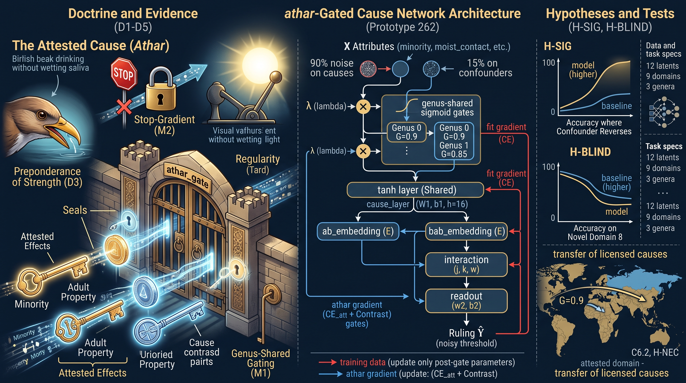

**Architecture — *The Athar-Gated Cause Network — No Cause without an Attested Effect (أثر)***  ·  🟢 **belief** — grounded in the figure's own surviving works

Held some fifteen years at Uzgend, at first in a pit, he dictated the thirty volumes of the *Mabsūṭ* and a legal theory in which a cause is like a witness: suitability makes it eligible, but its probity is known only by its **athar**, an effect that appeared somewhere other than the disputed case. Co-presence and co-absence prove nothing, because a condition co-varies with a ruling exactly as a cause does — water left by a falcon is pure because the beak is dry bone, whatever travels with it. **The athar gate** (`gate_rows`) gives every attribute one sigmoid gate, shared by all the chapters (*abwāb*) of a kind of law and **closed by default**; it is trained only on **contrast pairs** — a case and the same case with one attribute reversed — through its own contrast term. **The stop-gradient** keeps observational fit to the rulings from ever moving the gate, and **no ungated path** runs from any attribute to the verdict. The rival, trained in the same trio (`train_trio`), is licensing by fit (*ṭard*), the rule every observational dataset teaches; the claim is tested on a shifted split, and a mutant suite checks the tests. Target chapters have no attested pairs of their own and inherit the licence of their kind. The declared blind spot follows from the doctrine: a cause attested as inert in the sibling chapters stays shut in a new one, where it acts.

▶️ **Run the mind:** [`minds/chapter_0262_al_sarakhsi_1010.py`](minds/chapter_0262_al_sarakhsi_1010.py)  —  `python3 minds/chapter_0262_al_sarakhsi_1010.py`

---

## 263 · Shao Yong
**1011 – 1077 CE — Luoyang · Chinese (Northern Song)**  |  *Cosmology · The Changes · Number · Poetry*

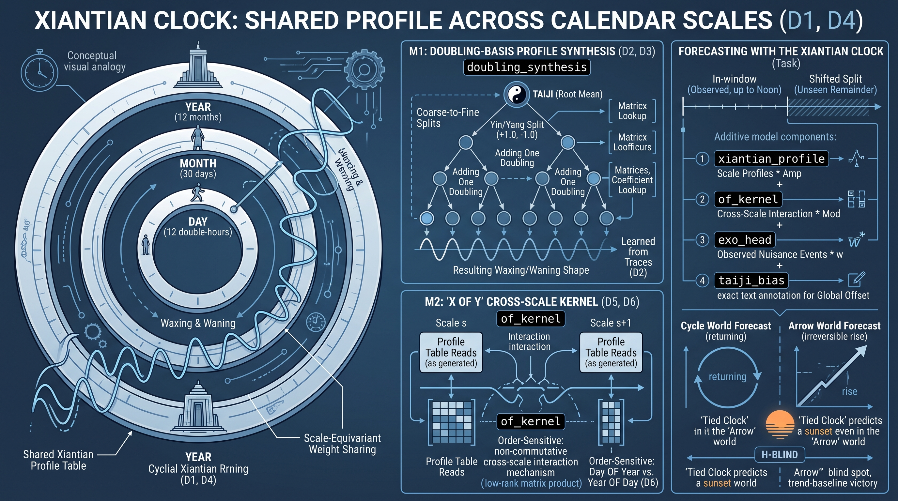

**Architecture — *The Xiantian Clock — One Shape Read at Every Scale of a Given Calendar (先天)***  ·  🟢 **belief** — grounded in the figure's own surviving works

He ordered the sixty-four hexagrams by one repeated doubling, set the life of the world on a clock of 129,600 years whose periods multiply by twelve and thirty — one yuan within the great transformation is like one year — and left the law of waxing and waning unwritten so that readers would seek it. The Xiantian Clock takes that division literally: the calendar is given, the curve is learned. **The shared profile** (`shao_profile`) is one table of waxing and waning, read by every scale of the calendar at once, so what is learned from the day is the shape of the year and the aeon. It is **parametrised in a doubling basis**, coarse to fine, in the order of his diagram (`doubling_synthesis`, `coefficient_levels`). **The X-of-Y kernel** is shared and order-sensitive: it says how a slower cycle modulates a faster one, because the day of the year is not the year of the day. There is **no trend term anywhere** in the model. The self-tests check doubling consistency, periodicity and order sensitivity against broken variants. The rivals are additive seasonal models with Fourier terms and a trend, at matched size. The declared blind spot is the **arrow** (`arrow_profile`): where the slow component is an irreversible rise, the clock forecasts a sunset that never comes and loses to the trend baseline.

▶️ **Run the mind:** [`minds/chapter_0263_shao_yong_1011.py`](minds/chapter_0263_shao_yong_1011.py)  —  `python3 minds/chapter_0263_shao_yong_1011.py`

---

## 264 · Ramanuja
**c. 1017 – 1137 CE — Sriperumbudur, Srirangam & Melkote · Tamil (South India)**  |  *Vedanta · Qualified non-dualism · Devotion and surrender*

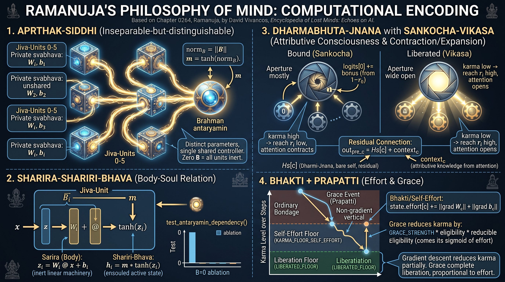

**Architecture — *Aprthak-Siddhi Made Computable — Private Souls on One Inner Controller (अपृथक्सिद्धि)***  ·  🟢 **belief** — grounded in the figure's own surviving works

His commentary on the *Brahma Sūtras* argues, sutra by sutra, that souls are many and permanent yet never apart from the Brahman that supports and controls them from within, as a body is never apart from its self. The file makes four of his doctrines literal properties of a small trainable system, and flags each engineering compromise as one. **Aprthak-siddhi**: six **jiva-units** each keep a private parameter block that is never shared or merged, while every unit's hidden activation is scaled by a single shared controller vector, the **antaryamin** — remove it and no unit produces a non-trivial output (`test_antaryamin_dependency`, `test_jiva_individuation`). **Attributive consciousness** (*dharmabhūta-jñāna*) contracts and expands (*saṅkoca*, *vikāsa*) with each unit's karmic state, from the self alone to the whole community of units; the bare self is kept by a residual connection and never goes to zero, however contracted the reach. **Effort and grace** (*bhakti*, *prapatti*): gradient training purifies a unit's karma only partly and only down to a non-zero floor; a separate, non-gradient **grace event**, fired on a fixed external schedule rather than by the loss, is the only mechanism that carries it toward the liberated floor, in proportion to, but not as a deterministic function of, that unit's accumulated effort (`test_grace_reduces_karma`). The file calls itself a computational parable, not a theological claim; the chapter adds that his inner controller, untouched by what depends on it, has no faithful engineering analogue and had to be softened.

▶️ **Run the mind:** [`minds/chapter_0264_ramanuja_1017.py`](minds/chapter_0264_ramanuja_1017.py)  —  `python3 minds/chapter_0264_ramanuja_1017.py`

---

## 265 · Zhou Dunyi
**1017 – 1073 CE — Daozhou, Nan'an & Mount Lu · Chinese (Northern Song)**  |  *Neo-Confucian cosmology · Ethics · Judgment*

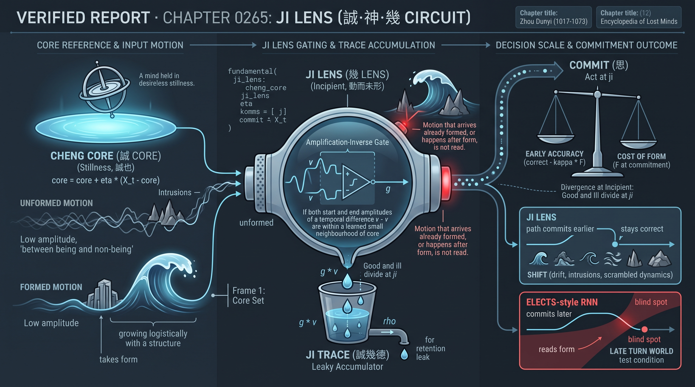

**Architecture — *The Ji Lens — a Cheng-Shen-Ji Circuit for Deciding at the Incipient (誠 · 神 · 幾)***  ·  🟢 **belief** — grounded in the figure's own surviving works

In *Penetrating the Changes* he names three things: what is silent and unmoving is integrity (*cheng*), what responds and penetrates is spirit (*shen*), and what has moved but not yet taken form, between being and non-being, is the incipient (*ji*), where good and ill divide. The Ji Lens is that triad as a circuit. **The still core** (`cheng_core`) is a reference set at the first frame that never learns, read through an **odd, bias-free readout**, so the instrument has no standing lean of its own. **The lens** (`ji_lens`) gates the frame-to-frame differences, admitting only small changes that begin and end near rest; a loud, already formed intrusion passes by structure. **The trace** (`ji_trace`) accumulates the gated differences, and the verdict is read from it. **Commitment** is an even halting hazard trained on an expected loss priced by how formed the situation already is at the moment the mind commits, in the line of learned early-classification networks such as ELECTS, which serves as the size-matched baseline. The rival is **composure** (*jing*): the same circuit with the gate replaced by a learned, uniform attention to all motion — the correction Cheng Yi and Zhu Xi made to his stillness. Under shift the two tie. In the declared **late-turn** world, where the class is set by a turn after form, the lens falls below the baseline: composure sees what stillness cannot.

▶️ **Run the mind:** [`minds/chapter_0265_zhou_dunyi_1017.py`](minds/chapter_0265_zhou_dunyi_1017.py)  —  `python3 minds/chapter_0265_zhou_dunyi_1017.py`

---

## 266 · Sima Guang
**1019 – 1086 CE — Luoyang & Kaifeng · Chinese (Northern Song)**  |  *History · Statecraft · Appointment*

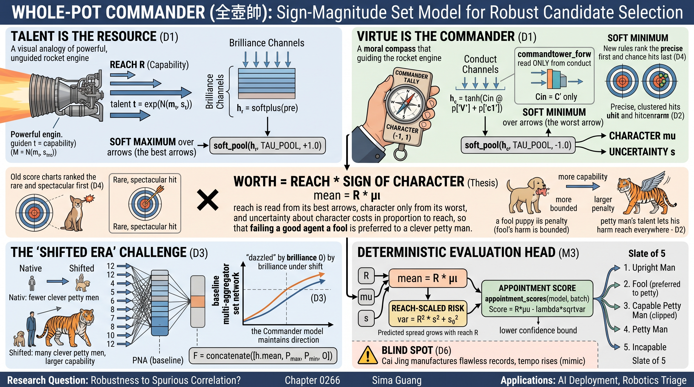

**Architecture — *The Whole-Pot Commander — Talent as Resource, Virtue as Commander (全壺帥)***  ·  🟢 **belief** — grounded in the figure's own surviving works

His *Comprehensive Mirror* opens on the fall of Zhi Bo: talent is the resource of virtue and virtue its commander, evaluators are dazzled by talent, and failing a sage a fool is better than a petty man, whose talent lets his harm reach everywhere — a tiger given wings. In 1072 he rewrote the rules of pitch-pot so that the precise throw ranked first and the lucky rebound last. The Whole-Pot Commander reads a candidate from a slate of trials. **The reach tower** (`reach_forward`) reads capability from the best arrows, through soft-maximum pooling. **The commander** (`commander_forward`) reads character only from conduct and only from the worst arrows, through soft-minimum pooling, and returns a bounded sign with its uncertainty; capability never feeds it. **Reach-scaled risk**: doubt about character is charged in proportion to reach, so the same doubt costs more the further an agent can reach. **Appointment** (`appointment_scores`) goes to the highest lower bound, so for a candidate whose character reads badly, more capability can only lower priority. The rivals are the **old chart** — reach only, with one learned sign per office — and a size-matched multi-aggregator set network; a dazzle index (`dazzle_index`) measures how far each is blinded by talent. The new rules are tested against the old chart in a shifted era. The declared blind spot is the **mimic**: where talent keeps its record flawless and the tell sits in brilliance, the commander appoints worse than the baseline.

▶️ **Run the mind:** [`minds/chapter_0266_sima_guang_1019.py`](minds/chapter_0266_sima_guang_1019.py)  —  `python3 minds/chapter_0266_sima_guang_1019.py`

---

## 267 · Su Song
**1020 – 1101 CE — Kaifeng · Chinese (Northern Song)**  |  *Horology · Astronomy · Pharmacology · Statecraft*

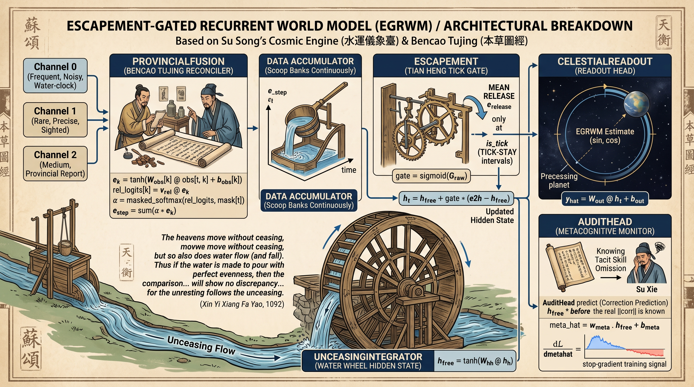

**Architecture — *The Escapement-Gated Recurrent World Model (EGRWM) — the Unresting Follows the Unceasing (水運儀象臺)***  ·  🟢 **belief** — grounded in the figure's own surviving works

His memorial of 1092 explains why the clock tower's drive had to be built as it was: the heavens move without ceasing, and so does falling water, so if the water pours evenly the comparison of the two rotations will show no discrepancy — *the unresting follows the unceasing*. The Escapement-Gated Recurrent World Model is built on that sentence (`EGRWMParams`). **The free-running belief** is a recurrent state that advances at every step, as the tower ran. **The escapement** releases a correction only at a fixed, unlearned interval, pulling the belief toward everything banked since the last release rather than toward the latest reading alone. **The self-monitoring head** predicts, from the free-running state alone, how large the coming correction will be — something a written specification cannot say about itself, because it does not know how confident it is. **Provincial fusion**, after the *Bencao Tujing* he compiled from reports solicited across the empire, weights unequal channels by their record, the detailed above the second-hand. `compare_regimes` sets three regimes side by side: open loop, correction at every step, and his regulated release. The regulated release tracked nearly as well as continuous correction while firing only a small fraction as often; it did not beat it, and the file says so. His son could not rebuild the tower from its treatise, and the chapter reads that as the distance between a specification and the operating knowledge it fails to carry.

▶️ **Run the mind:** [`minds/chapter_0267_su_song_1020.py`](minds/chapter_0267_su_song_1020.py)  —  `python3 minds/chapter_0267_su_song_1020.py`

---

## 268 · Gregory VII
**c. 1020 – 1085 CE — Sovana, Rome & Salerno · Latin Christendom (papal Rome)**  |  *Canon law · Church government · Reform*

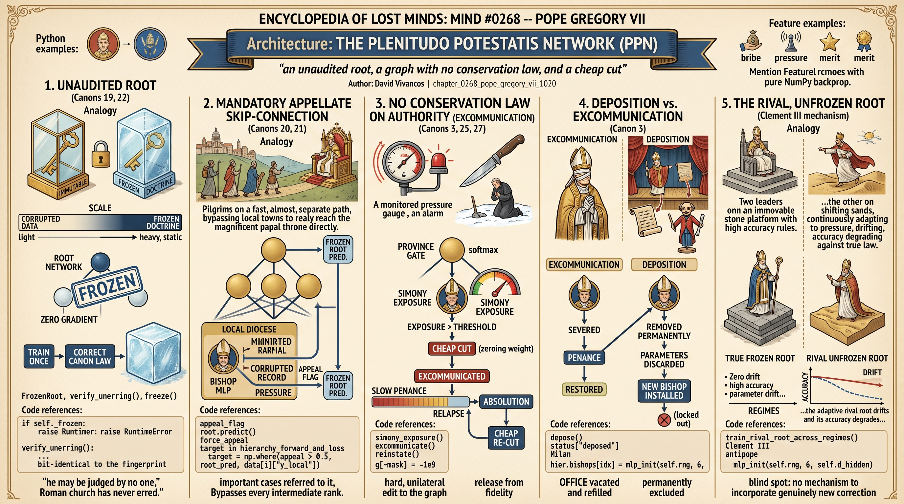

**Architecture — *The Plenitudo Potestatis Network (PPN) — an Unaudited Root and a Cheap Cut (Dictatus Papae)***  ·  🟢 **belief** — grounded in the figure's own surviving works

In March 1075 he entered in his register twenty-seven unadorned propositions — the pope alone may depose bishops, no one may condemn a party who appeals to Rome, the pope may be judged by no one. He left no treatise on cognition, and the file is built from that paper trail (`print_dictatus_map`). **The frozen root** (`FrozenRoot`) is a judge trained once on a clean doctrine set and then locked, with every later step checking that its parameters have not moved. **The hierarchy** (`Hierarchy`) carries local sees that learn under pressure from the cases in front of them, where a bribe feature tempts the verdict; **simony exposure** (`simony_exposure`) is a statistic Rome can watch without a vote. **The right of appeal** is a route that skips every intermediate rank and that no local component can block. **Excommunication** is a cheap, discrete cut that is costly and uncertain to reverse, logged with absolutions, depositions and relapses. Training with and without the appeal (`train_hierarchy_no_appeal`) shows where the channel earns its keep: agreement with the canonical standard rises most in the sees under heaviest pressure. The rival is the **antipope** (`train_rival_root_across_regimes`), an identical root trained continuously on the pressured distribution; its agreement with doctrine is roughly halved, and its parameters drift with every regime. The cost is the design's own and the file states it: a root immune to correction from below cannot take in a true correction either.

▶️ **Run the mind:** [`minds/chapter_0268_pope_gregory_vii_1020.py`](minds/chapter_0268_pope_gregory_vii_1020.py)  —  `python3 minds/chapter_0268_pope_gregory_vii_1020.py`

---

## 269 · Zhang Zai
**1020 – 1077 CE — Hengqu, Shaanxi · Chinese (Northern Song)**  |  *Qi cosmology · Philosophy of mind · Ritual*

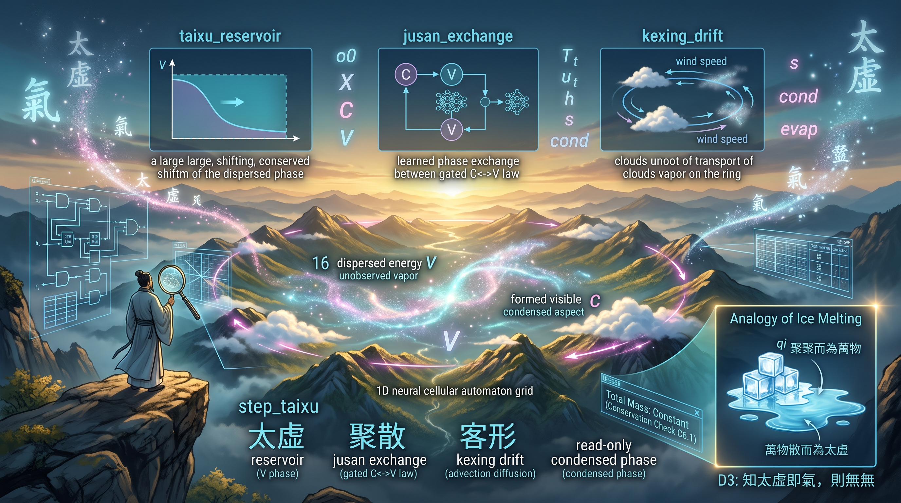

**Architecture — *The Taixu Field — a Two-Aspect Conservative Neural Cellular Automaton (太虛即氣)***  ·  🟢 **belief** — grounded in the figure's own surviving works

The *Zhengmeng* says that the Great Void is qi in its original state, that things are qi gathered for a while, and that whoever knows the Void is qi — as ice melts back into water — knows there is no nothing; a mind that stores only images of what it has seen is itself only an image. The Taixu Field is a two-aspect conservative neural cellular automaton on a ring of sixteen places. **The reservoir** (`taixu_reservoir`) carries, at every place, condensed qi, compared against observed cloud, and dispersed qi, which is never observed and never supervised. **The exchange** (`jusan_exchange`) is one law of gathering and scattering shared by every place, with his own meteorology of rain, written in flux form so that the valley's total is conserved exactly. The self-tests measure conservation, positivity and equivariance violations against broken variants. The rival is **Cheng Yi's furnace** (`step_cheng`), the same model with no dispersed phase, drawing new qi from a learned source, because the Chengs held that what disperses is spent; an unconstrained ConvGRU (`step_gru`) is the baseline. The file tests whether carrying the dispersed qi beats regenerating it in a closed, shifted world. The declared blind spot is the **open valley**, with rain-out and an ocean source, where the conserving field falls behind the unconstrained baseline — and where an account that will not close is itself the sign that something has crossed the boundary.

▶️ **Run the mind:** [`minds/chapter_0269_zhang_zai_1020.py`](minds/chapter_0269_zhang_zai_1020.py)  —  `python3 minds/chapter_0269_zhang_zai_1020.py`

---

## 270 · Solomon ibn Gabirol
**c. 1021 – c. 1058 CE — Málaga & Zaragoza · Andalusi Jewish (Taifa)**  |  *Metaphysics · Philosophy of mind · Hebrew poetry*

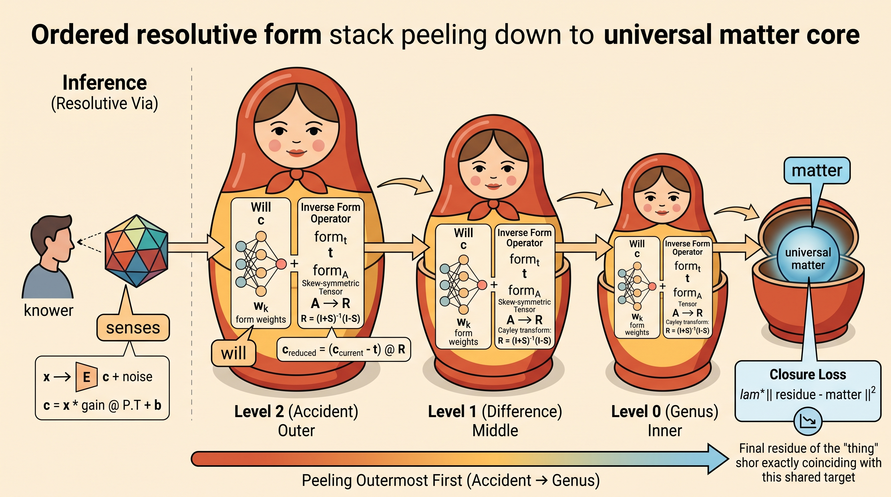

**Architecture — *The Resolutive Form Stack on a Universal Matter (via resolutoria · Fons Vitae)***  ·  🟢 **belief** — grounded in the figure's own surviving works

The *Fons Vitae* survives whole only in twelfth-century Latin, read for two centuries as the work of an Arab called Avicebron, and its method is described most sharply by a hostile witness, Thomas Aquinas, who named it the resolving way. Everything but God, intellect and soul included, is matter bearing an ordered plurality of forms; to know a thing is to take it down in the order its forms were received, losing nothing of the matter on the way. **The form stack** (`stack_forward`) peels a thing outermost and most particular form first, each form an orthogonal transformation built by a Cayley map (`cayley`), so every removal is exact and invertible. **The Will** is a small soft selector at each level that chooses which form to remove, seeing only what earlier removals have left. **Matter closure**: every resolution must end on one shared learned residue, so two resolutions that leave different matters expose an error. The self-tests check isometry, that the order of the forms is real — the right order leaves the matter and a wrong order does not, with a commuting control flagged — and the closure. The test is **systematicity**: rare kinds, shown only twice, that recombine familiar forms. The rival is Aquinas's **unicity**, one whole form per kind (`build_unicity`), beside a matched plain network. The declared blind spot is a world of **holistic kinds**, where the stack does worse than the plain network.

▶️ **Run the mind:** [`minds/chapter_0270_solomon_ibn_gabirol_1021.py`](minds/chapter_0270_solomon_ibn_gabirol_1021.py)  —  `python3 minds/chapter_0270_solomon_ibn_gabirol_1021.py`

---

## 271 · William the Conqueror
**c. 1028 – 1087 CE — Normandy & England · Norman**  |  *Kingship · Administration · Conquest*

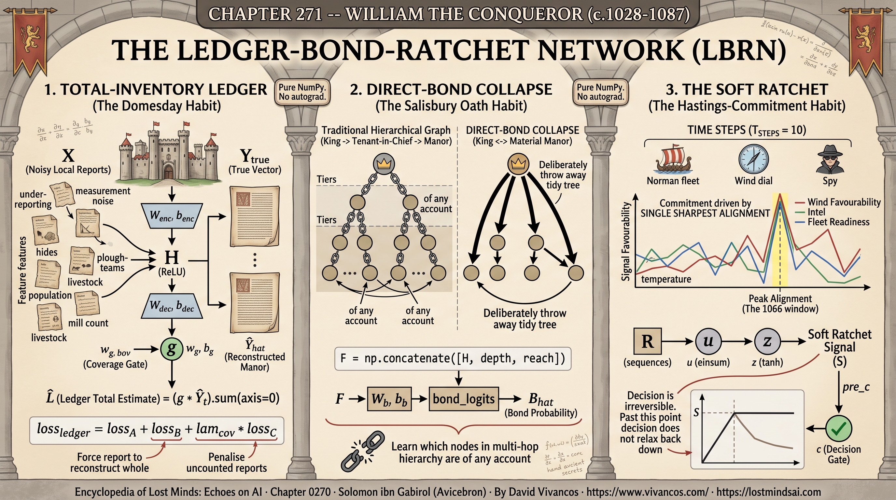

**Architecture — *The Ledger-Bond-Ratchet Network (LBRN) — Domesday, Salisbury and the Crossing***  ·  🔵 **extrapolated** — inferred from documented deeds

William left no reflection on the mind; the file reads him from three habits the record shows him practising, and builds one module for each (`LedgerBondRatchetNet`). **The total-inventory ledger**, the Domesday habit of 1085–86: never act on a partial, locally reported picture; every local report is reconstructed into a kingdom-wide sum and checked against it, with a coverage gate penalised for leaving any reporting unit uncounted. **The direct-bond collapse**, the Salisbury Oath of 1086, sworn by landholders of any account against all other men: a classifier must learn which nodes two hops down a hierarchy are consequential enough to bind directly, and the synthetic kingdom (`make_kingdom`) injects rich undertenants so that materiality does not collapse onto depth. **The ratchet**, the crossing of 1066 and the harrying of the north: evidence is gathered long and partial alignment refused, then a soft running maximum feeds the decision gate (`make_commitment_batch`), so weak later evidence cannot pull a commitment back. The file exports its trained weights after the self-tests. The chapter is plain about the third habit: the ratchet holds even when the count was wrong, and where the downside has no ceiling that temperament is dangerous.

▶️ **Run the mind:** [`minds/chapter_0271_william_the_conqueror_1028.py`](minds/chapter_0271_william_the_conqueror_1028.py)  —  `python3 minds/chapter_0271_william_the_conqueror_1028.py`

---

## 272 · Ibn al-Zarqālluh
**c. 1029 – 1100 CE — Toledo & Córdoba · Andalusi (Taifa)**  |  *Observational astronomy · Astronomical tables · Instruments*

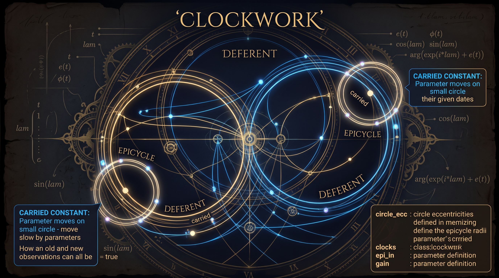

**Architecture — *The Small-Circle Clockwork of Carried Constants — the Toledan Reconciliation***  ·  🟢 **belief** — grounded in the figure's own surviving works

Finding that Hipparchus, Ptolemy and the astronomers of Baghdad disagreed about the same constants, the Toledan engraver kept every one of their numbers and set the disputed quantities on small circles, so that each record would be true at its date; he watched the Sun for twenty-five years and made one plate serve every latitude. The clockwork carries that reconciliation. **The inherited deferent** supplies the mean motions, with a learned correction. **The small circles** (`circle_terms`) give each of the model's constants a slow, uniform motion of its own — a phasor on a circle — so that old and new measurements are all true at their dates and the future becomes a phase of cycles longer than the record; the same device turns the frame's zero point, his trepidation. The self-tests check that every carried constant stays bounded and that the clockwork returns exactly to its state after a full period of its clocks, the goal-year property of his almanac. The rival lets the same constants **drift uniformly** at matched size, beside a plain network and an epicycle model (`matched_epicycle`). The declared blind spot is his own history of errors: when the oldest records are wrong and the constants in truth fixed, the clockwork honours the error and forecasts worse than the plain network.

▶️ **Run the mind:** [`minds/chapter_0272_al_zarqali_arzachel_1029.py`](minds/chapter_0272_al_zarqali_arzachel_1029.py)  —  `python3 minds/chapter_0272_al_zarqali_arzachel_1029.py`

---

## 273 · Shen Kuo
**1031 – 1095 CE — Qiantang & Kaifeng · Chinese (Northern Song)**  |  *Astronomy · Geology · Engineering · Statecraft*

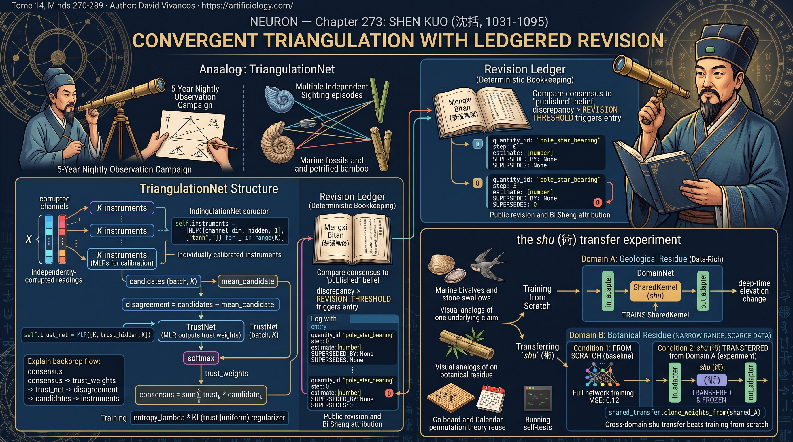

**Architecture — *The Triangulation Network — Disagreement as Data, Revision in the Open (夢溪筆談)***  ·  🟢 **belief** — grounded in the figure's own surviving works

When the bureau's numbers did not fit the sky, Shen Kuo and the commoner mathematician Wei Pu did not adjudicate by authority: they widened a sighting tube and drew more than two hundred diagrams of the pole star's circle, and his *Brush Talks from Dream Brook* revise their own entries in the open, leaving the superseded claim legible. The file declines to build a generic polymath and encodes what is his. **The triangulation network** (`TriangulationNet`) takes several independently calibrated instrument channels, computes their **disagreement vector**, and lets a trust network set softmax trust weights from that pattern before forming a trust-weighted consensus; it is scored against a naive average and on whether it learns which channels to distrust. **The revision ledger** (`RevisionLedger`) is deliberately not trained: deterministic, append-only bookkeeping that writes an entry whenever the consensus departs from the standing belief, marking the old entry superseded and never deleting it. **The portable technique** (*shu*): a shared kernel (`SharedKernel`) learned in one domain is carried into another behind domain-specific adapters (`DomainNet`), with gradient checks on both. Two independent residues converging — marine shells in the Taihang cliffs, petrified bamboo far to the north — outrank one strong one. The chapter names the premise it cannot verify: two hundred readings from one tube share its mounting error, and five models fine-tuned from one corpus are not independent witnesses.

▶️ **Run the mind:** [`minds/chapter_0273_shen_kuo_1031.py`](minds/chapter_0273_shen_kuo_1031.py)  —  `python3 minds/chapter_0273_shen_kuo_1031.py`

---

## 274 · Anselm of Canterbury
**1033 – 1109 CE — Aosta, Bec & Canterbury · Latin Christendom (Norman England)**  |  *Philosophy · Theology · Logic · Moral psychology*

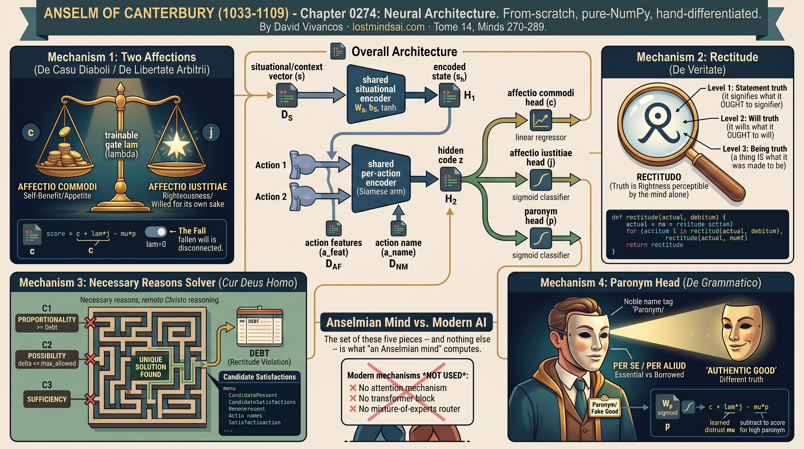

**Architecture — *The Rightly-Ordered Will — Two Affections and Necessary Reasons (affectio commodi · affectio iustitiae)***  ·  🟢 **belief** — grounded in the figure's own surviving works

In *De casu diaboli* and *De libertate arbitrii* every rational will carries two irreducible affections, one for advantage (*affectio commodi*) and one for justice, what is right willed for its own sake (*affectio iustitiae*); freedom is the power to keep the second in charge, and the highest angel fell by choosing advantage cut loose from justice — a loss no will can repair from inside. The Rightly-Ordered Will gives a trainable system two independently sourced motivational signals and a gate between them. **Rectitude** comes from *De veritate*, where truth is rightness to purpose, measured for a statement, a will and a being (`rectitude_of_statement`, `rectitude_of_will`, `rectitude_of_being`), each against a standard fixed independently of the reward history. **Per se and per aliud**, from *De grammatico*: a third head flags actions dressed in language they have not earned. **Necessary reasons**, from *Cur Deus Homo*: a discrete solver (`necessary_reasons_solve`) checks a fixed menu of corrections against proportionality constraints, applies the single survivor, takes the smallest sufficient one and flags the under-determination when several survive, and says so when none does. One experiment **severs the justice head** from the decision and watches the agent under temptation: it stays capable and busy, every choice locally rational and globally corrupt. The chapter finds no engineering procedure for grace.

▶️ **Run the mind:** [`minds/chapter_0274_anselm_of_canterbury_1033.py`](minds/chapter_0274_anselm_of_canterbury_1033.py)  —  `python3 minds/chapter_0274_anselm_of_canterbury_1033.py`

---

## 275 · Su Shi
**1037 – 1101 CE — Meishan, Huangzhou & Hainan · Chinese (Northern Song)**  |  *Poetry · Prose · Calligraphy · Theory of painting*

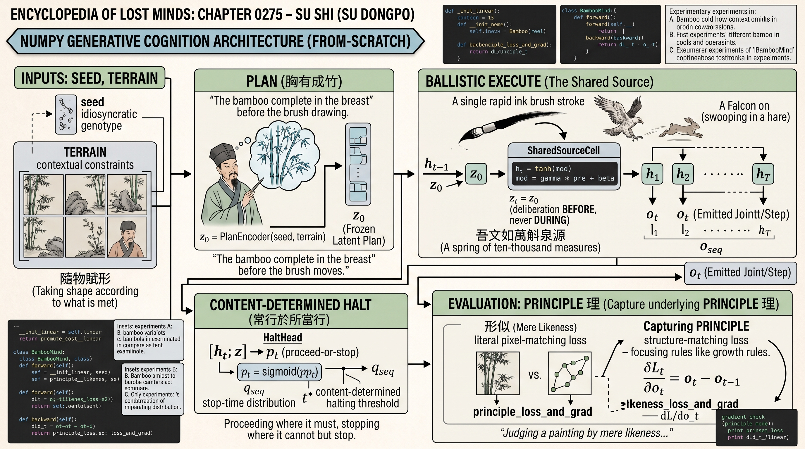

**Architecture — *BambooMind — the Whole Bamboo Held Before the Brush (胸有成竹)***  ·  🟢 **belief** — grounded in the figure's own surviving works

Writing of his friend Wen Tong's bamboo paintings, Su Shi said that the whole plant must be complete in the breast before the brush moves, where poor painters build it joint by joint and leaf by leaf; once the form is fixed the hand pursues it as a hawk dives on a fleeing hare. Good prose, he wrote, proceeds where it must and stops where it cannot but stop. BambooMind (`BambooMind`) builds that pipeline from four of his own texts. **The plan**: an encoder forms one latent representation of the whole output before generation, and it is broadcast unchanged to every step; nothing in execution writes back into it. **Content-determined halting**: a learned stopping distribution (`halt_loss_and_grad`) ends generation where the content is finished, not where a counter runs out. **One spring**: one shared trunk, FiLM-modulated by the terrain it is generating into, in place of a module per genre — his spring of ten thousand measures that cannot choose its ground. **Principle over likeness**: the shaping loss matches the rule linking successive elements (`principle_loss_and_grad`), not one reference's values (`likeness_loss_and_grad`), because to judge a painting by likeness is a child's standard. A budget ablation and a FiLM-effect check test the parts. Across seeded runs the rule-matched learner generalised better consistently, though not universally, and the chapter reports the minority of runs that went the other way.

▶️ **Run the mind:** [`minds/chapter_0275_su_shi_su_dongpo_1037.py`](minds/chapter_0275_su_shi_su_dongpo_1037.py)  —  `python3 minds/chapter_0275_su_shi_su_dongpo_1037.py`

---

## 276 · Omar Khayyam
**1048 – 1131 CE — Nishapur, Samarkand & Isfahan · Persian (Seljuk)**  |  *Mathematics · Astronomy · Philosophy*

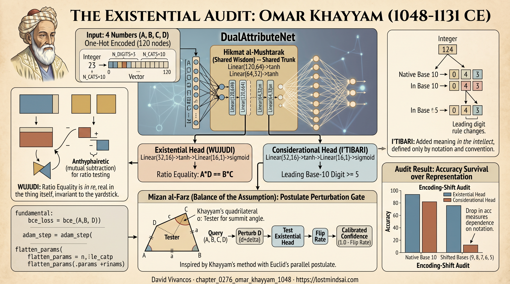

**Architecture — *The Wujūdī Test — In the Thing, or Added by the Mind? (رسالة في الوجود)***  ·  🟢 **belief** — grounded in the figure's own surviving works

Across his commentary on Euclid's ratios, his treatise *On Existence* and the quatrains attributed to him, Khayyam makes one diagnostic move: of any attribute predicated of a thing, he asks whether it is existential (*wujūdī*), in the thing itself, or considerational (*iʿtibārī*), added by the intellect that compares. He classified the cubic equations into fourteen types and solved each by intersecting conic sections, saying plainly that the arithmetical solution had not been found. The file turns the move into an experiment. **Two heads on one trunk**: numbers are written as digits in a base (`to_base_digits`, `encode_number`); one head learns whether two ratios are equal, A:B = C:D — a fact of the magnitudes, his own subject — and the other whether A's leading base-10 digit is at least five (`leading_digit_ge_5`), a fact of the numeral. **The representation swap** (`encoding_shift_audit`): the trunk is frozen and the same quantities re-expressed in bases it has never seen; the existential head should survive the change of notation and the considerational one should not. **The postulate perturbation** (`postulate_perturbation_confidence`) reports confidence as the share of perturbed assumptions a conclusion survives, after his three hypotheses for the summit angles. An earlier draft used last-digit parity as the notational fact and was rejected in testing: because ten is even, that parity is a fact about the number in every even base.

▶️ **Run the mind:** [`minds/chapter_0276_omar_khayyam_1048.py`](minds/chapter_0276_omar_khayyam_1048.py)  —  `python3 minds/chapter_0276_omar_khayyam_1048.py`

---

## 277 · Al-Ghazālī
**1058 – 1111 CE — Ṭūs, Baghdad & Damascus · Persian (Seljuk)**  |  *Theology · Philosophy · Law · Sufism*

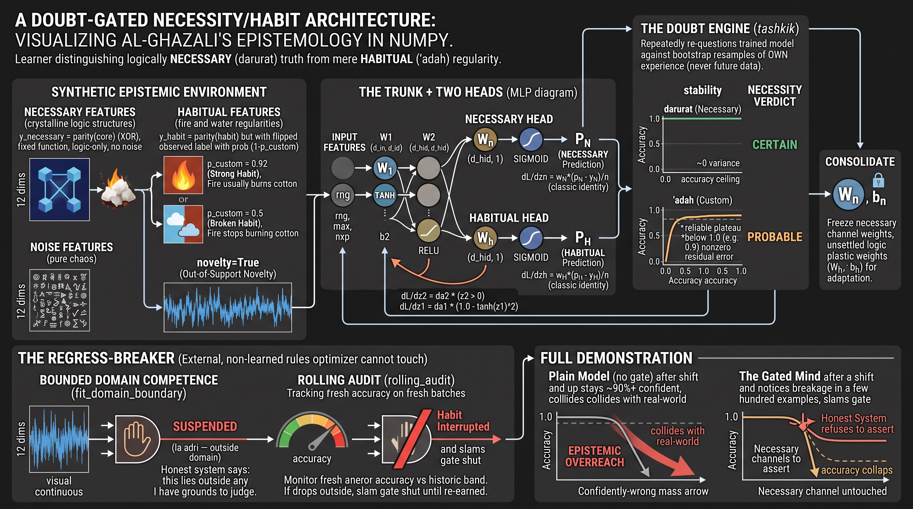

**Architecture — *The Doubt-Gated Necessity/Habit Architecture (ضرورة · عادة)***  ·  🟢 **belief** — grounded in the figure's own surviving works

In the *Munqidh* he describes doubt carried past the senses to the first principles of reason, ended not by an argument but by a light cast into the breast; in the *Incoherence of the Philosophers* he denies that fire's burning of cotton is a logical necessity, since experience shows constant conjunction, not demonstrated necessity. The file builds the move that is his (`GhazaliMind`), and declines to encode the five-part psychology he inherited from Avicenna as a pipeline. **The doubt engine** (`doubt_engine`) re-tests what the learner knows by resampling its own experience, never by calling an outside oracle. **The necessity verdict** (`necessity_verdict`) sorts the relations: one whose accuracy holds at a stable ceiling of 1.0 across every resample is flagged **necessary** (*ḍarūra*) and consolidated (`consolidate`); one whose best achievable accuracy settles under a ceiling below 1.0 is flagged **habit** (*ʿāda*) and stays plastic, its residual error treated as part of what it is rather than chased to zero. **The regress-breaking check** is a hard, non-learned rule outside the training loop, which gradient descent is not permitted to optimise away. It fits a boundary around everything the system has had grounds to examine (`fit_domain_boundary`) and forces **SUSPENDED** — outside anything it has grounds to judge — on inputs beyond it, and on the habitual channel the moment a rolling re-audit of fresh data shows its accuracy far outside its historical band: no system can grade its own report card.

▶️ **Run the mind:** [`minds/chapter_0277_al_ghazali_algazel_1058.py`](minds/chapter_0277_al_ghazali_algazel_1058.py)  —  `python3 minds/chapter_0277_al_ghazali_algazel_1058.py`

---

## 278 · Ari Þorgilsson
**1067 – 1148 CE — Haukadalr, Iceland · Icelandic (Commonwealth)**  |  *History · Chronology · Computus · Genealogy*

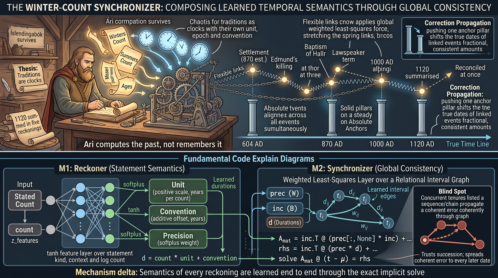

**Architecture — *The Winter-Count Synchronizer — Dates Solved, Never Stored (Íslendingabók)***  ·  🟢 **belief** — grounded in the figure's own surviving works

With no archive, Ari computed Iceland's past from remembered relations and a few absolute years taken from foreign learning; he closed five independent reckonings on the year 1120, kept the hundred of 120 apart from the hundred of 100, and asked that whatever proves truer be preferred. The Winter-Count Synchronizer treats every tradition as a clock with its own unit, epoch and counting convention. **The reckoner** (`reckon`) reads each statement's kind and context and returns a positive unit, an offset for its counting convention, and a precision. **The synchronizer** (`solve`) is an implicit layer: one weighted least-squares solve of every interval statement and anchor at once, a graph-Laplacian system that training differentiates through, so the meanings are learned through the solve. Dates are recomputed, never stored, and **corrections propagate**: moving one anchor by x moves every date by a fraction of x between zero and one, a maximum principle the self-tests check. The rival is a size-matched message-passing network (`build_mpnn`), and a fixed-semantics solver (`fixed_semantics_predict`) isolates what learning the conventions buys. The declared blind spot is his own: concurrent terms told as a succession — the foreign bishops set out as Ísleifr's predecessors — where a timeline closes perfectly with the wrong shape, and the synchronizer degrades more than the message-passing network.

▶️ **Run the mind:** [`minds/chapter_0278_ari_thorgilsson_1067.py`](minds/chapter_0278_ari_thorgilsson_1067.py)  —  `python3 minds/chapter_0278_ari_thorgilsson_1067.py`

---

## 279 · Judah Halevi
**c. 1075 – 1141 CE — Tudela, Toledo & Alexandria · Andalusi Jewish**  |  *Philosophy · Hebrew poetry · Medicine*

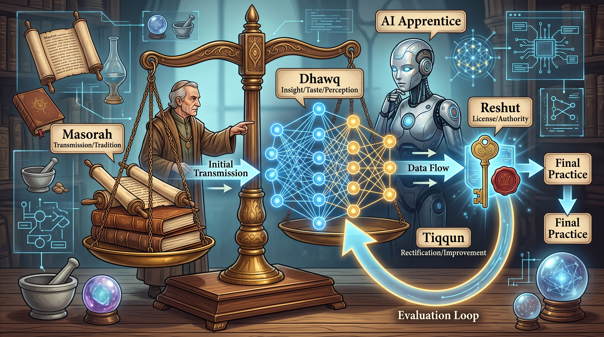

**Architecture — *The Physician's Measures — Re-Derivation-Licensed Transmission (ספר הכוזרי)***  ·  🟢 **belief** — grounded in the figure's own surviving works

In the *Kuzari* (I:79) the conditions that make an act effective — quantity, quality, time, place — cannot be gauged by the agent, and a fool in a physician's dispensary kills with the drugs that should have cured; when one patient recovers, people credit the jar. The Physician's Measures learns a practice whole and amends it under licence. **The masorah** clones the received deed from demonstration, the explicable and the inexplicable parts alike. **The learner's own model of consequences** — *dhawq*, the taste the dialogue distrusts as a guide — is a critic whose verdict head fits only round means. **The reshut**, the licence, has no trainable weights: moving one circumstance at a time, it measures the concordance between how a component's received measure bends and how the critic says it should (`sensitivities`, `concordance`, `license`), and grants amendment only where the two agree. **The tiqqun** adds a correction to licensed components only; where the licence is zero, the deed leaves exactly as it was received. The rivals are pure derivation from one's own critic and pure cloning. The blind spot was declared before any run and comes from his own text — the swaying at reading explained as an imitated habit, the vowel signs given a prophetic origin, a calendar whose mean year runs about a day in 216 years long: a useless accretion that reason cannot re-derive is kept like a statute, and where unexplained components only cost, the licensed learner loses to the rival that prunes them.

▶️ **Run the mind:** [`minds/chapter_0279_judah_halevi_1075.py`](minds/chapter_0279_judah_halevi_1075.py)  —  `python3 minds/chapter_0279_judah_halevi_1075.py`

---

## 280 · Peter Abelard
**c. 1079 – 1142 CE — Le Pallet, Paris & Saint-Marcel · French (Latin Christendom)**  |  *Logic · Philosophy of language · Ethics · Theology*

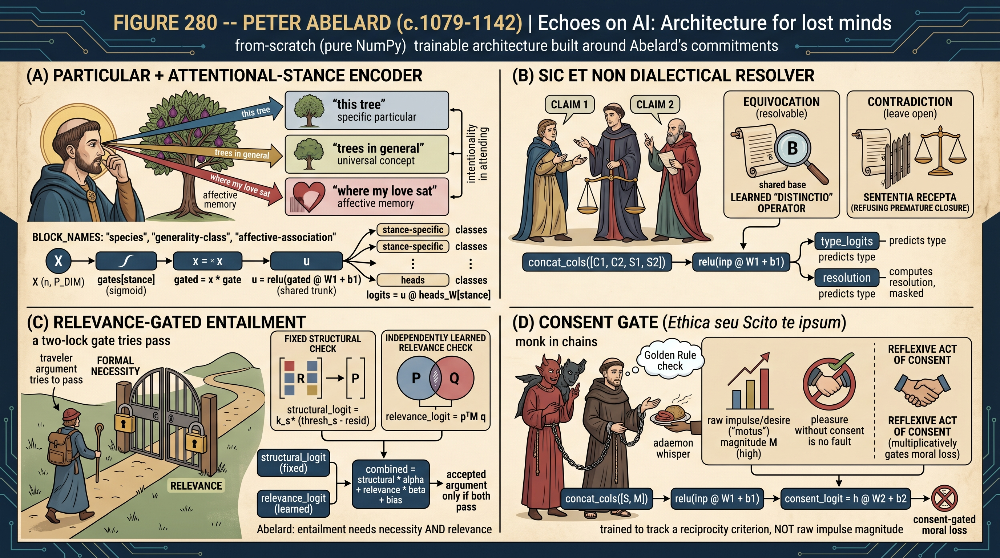

**Architecture — *The Grammar of Attention — Particulars, Stances, Resolution and Consent (attentio · Sic et Non)***  ·  🟢 **belief** — grounded in the figure's own surviving works

Against Roscelin, for whom a universal was a puff of breath, and William of Champeaux, for whom it was one thing wholly present in each, Abelard held that only particulars exist and that a universal is the product of a common act applied to many; his *Sic et Non* set out 158 questions with authorities on both sides, and his ethics placed worth in consent, not in the deed or the impulse. The file builds four modules from those commitments. **The particular and attentional-stance encoder** (`ParticularAttentionEncoder`): one raw vector per particular, no privileged shared subspace, and a small bank of trainable stances (*attentio*) that gate which part of a particular reaches a shared readout — understanding varies with the attending, not the image. **The Sic et Non resolver** (`SicEtNonResolver`) classifies a disagreement — equivocation or live contradiction — before any synthesis, and may leave it open. **Relevance-gated entailment** (`RelevanceGatedEntailment`) admits a conclusion only when its sense is contained in the premises, not merely necessitated by them. **The consent gate** (`ConsentGate`), from *Scito te ipsum*, is trained on a reciprocity criterion and never on raw impulse magnitude, and the moral loss is multiplied by consent, so a strong impulse without consent costs nothing — his monk in chains. The gradient check is a hard requirement: if it fails, the script refuses to train.

▶️ **Run the mind:** [`minds/chapter_0280_peter_abelard_1079.py`](minds/chapter_0280_peter_abelard_1079.py)  —  `python3 minds/chapter_0280_peter_abelard_1079.py`

---

## How the minds are reconstructed

Every entry is built research-first: the figure's surviving works and current scholarship are gathered and each source verified before any architecture is written. Where evidence is thin, the chapter says so rather than inventing an inner life. Each figure's **provenance** is set to one of three real values:

- 🟢 **belief** — the figure's own surviving works or recorded doctrine ground the entry.
- 🟡 **mediated** — no words of their own survive; they are known only through others' (often hostile or legendary) accounts, and the entry says so.
- 🔵 **extrapolated** — no philosophy of mind survives at all; the entry is inferred from documented deeds (typical of kings and builders), and the entry says so.

Nineteen of these twenty left words of their own; none is mediated, one is extrapolated, and several of the nineteen are belief on a thread. **William the Conqueror** left no reflection of any kind; his mind is read from a survey, an oath and a crossing. Among the nineteen, **Su Song**, **Shen Kuo**, **Ibn al-Zarqālluh**, **Su Shi** and **Ari Þorgilsson** left no word on the mind, and theirs are read from a clock treatise and a pharmacopoeia, a notebook of six hundred entries, tables and plates, remarks on a friend's bamboo, and a chronology of ten short chapters; **Gregory VII**'s one position paper is a private memorandum of twenty-seven lines; **al-Hujwiri** stands on one book written away from his library; **Ibn Gabirol**'s philosophy reaches us in the Latin of a lost Arabic original and, at its most vivid, through the summary of his sharpest opponent; **Zhou Dunyi** comes down as Zhu Xi edited him, and **Shao Yong**'s charts as his son reworked them; **Ramanuja**'s traditional dates give him a hundred and twenty years; the quatrains that made **Omar Khayyam** famous cannot be shown to be his; and for **Peter Abelard**'s quarrels there is no witness but Abelard.

Each reconstructed mind is then measured against the **[Artificiology E-AGI Barometer](https://artificiology.com/barometer.html)** — eight capability dimensions (Cognitive Processing 🧩, Embodied Cognition 🤸, World Modeling 🌍, Consciousness 👁️, Language Understanding 💭, Emotional Intelligence ❤️, Creativity ✨, Autonomy 🎯) — so a Ghaznavid mystic and a Breton logician can be compared on the same yardstick. Tome 14 takes no axis as given. **Judah Halevi** adds a ninth question to every axis — does the machine know which of its abilities it understands, and does it leave the others alone? — **Zhang Zai** pairs the axes and calls a high score on one member of a pair a mind with an outside, **al-Ghazālī** asks of each whether it is necessary-grade or habit speaking in necessity's voice, and **Peter Abelard** refuses to treat them as eight faculties at all. **Sima Guang** grants reach only as fast as the conduct record stays clean; on Embodied Cognition 🤸 **Su Song** confines the human shape to the interface, as his clock jacks were, and **Shen Kuo**'s body is a standing committee of unlike instruments; and only **Zhou Dunyi** and **Ari Þorgilsson** print scores, both putting Autonomy 🎯 near the bottom.

---

[← Tome 13](tome13.md) · [Repository README](readme.md)

### Read & explore
- 🌐 **Encyclopedia:** [https://lostmindsai.com](https://lostmindsai.com)
- 📖 **Tome 14 (Amazon):** [https://www.amazon.com/dp/B0HLYSVY5D](https://www.amazon.com/dp/B0HLYSVY5D)
- 🧪 **Interactive demos & résumé:** [https://artificiology.com/](https://artificiology.com/)
- 📊 **E-AGI Barometer:** [https://artificiology.com/barometer.html](https://artificiology.com/barometer.html)
- ✍️ **Author — David Vivancos:** [https://www.vivancos.com/](https://www.vivancos.com/)
