# Tome 2 — Minds 21–40
### *Axial Foundations — Vedic India, Ionia & the Hundred Schools*
**Encyclopedia of Lost Minds: Echoes on AI** · *800–500 BCE*

[🌐 Encyclopedia](https://lostmindsai.com) · [📖 Buy Tome 2 on Amazon](https://www.amazon.com/dp/B0H6QCQ9M7) · [🧪 Interactive Demos](https://artificiology.com/) · [📊 E-AGI Barometer](https://artificiology.com/barometer.html) · [✍️ Author](https://www.vivancos.com/) · [⭐ Repository](https://github.com/DavidVivancos/LostMindsAI)

[← Tome 1](tome1.md) · [Repository README](readme.md) · [Tome 3 →](tome3.md)

---

Tome 2 runs from **Yajnavalkya** to **Confucius (Kong Qiu)** — twenty reconstructed minds, each rendered on two planes. The **abstract plane** distils the thinker's cognitive signature into an interactive 3D mind-map; the **mechanistic plane** turns that same signature into a small, *runnable* neural architecture, built from scratch in NumPy, gradient-checked, trained and self-tested.

This page collects the twenty **visual mind-map explainers** for this tome and links each to its companion architecture. Runnable code lives in [`minds/`](minds/); the explainer images live in [`maps/`](maps/).

> Every architecture here executes and passes its own self-test suite (a mandatory finite-difference gradient check plus a real training loop). No number is hard-coded — each is produced live on the machine that runs the file.

---

## The Twenty at a Glance

| # | Mind | Era | Civilization | Architecture | Provenance |
|---|------|-----|--------------|--------------|:----------:|
| 21 | [Yajnavalkya](#21--yajnavalkya) | c. 700 BCE | Indian | *The Witness Network* | 🟢 |
| 22 | [Vyasa](#22--vyasa) | c. 800 BCE | Indian | *The Vyasa-Division Case Network* | 🟢 |
| 23 | [Hesiod](#23--hesiod) | c. 700 BCE | Greek | *The Theogonic Net* | 🟢 |
| 24 | [Valmiki](#24--valmiki) | c. 700 BCE | Indian | *The Soka-Sloka Resonator* | 🟢 |
| 25 | [Ashurbanipal](#25--ashurbanipal) | r. 668–627 BCE | Assyrian | *The Baru Engine* | 🟢 |
| 26 | [Nebuchadnezzar II](#26--nebuchadnezzar-ii) | r. 605–562 BCE | Babylonian | *The Temennu Network* | 🔵 |
| 27 | [Solon](#27--solon) | c. 630–558 BCE | Greek | *The Eunomia Network* | 🟢 |
| 28 | [Sappho](#28--sappho) | c. 630–570 BCE | Greek | *LYRE — Eros-Indexed Recurrence* | 🟢 |
| 29 | [Thales of Miletus](#29--thales-of-miletus) | c. 624–546 BCE | Greek | *The Arche-Flow* | 🟡 |
| 30 | [Aesop](#30--aesop) | c. 620–564 BCE | Greek | *The Aesopica Engine* | 🟢 |
| 31 | [Anaximander](#31--anaximander) | c. 610–546 BCE | Greek | *The Apeiron Equilibrium Network* | 🟢 |
| 32 | [Laozi (Lao Tzu)](#32--laozi-lao-tzu) | c. 6th c. BCE | Chinese | *The Valley Network* | 🟢 |
| 33 | [Cyrus the Great](#33--cyrus-the-great) | r. 559–530 BCE | Persian | *The Federated Legitimation Network* | 🟡 |
| 34 | [Susruta](#34--susruta) | c. 6th c. BCE | Indian | *The Salya Engine* | 🟢 |
| 35 | [Mahavira](#35--mahavira) | c. 599–527 BCE | Indian | *Anekanta-Net* | 🟢 |
| 36 | [Anaximenes of Miletus](#36--anaximenes-of-miletus) | c. 586–526 BCE | Greek | *The Pneuma Continuum Network* | 🟢 |
| 37 | [Cleisthenes](#37--cleisthenes) | c. 570–508 BCE | Greek | *Demos-Net — Decorrelated Sortition Ensemble* | 🔵 |
| 38 | [Pythagoras](#38--pythagoras) | c. 570–495 BCE | Greek | *The Monochord Resonance Network* | 🟡 |
| 39 | [Gautama Buddha](#39--gautama-buddha) | c. 563–483 BCE | Indian | *The Two-Arrow Equanimity Mind* | 🟢 |
| 40 | [Confucius (Kong Qiu)](#40--confucius-kong-qiu) | c. 551–479 BCE | Chinese | *The Li-Zhengming Network* | 🟢 |

**Provenance** — 🟢 belief · 🟡 mediated · 🔵 extrapolated. See [How the minds are reconstructed](#how-the-minds-are-reconstructed).

---

## 21 · Yajnavalkya
**c. 700 BCE — India (Vedic) · Indian**  |  *Philosophy · Theology*

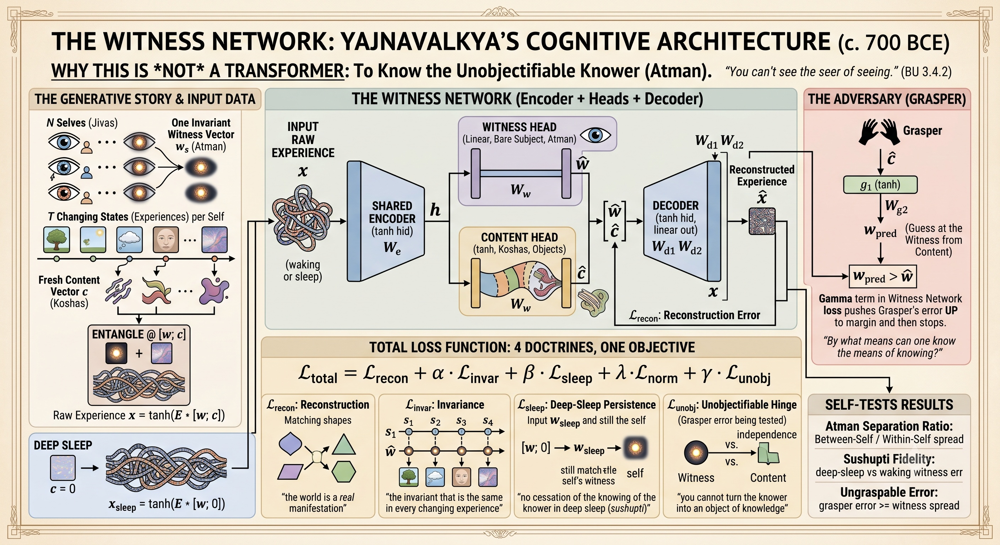

**Architecture — *The Witness Network***  ·  🟢 **belief** — grounded in the figure's own surviving works

The mind's ground is an *unobjectifiable witness*: the knower that lights up every object can never itself become an object, reached only by negation (neti neti) and shown in dreamless depth — self-awareness as the one thing that cannot be modelled from outside.

▶️ **Run the mind:** [`minds/chapter_0021_yajnavalkya_-700.py`](minds/chapter_0021_yajnavalkya_-700.py)  —  `python3 minds/chapter_0021_yajnavalkya_-700.py --test`

---

## 22 · Vyasa
**c. 800 BCE — India · Indian**  |  *Epic · Philosophy · Vedas*

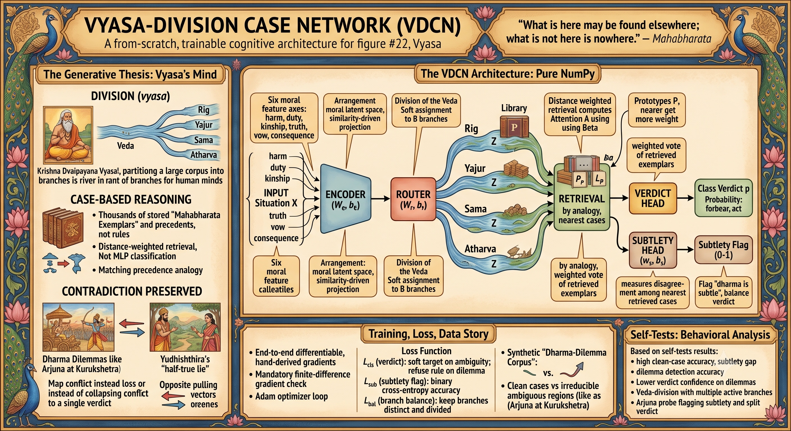

**Architecture — *The Vyasa-Division Case Network***  ·  🟢 **belief** — grounded in the figure's own surviving works

The *divider-arranger*: an overwhelming whole partitioned into transmissible branches fitted to each receiver's capacity, then navigated by analogy to stored moral exemplars — contradiction between cases preserved, not resolved away.

▶️ **Run the mind:** [`minds/chapter_0022_vyasa_-800.py`](minds/chapter_0022_vyasa_-800.py)  —  `python3 minds/chapter_0022_vyasa_-800.py --test`

---

## 23 · Hesiod
**c. 700 BCE — Ascra, Boeotia (Greece) · Greek**  |  *Poetry*

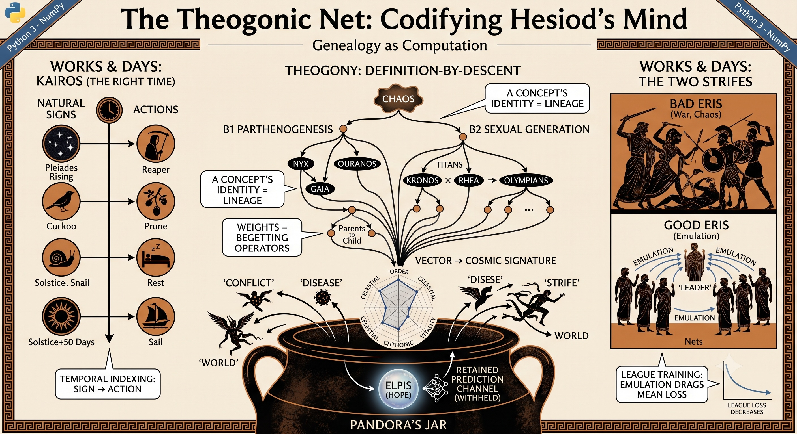

**Architecture — *The Theogonic Net***  ·  🟢 **belief** — grounded in the figure's own surviving works

Definition-by-descent: to know a thing is to know who begot it, so knowledge is a single begetting-graph rooted in Chaos, with action bound to kairos and the two Strifes separating productive emulation from ruinous conflict.

▶️ **Run the mind:** [`minds/chapter_0023_hesiod_-700.py`](minds/chapter_0023_hesiod_-700.py)  —  `python3 minds/chapter_0023_hesiod_-700.py --test`

---

## 24 · Valmiki
**c. 700 BCE — Ancient India · Indian**  |  *Epic · Poetry · Ramayana*

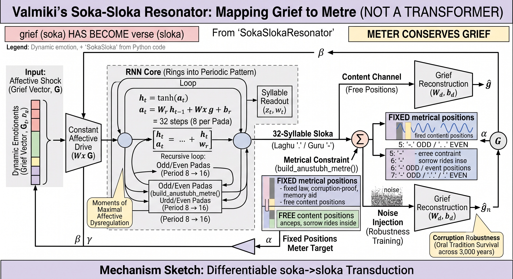

**Architecture — *The Soka-Sloka Resonator***  ·  🟢 **belief** — grounded in the figure's own surviving works

Grief transmuted into metre — the first verse (sloka) born from sorrow (soka): the poet-mind as a converter that turns raw, unrepeatable emotion into ordered, transmissible form under a metrical constraint.

▶️ **Run the mind:** [`minds/chapter_0024_Valmiki_-700.py`](minds/chapter_0024_Valmiki_-700.py)  —  `python3 minds/chapter_0024_Valmiki_-700.py --test`

---

## 25 · Ashurbanipal
**r. 668–627 BCE — Assyria · Assyrian**  |  *Library · Nineveh · Culture*

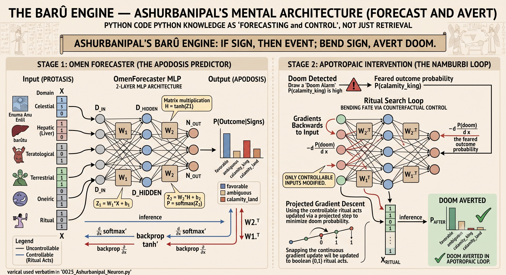

**Architecture — *The Baru Engine***  ·  🟢 **belief** — grounded in the figure's own surviving works

Sovereignty as *forecast-and-avert*: read the future from a curated corpus of sign→outcome (protasis→apodosis) correlations, then treat each verdict as appealable and search the catalogue of controllable actions for the aversion ritual.

▶️ **Run the mind:** [`minds/chapter_0025_Ashurbanipal_-685.py`](minds/chapter_0025_Ashurbanipal_-685.py)  —  `python3 minds/chapter_0025_Ashurbanipal_-685.py --test`

---

## 26 · Nebuchadnezzar II
**r. 605–562 BCE — Babylon · Babylonian**  |  *Architecture · Governance*

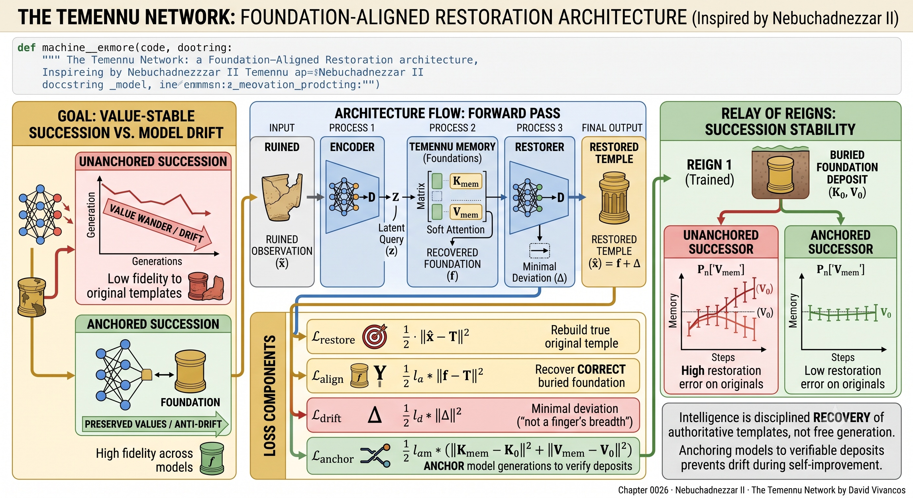

**Architecture — *The Temennu Network***  ·  🔵 **extrapolated** — inferred from documented deeds

Intelligence as *restoration to a buried template*: read from his building (not military) inscriptions, cognition is the disciplined recovery of an authoritative ground-truth foundation-record and correction of drift back toward it.

▶️ **Run the mind:** [`minds/chapter_0026_Nebuchadnezzar_II_-634.py`](minds/chapter_0026_Nebuchadnezzar_II_-634.py)  —  `python3 minds/chapter_0026_Nebuchadnezzar_II_-634.py --test`

---

## 27 · Solon
**c. 630–558 BCE — Athens · Greek**  |  *Governance · Law*

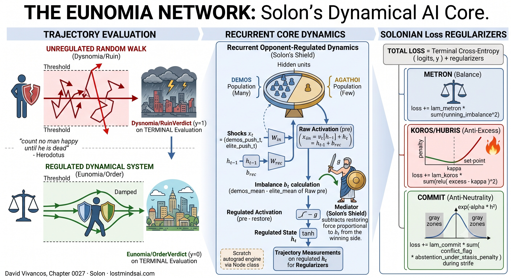

**Architecture — *The Eunomia Network***  ·  🟢 **belief** — grounded in the figure's own surviving works

Legal equality (isonomia) as a *structural* property: laws must embody reason to hold an over-strained society in good order (eunomia) rather than let it slide into decay — balance engineered, not decreed.

▶️ **Run the mind:** [`minds/chapter_0027_Solon_-630.py`](minds/chapter_0027_Solon_-630.py)  —  `python3 minds/chapter_0027_Solon_-630.py --test`

---

## 28 · Sappho
**c. 630–570 BCE — Lesbos (Greece) · Greek**  |  *Poetry · Lyric*

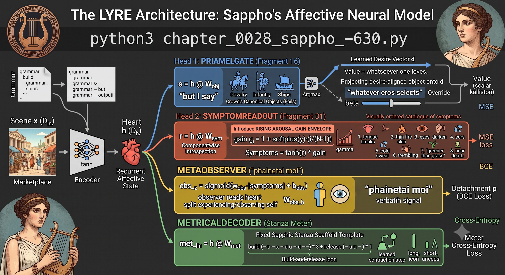

**Architecture — *LYRE — Eros-Indexed Recurrence***  ·  🟢 **belief** — grounded in the figure's own surviving works

Desire-indexed valuation: value is a *pointer aimed by eros* that overrides the crowd's fixed catalogue of worth (Fr. 16), fused with a third-person introspective decomposition of the self into an ordered, escalating catalogue of felt states.

▶️ **Run the mind:** [`minds/chapter_0028_sappho_-630.py`](minds/chapter_0028_sappho_-630.py)  —  `python3 minds/chapter_0028_sappho_-630.py --test`

---

## 29 · Thales of Miletus
**c. 624–546 BCE — Miletus (Greece) · Greek**  |  *Philosophy · Mathematics*

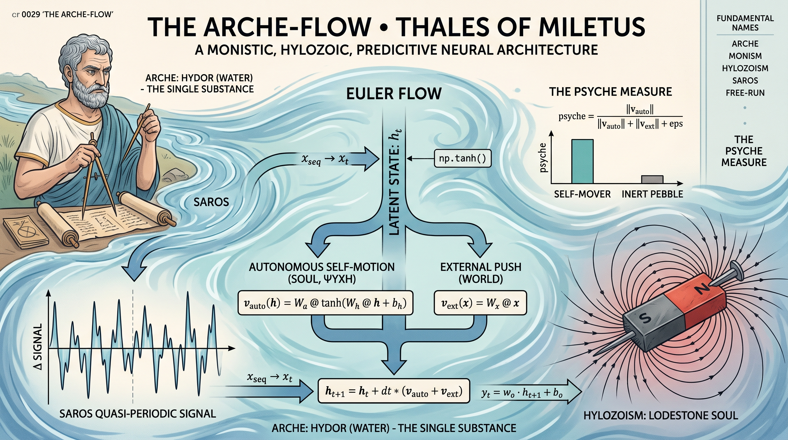

**Architecture — *The Arche-Flow***  ·  🟡 **mediated** — known only through others' accounts

Hylozoist monism: one continuous self-moving substance (water as arche) in which mind is not separate stuff but a *regime of self-originated motion* — soul is whatever moves itself (the lodestone criterion). No words of his own survive; the reading is mediated.

▶️ **Run the mind:** [`minds/chapter_0029_thales_of_miletus_-624.py`](minds/chapter_0029_thales_of_miletus_-624.py)  —  `python3 minds/chapter_0029_thales_of_miletus_-624.py --test`

---

## 30 · Aesop
**c. 620–564 BCE — Greece · Greek**  |  *Literature · Fable*

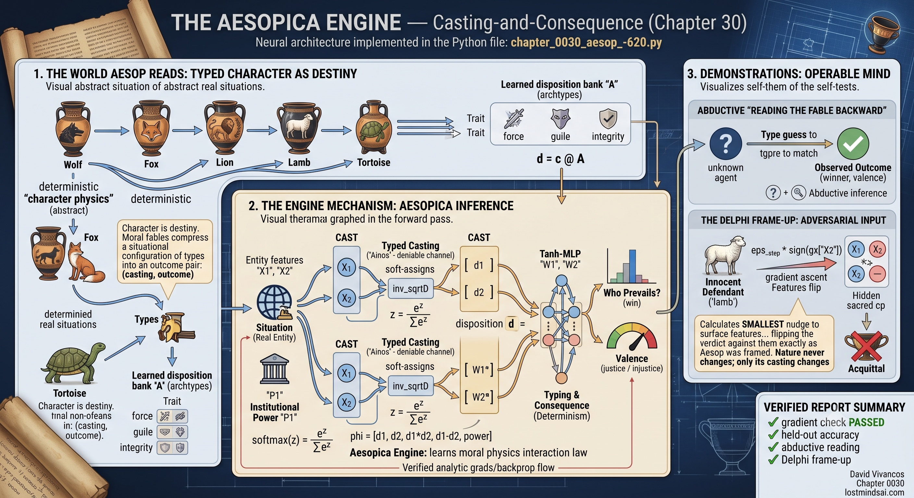

**Architecture — *The Aesopica Engine***  ·  🟢 **belief** — grounded in the figure's own surviving works

Casting: bind each power-laden entity to one of a tiny fixed repertoire of character-types, then run the deterministic *physics of character* (force prevails; guile subverts force; institutional power tilts the field) forward to the moral.

▶️ **Run the mind:** [`minds/chapter_0030_aesop_-620.py`](minds/chapter_0030_aesop_-620.py)  —  `python3 minds/chapter_0030_aesop_-620.py --test`

---

## 31 · Anaximander
**c. 610–546 BCE — Miletus, Ionia · Greek**  |  *Philosophy · Cosmology · Geography*

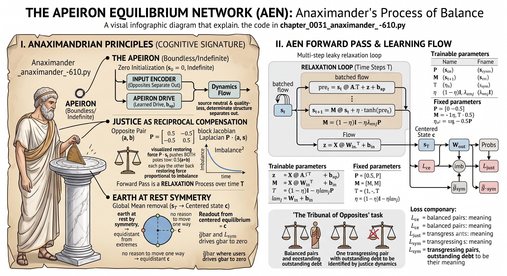

**Architecture — *The Apeiron Equilibrium Network***  ·  🟢 **belief** — grounded in the figure's own surviving works

Equilibrium-by-reciprocity: order as a self-regulating balance of opposed powers drawn from a neutral boundless source (apeiron), the Earth held still by *symmetry alone* — no sufficient reason to fall one way rather than another.

▶️ **Run the mind:** [`minds/chapter_0031_anaximander_-610.py`](minds/chapter_0031_anaximander_-610.py)  —  `python3 minds/chapter_0031_anaximander_-610.py --test`

---

## 32 · Laozi (Lao Tzu)
**c. 6th c. BCE — China · Chinese**  |  *Philosophy*

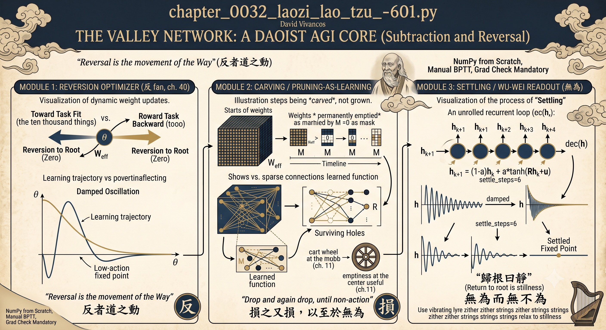

**Architecture — *The Valley Network***  ·  🟢 **belief** — grounded in the figure's own surviving works

The mind should be *empty like a valley* (xu); wu wei is action through non-conceptual natural response — competence that arises when the agent stops imposing categories and lets the situation supply the move.

▶️ **Run the mind:** [`minds/chapter_0032_laozi_lao_tzu_-601.py`](minds/chapter_0032_laozi_lao_tzu_-601.py)  —  `python3 minds/chapter_0032_laozi_lao_tzu_-601.py --test`

---

## 33 · Cyrus the Great
**r. 559–530 BCE — Persia · Persian**  |  *Governance · Statecraft · Empire*

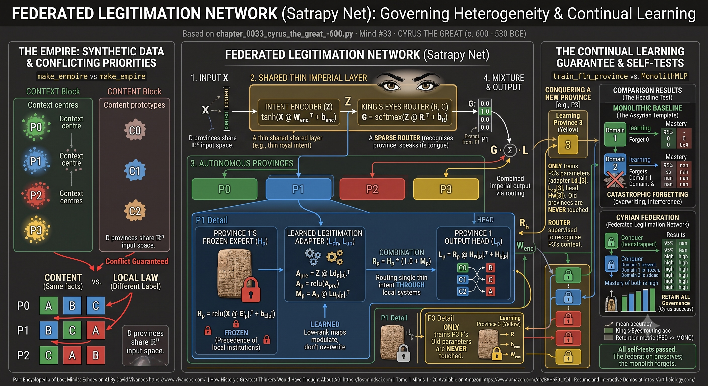

**Architecture — *The Federated Legitimation Network***  ·  🟡 **mediated** — known only through others' accounts

Empire as *federated translation*: a thin sovereign layer that preserves each conquered people's local priors and rules by re-expressing one intent in each domain's own idiom, never overwriting them into a single template.

▶️ **Run the mind:** [`minds/chapter_0033_Cyrus_the_Great_-600.py`](minds/chapter_0033_Cyrus_the_Great_-600.py)  —  `python3 minds/chapter_0033_Cyrus_the_Great_-600.py --test`

---

## 34 · Susruta
**c. 6th c. BCE — India · Indian**  |  *Medicine · Surgery*

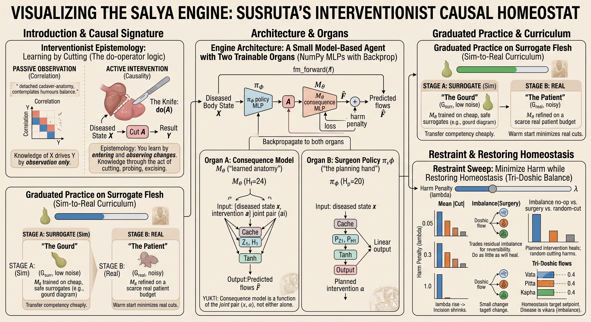

**Architecture — *The Salya Engine***  ·  🟢 **belief** — grounded in the figure's own surviving works

The interventionist surgeon: the body's causal structure is known only by *cutting into it* — intelligence as active probing, rehearsed first on surrogate flesh and disciplined by the smallest reversible incision.

▶️ **Run the mind:** [`minds/chapter_0034_susruta_-600.py`](minds/chapter_0034_susruta_-600.py)  —  `python3 minds/chapter_0034_susruta_-600.py --test`

---

## 35 · Mahavira
**c. 599–527 BCE — India · Indian**  |  *Philosophy · Asceticism*

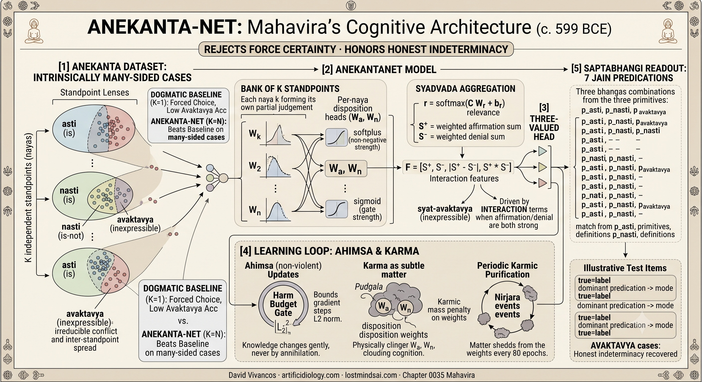

**Architecture — *Anekanta-Net***  ·  🟢 **belief** — grounded in the figure's own surviving works

Many-sidedness (anekantavada): every claim is true only from a stated standpoint (naya), so a single-viewpoint model is structurally blind — intelligence is holding multiple partial truths at once without collapsing them into one.

▶️ **Run the mind:** [`minds/chapter_0035_mahavira_-599.py`](minds/chapter_0035_mahavira_-599.py)  —  `python3 minds/chapter_0035_mahavira_-599.py --test`

---

## 36 · Anaximenes of Miletus
**c. 586–526 BCE — Miletus (Greece) · Greek**  |  *Philosophy · Cosmology*

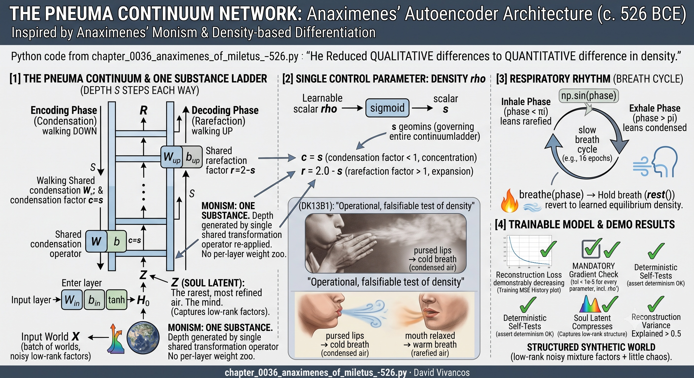

**Architecture — *The Pneuma Continuum Network***  ·  🟢 **belief** — grounded in the figure's own surviving works

One substance, graded by *density*: air/breath (pneuma) as the animating principle, all qualitative difference reduced to rarefaction and condensation on a single continuum — a monist mind that explains variety by degree, not by kind.

▶️ **Run the mind:** [`minds/chapter_0036_anaximenes_of_miletus_-526.py`](minds/chapter_0036_anaximenes_of_miletus_-526.py)  —  `python3 minds/chapter_0036_anaximenes_of_miletus_-526.py --test`

---

## 37 · Cleisthenes
**c. 570–508 BCE — Athens · Greek**  |  *Governance*

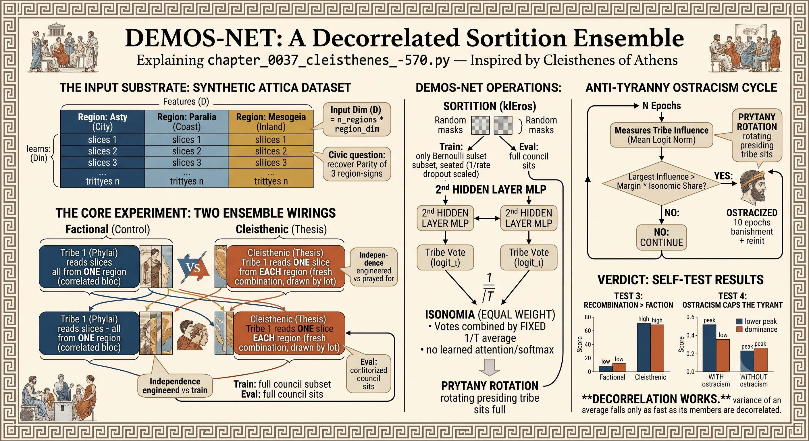

**Architecture — *Demos-Net — Decorrelated Sortition Ensemble***  ·  🔵 **extrapolated** — inferred from documented deeds

Collective intelligence is a property of the *wiring, not the parts*, and its enemy is correlation among contributors: the signature operation is to decorrelate by stratified recombination before any deliberation begins.

▶️ **Run the mind:** [`minds/chapter_0037_cleisthenes_-570.py`](minds/chapter_0037_cleisthenes_-570.py)  —  `python3 minds/chapter_0037_cleisthenes_-570.py --test`

---

## 38 · Pythagoras
**c. 570–495 BCE — Samos (Greece) · Greek**  |  *Philosophy · Mathematics*

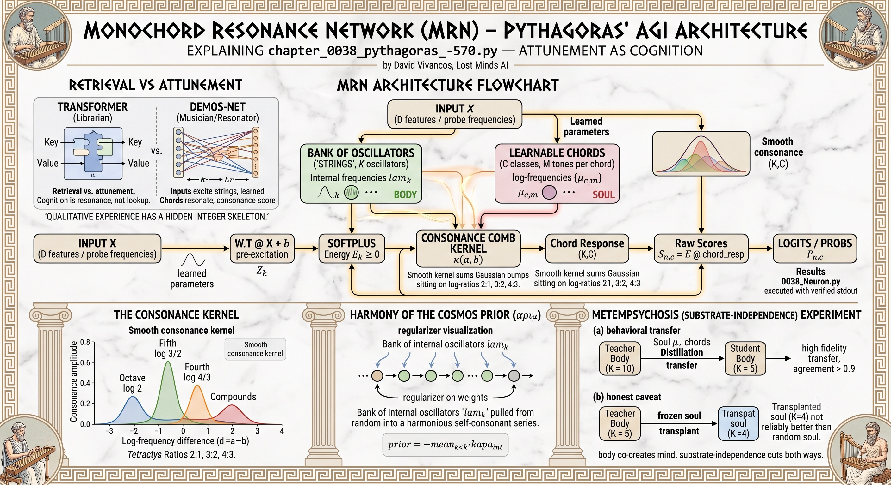

**Architecture — *The Monochord Resonance Network***  ·  🟡 **mediated** — known only through others' accounts

Mind as *attunement, not lookup*: to know is to bring the soul into the same whole-number ratio (harmonia) as the thing, so intelligence is resonance-seeking rather than retrieval. Known through his school; the reading is mediated.

▶️ **Run the mind:** [`minds/chapter_0038_pythagoras_-570.py`](minds/chapter_0038_pythagoras_-570.py)  —  `python3 minds/chapter_0038_pythagoras_-570.py --test`

---

## 39 · Gautama Buddha
**c. 563–483 BCE — Shakya (Nepal–India) · Indian**  |  *Philosophy · Meditation · Ethics*

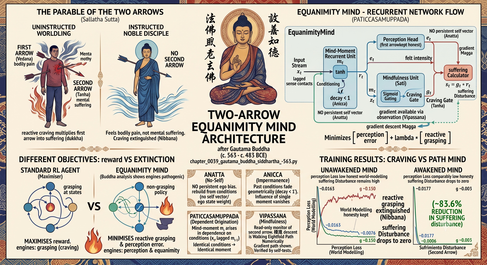

**Architecture — *The Two-Arrow Equanimity Mind***  ·  🟢 **belief** — grounded in the figure's own surviving works

Suffering as a *separable, dampable computation*: the feeling→craving (second-arrow) coupling is a learnable gate, so a mind can perceive and act with full competence while craving is driven toward zero, with no defended self to protect.

▶️ **Run the mind:** [`minds/chapter_0039_gautama_buddha_siddhartha_-563.py`](minds/chapter_0039_gautama_buddha_siddhartha_-563.py)  —  `python3 minds/chapter_0039_gautama_buddha_siddhartha_-563.py --test`

---

## 40 · Confucius (Kong Qiu)
**c. 551–479 BCE — China (Lu) · Chinese**  |  *Philosophy · Ethics · Education*

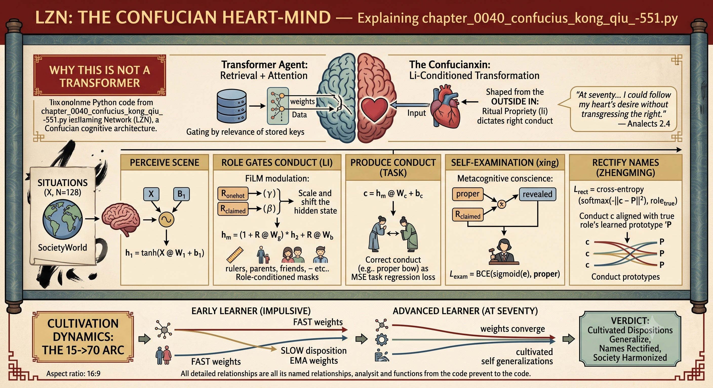

**Architecture — *The Li-Zhengming Network***  ·  🟢 **belief** — grounded in the figure's own surviving works

Order through *rectified names* (zhengming) and ritual form (li): the mind is cultivated by aligning word to role to conduct, so that calling each thing by its correct name is itself the corrective act that holds society coherent.

▶️ **Run the mind:** [`minds/chapter_0040_confucius_kong_qiu_-551.py`](minds/chapter_0040_confucius_kong_qiu_-551.py)  —  `python3 minds/chapter_0040_confucius_kong_qiu_-551.py --test`

---

## How the minds are reconstructed

Every entry is built research-first: the figure's surviving works and current scholarship are gathered and each source verified before any architecture is written. Where evidence is thin, the chapter says so rather than inventing an inner life. Each figure's **provenance** is set to one of three real values:

- 🟢 **belief** — the figure's own surviving works or recorded doctrine ground the entry.
- 🟡 **mediated** — no words of their own survive; they are known only through others' (often hostile or legendary) accounts, and the entry says so.
- 🔵 **extrapolated** — no philosophy of mind survives at all; the entry is inferred from documented deeds (typical of kings and builders), and the entry says so.

Each reconstructed mind is then measured against the **[Artificiology E-AGI Barometer](https://artificiology.com/barometer.html)** — eight capability dimensions (Cognitive Processing 🧩, Embodied Cognition 🤸, World Modeling 🌍, Consciousness 👁️, Language Understanding 💭, Emotional Intelligence ❤️, Creativity ✨, Autonomy 🎯) — so a Bronze-Age lawgiver and a Hellenistic geometer can be compared on the same yardstick.

---

[← Tome 1](tome1.md) · [Repository README](readme.md) · [Tome 3 →](tome3.md)

### Read & explore
- 🌐 **Encyclopedia:** [https://lostmindsai.com](https://lostmindsai.com)
- 📖 **Tome 2 (Amazon):** [https://www.amazon.com/dp/B0H6QCQ9M7](https://www.amazon.com/dp/B0H6QCQ9M7)
- 🧪 **Interactive demos & résumé:** [https://artificiology.com/](https://artificiology.com/)
- 📊 **E-AGI Barometer:** [https://artificiology.com/barometer.html](https://artificiology.com/barometer.html)
- ✍️ **Author — David Vivancos:** [https://www.vivancos.com/](https://www.vivancos.com/)
