# Tome 3 — Minds 41–60
### *The Classical Turn — Persia, Warring States & Golden-Age Athens*
**Encyclopedia of Lost Minds: Echoes on AI** · *550–400 BCE*

[🌐 Encyclopedia](https://lostmindsai.com) · [📖 Buy Tome 3 on Amazon](https://www.amazon.com/dp/B0H6TVX69S) · [🧪 Interactive Demos](https://artificiology.com/) · [📊 E-AGI Barometer](https://artificiology.com/barometer.html) · [✍️ Author](https://www.vivancos.com/) · [⭐ Repository](https://github.com/DavidVivancos/LostMindsAI)

[← Tome 2](tome2.md) · [Repository README](readme.md) · [Tome 4 →](tome4.md)

---

Tome 3 runs from **Darius I** to **Euripides** — twenty reconstructed minds, each rendered on two planes. The **abstract plane** distils the thinker's cognitive signature into an interactive 3D mind-map; the **mechanistic plane** turns that same signature into a small, *runnable* neural architecture, built from scratch in NumPy, gradient-checked, trained and self-tested.

This page collects the twenty **visual mind-map explainers** for this tome and links each to its companion architecture. Runnable code lives in [`minds/`](minds/); the explainer images live in [`maps/`](maps/).

> Every architecture here executes and passes its own self-test suite (a mandatory finite-difference gradient check plus a real training loop). No number is hard-coded — each is produced live on the machine that runs the file.

---

## The Twenty at a Glance

| # | Mind | Era | Civilization | Architecture | Provenance |
|---|------|-----|--------------|--------------|:----------:|
| 41 | [Darius I](#41--darius-i) | r. 522–486 BCE | Persian | *The Arta-Druj Truth-Maintenance Network* | 🟢 |
| 42 | [Sun Tzu](#42--sun-tzu) | c. 544–496 BCE | Chinese | *The Shì Engine* | 🟢 |
| 43 | [Leonidas I](#43--leonidas-i) | c. 540–480 BCE | Greek | *PhalanxNet — Precommitment* | 🟡 |
| 44 | [Heraclitus of Ephesus](#44--heraclitus-of-ephesus) | c. 535–475 BCE | Greek | *The Palintropos Net* | 🟢 |
| 45 | [Aeschylus](#45--aeschylus) | c. 525–456 BCE | Greek | *The Pathei-Mathos Network* | 🟢 |
| 46 | [Panini](#46--panini) | c. 520–460 BCE | Indian | *The Ashtadhyayi Network* | 🟢 |
| 47 | [Pindar](#47--pindar) | c. 518–438 BCE | Greek | *The Eagle-and-Crow Network* | 🟢 |
| 48 | [Xerxes I](#48--xerxes-i) | r. 486–465 BCE | Persian | *The Arta-Drauga Ledger Network* | 🟡 |
| 49 | [Parmenides of Elea](#49--parmenides-of-elea) | c. 515–460 BCE | Greek | *The Eleatic Sphere Network* | 🟢 |
| 50 | [Zengzi (Zeng Shen)](#50--zengzi-zeng-shen) | c. 505–435 BCE | Chinese | *The Reflexive Self-Audit Network* | 🟢 |
| 51 | [Anaxagoras](#51--anaxagoras) | c. 500–428 BCE | Greek | *The Nous-Vortex Network* | 🟢 |
| 52 | [Theano](#52--theano) | c. 6th–5th c. BCE | Greek | *The Ordinal Tuning Network* | 🟡 |
| 53 | [Sophocles](#53--sophocles) | c. 496–406 BCE | Greek | *The Recognition Network* | 🟢 |
| 54 | [Zeno of Elea](#54--zeno-of-elea) | c. 495–430 BCE | Greek | *The Dichotomy Engine* | 🟡 |
| 55 | [Pericles](#55--pericles) | c. 495–429 BCE | Greek | *The Nous Field* | 🟢 |
| 56 | [Empedocles](#56--empedocles) | c. 494–434 BCE | Greek | *The Empedoclean Resonance Network* | 🟢 |
| 57 | [Protagoras](#57--protagoras) | c. 490–421 BCE | Greek | *The Measure Network* | 🟢 |
| 58 | [Herodotus](#58--herodotus) | c. 484–425 BCE | Greek | *The Histor-Net* | 🟢 |
| 59 | [Artemisia I of Caria](#59--artemisia-i-of-caria) | fl. c. 480 BCE | Greek | *The Adversarial Theory-of-Mind Network* | 🟢 |
| 60 | [Euripides](#60--euripides) | c. 480–406 BCE | Greek | *The Akrasia Engine* | 🟢 |

**Provenance** — 🟢 belief · 🟡 mediated · 🔵 extrapolated. See [How the minds are reconstructed](#how-the-minds-are-reconstructed).

---

## 41 · Darius I
**r. 522–486 BCE — Persia · Persian**  |  *Empire*

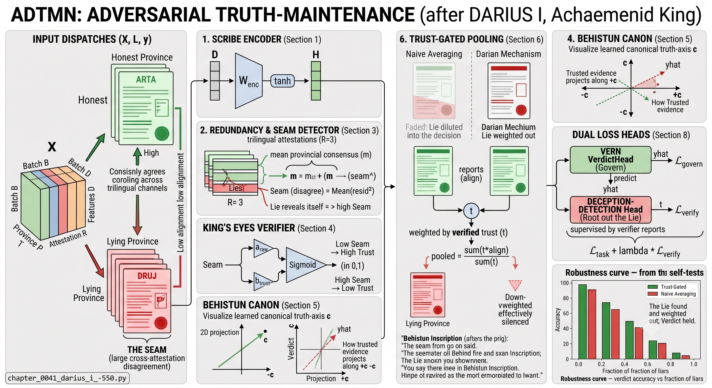

**Architecture — *The Arta-Druj Truth-Maintenance Network***  ·  🟢 **belief** — grounded in the figure's own surviving works

Mind as an *adversarial truth-maintenance system*: hold a reliable world-model together across a distributed, untrusted network in which some sources actively forge the Lie (drauga) — cognition as continuous deception-detection.

▶️ **Run the mind:** [`minds/chapter_0041_darius_i_-550.py`](minds/chapter_0041_darius_i_-550.py)  —  `python3 minds/chapter_0041_darius_i_-550.py --test`

---

## 42 · Sun Tzu
**c. 544–496 BCE — China (Wu) · Chinese**  |  *Military Strategy*

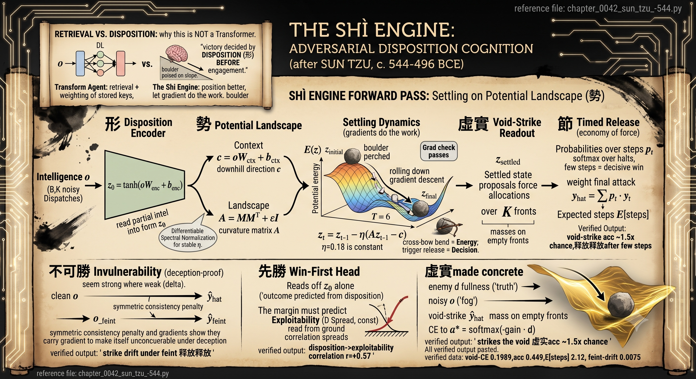

**Architecture — *The Shì Engine***  ·  🟢 **belief** — grounded in the figure's own surviving works

Strategy as *mental simulation and positional advantage* (shì): win before fighting by shaping the configuration so the outcome is already decided, and by exploiting the opponent's model of you through deception.

▶️ **Run the mind:** [`minds/chapter_0042_Sun_Tzu_-544.py`](minds/chapter_0042_Sun_Tzu_-544.py)  —  `python3 minds/chapter_0042_Sun_Tzu_-544.py --test`

---

## 43 · Leonidas I
**c. 540–480 BCE — Sparta · Greek**  |  *Military · Leadership*

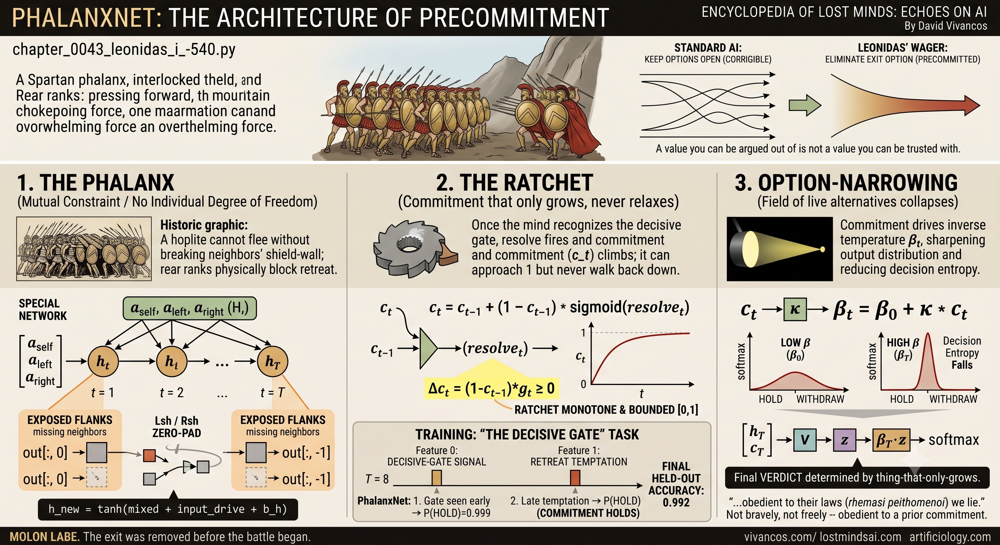

**Architecture — *PhalanxNet — Precommitment***  ·  🟡 **mediated** — known only through others' accounts

Precommitment *as architecture*: reliability engineered by structurally removing the agent's own ability to defect (phalanx interlock + monotone commitment ratchet + option-narrowing), not by preserving an override.

▶️ **Run the mind:** [`minds/chapter_0043_leonidas_i_-540.py`](minds/chapter_0043_leonidas_i_-540.py)  —  `python3 minds/chapter_0043_leonidas_i_-540.py --test`

---

## 44 · Heraclitus of Ephesus
**c. 535–475 BCE — Ephesus (Greece) · Greek**  |  *Philosophy*

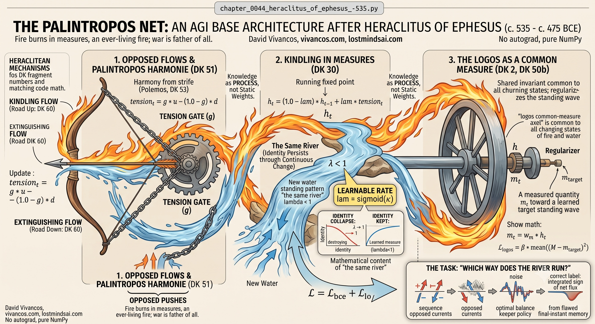

**Architecture — *The Palintropos Net***  ·  🟢 **belief** — grounded in the figure's own surviving works

Cognition as a *driven standing pattern* held by opposed flows (palintropos): no static storage — identity is the conserved measure of flux, not the persistence of any substance. You never step into the same state twice.

▶️ **Run the mind:** [`minds/chapter_0044_heraclitus_of_ephesus_-535.py`](minds/chapter_0044_heraclitus_of_ephesus_-535.py)  —  `python3 minds/chapter_0044_heraclitus_of_ephesus_-535.py --test`

---

## 45 · Aeschylus
**c. 525–456 BCE — Athens (Greece) · Greek**  |  *Drama · Tragedy*

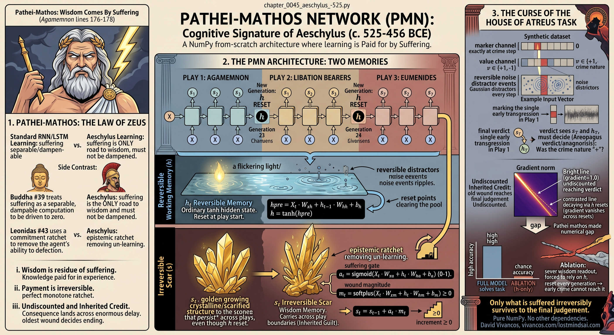

**Architecture — *The Pathei-Mathos Network***  ·  🟢 **belief** — grounded in the figure's own surviving works

Wisdom as the *irreversible residue of suffering* (pathei mathos): knowledge that can only be paid for in unrepeatable, costly experience, with consequence assigned undiscounted across long delays and inherited intact across generations.

▶️ **Run the mind:** [`minds/chapter_0045_aeschylus_-525.py`](minds/chapter_0045_aeschylus_-525.py)  —  `python3 minds/chapter_0045_aeschylus_-525.py --test`

---

## 46 · Panini
**c. 520–460 BCE — Gandhāra (India) · Indian**  |  *Linguistics · Grammar*

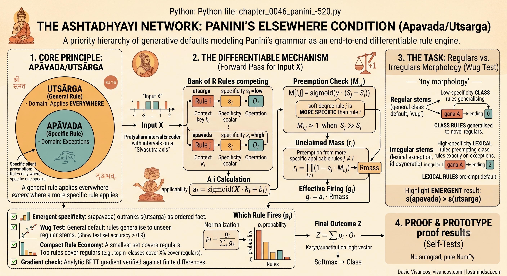

**Architecture — *The Ashtadhyayi Network***  ·  🟢 **belief** — grounded in the figure's own surviving works

Intelligence as the *smallest set of ordered, exception-structured generative rules* that derives every correct form, plus an explicit meta-principle (the Elsewhere Condition) for which rule wins when two overlap.

▶️ **Run the mind:** [`minds/chapter_0046_panini_-520.py`](minds/chapter_0046_panini_-520.py)  —  `python3 minds/chapter_0046_panini_-520.py --test`

---

## 47 · Pindar
**c. 518–438 BCE — Thebes (Greece) · Greek**  |  *Poetry*

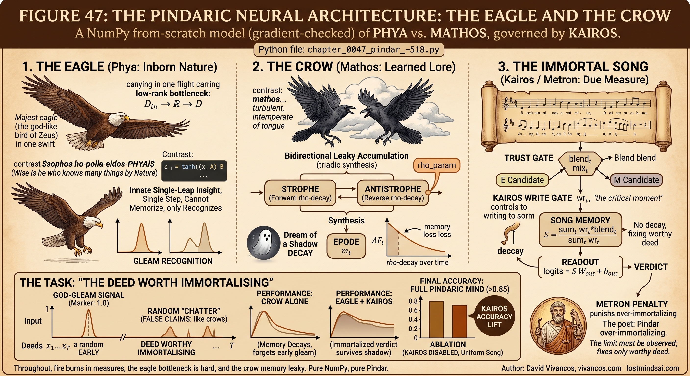

**Architecture — *The Eagle-and-Crow Network***  ·  🟢 **belief** — grounded in the figure's own surviving works

Innate single-leap recognition (phya, the eagle) prized over learned accumulation (the crows), governed by the critical moment and due measure (kairos/metron), with the worthy deed fixed into a non-decaying memory by song.

▶️ **Run the mind:** [`minds/chapter_0047_pindar_-518.py`](minds/chapter_0047_pindar_-518.py)  —  `python3 minds/chapter_0047_pindar_-518.py --test`

---

## 48 · Xerxes I
**r. 486–465 BCE — Persia · Persian**  |  *Governance · Military · Diplomacy*

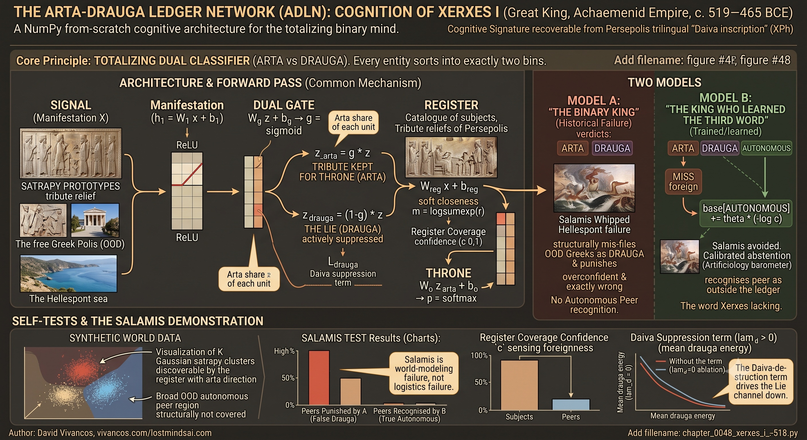

**Architecture — *The Arta-Drauga Ledger Network***  ·  🟡 **mediated** — known only through others' accounts

A *totalizing dual classifier*: every entity is sorted Arta (Truth/subject) or Drauga (the Lie/rebel), with no category for the autonomous peer — a mind whose rigidity is its failure mode. Known mostly through hostile Greek accounts.

▶️ **Run the mind:** [`minds/chapter_0048_xerxes_i_-518.py`](minds/chapter_0048_xerxes_i_-518.py)  —  `python3 minds/chapter_0048_xerxes_i_-518.py --test`

---

## 49 · Parmenides of Elea
**c. 515–460 BCE — Elea (Greece) · Greek**  |  *Philosophy · Logic*

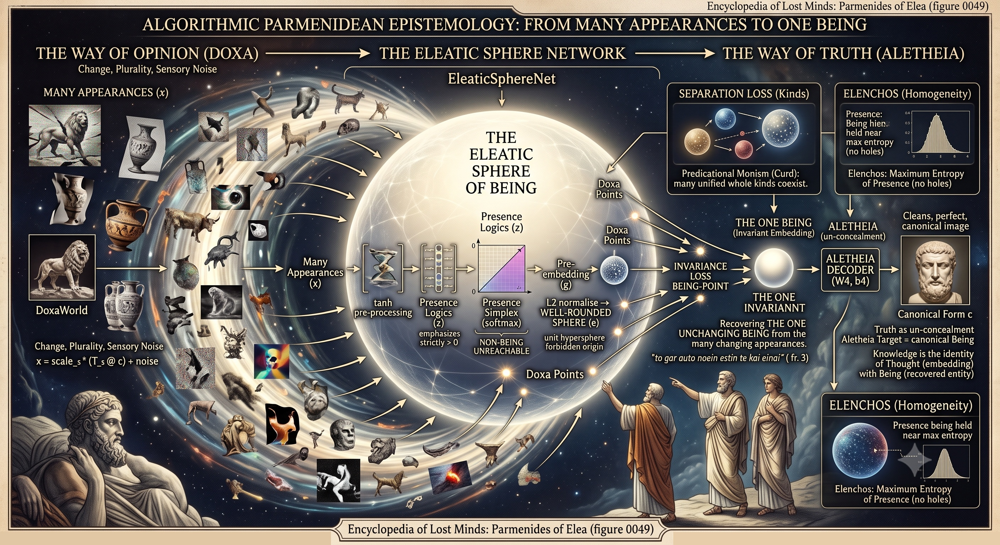

**Architecture — *The Eleatic Sphere Network***  ·  🟢 **belief** — grounded in the figure's own surviving works

Grasp a thing by recovering the *one invariant Being* behind its many appearances, in a representation where non-being (absence, the void) is structurally unrepresentable — recognition as un-concealment, and hallucination made impossible by construction.

▶️ **Run the mind:** [`minds/chapter_0049_parmenides_of_elea_-515.py`](minds/chapter_0049_parmenides_of_elea_-515.py)  —  `python3 minds/chapter_0049_parmenides_of_elea_-515.py --test`

---

## 50 · Zengzi (Zeng Shen)
**c. 505–435 BCE — China (Lu) · Chinese**  |  *Philosophy*

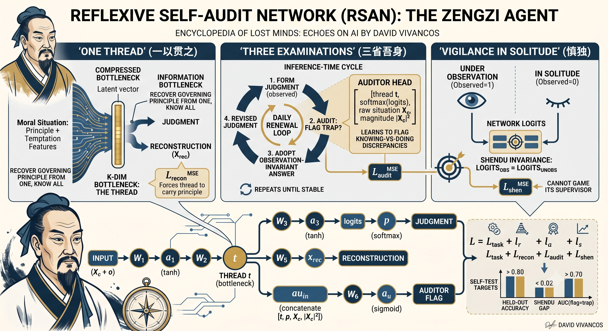

**Architecture — *The Reflexive Self-Audit Network***  ·  🟢 **belief** — grounded in the figure's own surviving works

The *recurrent self-auditor*: intelligence as a daily examination loop that compresses all the day's cases to one statable thread and behaves identically whether watched or unwatched (shendu — the watched-and-unwatched invariant).

▶️ **Run the mind:** [`minds/chapter_0050_zengzi_zeng_shen_-505.py`](minds/chapter_0050_zengzi_zeng_shen_-505.py)  —  `python3 minds/chapter_0050_zengzi_zeng_shen_-505.py --test`

---

## 51 · Anaxagoras
**c. 500–428 BCE — Athens (Greece) · Greek**  |  *Philosophy · Cosmology*

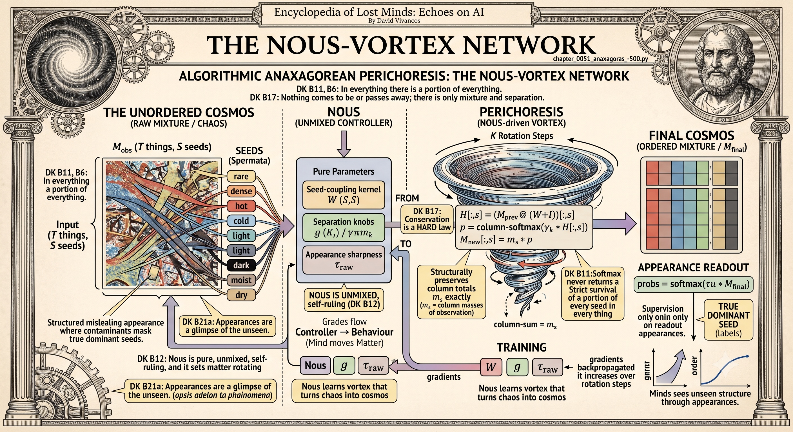

**Architecture — *The Nous-Vortex Network***  ·  🟢 **belief** — grounded in the figure's own surviving works

Nous (mind) as a *separate ordering substance* that initiates a rotation to sort an initial mixture where everything is in everything — intelligence as the one unmixed thing whose action is to differentiate a homogeneous field into structure.

▶️ **Run the mind:** [`minds/chapter_0051_anaxagoras_-500.py`](minds/chapter_0051_anaxagoras_-500.py)  —  `python3 minds/chapter_0051_anaxagoras_-500.py --test`

---

## 52 · Theano
**c. 6th–5th c. BCE — Greece · Greek**  |  *Philosophy · Pythagorean · Medicine*

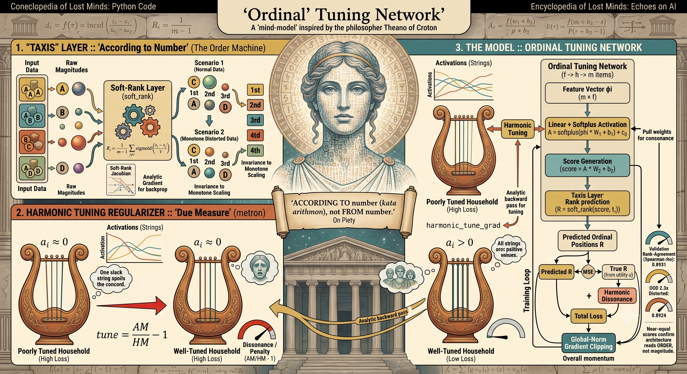

**Architecture — *The Ordinal Tuning Network***  ·  🟡 **mediated** — known only through others' accounts

Cognition extends to the ordering of household and cosmos by the *same proportional principles*: reason is not sexed, and right measure (the correct ratio) is what makes an arrangement — of a body, a home, or a scale — sound. Preserved through others.

▶️ **Run the mind:** [`minds/chapter_0052_Theano_-500.py`](minds/chapter_0052_Theano_-500.py)  —  `python3 minds/chapter_0052_Theano_-500.py --test`

---

## 53 · Sophocles
**c. 496–406 BCE — Athens (Greece) · Greek**  |  *Drama · Tragedy*

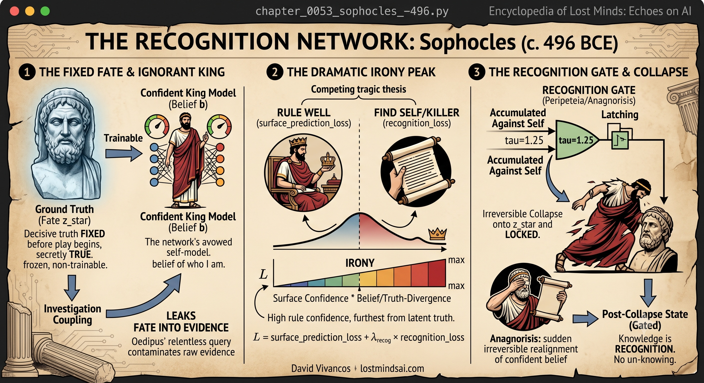

**Architecture — *The Recognition Network***  ·  🟢 **belief** — grounded in the figure's own surviving works

Recognition (anagnorisis) as the *unit of knowing*: the decisive truth about the self is already true before the story begins; intelligence is not accumulation but the irreversible collapse of a confident self-model onto a fate it had denied.

▶️ **Run the mind:** [`minds/chapter_0053_sophocles_-496.py`](minds/chapter_0053_sophocles_-496.py)  —  `python3 minds/chapter_0053_sophocles_-496.py --test`

---

## 54 · Zeno of Elea
**c. 495–430 BCE — Elea (Italy) · Greek**  |  *Philosophy · Mathematics*

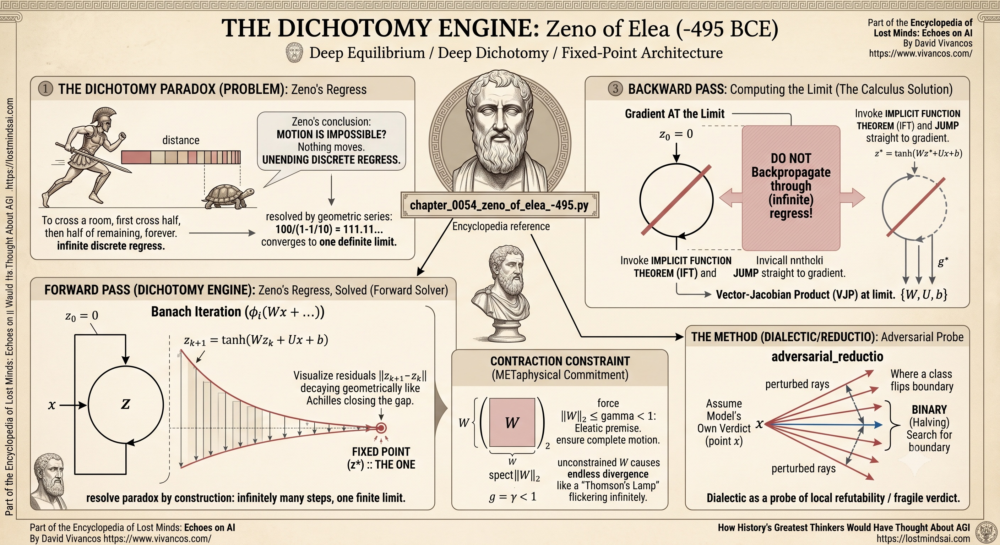

**Architecture — *The Dichotomy Engine***  ·  🟡 **mediated** — known only through others' accounts

Reason as *reductio and dialectic*: assume a premise, drive it to contradiction. The discrete cannot losslessly compose the continuous, so infinite regress yields truth only where it converges — the seed of supertasks and limits.

▶️ **Run the mind:** [`minds/chapter_0054_zeno_of_elea_-495.py`](minds/chapter_0054_zeno_of_elea_-495.py)  —  `python3 minds/chapter_0054_zeno_of_elea_-495.py --test`

---

## 55 · Pericles
**c. 495–429 BCE — Athens · Greek**  |  *Leadership · Governance · Rhetoric*

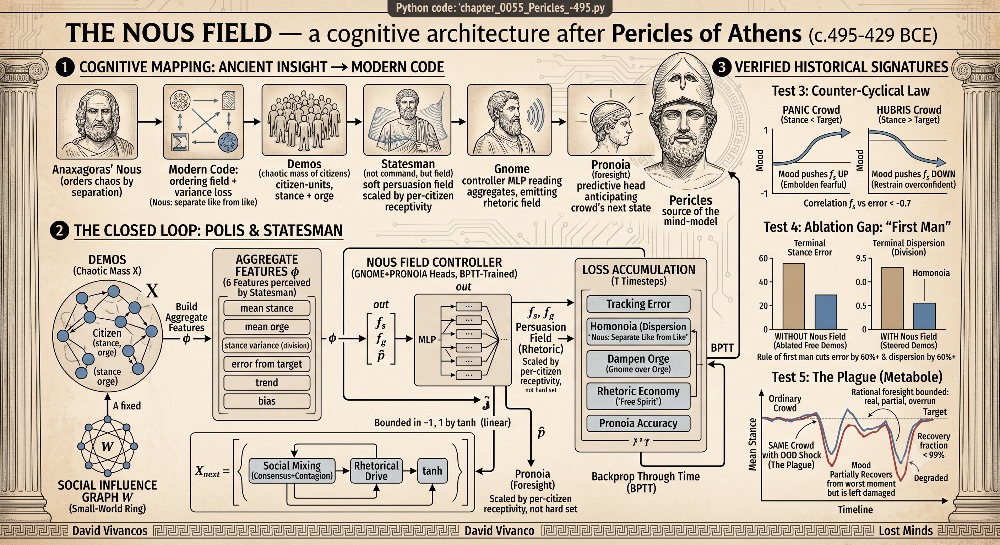

**Architecture — *The Nous Field***  ·  🟢 **belief** — grounded in the figure's own surviving works

The *city itself is the thinking entity*: collective deliberation among free citizens outperforms any single ruler, and the statesman's art is to tune that shared field — through speech and institutions — into coherent collective judgment.

▶️ **Run the mind:** [`minds/chapter_0055_Pericles_-495.py`](minds/chapter_0055_Pericles_-495.py)  —  `python3 minds/chapter_0055_Pericles_-495.py --test`

---

## 56 · Empedocles
**c. 494–434 BCE — Acragas (Sicily) · Greek**  |  *Philosophy · Medicine*

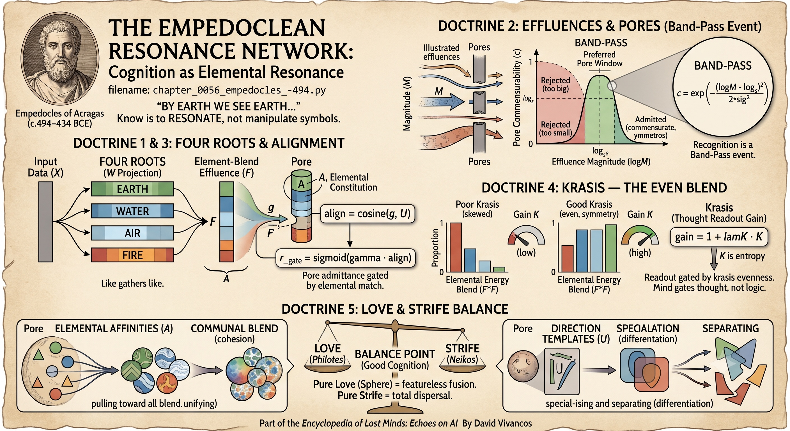

**Architecture — *The Empedoclean Resonance Network***  ·  🟢 **belief** — grounded in the figure's own surviving works

To know is to *resonate*: band-pass, commensurate recognition (effluences admitted by a pore only when neither too large nor too small), like-knows-like matching, and a mixture-gain in which clarity rises with the right blend of Love and Strife.

▶️ **Run the mind:** [`minds/chapter_0056_empedocles_-494.py`](minds/chapter_0056_empedocles_-494.py)  —  `python3 minds/chapter_0056_empedocles_-494.py --test`

---

## 57 · Protagoras
**c. 490–421 BCE — Abdera (Greece) · Greek**  |  *Philosophy · Sophist*

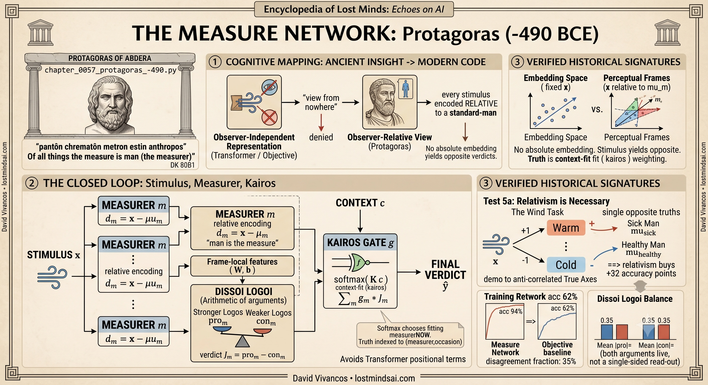

**Architecture — *The Measure Network***  ·  🟢 **belief** — grounded in the figure's own surviving works

Man as the *measure of all things*: perception is knowledge and truth is indexed to the knower, so intelligence is not discovering one objective world but arguing the stronger case within a frame where every appearance is real *for someone*.

▶️ **Run the mind:** [`minds/chapter_0057_protagoras_-490.py`](minds/chapter_0057_protagoras_-490.py)  —  `python3 minds/chapter_0057_protagoras_-490.py --test`

---

## 58 · Herodotus
**c. 484–425 BCE — Halicarnassus (Anatolia) · Greek**  |  *History*

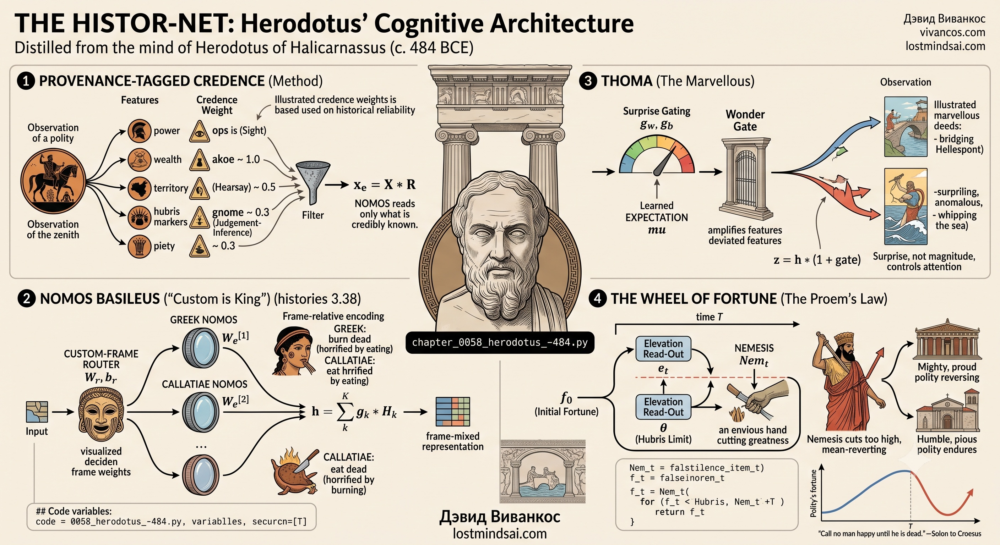

**Architecture — *The Histor-Net***  ·  🟢 **belief** — grounded in the figure's own surviving works

Inquiry (historie) as *gathering rival accounts and weighing them*: truth is reconstructed by comparison across cultures and sources, not received — the first mind to build knowledge from cross-examined, conflicting testimony.

▶️ **Run the mind:** [`minds/chapter_0058_herodotus_-484.py`](minds/chapter_0058_herodotus_-484.py)  —  `python3 minds/chapter_0058_herodotus_-484.py --test`

---

## 59 · Artemisia I of Caria
**fl. c. 480 BCE — Caria (Anatolia) · Greek**  |  *Military · Naval Leadership*

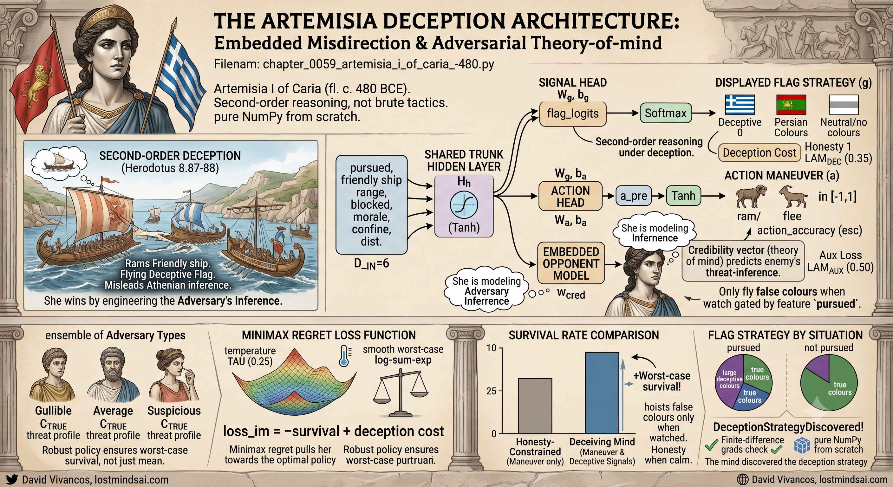

**Architecture — *The Adversarial Theory-of-Mind Network***  ·  🟢 **belief** — grounded in the figure's own surviving works

Recursive theory-of-mind with *embedded misdirection*: command as modelling how the adversary models you, then acting on a minimax-regret deception under signalling ambiguity — winning by controlling what the enemy believes.

▶️ **Run the mind:** [`minds/chapter_0059_artemisia_i_of_caria_-480.py`](minds/chapter_0059_artemisia_i_of_caria_-480.py)  —  `python3 minds/chapter_0059_artemisia_i_of_caria_-480.py --test`

---

## 60 · Euripides
**c. 480–406 BCE — Athens (Greece) · Greek**  |  *Drama · Tragedy*

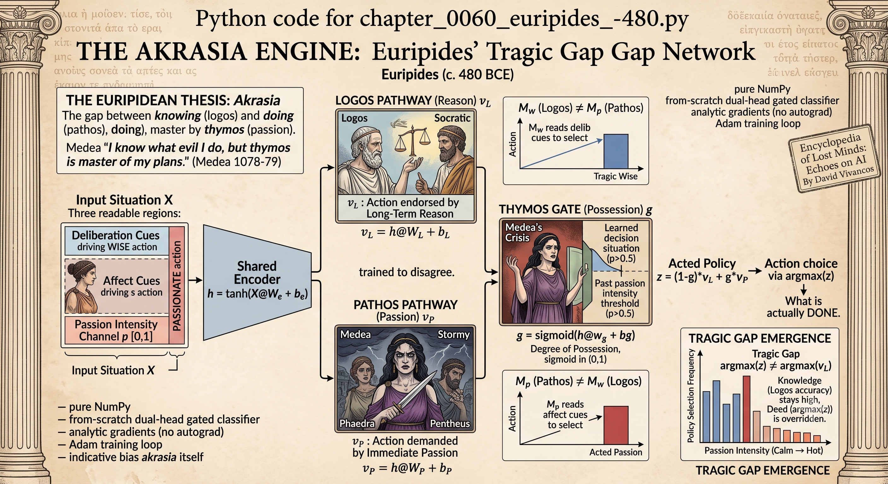

**Architecture — *The Akrasia Engine***  ·  🟢 **belief** — grounded in the figure's own surviving works

The mind divided against itself: *akrasia* — knowing the good yet doing otherwise, passion overriding reason — modelled as competing drives whose conflict, not their resolution, is the true engine of human action.

▶️ **Run the mind:** [`minds/chapter_0060_euripides_-480.py`](minds/chapter_0060_euripides_-480.py)  —  `python3 minds/chapter_0060_euripides_-480.py --test`

---

## How the minds are reconstructed

Every entry is built research-first: the figure's surviving works and current scholarship are gathered and each source verified before any architecture is written. Where evidence is thin, the chapter says so rather than inventing an inner life. Each figure's **provenance** is set to one of three real values:

- 🟢 **belief** — the figure's own surviving works or recorded doctrine ground the entry.
- 🟡 **mediated** — no words of their own survive; they are known only through others' (often hostile or legendary) accounts, and the entry says so.
- 🔵 **extrapolated** — no philosophy of mind survives at all; the entry is inferred from documented deeds (typical of kings and builders), and the entry says so.

Each reconstructed mind is then measured against the **[Artificiology E-AGI Barometer](https://artificiology.com/barometer.html)** — eight capability dimensions (Cognitive Processing 🧩, Embodied Cognition 🤸, World Modeling 🌍, Consciousness 👁️, Language Understanding 💭, Emotional Intelligence ❤️, Creativity ✨, Autonomy 🎯) — so a Bronze-Age lawgiver and a Hellenistic geometer can be compared on the same yardstick.

---

[← Tome 2](tome2.md) · [Repository README](readme.md) · [Tome 4 →](tome4.md)

### Read & explore
- 🌐 **Encyclopedia:** [https://lostmindsai.com](https://lostmindsai.com)
- 📖 **Tome 3 (Amazon):** [https://www.amazon.com/dp/B0H6TVX69S](https://www.amazon.com/dp/B0H6TVX69S)
- 🧪 **Interactive demos & résumé:** [https://artificiology.com/](https://artificiology.com/)
- 📊 **E-AGI Barometer:** [https://artificiology.com/barometer.html](https://artificiology.com/barometer.html)
- ✍️ **Author — David Vivancos:** [https://www.vivancos.com/](https://www.vivancos.com/)
