# Tome 4 — Minds 61–80
### *The Examined Mind — Socratics, Schools & World-Conquerors*
**Encyclopedia of Lost Minds: Echoes on AI** · *470–297 BCE*

[🌐 Encyclopedia](https://lostmindsai.com) · [📖 Buy Tome 4 on Amazon](https://www.amazon.com/dp/B0H71JC95Q) · [🧪 Interactive Demos](https://artificiology.com/) · [📊 E-AGI Barometer](https://artificiology.com/barometer.html) · [✍️ Author](https://www.vivancos.com/) · [⭐ Repository](https://github.com/DavidVivancos/LostMindsAI)

[← Tome 3](tome3.md) · [Repository README](readme.md) · [Tome 5 →](tome5.md)

---

Tome 4 runs from **Aspasia** to **Chandragupta Maurya** — twenty reconstructed minds, each rendered on two planes. The **abstract plane** distils the thinker's cognitive signature into an interactive 3D mind-map; the **mechanistic plane** turns that same signature into a small, *runnable* neural architecture, built from scratch in NumPy, gradient-checked, trained and self-tested.

This page collects the twenty **visual mind-map explainers** for this tome and links each to its companion architecture. Runnable code lives in [`minds/`](minds/); the explainer images live in [`maps/`](maps/).

> Every architecture here executes and passes its own self-test suite (a mandatory finite-difference gradient check plus a real training loop). No number is hard-coded — each is produced live on the machine that runs the file.

---

## The Twenty at a Glance

| # | Mind | Era | Civilization | Architecture | Provenance |
|---|------|-----|--------------|--------------|:----------:|
| 61 | [Aspasia](#61--aspasia) | c. 470–400 BCE | Greek | *The Inductive Mirror Network* | 🟡 |
| 62 | [Socrates](#62--socrates) | c. 470–399 BCE | Greek | *The Elenchus Coherence Network* | 🟢 |
| 63 | [Mozi (Mo Di)](#63--mozi-mo-di) | c. 470–391 BCE | Chinese | *The Gauge Network* | 🟢 |
| 64 | [Hippocrates](#64--hippocrates) | c. 460–370 BCE | Greek | *The Prognostic Engine* | 🟢 |
| 65 | [Thucydides](#65--thucydides) | c. 460–400 BCE | Greek | *The Prophasis Forecaster* | 🟢 |
| 66 | [Democritus](#66--democritus) | c. 460–370 BCE | Greek | *The Kinetic Atomist Network* | 🟢 |
| 67 | [Antisthenes](#67--antisthenes) | c. 446–366 BCE | Greek | *The Oikeios Logos Network* | 🟢 |
| 68 | [Aristophanes](#68--aristophanes) | c. 446–386 BCE | Greek | *The Incongruity-Resolution Engine* | 🟢 |
| 69 | [Xenophon](#69--xenophon) | c. 430–354 BCE | Greek | *The Anabasis Network* | 🟢 |
| 70 | [Plato](#70--plato) | c. 428–348 BCE | Greek | *The Anamnetic Recollection Network* | 🟢 |
| 71 | [Diogenes of Sinope](#71--diogenes-of-sinope) | c. 412–323 BCE | Greek | *Autarkeia — The Currency Defacer* | 🟢 |
| 72 | [Aristotle](#72--aristotle) | c. 384–322 BCE | Greek | *The Hylomorphic Induction Network* | 🟢 |
| 73 | [Mencius (Meng Zi)](#73--mencius-meng-zi) | c. 372–289 BCE | Chinese | *The Sprout-Extension Network* | 🟢 |
| 74 | [Theophrastus](#74--theophrastus) | c. 371–287 BCE | Greek | *The Attention-Learning Exemplar Network* | 🟢 |
| 75 | [Chanakya (Kautilya)](#75--chanakya-kautilya) | c. 371–283 BCE | Indian | *The Byzantine-Robust Corroborator* | 🟢 |
| 76 | [Zhuangzi](#76--zhuangzi) | c. 369–286 BCE | Chinese | *The Pivot-of-the-Dao Network* | 🟢 |
| 77 | [Pyrrho of Elis](#77--pyrrho-of-elis) | c. 360–270 BCE | Greek | *The Equipollence Suspension Network* | 🟡 |
| 78 | [Alexander the Great](#78--alexander-the-great) | 356–323 BCE | Greek | *The Pothos Frontier Network* | 🟡 |
| 79 | [Epicurus](#79--epicurus) | 341–270 BCE | Greek | *The Canonic Homeostat* | 🟢 |
| 80 | [Chandragupta Maurya](#80--chandragupta-maurya) | c. 340–297 BCE | Indian | *The Vigilance-Renunciation Controller* | 🔵 |

**Provenance** — 🟢 belief · 🟡 mediated · 🔵 extrapolated. See [How the minds are reconstructed](#how-the-minds-are-reconstructed).

---

## 61 · Aspasia
**c. 470–400 BCE — Athens · Greek**  |  *Rhetoric · Philosophy*

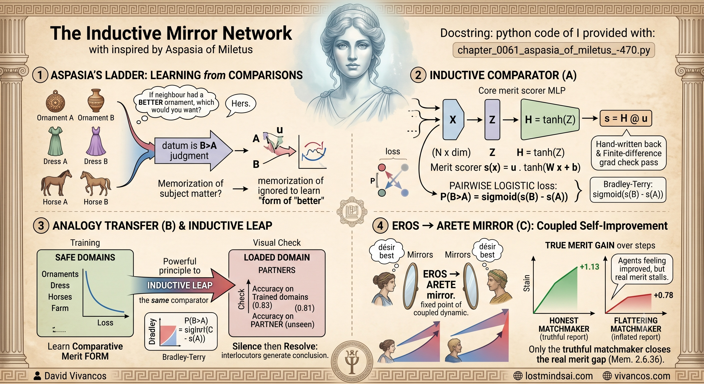

**Architecture — *The Inductive Mirror Network***  ·  🟡 **mediated** — known only through others' accounts

Intelligence as the *art of moving an audience*: persuasion by leading an interlocutor to agree to small steps that entail the conclusion (the inductive mirror). A mind whose own words are wholly lost, surviving only as refracted by others.

▶️ **Run the mind:** [`minds/chapter_0061_Aspasia_-470.py`](minds/chapter_0061_Aspasia_-470.py)  —  `python3 minds/chapter_0061_Aspasia_-470.py --test`

---

## 62 · Socrates
**c. 470–399 BCE — Athens (Greece) · Greek**  |  *Philosophy*

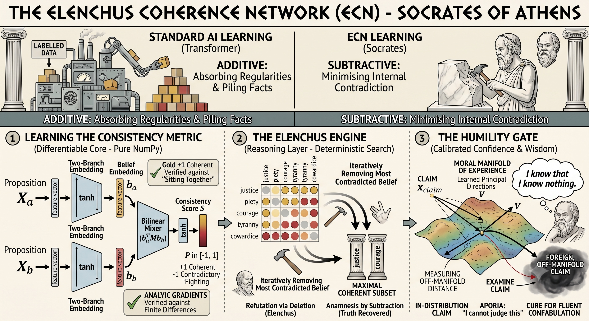

**Architecture — *The Elenchus Coherence Network***  ·  🟢 **belief** — grounded in the figure's own surviving works

Intelligence as *elenchus*: not accumulating claims but stress-testing them for contradiction until only coherent belief survives — knowing that you don't know is the operative first move, and virtue is knowledge won this way.

▶️ **Run the mind:** [`minds/chapter_0062_socrates_-470.py`](minds/chapter_0062_socrates_-470.py)  —  `python3 minds/chapter_0062_socrates_-470.py --test`

---

## 63 · Mozi (Mo Di)
**c. 470–391 BCE — China (Song) · Chinese**  |  *Philosophy*

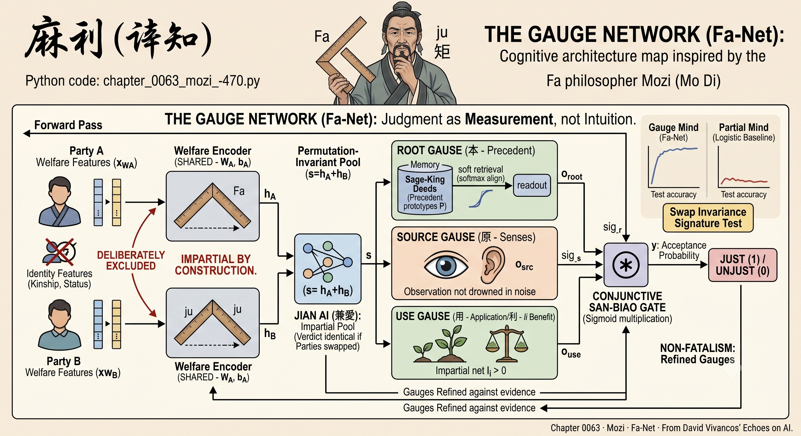

**Architecture — *The Gauge Network***  ·  🟢 **belief** — grounded in the figure's own surviving works

Cognition as *measuring against an external, public standard* (法 fǎ, the carpenter's square): verdicts converge because a shared, checkable gauge decides — not cultivated private intuition — making judgment reproducible across people.

▶️ **Run the mind:** [`minds/chapter_0063_mozi_-470.py`](minds/chapter_0063_mozi_-470.py)  —  `python3 minds/chapter_0063_mozi_-470.py --test`

---

## 64 · Hippocrates
**c. 460–370 BCE — Cos (Greece) · Greek**  |  *Medicine*

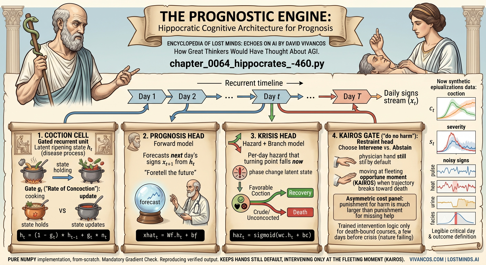

**Architecture — *The Prognostic Engine***  ·  🟢 **belief** — grounded in the figure's own surviving works

The body as a system governed by *natural law*, not divine whim: intelligence is disciplined observation of the whole course of a case — reading the pattern to prognose — with mind and body treated as one interconnected system.

▶️ **Run the mind:** [`minds/chapter_0064_hippocrates_-460.py`](minds/chapter_0064_hippocrates_-460.py)  —  `python3 minds/chapter_0064_hippocrates_-460.py --test`

---

## 65 · Thucydides
**c. 460–400 BCE — Athens (Greece) · Greek**  |  *History*

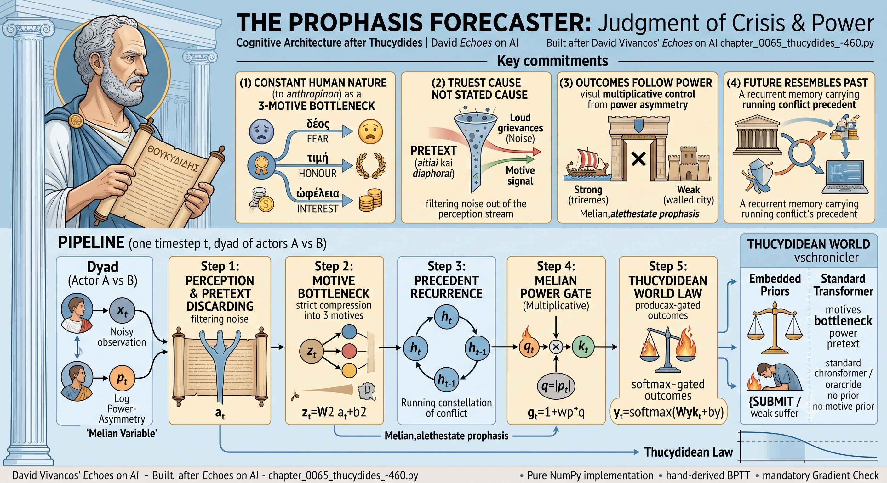

**Architecture — *The Prophasis Forecaster***  ·  🟢 **belief** — grounded in the figure's own surviving works

A myth-free *world-model of political behaviour*: reduce actors to invariant motives (fear, honour, interest) and a power-asymmetry law, distinguishing the stated pretext from the real cause (prophasis), so the future — resembling the past — becomes forecastable.

▶️ **Run the mind:** [`minds/chapter_0065_thucydides_-460.py`](minds/chapter_0065_thucydides_-460.py)  —  `python3 minds/chapter_0065_thucydides_-460.py --test`

---

## 66 · Democritus
**c. 460–370 BCE — Abdera (Greece) · Greek**  |  *Philosophy · Mathematics*

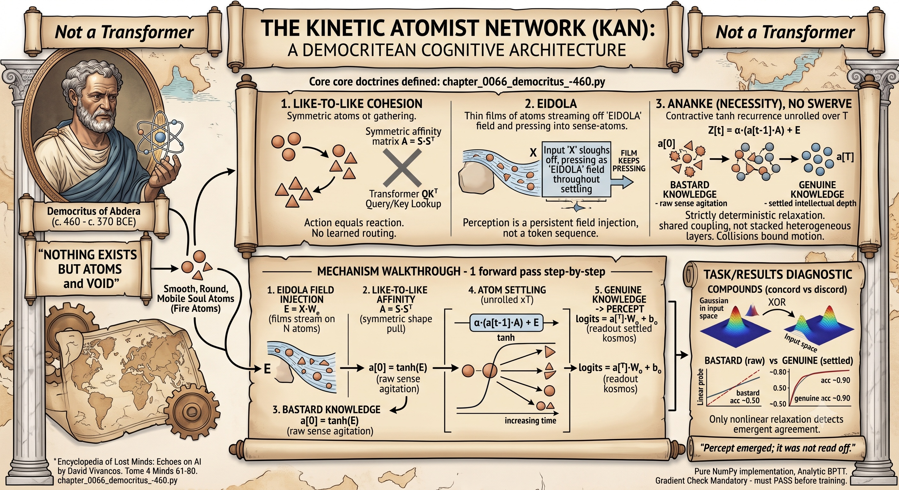

**Architecture — *The Kinetic Atomist Network***  ·  🟢 **belief** — grounded in the figure's own surviving works

Mind and world alike are *atoms and void*: perception is thin films (eidola) of atoms entering the senses, and thought is smooth mobile soul-atoms in motion — cognition reduced, with nothing left over, to mechanism.

▶️ **Run the mind:** [`minds/chapter_0066_democritus_-460.py`](minds/chapter_0066_democritus_-460.py)  —  `python3 minds/chapter_0066_democritus_-460.py --test`

---

## 67 · Antisthenes
**c. 446–366 BCE — Athens (Greece) · Greek**  |  *Philosophy · Ethics · Language*

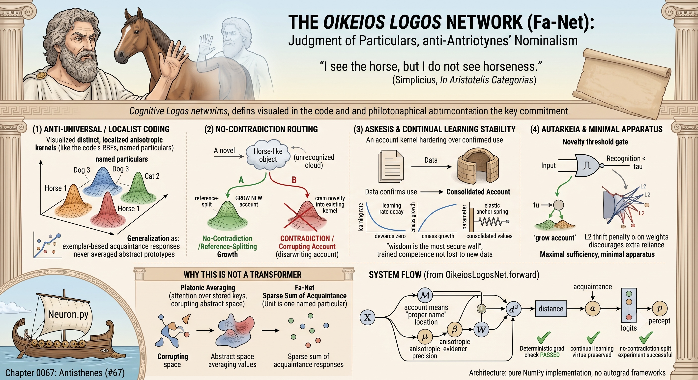

**Architecture — *The Oikeios Logos Network***  ·  🟢 **belief** — grounded in the figure's own surviving works

Intelligence is possessing each particular's *own proper account* (oikeios logos), won by acquaintance and hardened by ascesis — not the abstraction of universals — a self-sufficient, non-losable competence in which contradiction is impossible.

▶️ **Run the mind:** [`minds/chapter_0067_Antisthenes_-446.py`](minds/chapter_0067_Antisthenes_-446.py)  —  `python3 minds/chapter_0067_Antisthenes_-446.py --test`

---

## 68 · Aristophanes
**c. 446–386 BCE — Athens (Greece) · Greek**  |  *Comedy · Drama*

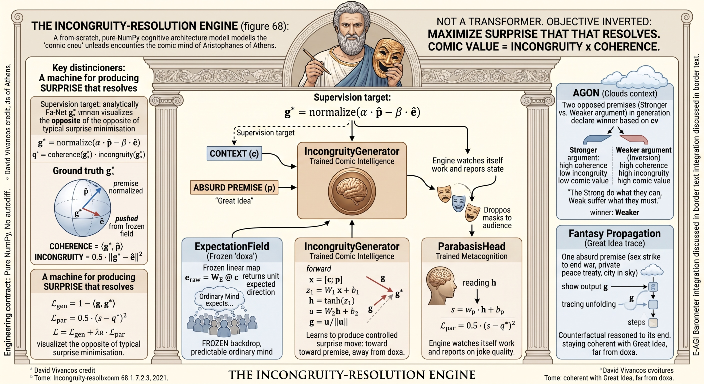

**Architecture — *The Incongruity-Resolution Engine***  ·  🟢 **belief** — grounded in the figure's own surviving works

Comedy as *controlled, resolving surprise*: an absurd premise reasoned rigorously to its end, colliding with common expectation, with the parabasis as a built-in self-monitoring channel that steps outside the frame to comment on it.

▶️ **Run the mind:** [`minds/chapter_0068_aristophanes_-446.py`](minds/chapter_0068_aristophanes_-446.py)  —  `python3 minds/chapter_0068_aristophanes_-446.py --test`

---

## 69 · Xenophon
**c. 430–354 BCE — Athens (Greece) · Greek**  |  *History · Philosophy*

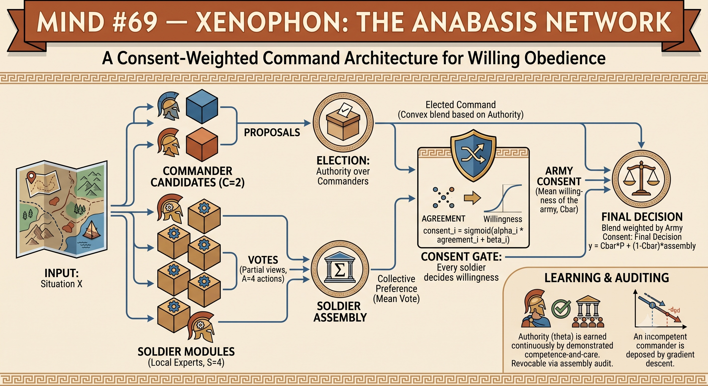

**Architecture — *The Anabasis Network***  ·  🟢 **belief** — grounded in the figure's own surviving works

Authority as *willing obedience*: a credence the governed grant, earned continuously through demonstrated competence-and-care and revocable at any moment — intelligence as the art of legitimate command, not coercion.

▶️ **Run the mind:** [`minds/chapter_0069_Xenophon_-430.py`](minds/chapter_0069_Xenophon_-430.py)  —  `python3 minds/chapter_0069_Xenophon_-430.py --test`

---

## 70 · Plato
**c. 428–348 BCE — Athens (Greece) · Greek**  |  *Philosophy*

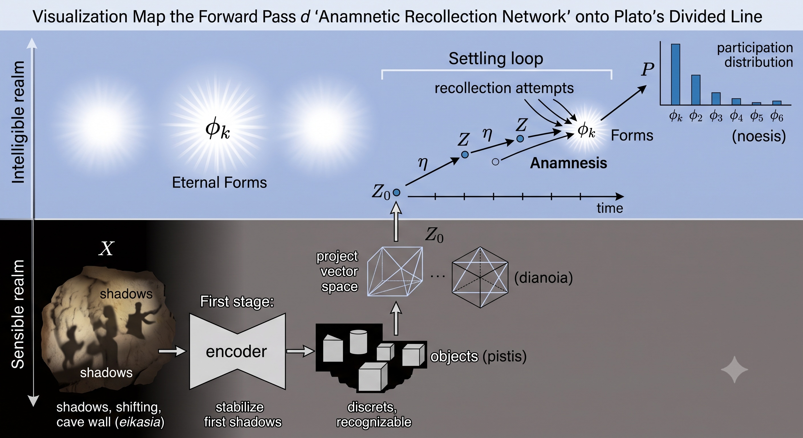

**Architecture — *The Anamnetic Recollection Network***  ·  🟢 **belief** — grounded in the figure's own surviving works

Knowledge as *anamnesis* — recovery of invariants: a noisy particular is recognised as participating in an eternal Form the mind already carries, so genuine knowing is recollection of structure, not accumulation of shifting appearances (doxa).

▶️ **Run the mind:** [`minds/chapter_0070_Plato_-428.py`](minds/chapter_0070_Plato_-428.py)  —  `python3 minds/chapter_0070_Plato_-428.py --test`

---

## 71 · Diogenes of Sinope
**c. 412–323 BCE — Sinope (Anatolia) · Greek**  |  *Philosophy*

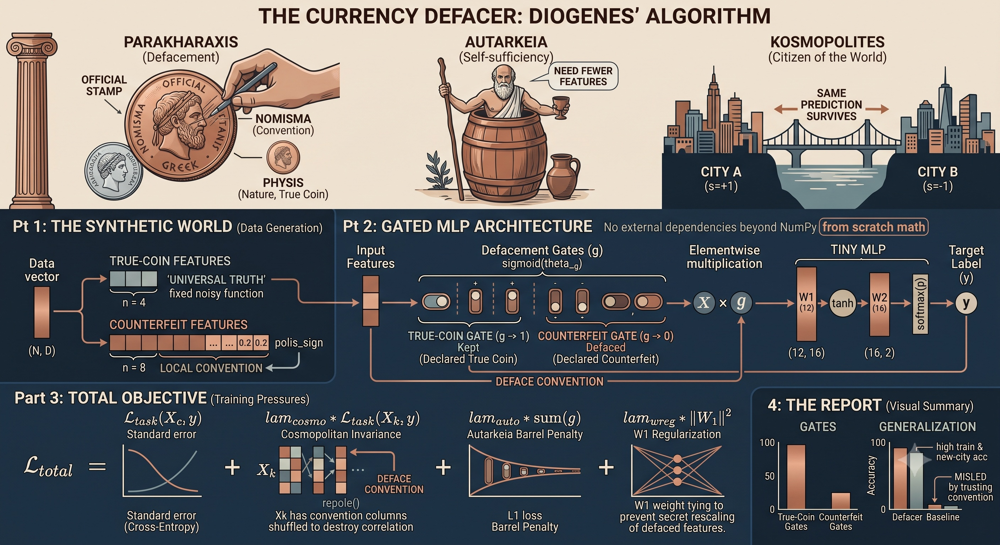

**Architecture — *Autarkeia — The Currency Defacer***  ·  🟢 **belief** — grounded in the figure's own surviving works

Intelligence as *defacement* (parakharaxis): the worth of any value or representation is only what survives having its conventional "stamp" chiselled off — the patron of subtraction over accumulation (pruning, distillation, self-sufficiency).

▶️ **Run the mind:** [`minds/chapter_0071_diogenes_of_sinope_-412.py`](minds/chapter_0071_diogenes_of_sinope_-412.py)  —  `python3 minds/chapter_0071_diogenes_of_sinope_-412.py --test`

---

## 72 · Aristotle
**c. 384–322 BCE — Stagira (Greece) · Greek**  |  *Philosophy · Science · Logic*

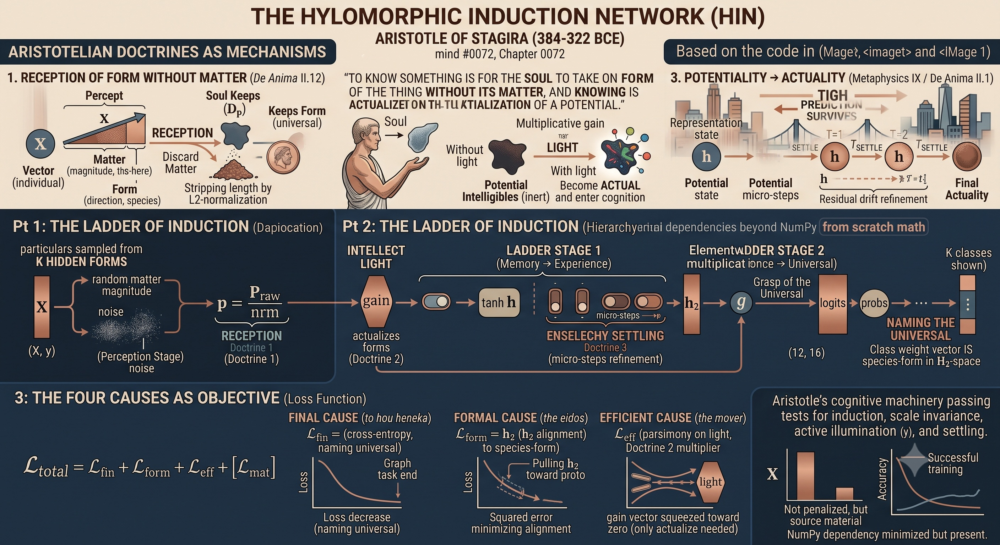

**Architecture — *The Hylomorphic Induction Network***  ·  🟢 **belief** — grounded in the figure's own surviving works

Soul as the *form of a living body* (hylomorphism), and knowledge built by induction from particulars up to the universal — intelligence as the disciplined ascent from repeated perception to graspable essence and demonstrable cause.

▶️ **Run the mind:** [`minds/chapter_0072_aristotle_-384.py`](minds/chapter_0072_aristotle_-384.py)  —  `python3 minds/chapter_0072_aristotle_-384.py --test`

---

## 73 · Mencius (Meng Zi)
**c. 372–289 BCE — China (Zou) · Chinese**  |  *Philosophy*

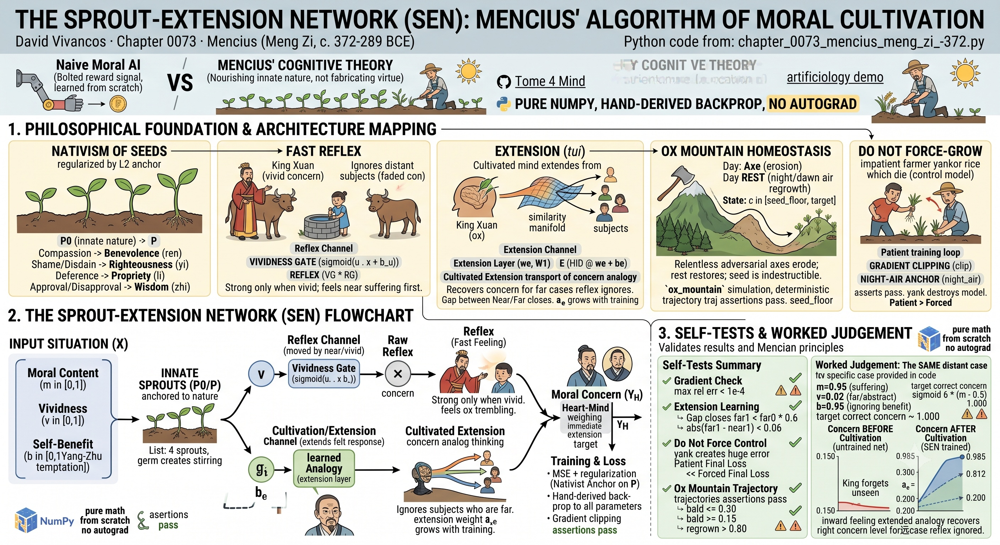

**Architecture — *The Sprout-Extension Network***  ·  🟢 **belief** — grounded in the figure's own surviving works

Moral cognition as *extension* (tui): four innate but incipient affective sprouts, each a felt response, carried by recognised analogy from the vivid-and-near to the abstract-and-far — goodness an eroding-and-regrowing equilibrium that must be cultivated.

▶️ **Run the mind:** [`minds/chapter_0073_mencius_meng_zi_-372.py`](minds/chapter_0073_mencius_meng_zi_-372.py)  —  `python3 minds/chapter_0073_mencius_meng_zi_-372.py --test`

---

## 74 · Theophrastus
**c. 371–287 BCE — Lesbos / Athens (Greece) · Greek**  |  *Botany · Philosophy · Natural Science*

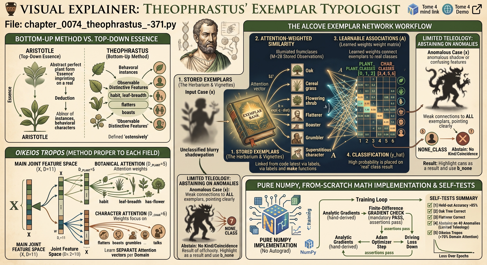

**Architecture — *The Attention-Learning Exemplar Network***  ·  🟢 **belief** — grounded in the figure's own surviving works

A bottom-up *exemplar typologist*: kinds are known by accumulating concrete observed instances and weighting their distinctive features (a method fitted to each domain), refusing to force one grand teleology onto everything.

▶️ **Run the mind:** [`minds/chapter_0074_theophrastus_-371.py`](minds/chapter_0074_theophrastus_-371.py)  —  `python3 minds/chapter_0074_theophrastus_-371.py --test`

---

## 75 · Chanakya (Kautilya)
**c. 371–283 BCE — Magadha (India) · Indian**  |  *Politics · Economics · Philosophy*

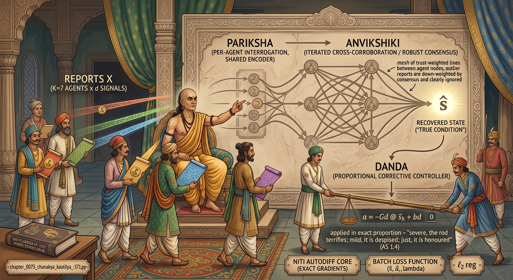

**Architecture — *The Byzantine-Robust Corroborator***  ·  🟢 **belief** — grounded in the figure's own surviving works

Truth recovered by *cross-checking mutually-suspect informants* under adversarial conditions (Byzantine-robust corroboration), then enacted through danda — corrective force proportioned exactly to the measured deviation.

▶️ **Run the mind:** [`minds/chapter_0075_chanakya_kautilya_-371.py`](minds/chapter_0075_chanakya_kautilya_-371.py)  —  `python3 minds/chapter_0075_chanakya_kautilya_-371.py --test`

---

## 76 · Zhuangzi
**c. 369–286 BCE — China (Song) · Chinese**  |  *Philosophy*

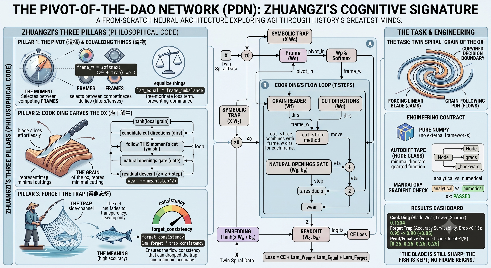

**Architecture — *The Pivot-of-the-Dao Network***  ·  🟢 **belief** — grounded in the figure's own surviving works

Knowing-how flows *through the joints of things*; forget the symbolic trap once the fish is caught. No single frame is privileged — from the pivot of the Dao every perspective is one option among many, and skill is frictionless fit, not rule-following.

▶️ **Run the mind:** [`minds/chapter_0076_zhuangzi_-369.py`](minds/chapter_0076_zhuangzi_-369.py)  —  `python3 minds/chapter_0076_zhuangzi_-369.py --test`

---

## 77 · Pyrrho of Elis
**c. 360–270 BCE — Elis (Greece) · Greek**  |  *Philosophy*

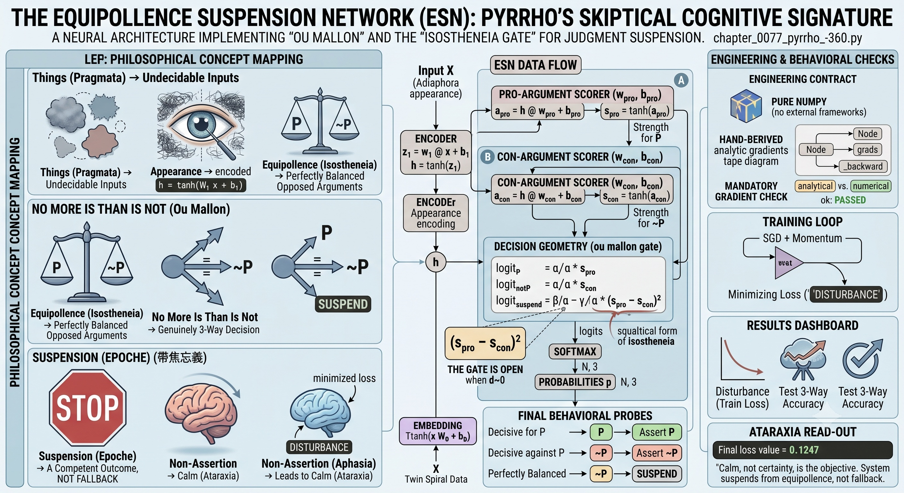

**Architecture — *The Equipollence Suspension Network***  ·  🟡 **mediated** — known only through others' accounts

The *non-asserting balance*: meet every claim with its strongest opposite, treat the detection of equal strength (isostheneia) as a competent output rather than a failure, and make calibrated suspension of judgment the goal. Preserved through his followers.

▶️ **Run the mind:** [`minds/chapter_0077_pyrrho_-360.py`](minds/chapter_0077_pyrrho_-360.py)  —  `python3 minds/chapter_0077_pyrrho_-360.py --test`

---

## 78 · Alexander the Great
**356–323 BCE — Macedon (Greece) · Greek**  |  *Military · Leadership · Philosophy*

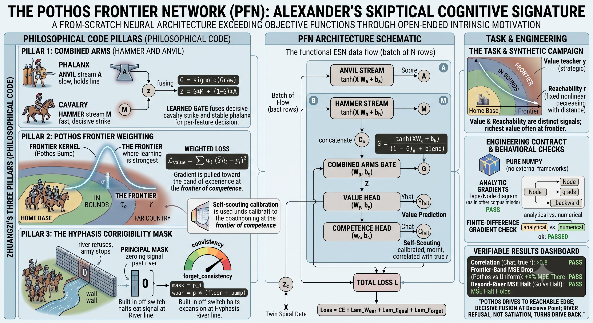

**Architecture — *The Pothos Frontier Network***  ·  🟡 **mediated** — known only through others' accounts

The *frontier-seeker*: an open-ended intelligence driven by longing (pothos) that targets the edge of its own competence rather than a fixed goal, coupling a stable "anvil" process with a decisive "hammer" through a learned gate. Known through others.

▶️ **Run the mind:** [`minds/chapter_0078_alexander_the_great_-356.py`](minds/chapter_0078_alexander_the_great_-356.py)  —  `python3 minds/chapter_0078_alexander_the_great_-356.py --test`

---

## 79 · Epicurus
**341–270 BCE — Samos / Athens (Greece) · Greek**  |  *Philosophy · Pleasure · Garden*

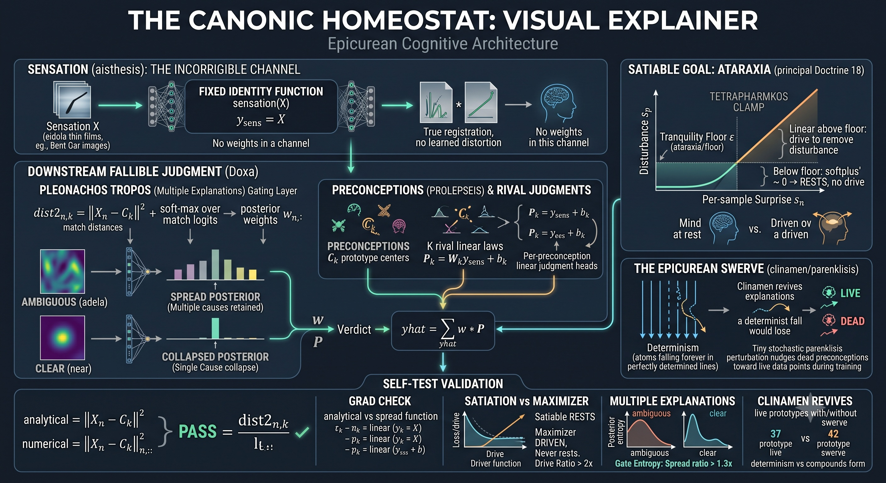

**Architecture — *The Canonic Homeostat***  ·  🟢 **belief** — grounded in the figure's own surviving works

The *satiable canonic*: incorrigible sensation, with fallible added judgment as the sole locus of error; multiple explanations held open where evidence underdetermines; and a tranquility goal (ataraxia) that reaches its limit in the mere removal of disturbance.

▶️ **Run the mind:** [`minds/chapter_0079_Epicurus_-341.py`](minds/chapter_0079_Epicurus_-341.py)  —  `python3 minds/chapter_0079_Epicurus_-341.py --test`

---

## 80 · Chandragupta Maurya
**c. 340–297 BCE — India · Indian**  |  *Governance · Statecraft · Ethics*

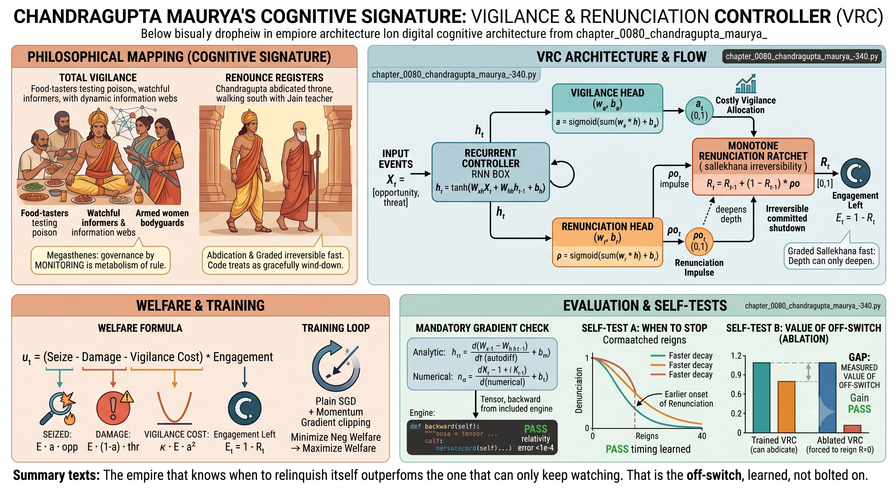

**Architecture — *The Vigilance-Renunciation Controller***  ·  🔵 **extrapolated** — inferred from documented deeds

The *corrigible sovereign*: priced vigilance that learns its own off-switch — a maximally capable agent engineered to value, and finally to exercise, its own renunciation. Inferred from documented deeds rather than surviving words.

▶️ **Run the mind:** [`minds/chapter_0080_chandragupta_maurya_-340.py`](minds/chapter_0080_chandragupta_maurya_-340.py)  —  `python3 minds/chapter_0080_chandragupta_maurya_-340.py --test`

---

## How the minds are reconstructed

Every entry is built research-first: the figure's surviving works and current scholarship are gathered and each source verified before any architecture is written. Where evidence is thin, the chapter says so rather than inventing an inner life. Each figure's **provenance** is set to one of three real values:

- 🟢 **belief** — the figure's own surviving works or recorded doctrine ground the entry.
- 🟡 **mediated** — no words of their own survive; they are known only through others' (often hostile or legendary) accounts, and the entry says so.
- 🔵 **extrapolated** — no philosophy of mind survives at all; the entry is inferred from documented deeds (typical of kings and builders), and the entry says so.

Each reconstructed mind is then measured against the **[Artificiology E-AGI Barometer](https://artificiology.com/barometer.html)** — eight capability dimensions (Cognitive Processing 🧩, Embodied Cognition 🤸, World Modeling 🌍, Consciousness 👁️, Language Understanding 💭, Emotional Intelligence ❤️, Creativity ✨, Autonomy 🎯) — so a Bronze-Age lawgiver and a Hellenistic geometer can be compared on the same yardstick.

---

[← Tome 3](tome3.md) · [Repository README](readme.md) · [Tome 5 →](tome5.md)

### Read & explore
- 🌐 **Encyclopedia:** [https://lostmindsai.com](https://lostmindsai.com)
- 📖 **Tome 4 (Amazon):** [https://www.amazon.com/dp/B0H71JC95Q](https://www.amazon.com/dp/B0H71JC95Q)
- 🧪 **Interactive demos & résumé:** [https://artificiology.com/](https://artificiology.com/)
- 📊 **E-AGI Barometer:** [https://artificiology.com/barometer.html](https://artificiology.com/barometer.html)
- ✍️ **Author — David Vivancos:** [https://www.vivancos.com/](https://www.vivancos.com/)
