# Tome 5 — Minds 81–100
### *Hellenistic Systems — Stoa, Alexandrian Science & Imperial Order*
**Encyclopedia of Lost Minds: Echoes on AI** · *334–122 BCE*

[🌐 Encyclopedia](https://lostmindsai.com) · [📖 Buy Tome 5 on Amazon](https://www.amazon.com/dp/B0H7LP5LP2) · [🧪 Interactive Demos](https://artificiology.com/) · [📊 E-AGI Barometer](https://artificiology.com/barometer.html) · [✍️ Author](https://www.vivancos.com/) · [⭐ Repository](https://github.com/DavidVivancos/LostMindsAI)

[← Tome 4](tome4.md) · [Repository README](readme.md)

---

Tome 5 runs from **Zeno of Citium** to **Liu An (Prince of Huainan)** — twenty reconstructed minds, each rendered on two planes. The **abstract plane** distils the thinker's cognitive signature into an interactive 3D mind-map; the **mechanistic plane** turns that same signature into a small, *runnable* neural architecture, built from scratch in NumPy, gradient-checked, trained and self-tested.

This page collects the twenty **visual mind-map explainers** for this tome and links each to its companion architecture. Runnable code lives in [`minds/`](minds/); the explainer images live in [`maps/`](maps/).

> Every architecture here executes and passes its own self-test suite (a mandatory finite-difference gradient check plus a real training loop). No number is hard-coded — each is produced live on the machine that runs the file.

---

## The Twenty at a Glance

| # | Mind | Era | Civilization | Architecture | Provenance |
|---|------|-----|--------------|--------------|:----------:|
| 81 | [Zeno of Citium](#81--zeno-of-citium) | c. 334–262 BCE | Greek | *The Assent-Gated Katalepsis Network* | 🟢 |
| 82 | [Cleanthes](#82--cleanthes) | c. 330–230 BCE | Greek | *The Tonos Resonance Network* | 🟢 |
| 83 | [Euclid](#83--euclid) | c. 325–270 BCE | Greek | *The Euclidean Constructor Network* | 🟢 |
| 84 | [Aristarchus of Samos](#84--aristarchus-of-samos) | c. 310–230 BCE | Greek | *The Parallax Frame-Covariance Network* | 🟢 |
| 85 | [Xunzi (Xun Kuang)](#85--xunzi-xun-kuang) | c. 310–237 BCE | Chinese | *The Suspended-Balance De-occlusion Network* | 🟢 |
| 86 | [Ashoka Maurya](#86--ashoka-maurya) | r. 268–232 BCE | Indian | *The Conscience-Gated Dharma Policy Network* | 🟢 |
| 87 | [Charaka](#87--charaka) | c. 3rd–2nd c. BCE | Indian | *The Doshic Homeostatic Controller* | 🟢 |
| 88 | [Apollonius of Rhodes](#88--apollonius-of-rhodes) | c. 295–215 BCE | Greek | *The Amechania Engine* | 🟢 |
| 89 | [Archimedes](#89--archimedes) | c. 287–212 BCE | Greek | *The Lever-and-Exhaustion Engine* | 🟢 |
| 90 | [Ctesibius of Alexandria](#90--ctesibius-of-alexandria) | c. 3rd c. BCE | Greek | *The Constant-Head Regulator Network* | 🟢 |
| 91 | [Han Feizi](#91--han-feizi) | c. 280–233 BCE | Chinese | *The Xing-Ming Verification Network* | 🟢 |
| 92 | [Chrysippus](#92--chrysippus) | c. 279–206 BCE | Greek | *The Hegemonikon* | 🟢 |
| 93 | [Eratosthenes](#93--eratosthenes) | c. 276–194 BCE | Greek | *The Gnomon Network* | 🟢 |
| 94 | [Qin Shi Huang](#94--qin-shi-huang) | 259–210 BCE | Chinese | *The Canonical Codex Network* | 🔵 |
| 95 | [Hannibal Barca](#95--hannibal-barca) | 247–183 BCE | Carthaginian | *The Adversarial Yield-Envelope Network* | 🟡 |
| 96 | [Patanjali](#96--patanjali) | c. 2nd c. BCE | Indian | *The Citta Field* | 🟢 |
| 97 | [Polybius](#97--polybius) | c. 200–118 BCE | Greek | *The Anacyclosis Dynamical Network* | 🟢 |
| 98 | [Uttaramimamsa (Brahma Sutra)](#98--uttaramimamsa-brahma-sutra) | c. 2nd c. BCE | Indian | *The Samanvaya Reconciliation Engine* | 🟢 |
| 99 | [Hipparchus](#99--hipparchus) | c. 190–120 BCE | Greek | *The Precession Engine* | 🟢 |
| 100 | [Liu An (Prince of Huainan)](#100--liu-an-prince-of-huainan) | c. 179–122 BCE | Chinese | *The Ganying Engine* | 🟢 |

**Provenance** — 🟢 belief · 🟡 mediated · 🔵 extrapolated. See [How the minds are reconstructed](#how-the-minds-are-reconstructed).

---

## 81 · Zeno of Citium
**c. 334–262 BCE — Citium (Cyprus) · Greek**  |  *Philosophy · Stoicism · Virtue*

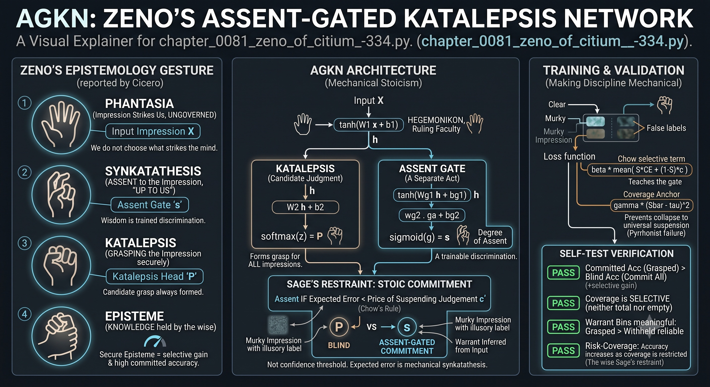

**Architecture — *The Assent-Gated Katalepsis Network***  ·  🟢 **belief** — grounded in the figure's own surviving works

The mind is a *gate*: knowledge is selective, abstaining commitment — wisdom is the trained discrimination that assents only to self-warranting (kataleptic) impressions and withholds on the rest, thereby never erring.

▶️ **Run the mind:** [`minds/chapter_0081_zeno_of_citium_-334.py`](minds/chapter_0081_zeno_of_citium_-334.py)  —  `python3 minds/chapter_0081_zeno_of_citium_-334.py --test`

---

## 82 · Cleanthes
**c. 330–230 BCE — Assos (Greece) · Greek**  |  *Philosophy · Stoicism*

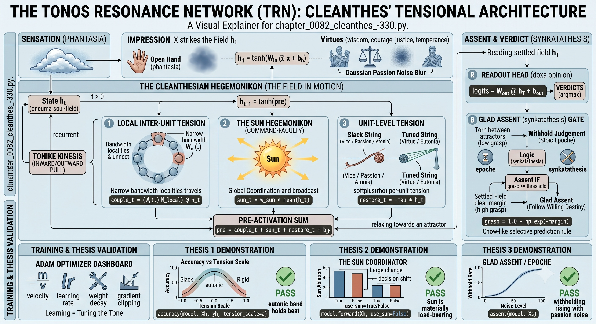

**Architecture — *The Tonos Resonance Network***  ·  🟢 **belief** — grounded in the figure's own surviving works

Soul and cosmos held together by *tension* (tonos): a single sustaining tone binds the parts into one commanding-mind, and freedom is the glad assent to providential order rather than escape from it.

▶️ **Run the mind:** [`minds/chapter_0082_cleanthes_-330.py`](minds/chapter_0082_cleanthes_-330.py)  —  `python3 minds/chapter_0082_cleanthes_-330.py --test`

---

## 83 · Euclid
**c. 325–270 BCE — Alexandria (Greece) · Greek**  |  *Mathematics*

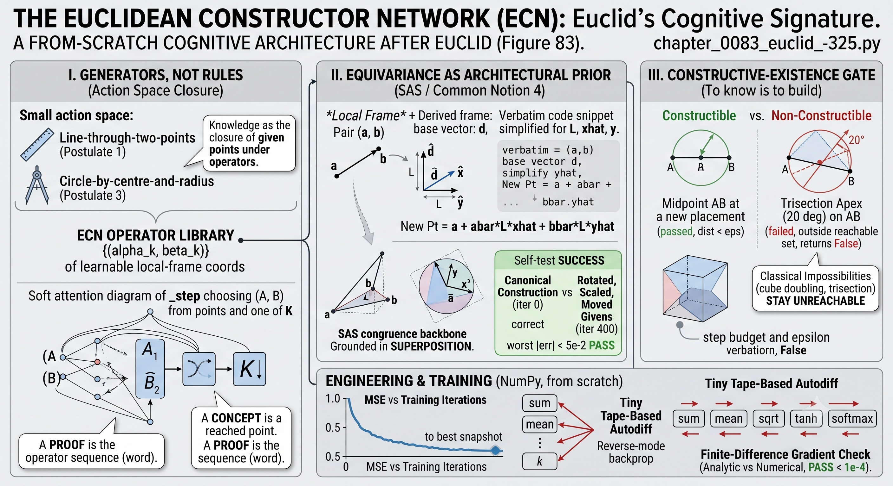

**Architecture — *The Euclidean Constructor Network***  ·  🟢 **belief** — grounded in the figure's own surviving works

*Constructive existence*: to know is to build. A claim is true when it can be constructed from a frugal, fixed operator set from stated axioms; the unbuildable is provably impossible — certainty as derivation, not observation.

▶️ **Run the mind:** [`minds/chapter_0083_euclid_-325.py`](minds/chapter_0083_euclid_-325.py)  —  `python3 minds/chapter_0083_euclid_-325.py --test`

---

## 84 · Aristarchus of Samos
**c. 310–230 BCE — Samos (Greece) · Greek**  |  *Astronomy*

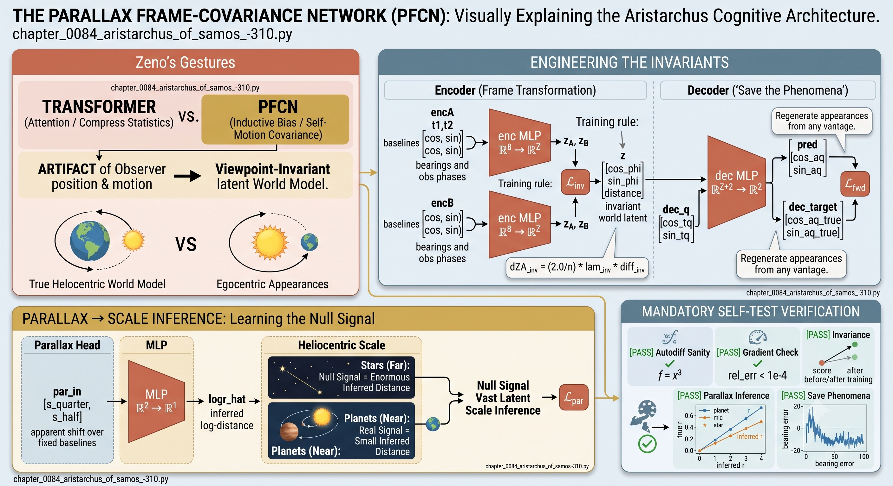

**Architecture — *The Parallax Frame-Covariance Network***  ·  🟢 **belief** — grounded in the figure's own surviving works

*Frame-covariant cognition*: truth is the description that stays invariant under the observer's own motion, and vast hidden scale is inferred from the *absence* of an expected signal (the unseen stellar parallax) — reasoning from what is not seen.

▶️ **Run the mind:** [`minds/chapter_0084_aristarchus_of_samos_-310.py`](minds/chapter_0084_aristarchus_of_samos_-310.py)  —  `python3 minds/chapter_0084_aristarchus_of_samos_-310.py --test`

---

## 85 · Xunzi (Xun Kuang)
**c. 310–237 BCE — China (Zhao) · Chinese**  |  *Philosophy*

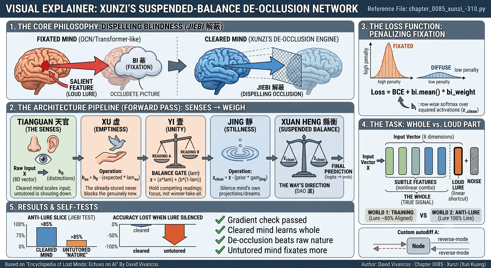

**Architecture — *The Suspended-Balance De-occlusion Network***  ·  🟢 **belief** — grounded in the figure's own surviving works

A *de-occlusion engine*: the mind as a suspended balance (xuan heng) that reaches great clarity (da qingming) by clearing one-sided fixation (bi) through emptiness, unity and stillness — bias removal as the core cognitive operation.

▶️ **Run the mind:** [`minds/chapter_0085_xunzi_-310.py`](minds/chapter_0085_xunzi_-310.py)  —  `python3 minds/chapter_0085_xunzi_-310.py --test`

---

## 86 · Ashoka Maurya
**r. 268–232 BCE — Magadha (India) · Indian**  |  *Philosophy · Empire*

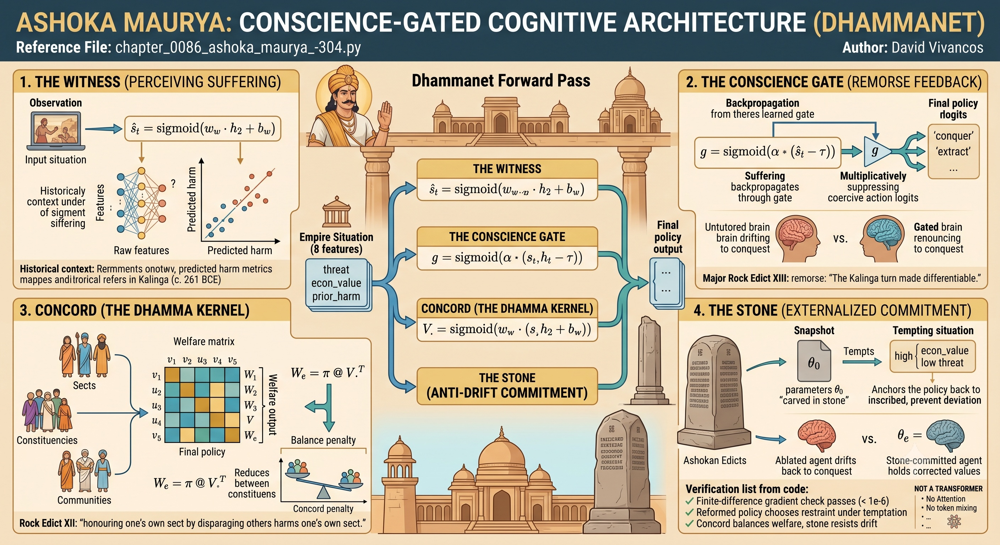

**Architecture — *The Conscience-Gated Dharma Policy Network***  ·  🟢 **belief** — grounded in the figure's own surviving works

*Remorse as backpropagated error*: a maximally powerful agent that, having discovered its own catastrophic misalignment (Kalinga), wires an un-mutable witnessed-suffering signal to gate its dominant objective — corrigibility inscribed by construction.

▶️ **Run the mind:** [`minds/chapter_0086_ashoka_maurya_-304.py`](minds/chapter_0086_ashoka_maurya_-304.py)  —  `python3 minds/chapter_0086_ashoka_maurya_-304.py --test`

---

## 87 · Charaka
**c. 3rd–2nd c. BCE — India · Indian**  |  *Medicine · Ayurveda*

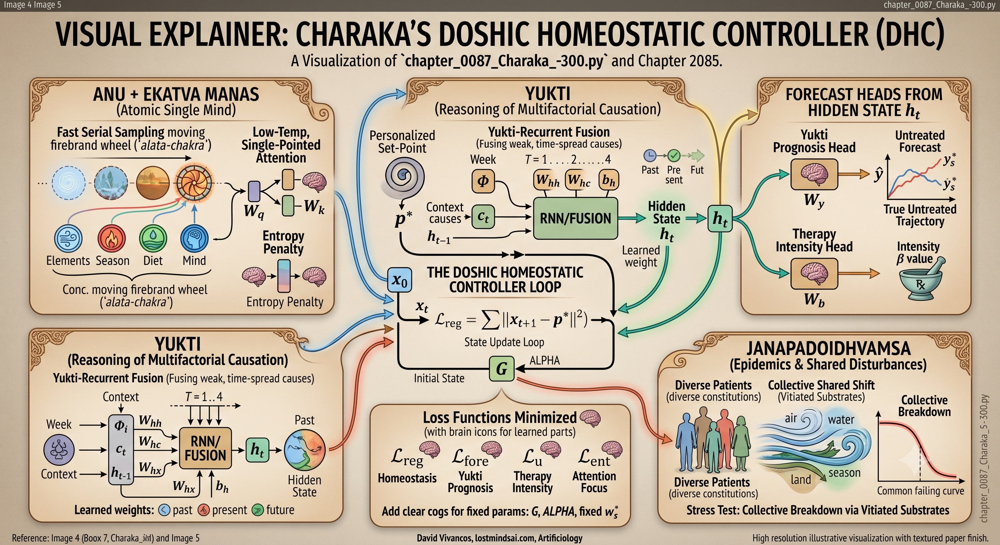

**Architecture — *The Doshic Homeostatic Controller***  ·  🟢 **belief** — grounded in the figure's own surviving works

Health as *dynamic homeostasis* across three humoral controllers (doshas): intelligence is continuous regulation back toward a personal equilibrium, with body and mind coupled as one system to be kept in balance.

▶️ **Run the mind:** [`minds/chapter_0087_Charaka_-300.py`](minds/chapter_0087_Charaka_-300.py)  —  `python3 minds/chapter_0087_Charaka_-300.py --test`

---

## 88 · Apollonius of Rhodes
**c. 295–215 BCE — Alexandria (Greece) · Greek**  |  *Poetry · Epic*

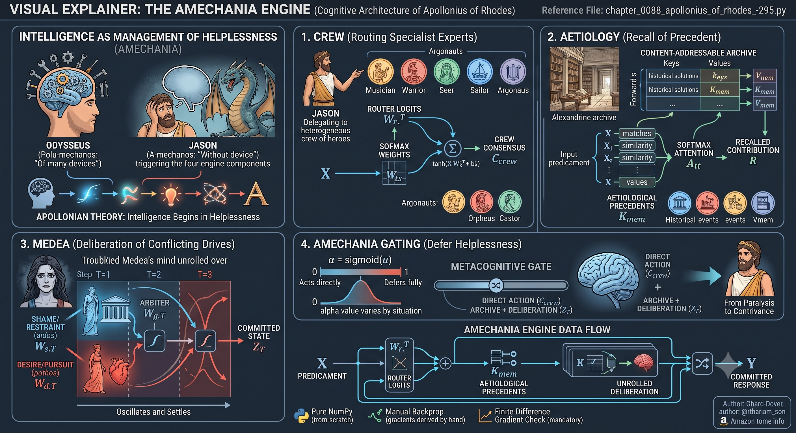

**Architecture — *The Amechania Engine***  ·  🟢 **belief** — grounded in the figure's own surviving works

Intelligence as the *management of helplessness* (amechania): delegation to a crew of specialists, retrieval from an archive of origins, probe-before-commit search, and reversible deliberation under conflicting drives — heroism recast as resource-management.

▶️ **Run the mind:** [`minds/chapter_0088_apollonius_of_rhodes_-295.py`](minds/chapter_0088_apollonius_of_rhodes_-295.py)  —  `python3 minds/chapter_0088_apollonius_of_rhodes_-295.py --test`

---

## 89 · Archimedes
**c. 287–212 BCE — Syracuse (Greece) · Greek**  |  *Mathematics · Engineering · Physics*

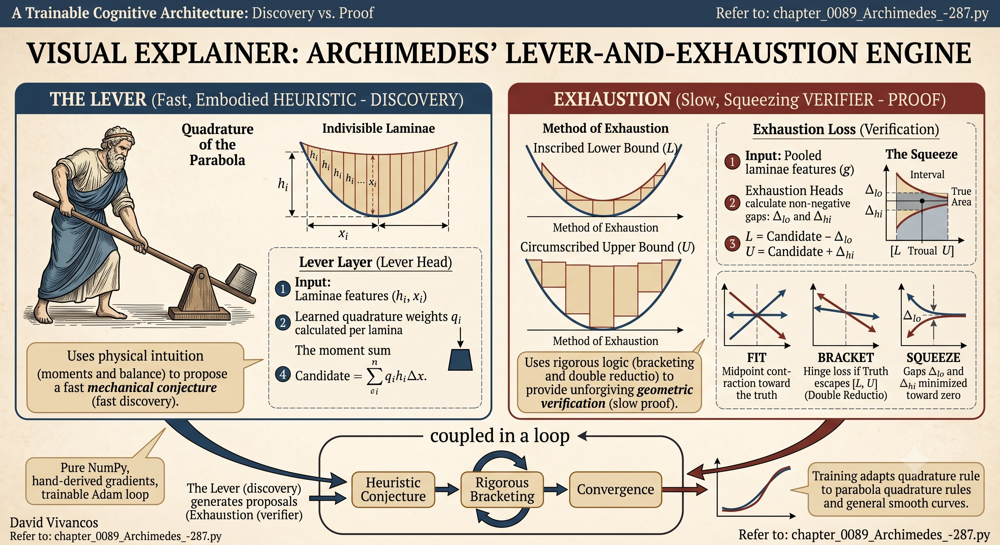

**Architecture — *The Lever-and-Exhaustion Engine***  ·  🟢 **belief** — grounded in the figure's own surviving works

A disciplined loop between a *bold mechanical heuristic* that proposes and an *unforgiving geometric verifier* that proves: truth reached not as a point but as a bracket (exhaustion) squeezed until the gap vanishes.

▶️ **Run the mind:** [`minds/chapter_0089_Archimedes_-287.py`](minds/chapter_0089_Archimedes_-287.py)  —  `python3 minds/chapter_0089_Archimedes_-287.py --test`

---

## 90 · Ctesibius of Alexandria
**c. 3rd c. BCE — Alexandria (Greece) · Greek**  |  *Engineering · Invention*

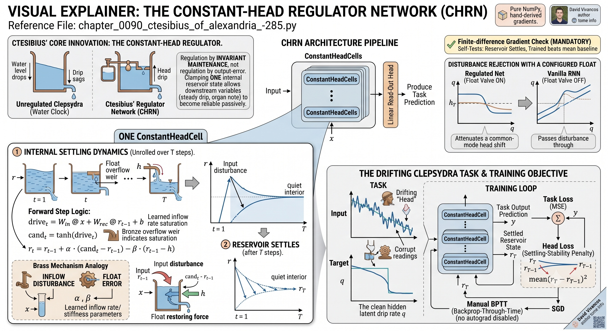

**Architecture — *The Constant-Head Regulator Network***  ·  🟢 **belief** — grounded in the figure's own surviving works

Artificial mechanisms can *emulate natural processes*: air has elasticity and stores energy, and a feedback regulator (the constant-head float) holds an output steady against disturbance — the first explicit control loop as a model of mind.

▶️ **Run the mind:** [`minds/chapter_0090_ctesibius_of_alexandria_-285.py`](minds/chapter_0090_ctesibius_of_alexandria_-285.py)  —  `python3 minds/chapter_0090_ctesibius_of_alexandria_-285.py --test`

---

## 91 · Han Feizi
**c. 280–233 BCE — State of Han (China) · Chinese**  |  *Philosophy · Law*

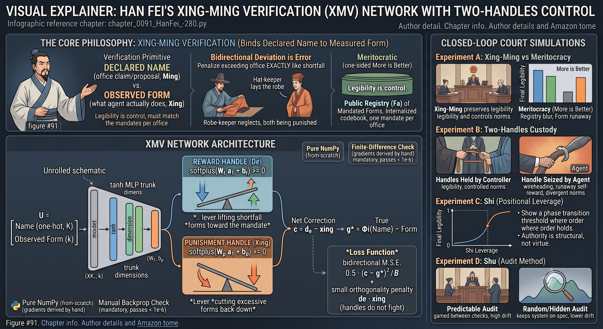

**Architecture — *The Xing-Ming Verification Network***  ·  🟢 **belief** — grounded in the figure's own surviving works

*Xing-ming verification*: bind a declared name to a measured form, where deviation in *either* direction (over- or under-fulfilment) is error, and the two handles (reward and punishment) must stay in the controller's custody — accountability as pure measurement.

▶️ **Run the mind:** [`minds/chapter_0091_HanFei_-280.py`](minds/chapter_0091_HanFei_-280.py)  —  `python3 minds/chapter_0091_HanFei_-280.py --test`

---

## 92 · Chrysippus
**c. 279–206 BCE — Soli (Anatolia) · Greek**  |  *Philosophy · Stoicism · Logic*

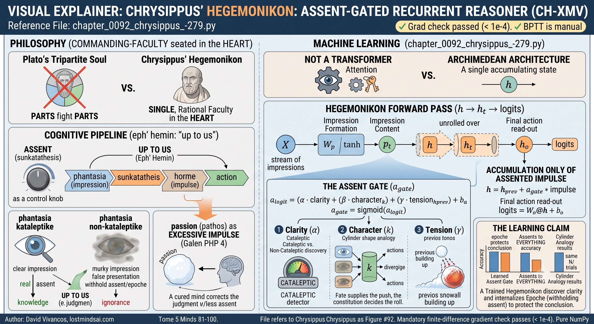

**Architecture — *The Hegemonikon***  ·  🟢 **belief** — grounded in the figure's own surviving works

The soul as *one rational commanding-faculty* (hegemonikon) in the heart: impression, assent and impulse are the mechanics of judgment, with assent — the moment of yes-or-no — as the single seat of freedom and responsibility.

▶️ **Run the mind:** [`minds/chapter_0092_chrysippus_-279.py`](minds/chapter_0092_chrysippus_-279.py)  —  `python3 minds/chapter_0092_chrysippus_-279.py --test`

---

## 93 · Eratosthenes
**c. 276–194 BCE — Cyrene (Libya) · Greek**  |  *Mathematics · Geography*

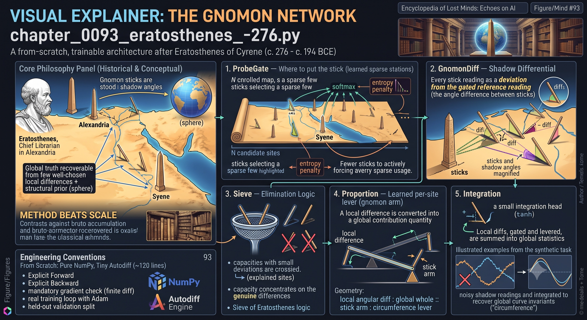

**Architecture — *The Gnomon Network***  ·  🟢 **belief** — grounded in the figure's own surviving works

The world is *measurable from a few observations and pure inference*: the size of the Earth computed without leaving Egypt, from two shadows and an assumption — intelligence as leverage, extracting the global from the sparse and local.

▶️ **Run the mind:** [`minds/chapter_0093_eratosthenes_-276.py`](minds/chapter_0093_eratosthenes_-276.py)  —  `python3 minds/chapter_0093_eratosthenes_-276.py --test`

---

## 94 · Qin Shi Huang
**259–210 BCE — Qin (China) · Chinese**  |  *Empire · Governance*

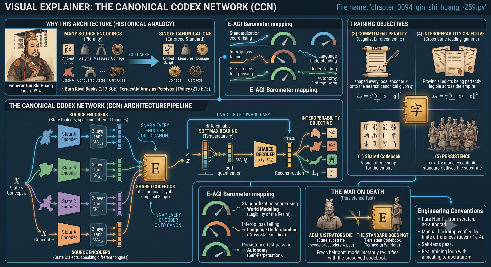

**Architecture — *The Canonical Codex Network***  ·  🔵 **extrapolated** — inferred from documented deeds

No philosophy of mind but a *doctrine of control*: human nature is selfish, so order is imposed by standardized law, surveillance and the abolition of independent thought — plus a literal war on death. Inferred from documented deeds.

▶️ **Run the mind:** [`minds/chapter_0094_qin_shi_huang_-259.py`](minds/chapter_0094_qin_shi_huang_-259.py)  —  `python3 minds/chapter_0094_qin_shi_huang_-259.py --test`

---

## 95 · Hannibal Barca
**247–183 BCE — Carthage · Carthaginian**  |  *Military Strategy*

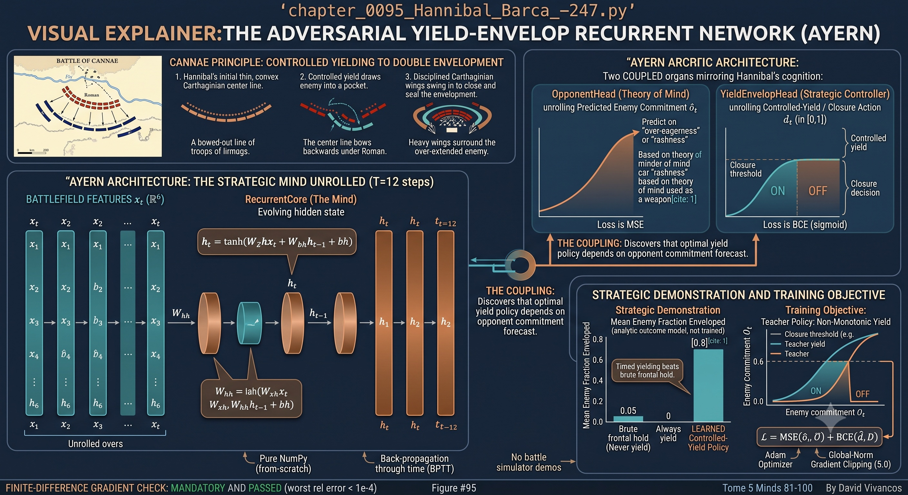

**Architecture — *The Adversarial Yield-Envelope Network***  ·  🟡 **mediated** — known only through others' accounts

Opponent-modelling that *weaponizes the enemy's own momentum*: victory engineered through deliberate, controlled yielding (the Cannae double-envelopment) so the adversary's strength becomes the mechanism of its defeat. Known through Roman sources.

▶️ **Run the mind:** [`minds/chapter_0095_Hannibal_Barca_-247.py`](minds/chapter_0095_Hannibal_Barca_-247.py)  —  `python3 minds/chapter_0095_Hannibal_Barca_-247.py --test`

---

## 96 · Patanjali
**c. 2nd c. BCE — India · Indian**  |  *Philosophy · Yoga · Psychology*

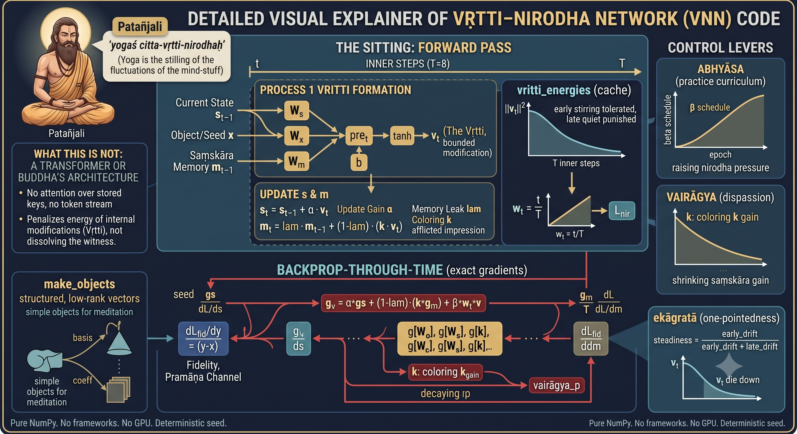

**Architecture — *The Citta Field***  ·  🟢 **belief** — grounded in the figure's own surviving works

The mind (citta) is a *fluctuating, trainable instrument* whose modifications (vritti) can be classified and progressively quieted: intelligence is the graded stilling of the field until the seer rests in its own nature.

▶️ **Run the mind:** [`minds/chapter_0096_patanjali_-200.py`](minds/chapter_0096_patanjali_-200.py)  —  `python3 minds/chapter_0096_patanjali_-200.py --test`

---

## 97 · Polybius
**c. 200–118 BCE — Megalopolis (Greece) · Greek**  |  *History*

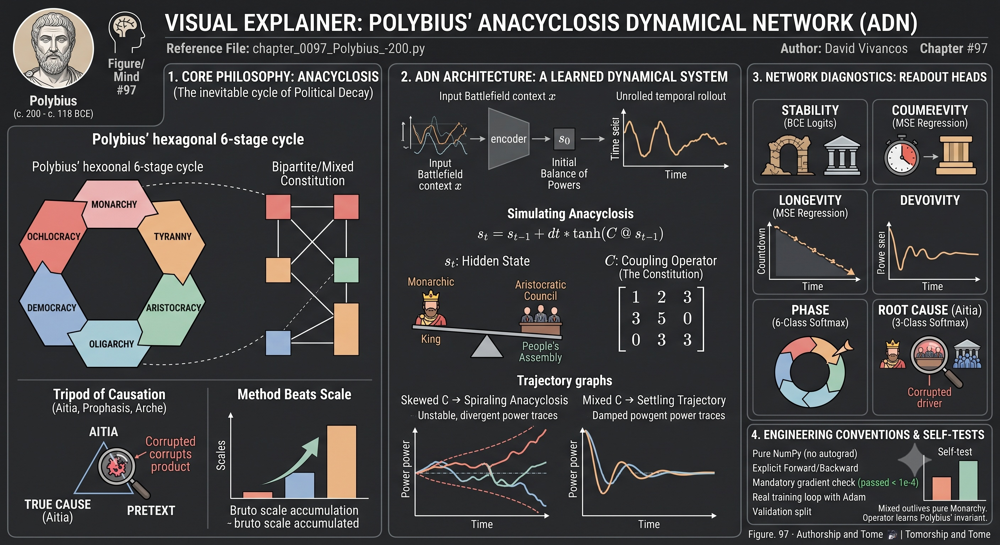

**Architecture — *The Anacyclosis Dynamical Network***  ·  🟢 **belief** — grounded in the figure's own surviving works

*Endogenous decay*: every successful order breeds the specific corruption that destroys it, so decline is structural and predictable (anacyclosis — the cycle of constitutions), and the only stable design is one that balances the failure modes against each other.

▶️ **Run the mind:** [`minds/chapter_0097_Polybius_-200.py`](minds/chapter_0097_Polybius_-200.py)  —  `python3 minds/chapter_0097_Polybius_-200.py --test`

---

## 98 · Uttaramimamsa (Brahma Sutra)
**c. 2nd c. BCE — India · Indian**  |  *Philosophy · Theology · Vedanta*

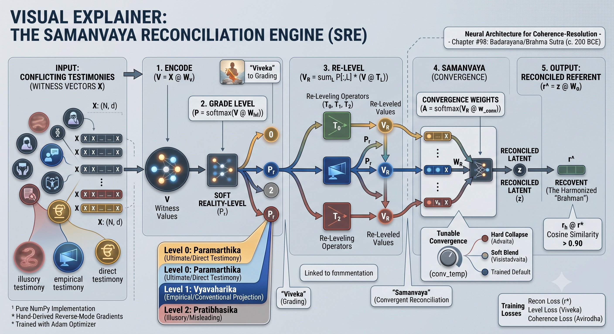

**Architecture — *The Samanvaya Reconciliation Engine***  ·  🟢 **belief** — grounded in the figure's own surviving works

Intelligence as the *convergent reconciliation* (samanvaya) of mutually contradictory testimony onto one underlying referent by re-grading each claim to its correct level of reality — never by deleting a claim, always by ranking it.

▶️ **Run the mind:** [`minds/chapter_0098_uttaramimamsa_brahma_sutra_-200.py`](minds/chapter_0098_uttaramimamsa_brahma_sutra_-200.py)  —  `python3 minds/chapter_0098_uttaramimamsa_brahma_sutra_-200.py --test`

---

## 99 · Hipparchus
**c. 190–120 BCE — Nicaea (Anatolia) · Greek**  |  *Astronomy · Mathematics*

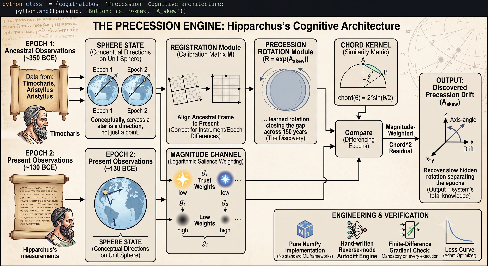

**Architecture — *The Precession Engine***  ·  🟢 **belief** — grounded in the figure's own surviving works

Intelligence as *temporal differencing*: knowledge that exists only in the comparison across epochs — register two star-catalogues ~150 years apart into one frame and subtract them, and a tiny lawful drift (precession) is revealed that no single observation could show.

▶️ **Run the mind:** [`minds/chapter_0099_hipparchus_-190.py`](minds/chapter_0099_hipparchus_-190.py)  —  `python3 minds/chapter_0099_hipparchus_-190.py --test`

---

## 100 · Liu An (Prince of Huainan)
**c. 179–122 BCE — China (Huainan) · Chinese**  |  *Philosophy · Anthology · Cosmology*

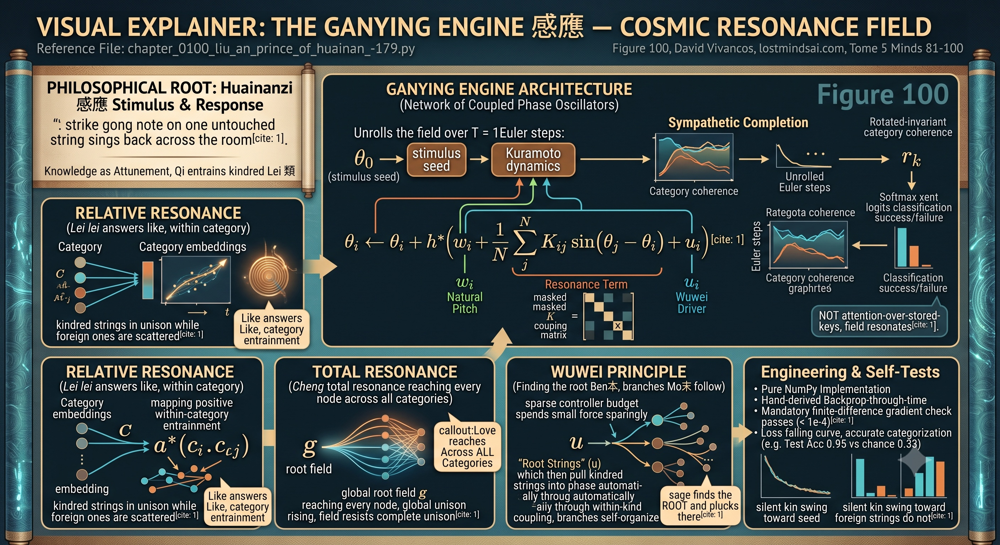

**Architecture — *The Ganying Engine***  ·  🟢 **belief** — grounded in the figure's own surviving works

*Resonance-control over a categorical field*: to know is to let stimulus and response (ganying) propagate sympathetically among things of one kind (lei); to act is wuwei — tune the root and the branches fall into order of themselves.

▶️ **Run the mind:** [`minds/chapter_0100_liu_an_prince_of_huainan_-179.py`](minds/chapter_0100_liu_an_prince_of_huainan_-179.py)  —  `python3 minds/chapter_0100_liu_an_prince_of_huainan_-179.py --test`

---

## How the minds are reconstructed

Every entry is built research-first: the figure's surviving works and current scholarship are gathered and each source verified before any architecture is written. Where evidence is thin, the chapter says so rather than inventing an inner life. Each figure's **provenance** is set to one of three real values:

- 🟢 **belief** — the figure's own surviving works or recorded doctrine ground the entry.
- 🟡 **mediated** — no words of their own survive; they are known only through others' (often hostile or legendary) accounts, and the entry says so.
- 🔵 **extrapolated** — no philosophy of mind survives at all; the entry is inferred from documented deeds (typical of kings and builders), and the entry says so.

Each reconstructed mind is then measured against the **[Artificiology E-AGI Barometer](https://artificiology.com/barometer.html)** — eight capability dimensions (Cognitive Processing 🧩, Embodied Cognition 🤸, World Modeling 🌍, Consciousness 👁️, Language Understanding 💭, Emotional Intelligence ❤️, Creativity ✨, Autonomy 🎯) — so a Bronze-Age lawgiver and a Hellenistic geometer can be compared on the same yardstick.

---

[← Tome 4](tome4.md) · [Repository README](readme.md)

### Read & explore
- 🌐 **Encyclopedia:** [https://lostmindsai.com](https://lostmindsai.com)
- 📖 **Tome 5 (Amazon):** [https://www.amazon.com/dp/B0H7LP5LP2](https://www.amazon.com/dp/B0H7LP5LP2)
- 🧪 **Interactive demos & résumé:** [https://artificiology.com/](https://artificiology.com/)
- 📊 **E-AGI Barometer:** [https://artificiology.com/barometer.html](https://artificiology.com/barometer.html)
- ✍️ **Author — David Vivancos:** [https://www.vivancos.com/](https://www.vivancos.com/)
