# Tome 6 — Minds 101–120
### *Rome and the Record — Republic, Principate & the Han Interregnum*
**Encyclopedia of Lost Minds: Echoes on AI** · *145 BCE – 23 CE*

[🌐 Encyclopedia](https://lostmindsai.com) · [📖 Buy Tome 6 on Amazon](https://www.amazon.com/dp/B0HF7G6JJD) · [🧪 Interactive Demos](https://artificiology.com/) · [📊 E-AGI Barometer](https://artificiology.com/barometer.html) · [✍️ Author](https://www.vivancos.com/) · [⭐ Repository](https://github.com/DavidVivancos/LostMindsAI)

[← Tome 5](tome5.md) · [Repository README](readme.md)

---

Tome 6 runs from **Sima Qian** to **Pliny the Elder** — twenty reconstructed minds, each rendered on two planes. The **abstract plane** distils the thinker's cognitive signature into an interactive 3D mind-map; the **mechanistic plane** turns that same signature into a small, *runnable* neural architecture, built from scratch in NumPy, gradient-checked, trained and self-tested.

This page collects the twenty **visual mind-map explainers** for this tome and links each to its companion architecture. Runnable code lives in [`minds/`](minds/); the explainer images live in [`maps/`](maps/).

> Every architecture here executes and passes its own self-test suite (a mandatory finite-difference gradient check plus a real training loop). No number is hard-coded — each is produced live on the machine that runs the file.

Where Tome 5 asked how a trustworthy mind is *built*, Tome 6 asks how anyone standing outside it can *verify* what was built — the volume of the record that carries its sources, the public face that must answer to a private deed, and the constraint no incentive can reach.

---

## The Twenty at a Glance

| # | Mind | Era | Civilization | Architecture | Provenance |
|---|------|-----|--------------|--------------|:----------:|
| 101 | [Sima Qian](#101--sima-qian) | c. 145–86 BCE | Chinese | *The Grand Scribe's Engine* | 🟢 |
| 102 | [Spartacus](#102--spartacus) | c. 109–71 BCE | Thracian | *The Insurgent Coalition Network* | 🟡 |
| 103 | [Cicero](#103--cicero) | 106–43 BCE | Roman | *The Forum* | 🟢 |
| 104 | [Julius Caesar](#104--julius-caesar) | 100–44 BCE | Roman | *The Rubicon Engine* | 🟢 |
| 105 | [Lucretius](#105--lucretius) | c. 99–55 BCE | Roman | *The Clinamen Engine* | 🟢 |
| 106 | [Cato the Younger](#106--cato-the-younger) | 95–46 BCE | Roman | *The Unbribable Machine* | 🟢 |
| 107 | [Vitruvius](#107--vitruvius) | c. 80–15 BCE | Roman | *The Dancing Column* | 🟢 |
| 108 | [Virgil](#108--virgil) | 70–19 BCE | Roman | *The Two-Voice Engine* | 🟢 |
| 109 | [Cleopatra VII](#109--cleopatra-vii) | 69–30 BCE | Ptolemaic Greek | *The Prosopon Network* | 🟢 |
| 110 | [Horace](#110--horace) | 65–8 BCE | Roman | *The Aurea Mediocritas Network* | 🟢 |
| 111 | [Strabo](#111--strabo) | c. 64 BCE–24 CE | Greek | *The Chorographic Manifold* | 🟢 |
| 112 | [Augustus (Octavian)](#112--augustus-octavian) | 63 BCE–14 CE | Roman | *The Principate Network* | 🟢 |
| 113 | [Livy](#113--livy) | 59 BCE–17 CE | Roman | *The Exemplar Engine* | 🟢 |
| 114 | [Wang Mang](#114--wang-mang) | 45 BCE–23 CE | Chinese | *The Rectification Codex* | 🟡 |
| 115 | [Ovid](#115--ovid) | 43 BCE–17 CE | Roman | *The Metamorphic Autoencoder* | 🟢 |
| 116 | [Arminius (Hermann)](#116--arminius-hermann) | c. 18 BCE–21 CE | Germanic | *The Trusted-Channel Inverter* | 🟡 |
| 117 | [Seneca](#117--seneca) | c. 4 BCE–65 CE | Roman | *The Assent-Gated Mind* | 🟢 |
| 118 | [Heron of Alexandria](#118--heron-of-alexandria) | c. 10–70 CE | Greek | *The Differentiable Automaton* | 🟢 |
| 119 | [Apollonius of Tyana](#119--apollonius-of-tyana) | c. 15–100 CE | Greek | *The Apollonian Ascent Network* | 🟡 |
| 120 | [Pliny the Elder](#120--pliny-the-elder) | 23–79 CE | Roman | *The Index Rerum Machine* | 🟢 |

**Provenance** — 🟢 belief · 🟡 mediated · 🔵 extrapolated. See [How the minds are reconstructed](#how-the-minds-are-reconstructed).

---

## 101 · Sima Qian
**c. 145–86 BCE — Xiayang, Han China · Chinese**  |  *History · Literature*

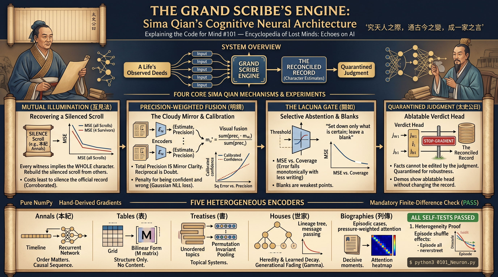

**Architecture — *The Grand Scribe's Engine***  ·  🟢 **belief** — grounded in the figure's own surviving works

*Mutual illumination* (hujian fa): no single account holds the whole truth — one life is split across five incompatible forms so the record is recovered only by reading them against one another, with the historian's verdict quarantined where it can never rewrite the facts beneath it.

▶️ **Run the mind:** [`minds/chapter_0101_sima_qian_-145.py`](minds/chapter_0101_sima_qian_-145.py)  —  `python3 minds/chapter_0101_sima_qian_-145.py --test`

---

## 102 · Spartacus
**c. 109–71 BCE — Thrace / Roman Republic · Thracian**  |  *Military · Leadership · Rebellion*

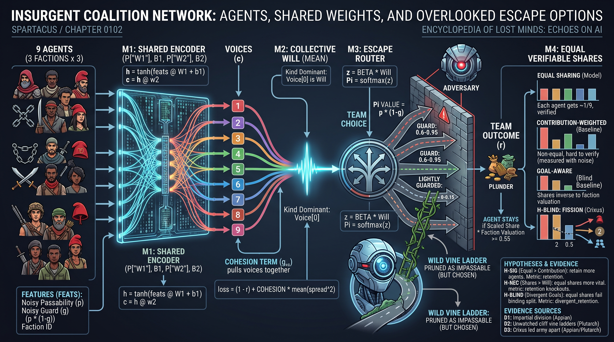

**Architecture — *The Insurgent Coalition Network***  ·  🟡 **mediated** — no words of their own survive; known through others' accounts

Coalition intelligence from below: bind a heterogeneous swarm by dividing reward in equal, *verifiable* shares rather than by learned weighting, search the regions the adversary's model has pruned away, and keep cognition embodied in terrain — a capable instrument that refused the objective it was built for.

▶️ **Run the mind:** [`minds/chapter_0102_spartacus_-109.py`](minds/chapter_0102_spartacus_-109.py)  —  `python3 minds/chapter_0102_spartacus_-109.py --test`

---

## 103 · Cicero
**106–43 BCE — Arpinum (Roman Republic) · Roman**  |  *Rhetoric · Philosophy · Politics*

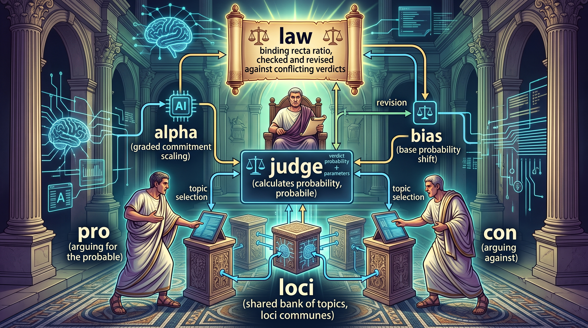

**Architecture — *The Forum***  ·  🟢 **belief** — grounded in the figure's own surviving works

Reason is *adversarial* before it is conclusive: build both sides of the case (in utramque partem) from one shared bank of topics, resolve them to a graded probability sufficient to act on, and hold the verdict answerable to a right reason larger than the arguers.

▶️ **Run the mind:** [`minds/chapter_0103_cicero_-106.py`](minds/chapter_0103_cicero_-106.py)  —  `python3 minds/chapter_0103_cicero_-106.py --test`

---

## 104 · Julius Caesar
**100–44 BCE — Rome (Roman Republic) · Roman**  |  *Military · Leadership · Writing · Politics*

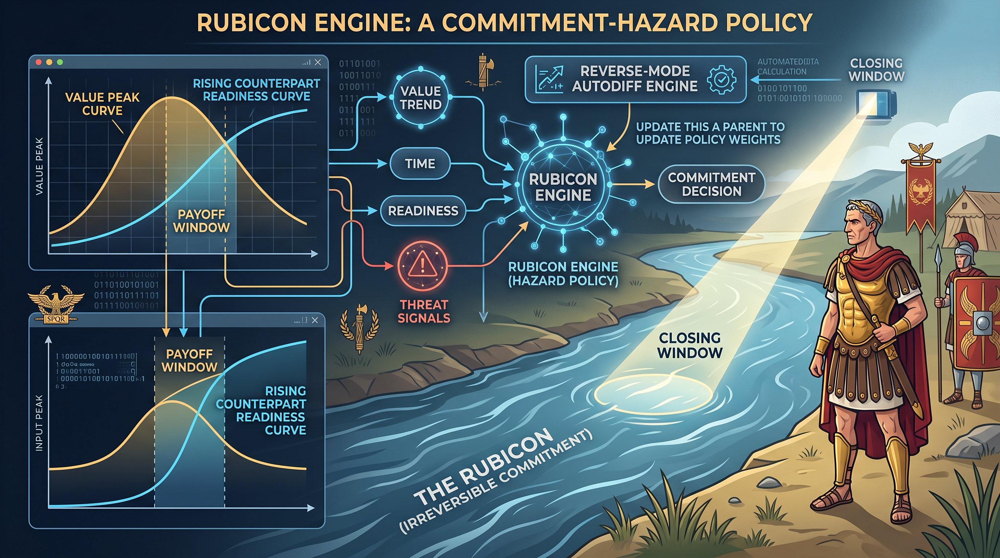

**Architecture — *The Rubicon Engine***  ·  🟢 **belief** — grounded in the figure's own surviving works

*Kairos* as the dominant variable: a commit-hazard trained under optimal stopping, where hesitation carries a real price and commitment destroys its own line of retreat — and where the audit trail is narrated during the act rather than reconstructed after it.

▶️ **Run the mind:** [`minds/chapter_0104_julius_caesar_-100.py`](minds/chapter_0104_julius_caesar_-100.py)  —  `python3 minds/chapter_0104_julius_caesar_-100.py --test`

---

## 105 · Lucretius
**c. 99–55 BCE — Roman Republic · Roman**  |  *Poetry · Philosophy · Atomism*

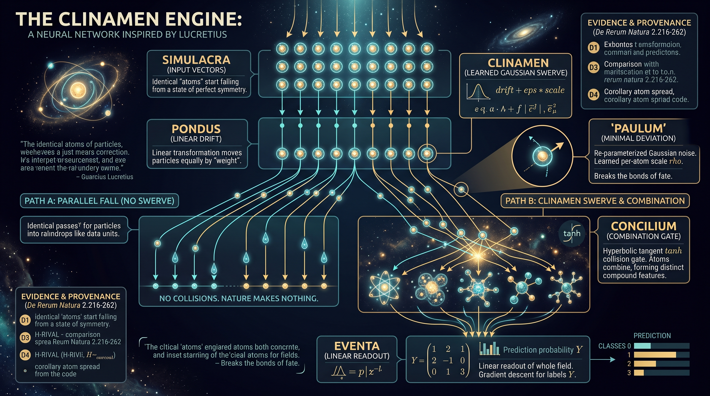

**Architecture — *The Clinamen Engine***  ·  🟢 **belief** — grounded in the figure's own surviving works

The *clinamen*: parallel deterministic drift produces nothing until a minimal, learned swerve breaks the symmetry — the injected stochasticity without which identical units cannot differentiate and a system can only execute, never originate.

▶️ **Run the mind:** [`minds/chapter_0105_lucretius_-99.py`](minds/chapter_0105_lucretius_-99.py)  —  `python3 minds/chapter_0105_lucretius_-99.py --test`

---

## 106 · Cato the Younger
**95–46 BCE — Rome (Roman Republic) · Roman**  |  *Politics · Ethics · Stoicism*

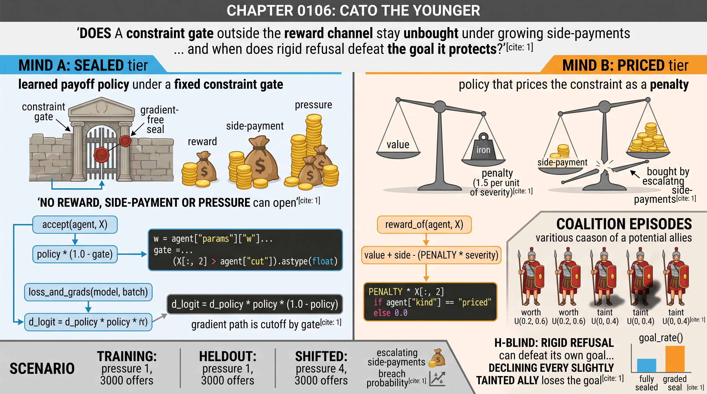

**Architecture — *The Unbribable Machine***  ·  🟢 **belief** — grounded in the figure's own surviving works

*Lexicographic* virtue: a frozen permissibility judgment the reward machinery may read but never modify, consulted absolutely before any payoff is weighed — with refusal available as a first-class output when nothing permissible remains.

▶️ **Run the mind:** [`minds/chapter_0106_cato_the_younger_-95.py`](minds/chapter_0106_cato_the_younger_-95.py)  —  `python3 minds/chapter_0106_cato_the_younger_-95.py --test`

---

## 107 · Vitruvius
**c. 80–15 BCE — Rome (Roman Republic) · Roman**  |  *Architecture · Engineering*

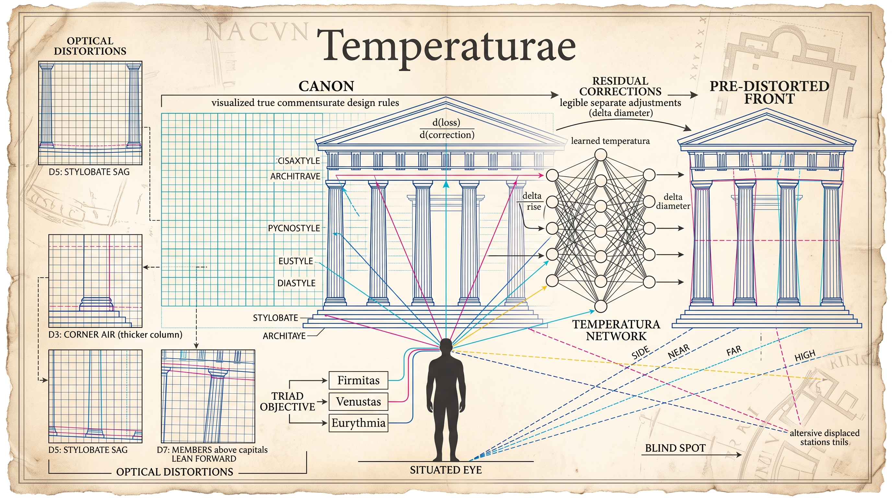

**Architecture — *The Dancing Column***  ·  🟢 **belief** — grounded in the figure's own surviving works

Two models of one object held at once — the commensurate *symmetria* the network computes and the *eurythmia* a situated eye receives — reconciled by learned corrections (temperaturae) that deliberately falsify the true measure so the seen one comes out right.

▶️ **Run the mind:** [`minds/chapter_0107_vitruvius_-80.py`](minds/chapter_0107_vitruvius_-80.py)  —  `python3 minds/chapter_0107_vitruvius_-80.py --test`

---

## 108 · Virgil
**70–19 BCE — Mantua (Roman Republic) · Roman**  |  *Poetry · Epic*

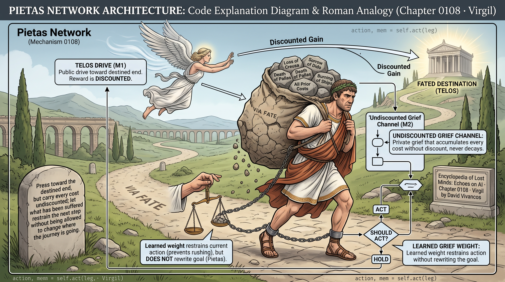

**Architecture — *The Two-Voice Engine***  ·  🟢 **belief** — grounded in the figure's own surviving works

*Lacrimae rerum* as a mechanism: a leaky public channel oriented to the destined goal, and a non-decaying private accumulator whose coefficient on its own past is exactly one — so an early cost reaches a late decision at full strength and is subtracted from the deed.

▶️ **Run the mind:** [`minds/chapter_0108_virgil_-70.py`](minds/chapter_0108_virgil_-70.py)  —  `python3 minds/chapter_0108_virgil_-70.py --test`

---

## 109 · Cleopatra VII
**69–30 BCE — Alexandria (Egypt) · Ptolemaic Greek**  |  *Diplomacy · Governance*

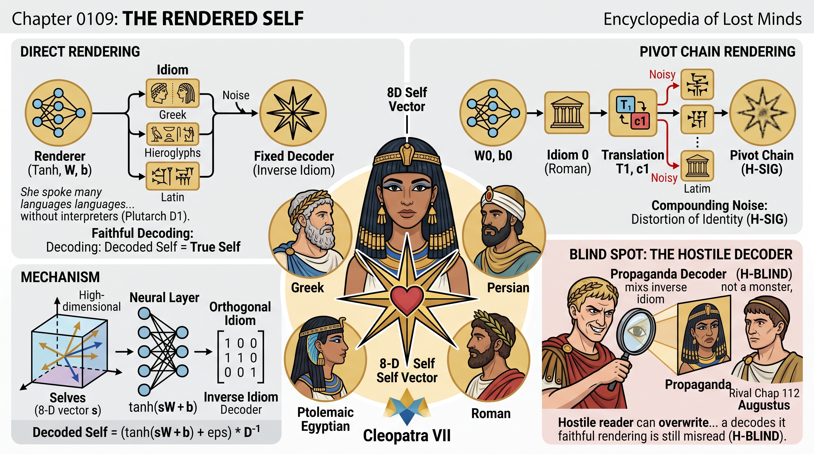

**Architecture — *The Prosopon Network***  ·  🟢 **belief** — grounded in the figure's own surviving works

*Prosopon*: one conserved self rendered into each audience's own idiom of legitimacy, with a renderer, reader and adversarial critic per audience — integrity relocated from uniformity to invertibility, and distinctiveness enforced so the faces cannot collapse into one.

▶️ **Run the mind:** [`minds/chapter_0109_cleopatra_vii_-69.py`](minds/chapter_0109_cleopatra_vii_-69.py)  —  `python3 minds/chapter_0109_cleopatra_vii_-69.py --test`

---

## 110 · Horace
**65–8 BCE — Venusia (Roman Republic) · Roman**  |  *Poetry · Lyric*

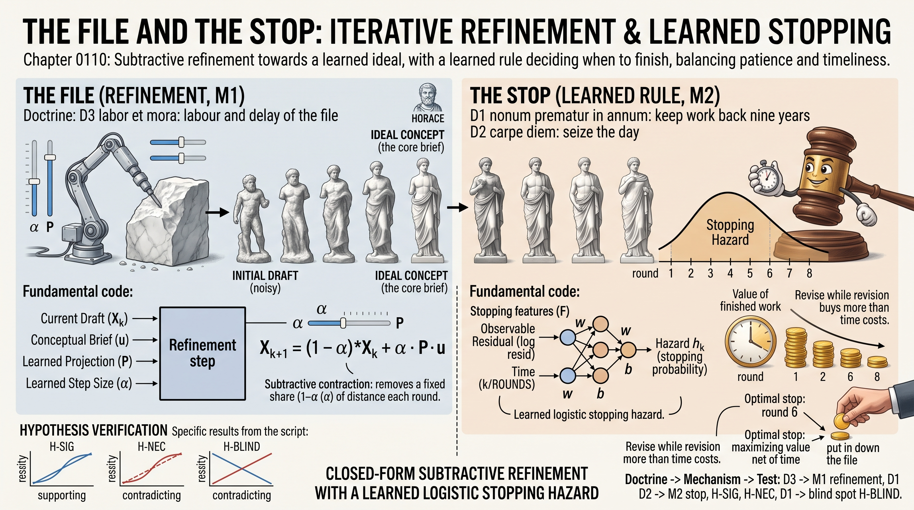

**Architecture — *The Aurea Mediocritas Network***  ·  🟢 **belief** — grounded in the figure's own surviving works

*Aurea mediocritas*: a regularizer that pulls representation magnitude toward a learned interior target instead of toward zero, penalising drift in both directions — antiquity's answer to the unbounded optimiser, and to the measure that stops being good the moment it becomes the target.

▶️ **Run the mind:** [`minds/chapter_0110_horace_-65.py`](minds/chapter_0110_horace_-65.py)  —  `python3 minds/chapter_0110_horace_-65.py --test`

---

## 111 · Strabo
**c. 64 BCE–24 CE — Amaseia, Pontus (Anatolia) · Greek**  |  *Geography · History*

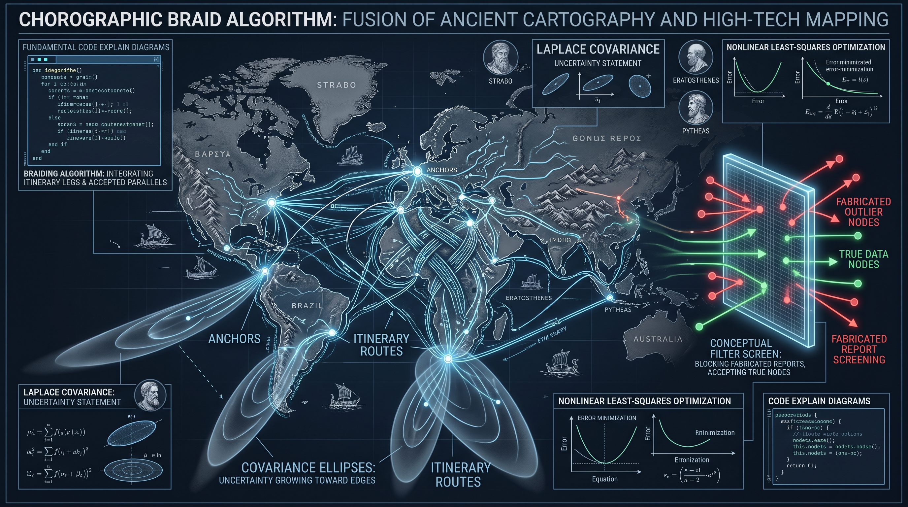

**Architecture — *The Chorographic Manifold***  ·  🟢 **belief** — grounded in the figure's own surviving works

*Autopsia* and its limits: many imperfect reports fused onto one two-dimensional manifold, each weighted by the credibility of the witness who carried it, under a heteroscedastic objective that lets the map declare its own fog instead of smoothing it away.

▶️ **Run the mind:** [`minds/chapter_0111_strabo_-64.py`](minds/chapter_0111_strabo_-64.py)  —  `python3 minds/chapter_0111_strabo_-64.py --test`

---

## 112 · Augustus (Octavian)
**63 BCE–14 CE — Rome (Italy) · Roman**  |  *Governance · Peace · Law*

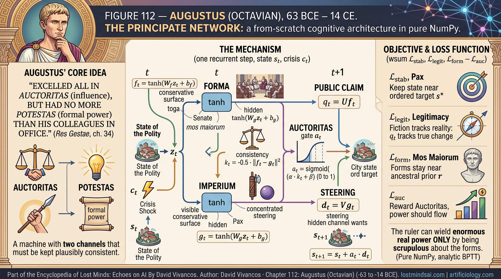

**Architecture — *The Principate Network***  ·  🟢 **belief** — grounded in the figure's own surviving works

*Auctoritas* against *potestas*: a public channel tethered to the ancestral prior and a private one free to steer, coupled by a gate that opens only in proportion to how far the two agree — making divergence structurally unprofitable rather than merely forbidden.

▶️ **Run the mind:** [`minds/chapter_0112_augustus_octavian_-63.py`](minds/chapter_0112_augustus_octavian_-63.py)  —  `python3 minds/chapter_0112_augustus_octavian_-63.py --test`

---

## 113 · Livy
**59 BCE–17 CE — Patavium (Padua, Italy) · Roman**  |  *History*

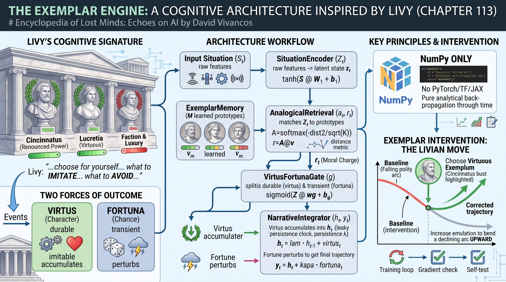

**Architecture — *The Exemplar Engine***  ·  🟢 **belief** — grounded in the figure's own surviving works

*Exempla* as cognition: prototypes distilled during learning rather than copied from the record, retrieved analogically in a morally load-bearing subspace, and read off as judgment — case-based moral reasoning two thousand years before it had a name.

▶️ **Run the mind:** [`minds/chapter_0113_livy_-59.py`](minds/chapter_0113_livy_-59.py)  —  `python3 minds/chapter_0113_livy_-59.py --test`

---

## 114 · Wang Mang
**45 BCE–23 CE — Han / Xin dynasty China · Chinese**  |  *Governance · Reform*

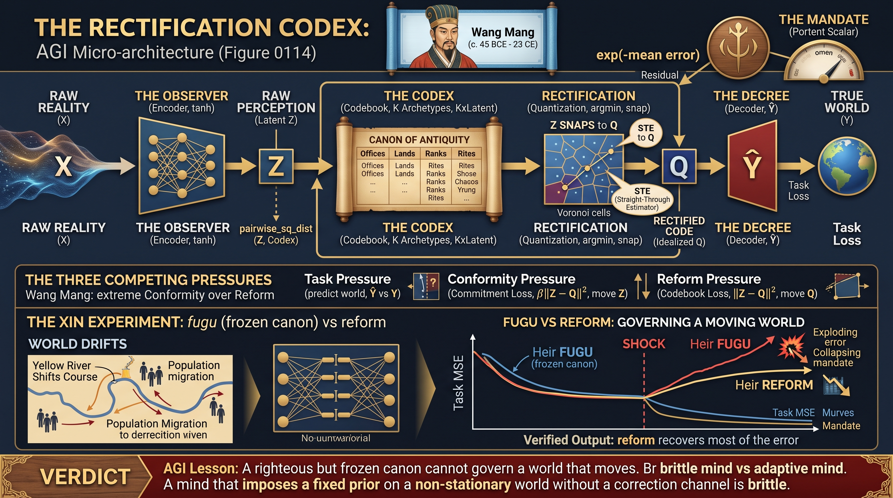

**Architecture — *The Rectification Codex***  ·  🟡 **mediated** — no words of their own survive; known through others' accounts

*Zhengming* run to its limit: every observation snapped hard to its nearest canonical prototype and thereafter reasoned about as a name, in a system that optimises conformity-to-canon over correspondence-to-reality and has no fast path for the world to answer back.

▶️ **Run the mind:** [`minds/chapter_0114_wang_mang_-45.py`](minds/chapter_0114_wang_mang_-45.py)  —  `python3 minds/chapter_0114_wang_mang_-45.py --test`

---

## 115 · Ovid
**43 BCE–17 CE — Rome (Italy) · Roman**  |  *Poetry · Mythology*

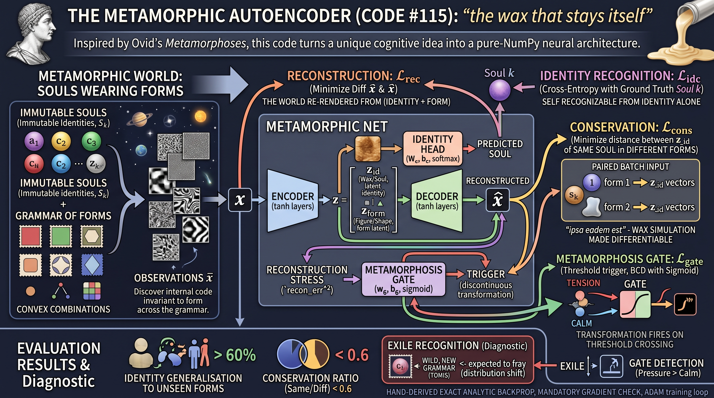

**Architecture — *The Metamorphic Autoencoder***  ·  🟢 **belief** — grounded in the figure's own surviving works

The wax that stays itself: a latent split into *essence* and *form* and held apart by a conservation objective, so one identity code survives every transformation — with a threshold unit that marks the crossing, because reorganisation fires as an event rather than a drift.

▶️ **Run the mind:** [`minds/chapter_0115_ovid_-43.py`](minds/chapter_0115_ovid_-43.py)  —  `python3 minds/chapter_0115_ovid_-43.py --test`

---

## 116 · Arminius (Hermann)
**c. 18 BCE–21 CE — Germania (Cheruscan territory) · Germanic**  |  *Military · Resistance · Leadership*

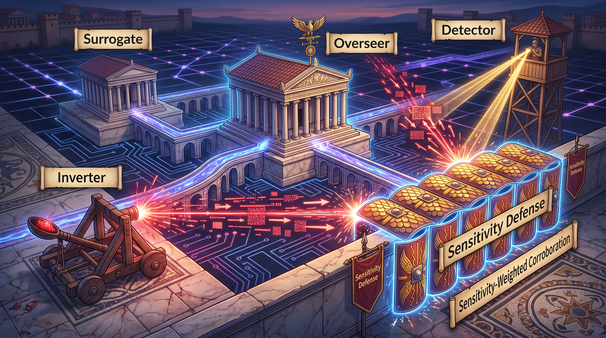

**Architecture — *The Trusted-Channel Inverter***  ·  🟡 **mediated** — no words of their own survive; known through others' accounts

Model inversion as method: a learned surrogate of the adversary's decision function, solved backward under a deniability budget for the smallest false input producing the chosen output — permitted to move only the *trusted channel* the target cannot independently re-measure.

▶️ **Run the mind:** [`minds/chapter_0116_arminius_hermann_-18.py`](minds/chapter_0116_arminius_hermann_-18.py)  —  `python3 minds/chapter_0116_arminius_hermann_-18.py --test`

---

## 117 · Seneca
**c. 4 BCE–65 CE — Rome (Italy) · Roman**  |  *Philosophy · Stoicism · Letters*

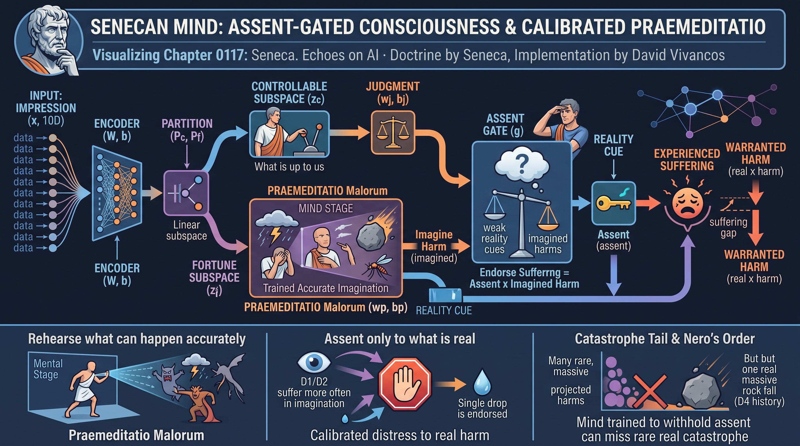

**Architecture — *The Assent-Gated Mind***  ·  🟢 **belief** — grounded in the figure's own surviving works

The *assent* gate: a latent split into what is up to us and what belongs to Fortuna, a calibrated rehearsal of misfortune wired to the gate rather than straight to affect, and one learned decision governing whether an impression is ever ratified into a passion.

▶️ **Run the mind:** [`minds/chapter_0117_seneca_-4.py`](minds/chapter_0117_seneca_-4.py)  —  `python3 minds/chapter_0117_seneca_-4.py --test`

---

## 118 · Heron of Alexandria
**c. 10–70 CE — Alexandria (Roman Egypt) · Greek**  |  *Engineering · Mathematics*

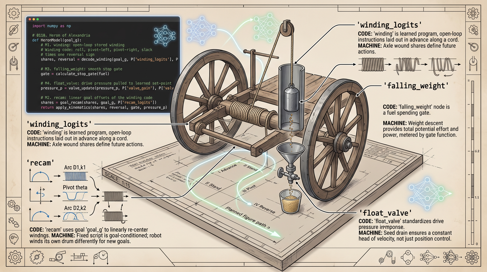

**Architecture — *The Differentiable Automaton***  ·  🟢 **belief** — grounded in the figure's own surviving works

A stored program on a pegged drum: instruction sequences blended softly between roll, wrap and hold; a float valve regulating toward a learned set-point that restores itself after disturbance; and a finite falling weight metering the whole performance.

▶️ **Run the mind:** [`minds/chapter_0118_heron_of_alexandria_10.py`](minds/chapter_0118_heron_of_alexandria_10.py)  —  `python3 minds/chapter_0118_heron_of_alexandria_10.py --test`

---

## 119 · Apollonius of Tyana
**c. 15–100 CE — Tyana (Asia Minor) · Greek**  |  *Philosophy · Neopythagoreanism*

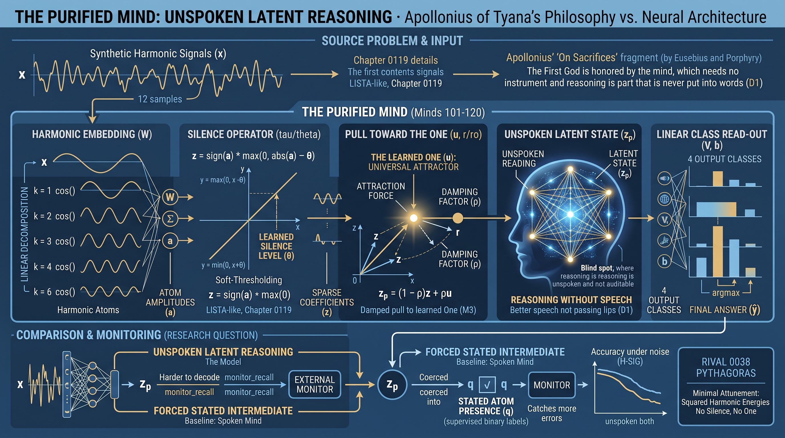

**Architecture — *The Apollonian Ascent Network***  ·  🟡 **mediated** — no words of their own survive; known through others' accounts

The ascent by *subtraction*: a soft-threshold silence operator that subtracts a fixed magnitude from every harmonic mode and zeroes whatever is quieter — a level of silencing the model raises on its own as it trains, relaxed toward a single learned invariant.

▶️ **Run the mind:** [`minds/chapter_0119_apollonius_of_tyana_15.py`](minds/chapter_0119_apollonius_of_tyana_15.py)  —  `python3 minds/chapter_0119_apollonius_of_tyana_15.py --test`

---

## 120 · Pliny the Elder
**23–79 CE — Como (Italy) · Roman**  |  *Natural History*

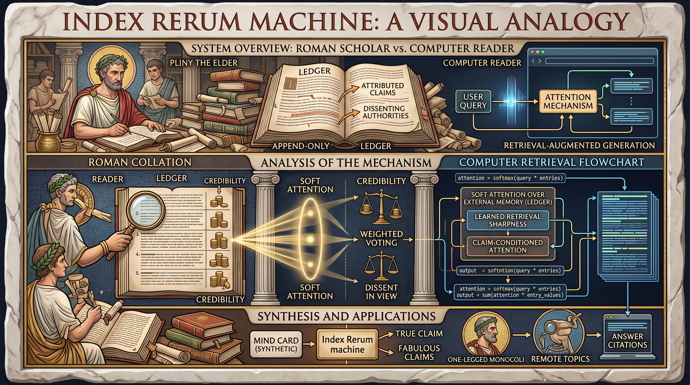

**Architecture — *The Index Rerum Machine***  ·  🟢 **belief** — grounded in the figure's own surviving works

The *index rerum*: an append-only external memory of attributed facts, retrieved by relevance scaled by a learned per-source credibility — so a wholly new authority can be admitted after training and weighed on evidence rather than on rank.

▶️ **Run the mind:** [`minds/chapter_0120_pliny_the_elder_23.py`](minds/chapter_0120_pliny_the_elder_23.py)  —  `python3 minds/chapter_0120_pliny_the_elder_23.py --test`

---

## How the minds are reconstructed

Every entry is built research-first: the figure's surviving works and current scholarship are gathered and each source verified before any architecture is written. Where evidence is thin, the chapter says so rather than inventing an inner life. Each figure's **provenance** is set to one of three real values:

- 🟢 **belief** — the figure's own surviving works or recorded doctrine ground the entry.
- 🟡 **mediated** — no words of their own survive; they are known only through others' (often hostile or legendary) accounts, and the entry says so.
- 🔵 **extrapolated** — no philosophy of mind survives at all; the entry is inferred from documented deeds (typical of kings and builders), and the entry says so.

This tome is unusually well attested — sixteen of its twenty figures left words of their own. The four exceptions are instructive rather than regrettable: **Spartacus** and **Arminius** survive only in the language of the powers that destroyed them, **Wang Mang** reaches us through Ban Gu's hostile *Book of Han*, and **Apollonius of Tyana** through a court-commissioned life written more than a century after his death. A mind known only through the reports of its adversaries is the same problem this tome poses about machines: abundant behaviour, interested testimony, and an interior that must be inferred from outside.

Each reconstructed mind is then measured against the **[Artificiology E-AGI Barometer](https://artificiology.com/barometer.html)** — eight capability dimensions (Cognitive Processing 🧩, Embodied Cognition 🤸, World Modeling 🌍, Consciousness 👁️, Language Understanding 💭, Emotional Intelligence ❤️, Creativity ✨, Autonomy 🎯) — so a Bronze-Age lawgiver and a Roman historian can be compared on the same yardstick.

---

[← Tome 5](tome5.md) · [Repository README](readme.md)

### Read & explore
- 🌐 **Encyclopedia:** [https://lostmindsai.com](https://lostmindsai.com)
- 📖 **Tome 6 (Amazon):** [https://www.amazon.com/dp/B0HF7G6JJD](https://www.amazon.com/dp/B0HF7G6JJD)
- 🧪 **Interactive demos & résumé:** [https://artificiology.com/](https://artificiology.com/)
- 📊 **E-AGI Barometer:** [https://artificiology.com/barometer.html](https://artificiology.com/barometer.html)
- ✍️ **Author — David Vivancos:** [https://www.vivancos.com/](https://www.vivancos.com/)
