# Tome 7 — Minds 121–140
### *The Tested World — The Antonine Peak, the Second Sophistic & the Han's Collapse*
**Encyclopedia of Lost Minds: Echoes on AI** · *27 – 192 CE*

[🌐 Encyclopedia](https://lostmindsai.com) · [📖 Buy Tome 7 on Amazon](https://www.amazon.com/dp/B0HFN6GXMH) · [🧪 Interactive Demos](https://artificiology.com/) · [📊 E-AGI Barometer](https://artificiology.com/barometer.html) · [✍️ Author](https://www.vivancos.com/) · [⭐ Repository](https://github.com/DavidVivancos/LostMindsAI)

[← Tome 6](tome6.md) · [Repository README](readme.md)

---

Tome 7 runs from **Wang Chong** to **Cao Zhi** — twenty reconstructed minds, each rendered on two planes. The **abstract plane** distils the thinker's cognitive signature into an interactive 3D mind-map; the **mechanistic plane** turns that same signature into a small, *runnable* neural architecture, built from scratch in NumPy, gradient-checked, trained and self-tested.

This page collects the twenty **visual mind-map explainers** for this tome and links each to its companion architecture. Runnable code lives in [`minds/`](minds/); the explainer images live in [`maps/`](maps/).

> Every architecture here executes and passes its own self-test suite (a mandatory finite-difference gradient check plus a real training loop). No number is hard-coded — each is produced live on the machine that runs the file.

Where Tome 6 asked how anyone standing outside a mind can *verify* what was built, Tome 7 asks the harder half: what a mind should do when it cannot go behind anything it is given. Two empires had become machines for moving claims, and confident assertion had outrun anyone's power to check it — so these twenty converge, from four unconnected traditions, on the discipline of proportioning what you assert to what you actually verified.

---

## The Twenty at a Glance

| # | Mind | Era | Civilization | Architecture | Provenance |
|---|------|-----|--------------|--------------|:----------:|
| 121 | [Wang Chong](#121--wang-chong) | 27 – c. 100 CE | Chinese | *The Balance Network* | 🟢 |
| 122 | [Boudica](#122--boudica) | c. 30 – 61 CE | Britannic | *The Carnyx Field* | 🟡 |
| 123 | [Dioscorides](#123--dioscorides) | c. 40 – 90 CE | Greek | *Dynamis — the Drug-Affinity Effect-Manifold* | 🟢 |
| 124 | [Plutarch](#124--plutarch) | 46 – c. 120 CE | Greek | *The Synkritic Character Encoder* | 🟢 |
| 125 | [Epictetus](#125--epictetus) | c. 50 – 135 CE | Greek | *The Proairetic Gate Network* | 🟢 |
| 126 | [Trajan](#126--trajan) | 53 – 117 CE | Roman | *The Rescriptor — a Casuistic Kernel Reasoner* | 🟢 |
| 127 | [Tacitus](#127--tacitus) | c. 56 – 120 CE | Roman | *The Tacitean Inversion* | 🟢 |
| 128 | [Hadrian](#128--hadrian) | 76 – 138 CE | Roman | *The Peripatetic Atlas Network* | 🔵 |
| 129 | [Zhang Heng](#129--zhang-heng) | 78 – 139 CE | Chinese | *The Resonant Direction Engine* | 🟢 |
| 130 | [Ptolemy](#130--ptolemy) | c. 100 – 170 CE | Greco-Roman | *The Equant Engine* | 🟢 |
| 131 | [Marcus Aurelius](#131--marcus-aurelius) | 121 – 180 CE | Roman | *The Homeostat of the View From Above* | 🟢 |
| 132 | [Zhang Zhi](#132--zhang-zhi) | c. 125 – 192 CE | Chinese | *The One-Stroke Continuous-Trace Network* | 🟡 |
| 133 | [Lucian of Samosata](#133--lucian-of-samosata) | c. 125 – 180 CE | Greek | *The Kataskopos Engine* | 🟢 |
| 134 | [Apuleius](#134--apuleius) | c. 125 – 170 CE | Roman (Numidian) | *The Metamorphic Curiosity Network* | 🟢 |
| 135 | [Galen](#135--galen) | 129 – c. 216 CE | Greek | *The Pneumatic Engine* | 🟢 |
| 136 | [Nagarjuna](#136--nagarjuna) | c. 150 – 250 CE | Indian | *The Śūnyatā Relational Engine* | 🟢 |
| 137 | [Cao Cao](#137--cao-cao) | 155 – 220 CE | Chinese | *The Logistics-Gated Strategy Network* | 🟢 |
| 138 | [Tertullian](#138--tertullian) | c. 155 – 240 CE | Roman-African | *The Anima Corporea Network* | 🟢 |
| 139 | [Sextus Empiricus](#139--sextus-empiricus) | c. 160 – 210 CE | Greek | *The Equipollence Engine* | 🟢 |
| 140 | [Cao Zhi](#140--cao-zhi) | 192 – 232 CE | Chinese | *The Constrained Resonance Network* | 🟢 |

**Provenance** — 🟢 belief · 🟡 mediated · 🔵 extrapolated. See [How the minds are reconstructed](#how-the-minds-are-reconstructed).

---

## 121 · Wang Chong
**27 – c. 100 CE — Kuaiji, Han China · Chinese**  |  *Philosophy · Skepticism*

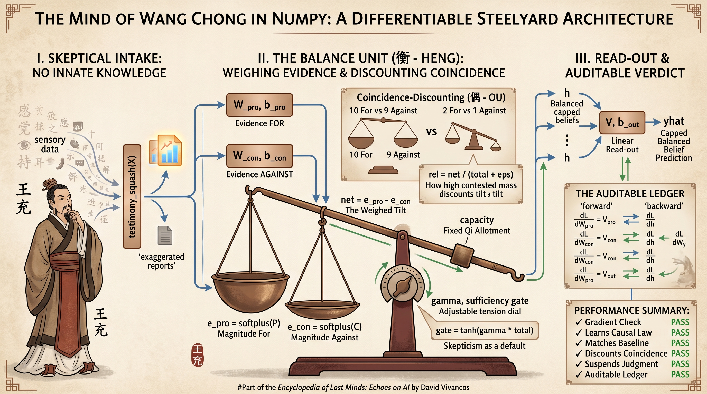

**Architecture — *The Balance Network***  ·  🟢 **belief** — grounded in the figure's own surviving works

The steelyard (*heng* 衡): every unit sets a *pro* pan against a *con* pan and divides the net tilt by the total contested mass, so ten-for against nine-against correctly reads as nothing — with a sufficiency gate that suspends judgment until evidence accumulates, and a frozen capacity cap (*ming*) no learning may argue past.

▶️ **Run the mind:** [`minds/chapter_0121_wang_chong_27.py`](minds/chapter_0121_wang_chong_27.py)  —  `python3 minds/chapter_0121_wang_chong_27.py --test`

---

## 122 · Boudica
**c. 30 – 61 CE — Britannia (Iceni) · Britannic**  |  *Military · Resistance · Leadership*

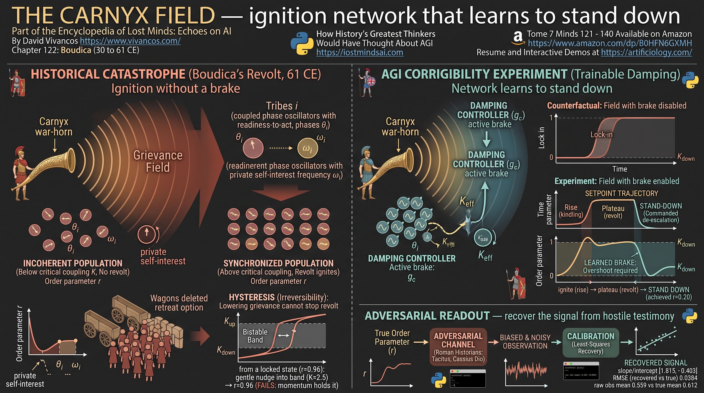

**Architecture — *The Carnyx Field***  ·  🟡 **mediated** — no words of their own survive; known through others' accounts

Ignition as a phase transition: a population of coupled phase-holders whose coherence is driven by one broadcast grievance, given inertia so the field locks far below the coupling that lit it — and a brake that must be learned long after the ignition it has to undo.

▶️ **Run the mind:** [`minds/chapter_0122_boudica_30.py`](minds/chapter_0122_boudica_30.py)  —  `python3 minds/chapter_0122_boudica_30.py --test`

---

## 123 · Dioscorides
**c. 40 – 90 CE — Anazarbus, Cilicia · Greek**  |  *Medicine · Pharmacology · Botany*

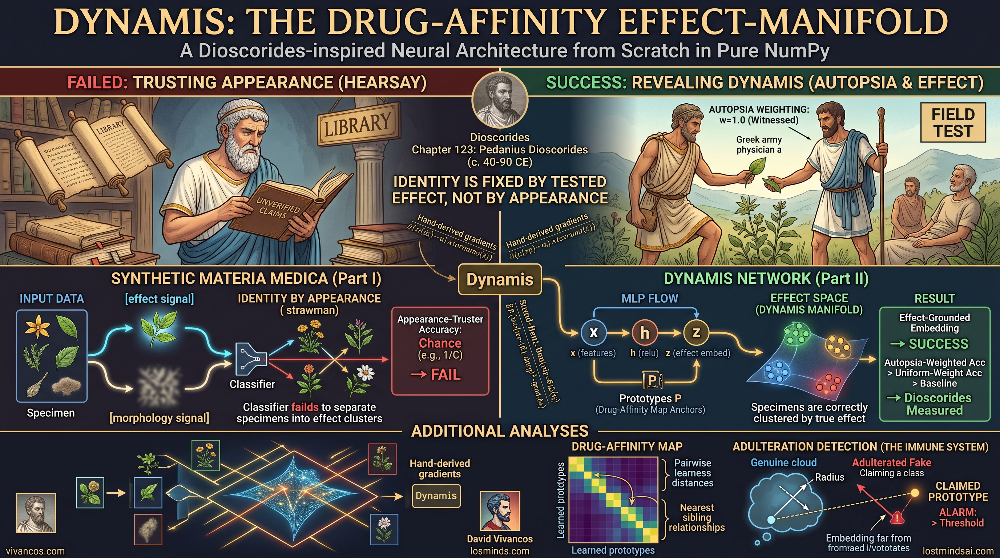

**Architecture — *Dynamis — the Drug-Affinity Effect-Manifold***  ·  🟢 **belief** — grounded in the figure's own surviving works

Identity by tested effect (*dynamis*), never by appearance: substances are embedded so that neighbours share physiological action, morphology is built to carry no information about function, and witnessed evidence outweighs the merely reported.

▶️ **Run the mind:** [`minds/chapter_0123_dioscorides_40.py`](minds/chapter_0123_dioscorides_40.py)  —  `python3 minds/chapter_0123_dioscorides_40.py --test`

---

## 124 · Plutarch
**46 – c. 120 CE — Chaeronea, Greece · Greek**  |  *Biography · Philosophy · Ethics*

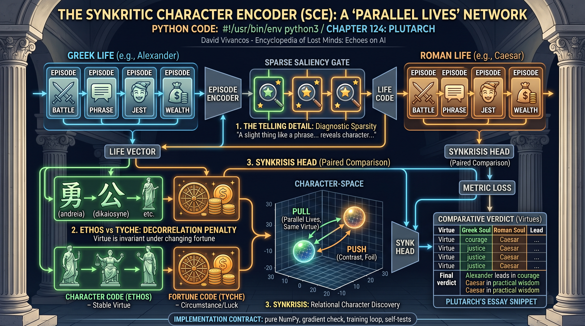

**Architecture — *The Synkritic Character Encoder***  ·  🟢 **belief** — grounded in the figure's own surviving works

*Synkrisis* with gradients: character and circumstance are split into two codes held apart by an explicit independence penalty, so *ēthos* is whatever survives a change of *tychē* — and a saliency gate pushed toward sparseness, because character shows in the slight thing rather than the battle.

▶️ **Run the mind:** [`minds/chapter_0124_plutarch_46.py`](minds/chapter_0124_plutarch_46.py)  —  `python3 minds/chapter_0124_plutarch_46.py --test`

---

## 125 · Epictetus
**c. 50 – 135 CE — Hierapolis → Rome → Nicopolis · Greek**  |  *Philosophy · Ethics*

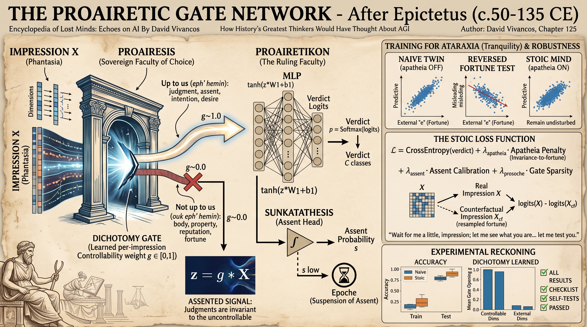

**Architecture — *The Proairetic Gate Network***  ·  🟢 **belief** — grounded in the figure's own surviving works

The dichotomy of control as an architecture: every input is assigned a controllability weight before the judging faculty may lean on it, assent is a separate act that can be withheld, and the cut is not installed by hand but *learned* from a penalty on any verdict that moves when fortune is resampled.

▶️ **Run the mind:** [`minds/chapter_0125_epictetus_50.py`](minds/chapter_0125_epictetus_50.py)  —  `python3 minds/chapter_0125_epictetus_50.py --test`

---

## 126 · Trajan
**53 – 117 CE — Italica → Rome · Roman**  |  *Governance · Expansion · Ethics*

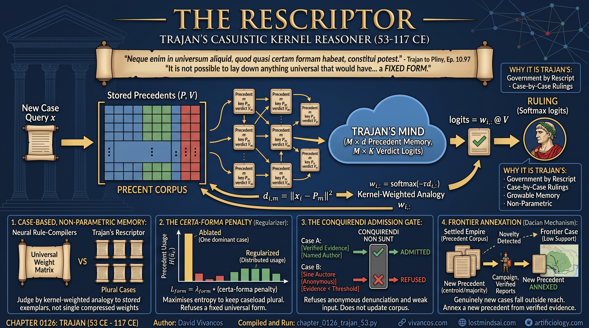

**Architecture — *The Rescriptor — a Casuistic Kernel Reasoner***  ·  🟢 **belief** — grounded in the figure's own surviving works

Government by rescript: a non-parametric corpus of precedent cases consulted by weighted analogy, regularised against any one rule swelling into a universal form (*certa forma*), gated at intake against the unsigned accusation, and grown only at verified frontiers.

▶️ **Run the mind:** [`minds/chapter_0126_trajan_53.py`](minds/chapter_0126_trajan_53.py)  —  `python3 minds/chapter_0126_trajan_53.py --test`

---

## 127 · Tacitus
**c. 56 – 120 CE — Gallia Narbonensis → Rome · Roman**  |  *History*

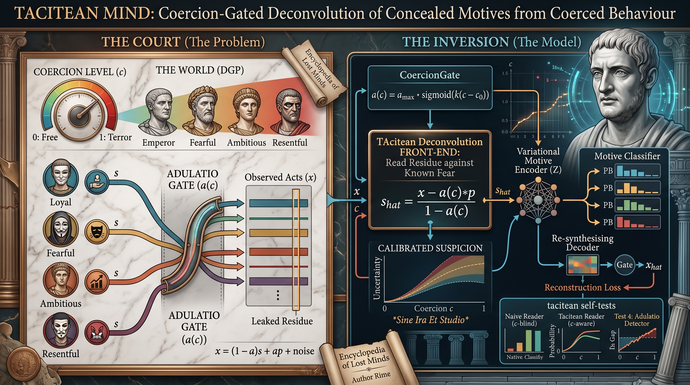

**Architecture — *The Tacitean Inversion***  ·  🟢 **belief** — grounded in the figure's own surviving works

*Sine ira et studio* as signal processing: observed conduct is truth passed through a coercion channel of estimable strength, the known compliance is divided back out, and confidence widens exactly where the surface grows uniform — because a room of identical praise carries no information.

▶️ **Run the mind:** [`minds/chapter_0127_tacitus_56.py`](minds/chapter_0127_tacitus_56.py)  —  `python3 minds/chapter_0127_tacitus_56.py --test`

---

## 128 · Hadrian
**76 – 138 CE — Italica → Rome · Roman**  |  *Governance · Architecture · Consolidation*

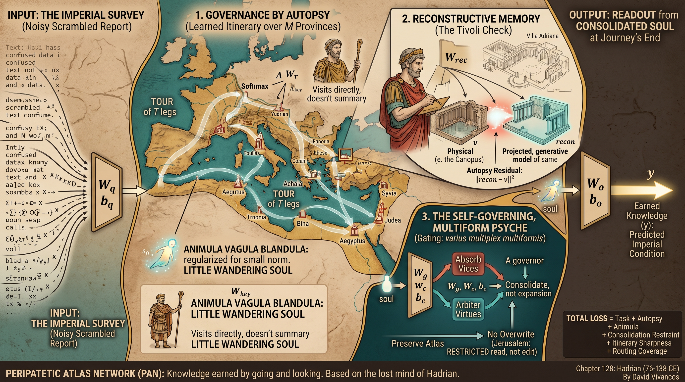

**Architecture — *The Peripatetic Atlas Network***  ·  🔵 **extrapolated** — no philosophy of mind survives; inferred from documented deeds

Governance by autopsy: the network must physically tour a map of its own knowledge, unreachable from the query alone, folding each visit into a small carried state (*animula*) penalised for bloat — and counting a place known only once it can be rebuilt and checked against the original.

▶️ **Run the mind:** [`minds/chapter_0128_hadrian_76.py`](minds/chapter_0128_hadrian_76.py)  —  `python3 minds/chapter_0128_hadrian_76.py --test`

---

## 129 · Zhang Heng
**78 – 139 CE — Nanyang, Han China · Chinese**  |  *Astronomy · Engineering · Mathematics*

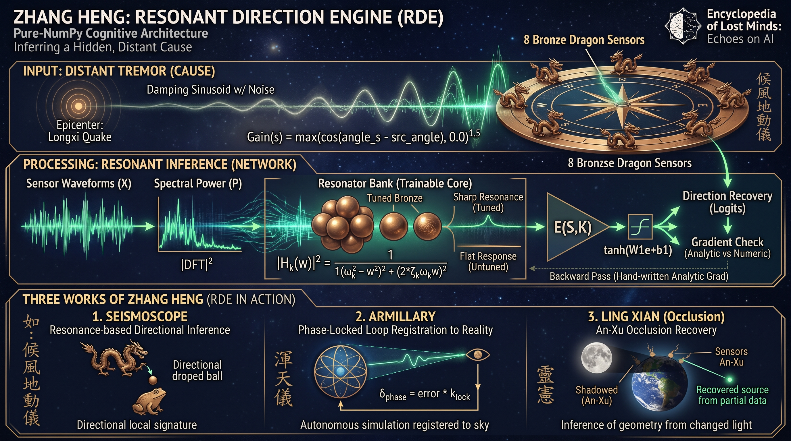

**Architecture — *The Resonant Direction Engine***  ·  🟢 **belief** — grounded in the figure's own surviving works

The seismoscope as inference: tuned second-order resonators whose selectivity comes from what *rings* rather than what is stored, accumulating evidence per bearing to a competitive commitment — with an armillary kept phase-locked to observation, and a bearing still recoverable through occlusion.

▶️ **Run the mind:** [`minds/chapter_0129_zhang_heng_78.py`](minds/chapter_0129_zhang_heng_78.py)  —  `python3 minds/chapter_0129_zhang_heng_78.py --test`

---

## 130 · Ptolemy
**c. 100 – 170 CE — Alexandria, Roman Egypt · Greco-Roman**  |  *Astronomy · Mathematics · Harmonics*

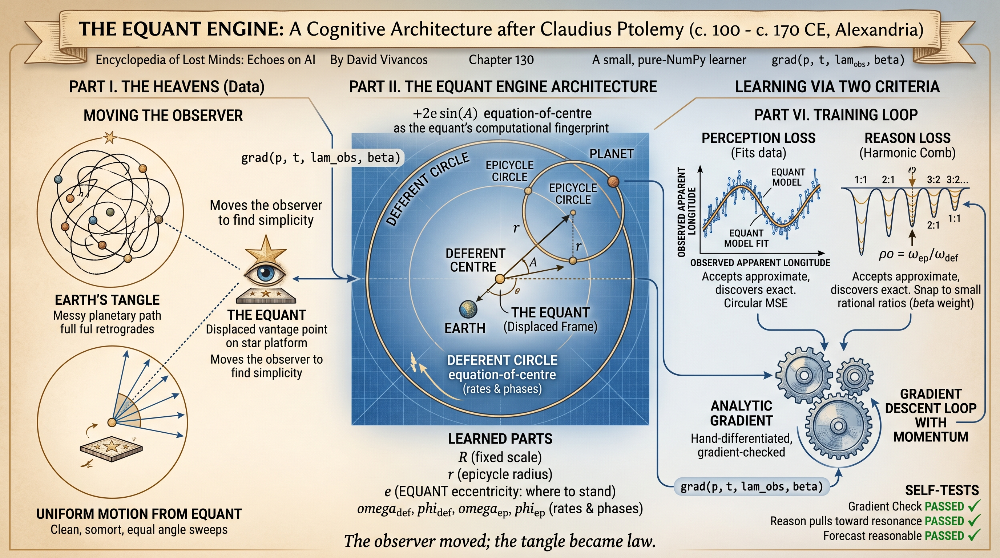

**Architecture — *The Equant Engine***  ·  🟢 **belief** — grounded in the figure's own surviving works

Regularity as a property of vantage: the law is held fixed and the observation point is *learned*, so the fit gradient points literally toward where to stand — under a two-criterion objective in which reason and perception each hold a veto over the other.

▶️ **Run the mind:** [`minds/chapter_0130_ptolemy_100.py`](minds/chapter_0130_ptolemy_100.py)  —  `python3 minds/chapter_0130_ptolemy_100.py --test`

---

## 131 · Marcus Aurelius
**121 – 180 CE — Rome · Roman**  |  *Philosophy · Leadership · Ethics*

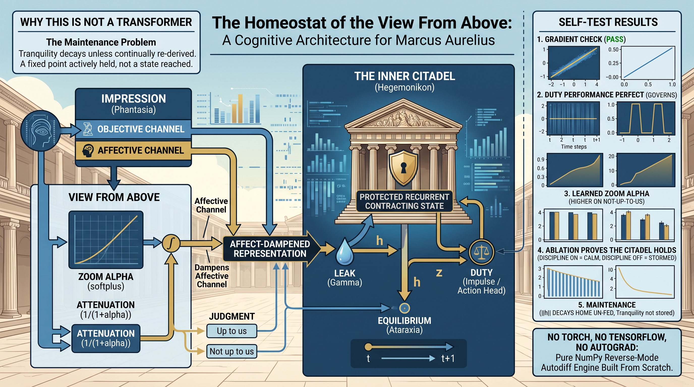

**Architecture — *The Homeostat of the View From Above***  ·  🟢 **belief** — grounded in the figure's own surviving works

Tranquility as a maintained state, not a reached one: a protected recurrent faculty the world cannot write to directly, updated only through a gate of assent, deliberately leaky so calm decays unless continually re-derived — and a learned zoom that drains affect while leaving the duty intact.

▶️ **Run the mind:** [`minds/chapter_0131_marcus_aurelius_121.py`](minds/chapter_0131_marcus_aurelius_121.py)  —  `python3 minds/chapter_0131_marcus_aurelius_121.py --test`

---

## 132 · Zhang Zhi
**c. 125 – 192 CE — Dunhuang, Han China · Chinese**  |  *Calligraphy · Art*

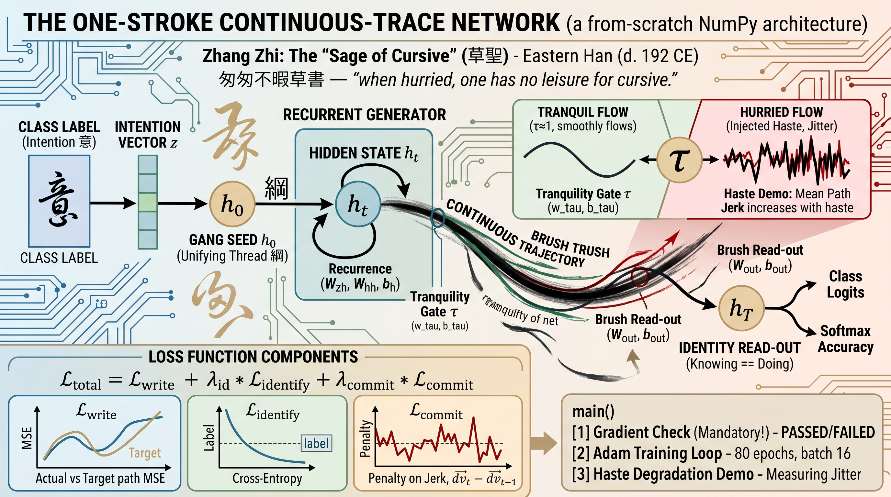

**Architecture — *The One-Stroke Continuous-Trace Network***  ·  🟡 **mediated** — no words of their own survive; known through others' accounts

The trace is the thought: one unbroken committed trajectory with no bank of past states to re-read, sustained by a single master-thread (*gāng*) and re-injected intention (*yì*), governed by one tranquility gate — force haste through it and the whole gesture fractures.

▶️ **Run the mind:** [`minds/chapter_0132_zhang_zhi_125.py`](minds/chapter_0132_zhang_zhi_125.py)  —  `python3 minds/chapter_0132_zhang_zhi_125.py --test`

---

## 133 · Lucian of Samosata
**c. 125 – 180 CE — Samosata, Syria · Greek**  |  *Literature · Satire*

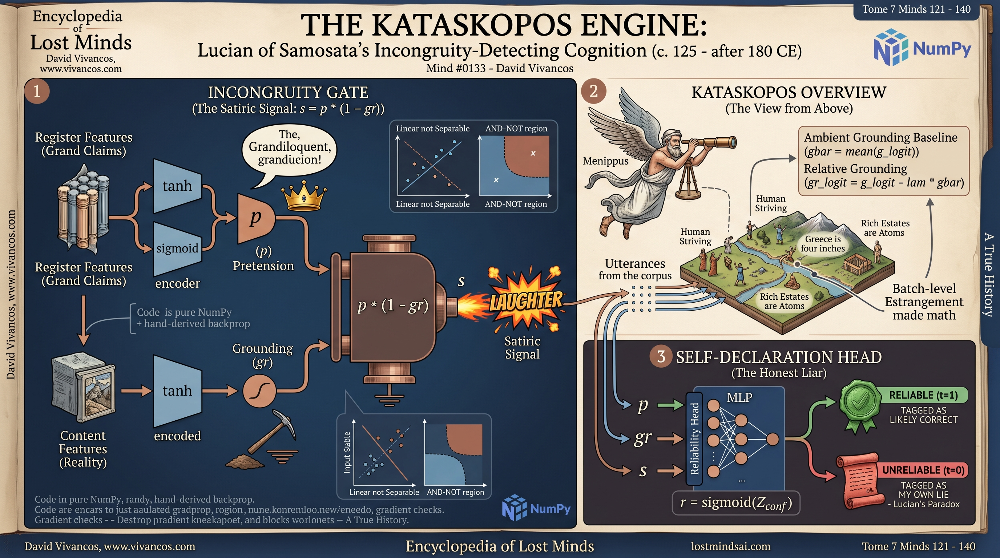

**Architecture — *The Kataskopos Engine***  ·  🟢 **belief** — grounded in the figure's own surviving works

Intelligence as comparison: pretension and grounding measured by rigorously separate organs and combined multiplicatively, so the signal fires on high claim *and* low support and on nothing else — plus an overview vantage, and a channel that declares its own reliability.

▶️ **Run the mind:** [`minds/chapter_0133_lucian_of_samosata_125.py`](minds/chapter_0133_lucian_of_samosata_125.py)  —  `python3 minds/chapter_0133_lucian_of_samosata_125.py --test`

---

## 134 · Apuleius
**c. 125 – 170 CE — Madauros, Numidia · Roman (Numidian)**  |  *Novel · Philosophy · Rhetoric*

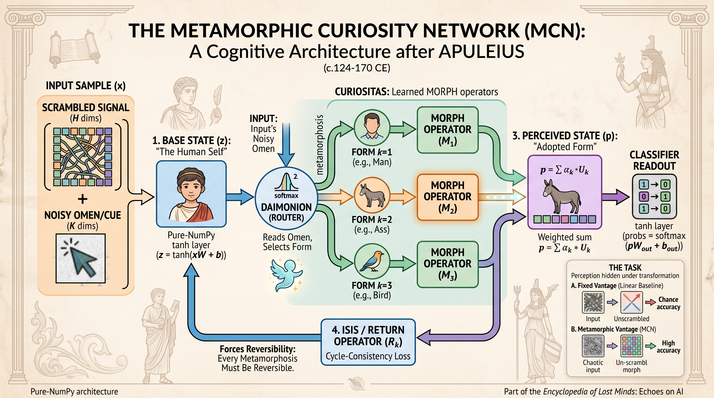

**Architecture — *The Metamorphic Curiosity Network***  ·  🟢 **belief** — grounded in the figure's own surviving works

Change the observer, not the query: a repertoire of learned vantages, none of which sees everything, dispatched by a daemon-router that reads the situation — with every transformation required to be reversible, because a form adopted can trap you.

▶️ **Run the mind:** [`minds/chapter_0134_apuleius_125.py`](minds/chapter_0134_apuleius_125.py)  —  `python3 minds/chapter_0134_apuleius_125.py --test`

---

## 135 · Galen
**129 – c. 216 CE — Pergamon → Rome · Greek**  |  *Medicine · Philosophy*

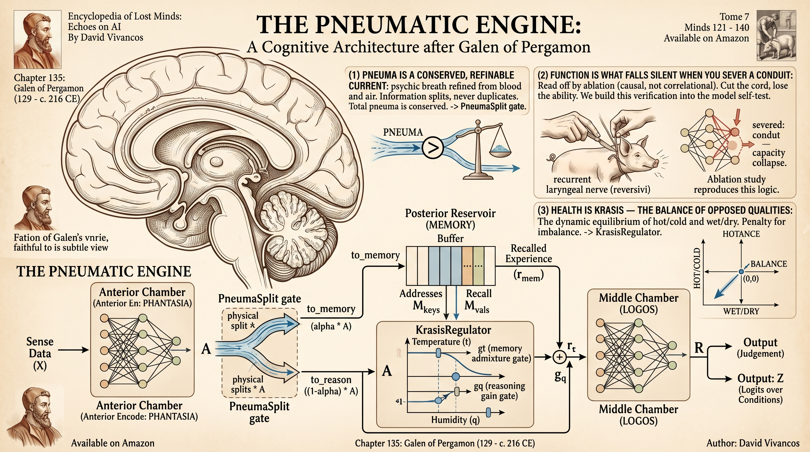

**Architecture — *The Pneumatic Engine***  ·  🟢 **belief** — grounded in the figure's own surviving works

Pneuma is split, never copied: a per-unit gate whose two fractions sum to the whole, so routing more toward memory necessarily starves reason — with severable conduits that reproduce graded lesion effects, and correct operation defined as a *krasis* that has to be actively held.

▶️ **Run the mind:** [`minds/chapter_0135_galen_129.py`](minds/chapter_0135_galen_129.py)  —  `python3 minds/chapter_0135_galen_129.py --test`

---

## 136 · Nagarjuna
**c. 150 – 250 CE — Andhra / Sātavāhana India · Indian**  |  *Philosophy*

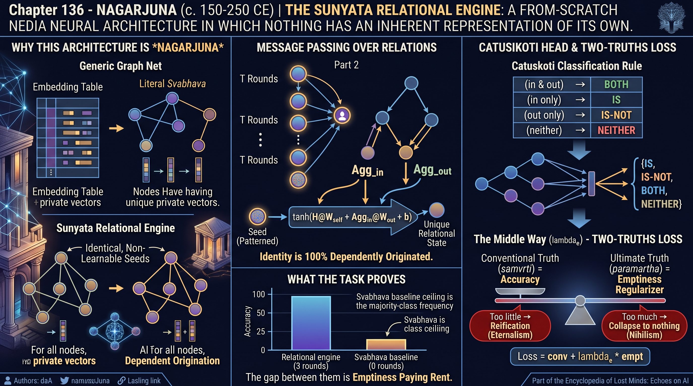

**Architecture — *The Śūnyatā Relational Engine***  ·  🟢 **belief** — grounded in the figure's own surviving works

No element owns its identity: every node begins from the same contentless seed, so all distinctness must precipitate out of message passing — judged on four corners rather than two, against a twin that assumes own-being (*svabhāva*) and cannot tell the corners apart at all.

▶️ **Run the mind:** [`minds/chapter_0136_nagarjuna_150.py`](minds/chapter_0136_nagarjuna_150.py)  —  `python3 minds/chapter_0136_nagarjuna_150.py --test`

---

## 137 · Cao Cao
**155 – 220 CE — Pei, Han China · Chinese**  |  *Governance · Poetry · Three Kingdoms*

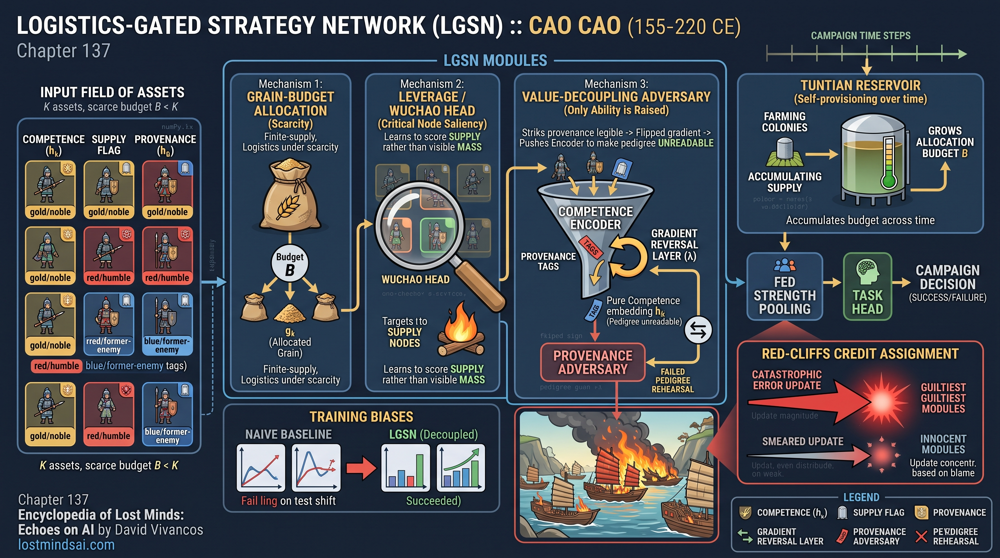

**Architecture — *The Logistics-Gated Strategy Network***  ·  🟢 **belief** — grounded in the figure's own surviving works

Reason about the grain, not the army: a scarce supply that must genuinely be allocated, a leverage scorer that finds where acting moves the outcome most, and an adversary trained to read pedigree from the internal state — against which the system learns to make origin unreadable and ability legible.

▶️ **Run the mind:** [`minds/chapter_0137_cao_cao_155.py`](minds/chapter_0137_cao_cao_155.py)  —  `python3 minds/chapter_0137_cao_cao_155.py --test`

---

## 138 · Tertullian
**c. 155 – 240 CE — Carthage · Roman-African**  |  *Theology · Christian Thought*

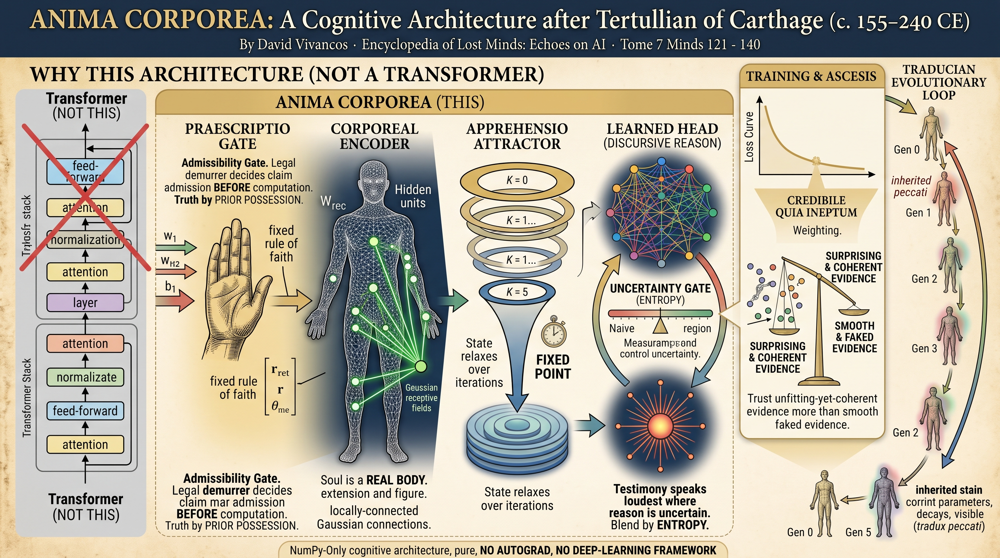

**Architecture — *The Anima Corporea Network***  ·  🟢 **belief** — grounded in the figure's own surviving works

The soul is a body: units sit at coordinates and see mainly what is near them, understanding is convergence to rest rather than a single sweep, admission is decided before the merits (*praescriptio*), and every model is seeded from a parent whose inherited mark decays but never clears.

▶️ **Run the mind:** [`minds/chapter_0138_tertullian_155.py`](minds/chapter_0138_tertullian_155.py)  —  `python3 minds/chapter_0138_tertullian_155.py --test`

---

## 139 · Sextus Empiricus
**c. 160 – 210 CE — Alexandria / Rome · Greek**  |  *Philosophy · Skepticism · Medicine*

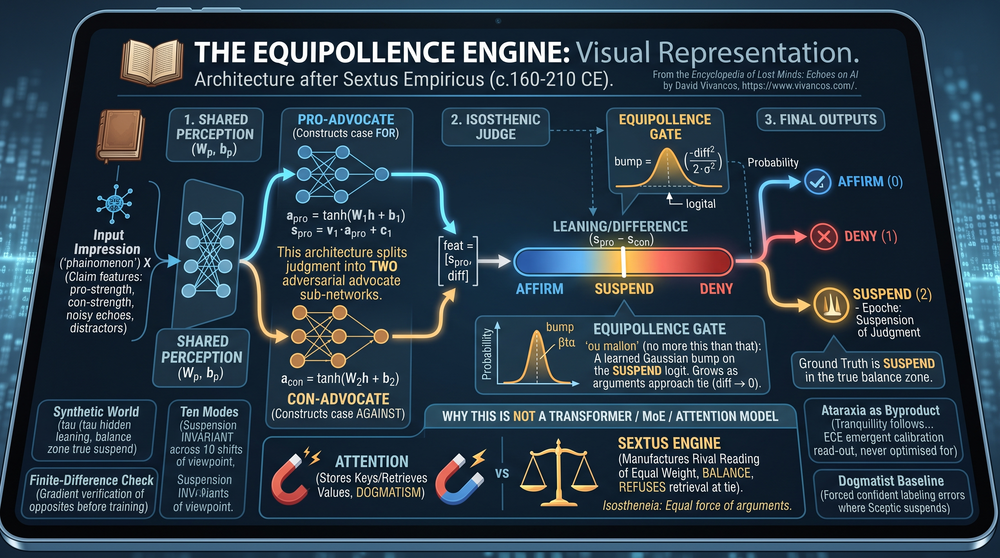

**Architecture — *The Equipollence Engine***  ·  🟢 **belief** — grounded in the figure's own surviving works

Two advocates with entirely separate resources argue opposite sides of one impression and return strengths rather than verdicts, while a balance-gate lifts suspension into contention as they converge — so *epochē* is a destination the system is scored for reaching, and calibration arrives unpursued.

▶️ **Run the mind:** [`minds/chapter_0139_sextus_empiricus_160.py`](minds/chapter_0139_sextus_empiricus_160.py)  —  `python3 minds/chapter_0139_sextus_empiricus_160.py --test`

---

## 140 · Cao Zhi
**192 – 232 CE — Ye, Cao Wei · Chinese**  |  *Poetry*

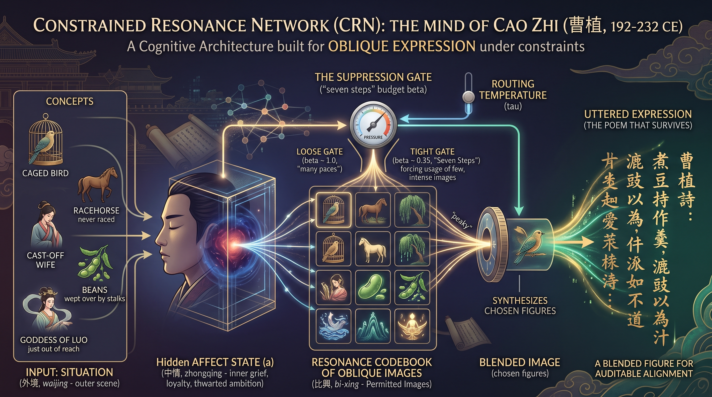

**Architecture — *The Constrained Resonance Network***  ·  🟢 **belief** — grounded in the figure's own surviving works

Obliquity made structural: an inner state (*zhongqing*) with no direct decoding path to output, everything sayable routed through a small codebook of maximally distinct figures, under a suppression gate tightened until meaning concentrates — and, past one locatable point, breaks.

▶️ **Run the mind:** [`minds/chapter_0140_cao_zhi_192.py`](minds/chapter_0140_cao_zhi_192.py)  —  `python3 minds/chapter_0140_cao_zhi_192.py --test`

---

## How the minds are reconstructed

Every entry is built research-first: the figure's surviving works and current scholarship are gathered and each source verified before any architecture is written. Where evidence is thin, the chapter says so rather than inventing an inner life. Each figure's **provenance** is set to one of three real values:

- 🟢 **belief** — the figure's own surviving works or recorded doctrine ground the entry.
- 🟡 **mediated** — no words of their own survive; they are known only through others' (often hostile or legendary) accounts, and the entry says so.
- 🔵 **extrapolated** — no philosophy of mind survives at all; the entry is inferred from documented deeds (typical of kings and builders), and the entry says so.

Seventeen of these twenty left words of their own. The three exceptions sit at the centre of the tome's subject rather than at its edge: **Boudica** left no letter, no saying, no coin legend, and survives only through the two Roman senators whose side she was trying to destroy; **Zhang Zhi** left no autograph and no treatise, reaching us through later critics and a single surviving aphorism; and **Hadrian** left almost nothing beyond a deathbed fragment transmitted by the unreliable *Historia Augusta*, so his cognition is read from exceptionally well-documented deeds. A volume about assaying testimony cannot exempt its own sources, and several chapters whose provenance is 🟢 say plainly where the record is still thin — **Ptolemy** left no letters or named students, **Sextus Empiricus**'s dates float across a century and a half, and **Lucian** is the last witness anyone should trust about **Lucian**.

Each reconstructed mind is then measured against the **[Artificiology E-AGI Barometer](https://artificiology.com/barometer.html)** — eight capability dimensions (Cognitive Processing 🧩, Embodied Cognition 🤸, World Modeling 🌍, Consciousness 👁️, Language Understanding 💭, Emotional Intelligence ❤️, Creativity ✨, Autonomy 🎯) — so a Bronze-Age lawgiver and a Roman physician can be compared on the same yardstick.

---

[← Tome 6](tome6.md) · [Repository README](readme.md)

### Read & explore
- 🌐 **Encyclopedia:** [https://lostmindsai.com](https://lostmindsai.com)
- 📖 **Tome 7 (Amazon):** [https://www.amazon.com/dp/B0HFN6GXMH](https://www.amazon.com/dp/B0HFN6GXMH)
- 🧪 **Interactive demos & résumé:** [https://artificiology.com/](https://artificiology.com/)
- 📊 **E-AGI Barometer:** [https://artificiology.com/barometer.html](https://artificiology.com/barometer.html)
- ✍️ **Author — David Vivancos:** [https://www.vivancos.com/](https://www.vivancos.com/)
