# Tome 8 — Minds 141–160
### *The Shaped Mind — The Fall of Rome, the Church Fathers & the Gupta Golden Age*
**Encyclopedia of Lost Minds: Echoes on AI** · *200 – 470 CE*

[🌐 Encyclopedia](https://lostmindsai.com) · [📖 Buy Tome 8 on Amazon](https://www.amazon.com/dp/B0HH8RTCXF) · [🧪 Interactive Demos](https://artificiology.com/) · [📊 E-AGI Barometer](https://artificiology.com/barometer.html) · [✍️ Author](https://www.vivancos.com/) · [⭐ Repository](https://github.com/DavidVivancos/LostMindsAI)

[← Tome 7](tome7.md) · [Repository README](readme.md)

---

Tome 8 runs from **Ma Jun** to **Bodhidharma** — twenty reconstructed minds, each rendered on two planes. The **abstract plane** distils the thinker's cognitive signature into an interactive 3D mind-map; the **mechanistic plane** turns that same signature into a small, *runnable* neural architecture, built from scratch in NumPy, gradient-checked, trained and self-tested.

This page collects the twenty **visual mind-map explainers** for this tome and links each to its companion architecture. Runnable code lives in [`minds/`](minds/); the explainer images live in [`maps/`](maps/).

> Every architecture here executes and passes its own self-test suite (a mandatory finite-difference gradient check plus a real training loop). No number is hard-coded — each is produced live on the machine that runs the file.

Where Tome 7 asked what a mind may assert after weighing everything that arrives through a channel it cannot trust, Tome 8 asks what must be *built* so that the answer does not die with the mind that reached it. These twenty worked while the institutions that guaranteed their findings came apart — Rome dissolving, archives burning, whole languages without letters of their own — and they converge, from unconnected traditions, on an architectural answer rather than an epistemic one: refuse the single voice, remove what you do not need, write the value into a substrate that reproduces it, and never let one hand hold the irreversible. Not one of the twenty architectures below is an oracle.

---

## The Twenty at a Glance

| # | Mind | Era | Civilization | Architecture | Provenance |
|---|------|-----|--------------|--------------|:----------:|
| 141 | [Ma Jun](#141--ma-jun) | c. 200 – 265 CE | Chinese | *The Trial-Loom* | 🟢 |
| 142 | [Cyprian of Carthage](#142--cyprian-of-carthage) | c. 200 – 258 CE | Roman-African | *The Collegial Communion Network* | 🟢 |
| 143 | [Plotinus](#143--plotinus) | c. 205 – 270 CE | Greco-Egyptian | *The Henadic Emanation Network* | 🟢 |
| 144 | [Longinus](#144--longinus) | c. 213 – 273 CE | Greek (Roman East) | *The Krisis Critic — a Critic-First Architecture for Taste* | 🟢 |
| 145 | [Mani](#145--mani) | c. 216 – 274 CE | Persian | *The Two-Principles Demixer* | 🟢 |
| 146 | [Porphyry](#146--porphyry) | c. 234 – c. 305 CE | Phoenician-Greek | *The Diairetic Differentia Network* | 🟢 |
| 147 | [Constantine the Great](#147--constantine-the-great) | 272 – 337 CE | Roman | *The Labarum Engine* | 🟢 |
| 148 | [St. Ambrose](#148--st-ambrose) | c. 339 – 397 CE | Roman | *The Antiphonal Settling Network* | 🟢 |
| 149 | [St. Jerome](#149--st-jerome) | c. 347 – 420 CE | Roman (Dalmatian) | *The Hieronymian Collation Engine* | 🟢 |
| 150 | [Theodosius I](#150--theodosius-i) | 347 – 395 CE | Roman (Hispanic) | *The Latency-Gated Consistory Network* | 🔵 |
| 151 | [Augustine of Hippo](#151--augustine-of-hippo) | 354 – 430 CE | Roman-African | *The Inner Teacher — an Illuminationist Recognition Network* | 🟢 |
| 152 | [Hypatia](#152--hypatia) | c. 360 – 415 CE | Greek (Alexandrian) | *The Astrolabe Engine* | 🟡 |
| 153 | [Mesrop Mashtots](#153--mesrop-mashtots) | c. 362 – 440 CE | Armenian | *The Aybuben Engine* | 🔵 |
| 154 | [Alaric I](#154--alaric-i) | c. 370 – 410 CE | Visigothic | *The Foederatus Bargaining Engine* | 🔵 |
| 155 | [St. Patrick](#155--st-patrick) | c. 385 – c. 461 CE | Roman-British | *The Kerygma Engine* | 🟢 |
| 156 | [Kalidasa](#156--kalidasa) | c. 400 – 450 CE | Indian (Gupta) | *The Dhvani Resonance Engine* | 🟢 |
| 157 | [Vatsyayana](#157--vatsyayana) | fl. c. 400 – 500 CE | Indian | *The Catuṣpramāṇa Adjudicator* | 🟢 |
| 158 | [Attila the Hun](#158--attila-the-hun) | c. 406 – 453 CE | Hunnic | *The Tribute Engine* | 🟡 |
| 159 | [Proclus](#159--proclus) | 412 – 485 CE | Greek (Athenian) | *The Henadic Emanation Engine — the Procline Triad* | 🟢 |
| 160 | [Bodhidharma](#160--bodhidharma) | c. 470 – 540 CE | Indian → Chinese | *The Biguan Net — a Wall-Gazing Subtraction Network* | 🟢 |

**Provenance** — 🟢 belief · 🟡 mediated · 🔵 extrapolated. See [How the minds are reconstructed](#how-the-minds-are-reconstructed).

---

## 141 · Ma Jun
**c. 200 – 265 CE — Fufeng, Cao Wei · Chinese**  |  *Engineering · Invention*

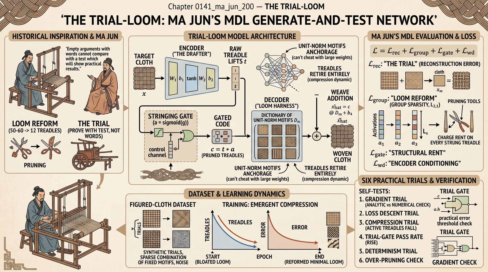

**Architecture — *The Trial-Loom***  ·  🟢 **belief** — grounded in the figure's own surviving works

Compression as a training dynamic: a bank of latent "treadles," each with a learnable gate that says whether it is strung at all, charged rent per strung treadle under a description-length penalty — so gradient pressure prunes the loom to the few that earn their keep, while a *trial gate* reports the fraction of woven outputs that pass a fixed test, never an argument.

▶️ **Run the mind:** [`minds/chapter_0141_ma_jun_200.py`](minds/chapter_0141_ma_jun_200.py)  —  `python3 minds/chapter_0141_ma_jun_200.py --test`

---

## 142 · Cyprian of Carthage
**c. 200 – 258 CE — Carthage · Roman-African**  |  *Theology · Church Governance*

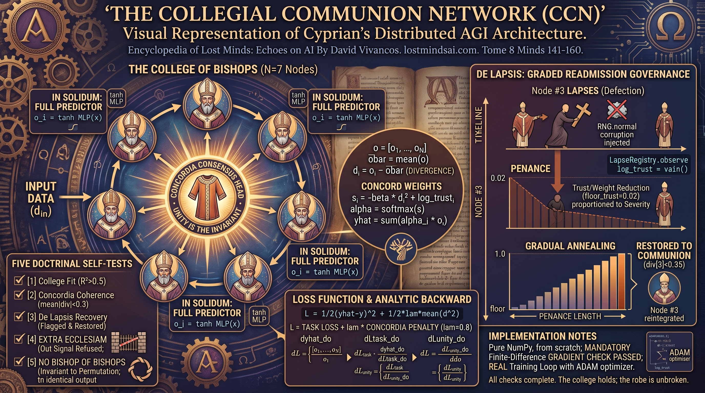

**Architecture — *The Collegial Communion Network***  ·  🟢 **belief** — grounded in the figure's own surviving works

*In solidum* as a distributed system: every bishop-expert produces a full verdict, weighted by nearness to the college mean so coherence begets influence; a *concordia* loss penalises divergence, out-of-communion inputs are refused regardless of form, and a non-differentiable lapse registry places a drifting node under penance proportioned to its fall — with no node privileged to cast the deciding vote.

▶️ **Run the mind:** [`minds/chapter_0142_Cyprian_of_Carthage_200.py`](minds/chapter_0142_Cyprian_of_Carthage_200.py)  —  `python3 minds/chapter_0142_Cyprian_of_Carthage_200.py --test`

---

## 143 · Plotinus
**c. 205 – 270 CE — Lycopolis, Roman Egypt → Rome · Greco-Egyptian**  |  *Philosophy · Neoplatonism*

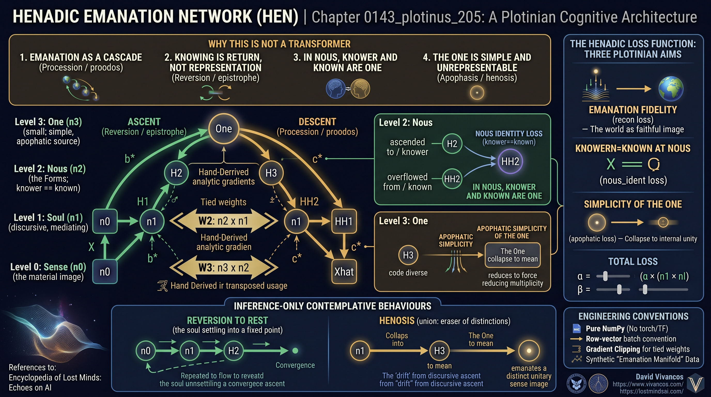

**Architecture — *The Henadic Emanation Network***  ·  🟢 **belief** — grounded in the figure's own surviving works

Emanation as a tied autoencoder — Sense ↔ Soul ↔ Nous ↔ One — where the operator that ascends to a Form is the transpose of the operator by which the Form overflows into its image (knower and known are one), with a contemplative-identity loss at Nous and an apophatic penalty driving the summit code toward a single shared value: the summit is less, not more.

▶️ **Run the mind:** [`minds/chapter_0143_plotinus_205.py`](minds/chapter_0143_plotinus_205.py)  —  `python3 minds/chapter_0143_plotinus_205.py --test`

---

## 144 · Longinus
**c. 213 – 273 CE — Emesa → Athens → Palmyra · Greek (Roman East)**  |  *Literary Criticism · Rhetoric · Philology*

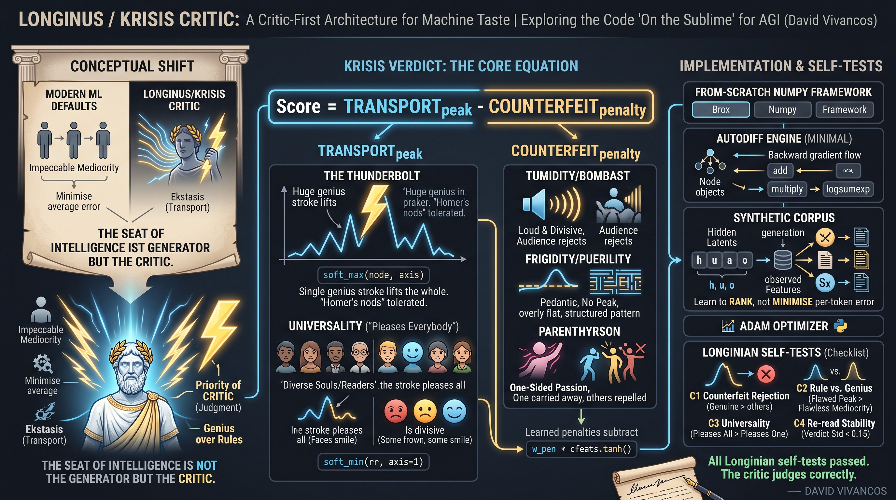

**Architecture — *The Krisis Critic — a Critic-First Architecture for Taste***  ·  🟢 **belief** — grounded in the figure's own surviving works

Build the critic before the voice: a taste function scores a passage by the soft-max *peak* over its strokes rather than the mean, counts a stroke as elevated only if a diverse ensemble of readers all respond and the response survives re-reading noise, and is trained solely to rank genuine sublimity above its three counterfeits — the tumid, the frigid, and *parenthyrson*.

▶️ **Run the mind:** [`minds/chapter_0144_longinus_213.py`](minds/chapter_0144_longinus_213.py)  —  `python3 minds/chapter_0144_longinus_213.py --test`

---

## 145 · Mani
**c. 216 – 274 CE — Ctesiphon, Babylonia · Persian**  |  *Religion · Dualism*

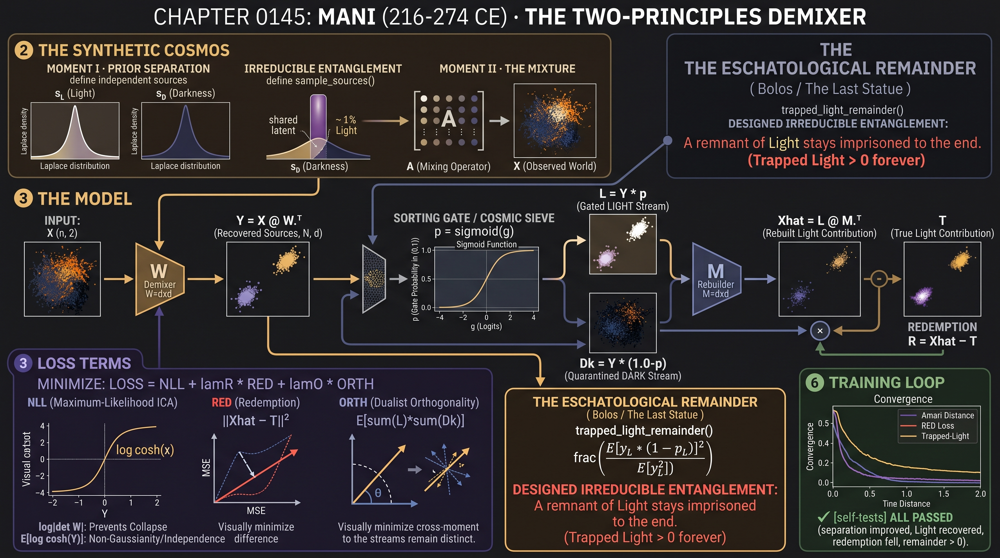

**Architecture — *The Two-Principles Demixer***  ·  🟢 **belief** — grounded in the figure's own surviving works

Blind source separation as cognition: an unknown operator entangles Light and Darkness into one observed signal; a Demixer learns to invert it under an Infomax objective, a soft Sorting Gate routes recovered Light onward and quarantines the rest, a Rebuilder re-mixes the liberated Light into the world — and the trapped-Light remainder is reported every step and never trained to zero.

▶️ **Run the mind:** [`minds/chapter_0145_mani_216.py`](minds/chapter_0145_mani_216.py)  —  `python3 minds/chapter_0145_mani_216.py --test`

---

## 146 · Porphyry
**c. 234 – c. 305 CE — Tyre, Phoenicia · Phoenician-Greek**  |  *Philosophy · Logic · Classification*

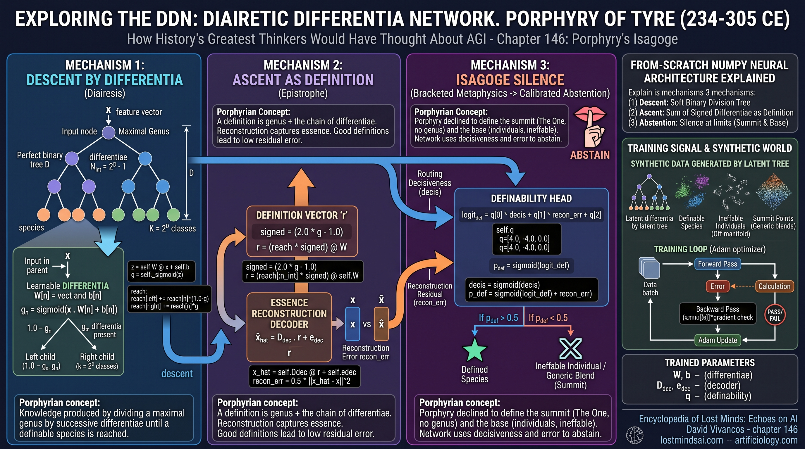

**Architecture — *The Diairetic Differentia Network***  ·  🟢 **belief** — grounded in the figure's own surviving works

Knowing is dividing: a soft binary division tree whose every internal node owns a learnable *differentia*, an ascent decoder that rebuilds the input from the signed chain of differences actually traversed (the definition), and a definability head that abstains at the two places the tree cannot reach — the summit with no genus above it, and the individual that cannot be rebuilt from generic differences.

▶️ **Run the mind:** [`minds/chapter_0146_porphyry_234.py`](minds/chapter_0146_porphyry_234.py)  —  `python3 minds/chapter_0146_porphyry_234.py --test`

---

## 147 · Constantine the Great
**272 – 337 CE — Naissus → Rome → Constantinople · Roman**  |  *Governance · Religion · Law*

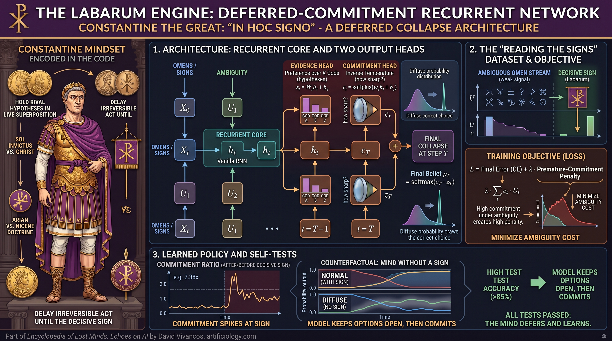

**Architecture — *The Labarum Engine***  ·  🟢 **belief** — grounded in the figure's own surviving works

A belief accumulator with two heads: an evidence head produces preferences over rival hypotheses ("gods"), and a separate commitment head emits one non-negative inverse temperature per step that decides how sharply belief may collapse into decision — rewarded for a correct final choice, charged for collapsing early, and able, when the decisive sign never arrives, to hold near maximum uncertainty indefinitely.

▶️ **Run the mind:** [`minds/chapter_0147_constantine_the_great_272.py`](minds/chapter_0147_constantine_the_great_272.py)  —  `python3 minds/chapter_0147_constantine_the_great_272.py --test`

---

## 148 · St. Ambrose
**c. 339 – 397 CE — Trier → Milan · Roman**  |  *Theology · Liturgy*

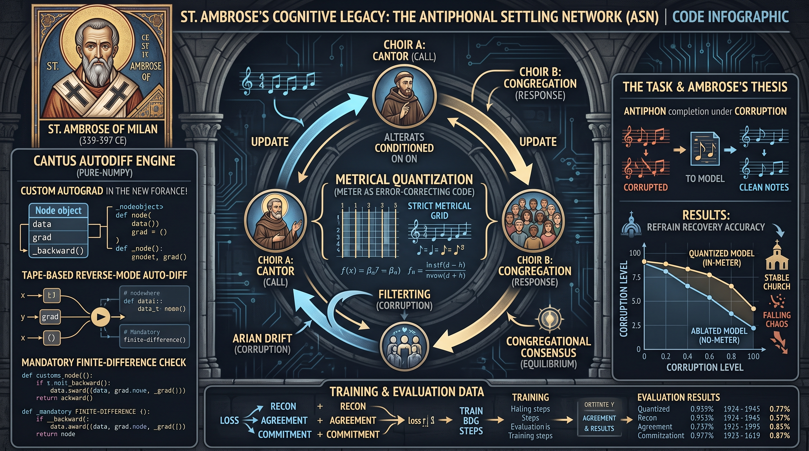

**Architecture — *The Antiphonal Settling Network***  ·  🟢 **belief** — grounded in the figure's own surviving works

Two coupled recurrent choirs alternate for several rounds, each updating from the shared verse plus the *other* choir's last utterance; every utterance is snapped onto a learned metrical codebook by soft vector quantisation, and an antiphonal-agreement loss rewards convergence — so under rising corruption the metered network holds the refrain where an unmetered control loses it.

▶️ **Run the mind:** [`minds/chapter_0148_st_ambrose_339.py`](minds/chapter_0148_st_ambrose_339.py)  —  `python3 minds/chapter_0148_st_ambrose_339.py --test`

---

## 149 · St. Jerome
**c. 347 – 420 CE — Stridon, Dalmatia → Bethlehem · Roman (Dalmatian)**  |  *Theology · Translation · Textual Criticism*

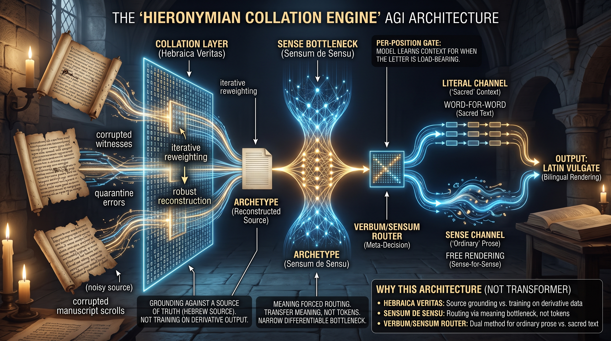

**Architecture — *The Hieronymian Collation Engine***  ·  🟢 **belief** — grounded in the figure's own surviving works

Differentiable stemmatics: several corrupted witnesses of one source are aligned and iteratively reweighted so readings that agree with the emerging archetype gain authority and corrupt ones are quarantined; the reconstruction must pass a narrow *sense bottleneck* before re-expression, and a per-position *verbum/sensum* router learns from context when the order of the words is itself load-bearing.

▶️ **Run the mind:** [`minds/chapter_0149_st_jerome_347.py`](minds/chapter_0149_st_jerome_347.py)  —  `python3 minds/chapter_0149_st_jerome_347.py --test`

---

## 150 · Theodosius I
**347 – 395 CE — Cauca, Hispania → Constantinople · Roman (Hispanic)**  |  *Governance · Religion · Law*

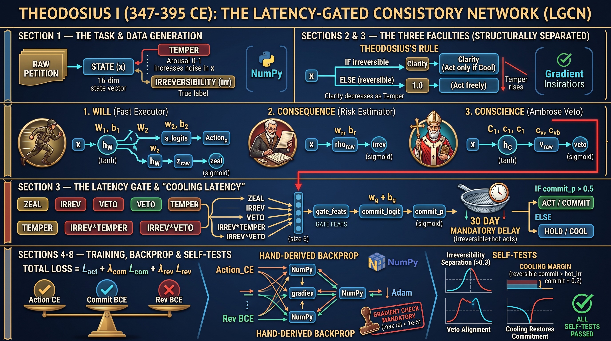

**Architecture — *The Latency-Gated Consistory Network***  ·  🔵 **extrapolated** — no philosophy of mind survives; inferred from documented deeds

A differentiable commit gate in which a fast, confident will is throttled by an estimate of irreversibility, amplified by temper, and by a structurally separated conscience that holds a veto and no parameters in common with the will — reversible actions fire at once, irreversible-and-uncertain ones are held, and a penance loop re-weights the faculty that erred rather than denying the error.

▶️ **Run the mind:** [`minds/chapter_0150_theodosius_i_347.py`](minds/chapter_0150_theodosius_i_347.py)  —  `python3 minds/chapter_0150_theodosius_i_347.py --test`

---

## 151 · Augustine of Hippo
**354 – 430 CE — Thagaste, Numidia → Hippo · Roman-African**  |  *Philosophy · Theology*

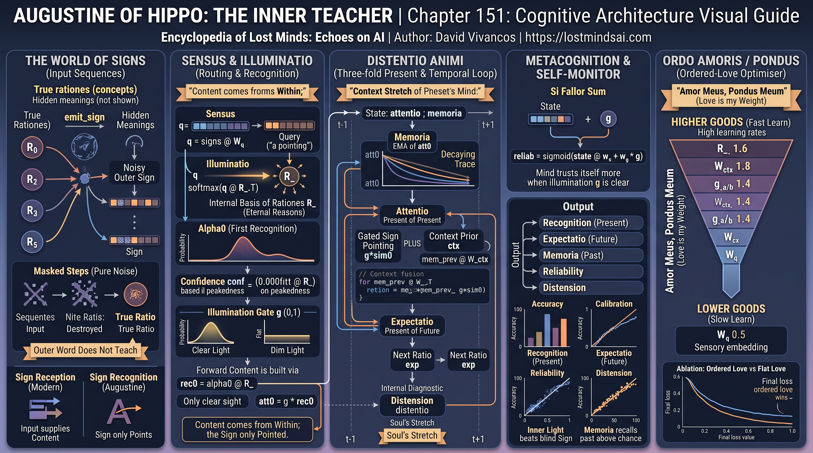

**Architecture — *The Inner Teacher — an Illuminationist Recognition Network***  ·  🟢 **belief** — grounded in the figure's own surviving works

No one learns from words: the noisy sign never supplies the forward representation, only a pointing over an internal basis of eternal *rationes*, gated by an illumination threshold below which the word is heard and nothing is understood — with a *distentio* of three temporal registers held at once, and an *ordo amoris* optimiser that lets the inner basis learn faster than the sensory surface.

▶️ **Run the mind:** [`minds/chapter_0151_augustine_of_hippo_354.py`](minds/chapter_0151_augustine_of_hippo_354.py)  —  `python3 minds/chapter_0151_augustine_of_hippo_354.py --test`

---

## 152 · Hypatia
**c. 360 – 415 CE — Alexandria, Roman Egypt · Greek (Alexandrian)**  |  *Mathematics · Astronomy · Philosophy*

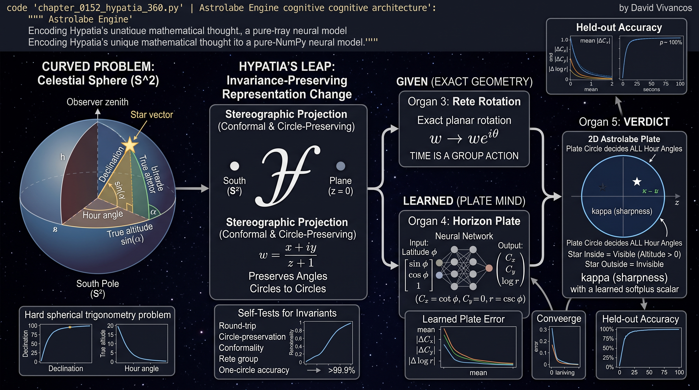

**Architecture — *The Astrolabe Engine***  ·  🟡 **mediated** — no words of their own survive; known through others' accounts

Solve where the invariants are provable: stars on a sphere are stereographically projected to a plane whose map keeps angles and sends circles to circles, so "above the horizon?" becomes "inside one fixed circle?" and the passage of time is an exact rotation of the rete — the only learned organ is the horizon plate, and the model rediscovers its closed form from data.

▶️ **Run the mind:** [`minds/chapter_0152_hypatia_360.py`](minds/chapter_0152_hypatia_360.py)  —  `python3 minds/chapter_0152_hypatia_360.py --test`

---

## 153 · Mesrop Mashtots
**c. 362 – 440 CE — Hatsekats, Taron → Vagharshapat · Armenian**  |  *Linguistics · Alphabet*

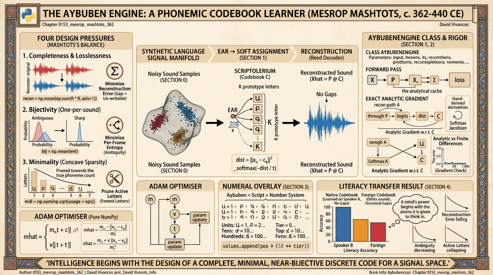

**Architecture — *The Aybuben Engine***  ·  🔵 **extrapolated** — no philosophy of mind survives; inferred from documented deeds

Learned tokenisation as alphabet design: a scriptorium of prototype letters, a soft vector-quantiser assigning each sound-frame to letters, and a reed that reconstructs the sound — trained under exactly Mashtots's four pressures (completeness, losslessness, bijectivity, minimality), then canonically ordered so every letter doubles as a numeral, and tested by teaching a fresh reader a new speaker.

▶️ **Run the mind:** [`minds/chapter_0153_mesrop_mashtots_362.py`](minds/chapter_0153_mesrop_mashtots_362.py)  —  `python3 minds/chapter_0153_mesrop_mashtots_362.py --test`

---

## 154 · Alaric I
**c. 370 – 410 CE — Peuce, Danube delta → Italy · Visigothic**  |  *Military · Leadership · Diplomacy*

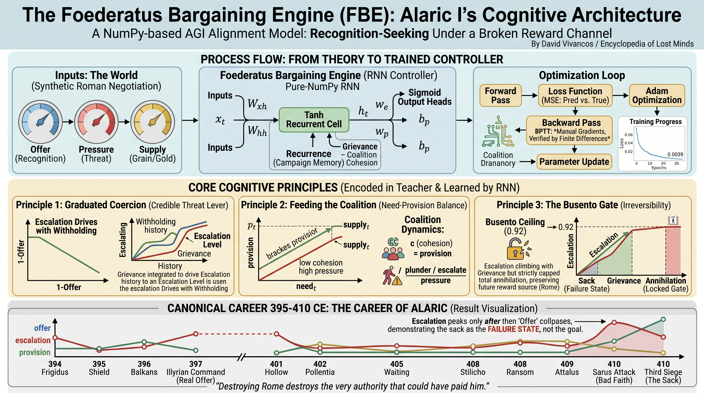

**Architecture — *The Foederatus Bargaining Engine***  ·  🔵 **extrapolated** — no philosophy of mind survives; inferred from documented deeds

A recognition-seeking coalition agent under a broken reward channel: standing granted by a principal that keeps withholding it, a cohesion homeostat the agent must continuously feed or fracture, graduated coercion that chooses the smallest credible threat, and a *Busento gate* that brakes escalation strictly below the point where the source of the reward is annihilated.

▶️ **Run the mind:** [`minds/chapter_0154_alaric_i_370.py`](minds/chapter_0154_alaric_i_370.py)  —  `python3 minds/chapter_0154_alaric_i_370.py --test`

---

## 155 · St. Patrick
**c. 385 – c. 461 CE — Roman Britain → Ireland · Roman-British**  |  *Theology · Mission*

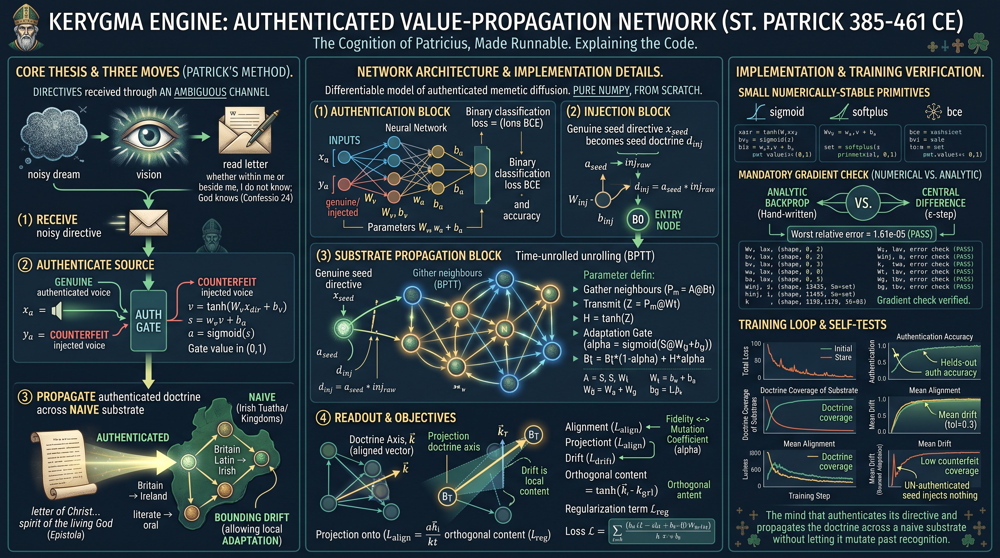

**Architecture — *The Kerygma Engine***  ·  🟢 **belief** — grounded in the figure's own surviving works

Authenticated memetic diffusion: an auth gate classifies each incoming directive as genuine or injected before anything else may happen, an authenticated directive becomes a seed doctrine, the doctrine diffuses over a graph of naive nodes each adapting it through a per-node gate, and a readout scores alignment against a drift penalty — so the network learns to reject the counterfeit voice *and* carry the value to the far nodes recognisably.

▶️ **Run the mind:** [`minds/chapter_0155_st_patrick_385.py`](minds/chapter_0155_st_patrick_385.py)  —  `python3 minds/chapter_0155_st_patrick_385.py --test`

---

## 156 · Kalidasa
**c. 400 – 450 CE — Gupta India · Indian (Gupta)**  |  *Poetry · Drama*

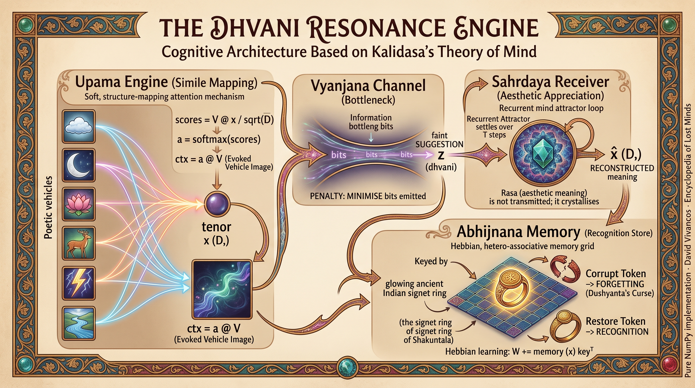

**Architecture — *The Dhvani Resonance Engine***  ·  🟢 **belief** — grounded in the figure's own surviving works

Minimise the bits emitted while a fixed-capacity receiver still reconstructs the meaning: an *upamā* engine of soft structure-mapping over a bank of poetic vehicles, a *vyañjanā* channel with an explicit rate penalty, a *sahṛdaya* receiver that settles the faint seed into a completed *rasa* over several steps, and an *abhijñāna* memory addressed only by its token — lose the ring and the memory is unreachable, intact.

▶️ **Run the mind:** [`minds/chapter_0156_kalidasa_400.py`](minds/chapter_0156_kalidasa_400.py)  —  `python3 minds/chapter_0156_kalidasa_400.py --test`

---

## 157 · Vatsyayana
**fl. c. 400 – 500 CE — Northern India · Indian**  |  *Philosophy · Logic · Epistemology*

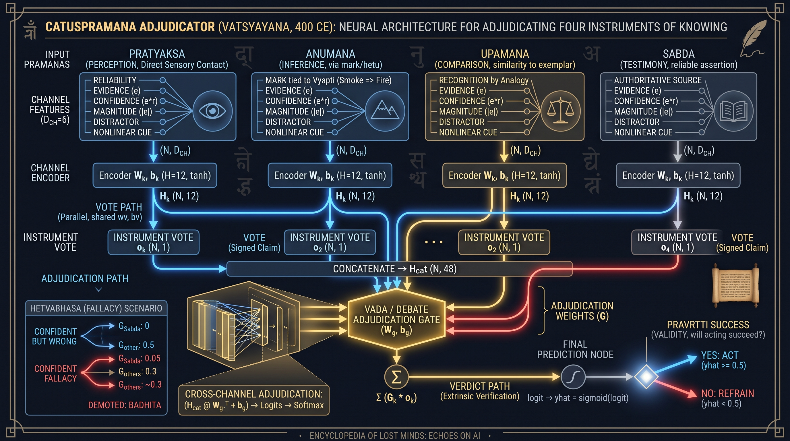

**Architecture — *The Catuṣpramāṇa Adjudicator***  ·  🟢 **belief** — grounded in the figure's own surviving works

A federated adjudicator, not a monolith: four separate channel encoders — perception, inference, comparison, testimony — each carrying its own provenance and its own characteristic fallacy check, weighed jointly under structured debate to fix belief only once doubt is resolved, and certified extrinsically by the success of the action the cognition licenses rather than by inspection of the cognition itself.

▶️ **Run the mind:** [`minds/chapter_0157_vatsyayana_400.py`](minds/chapter_0157_vatsyayana_400.py)  —  `python3 minds/chapter_0157_vatsyayana_400.py --test`

---

## 158 · Attila the Hun
**c. 406 – 453 CE — Pannonian Basin, Danube · Hunnic**  |  *Military · Diplomacy · Leadership*

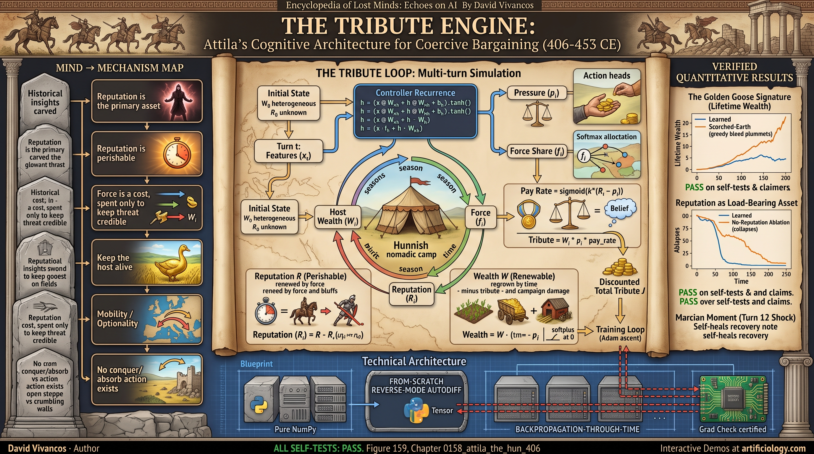

**Architecture — *The Tribute Engine***  ·  🟡 **mediated** — no words of their own survive; known through others' accounts

A policy that maximises discounted total tribute across a long horizon by managing one asset — the belief, held inside the adversary's head, that it cannot be stopped: violence spent only to keep the threat credible, the host deliberately kept alive because a paying Rome outperforms a burned one, and no institution built, so the intelligence lives entirely in a managed reputation.

▶️ **Run the mind:** [`minds/chapter_0158_attila_the_hun_406.py`](minds/chapter_0158_attila_the_hun_406.py)  —  `python3 minds/chapter_0158_attila_the_hun_406.py --test`

---

## 159 · Proclus
**412 – 485 CE — Constantinople → Athens · Greek (Athenian)**  |  *Philosophy · Neoplatonism*

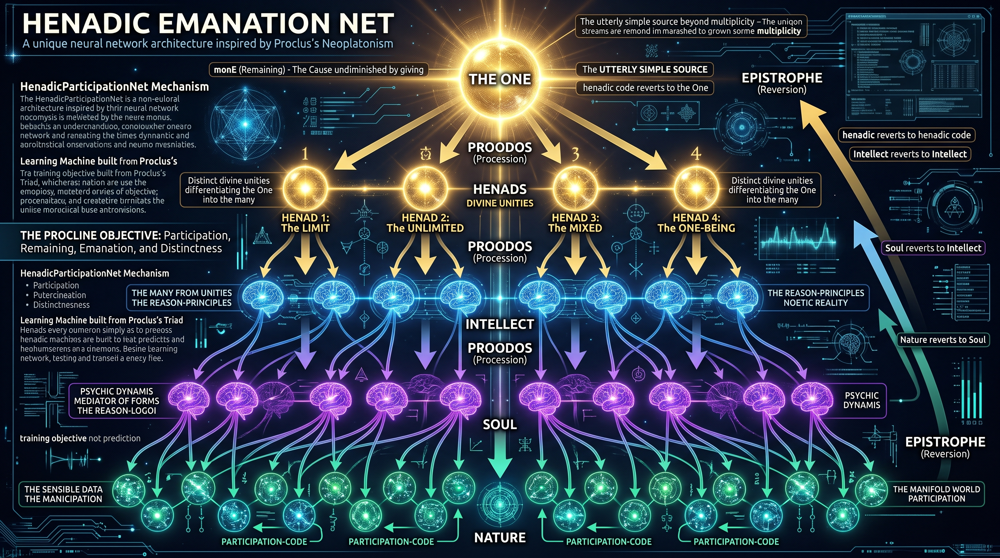

**Architecture — *The Henadic Emanation Engine — the Procline Triad***  ·  🟢 **belief** — grounded in the figure's own surviving works

The Procline triad as a learning machine: the One proceeds through learned henads to Intellect, Soul and the sensible data, and reversion runs the other way; *participation* demands every datum revert to a henadic code and proceed back to reconstruct itself, *remaining* demands the cause be undiminished by giving (a round-trip identity), and a reversion test asks each claim to trace itself to the root.

▶️ **Run the mind:** [`minds/chapter_0159_proclus_412.py`](minds/chapter_0159_proclus_412.py)  —  `python3 minds/chapter_0159_proclus_412.py --test`

---

## 160 · Bodhidharma
**c. 470 – 540 CE — India → Northern Wei China · Indian → Chinese**  |  *Buddhism · Meditation*

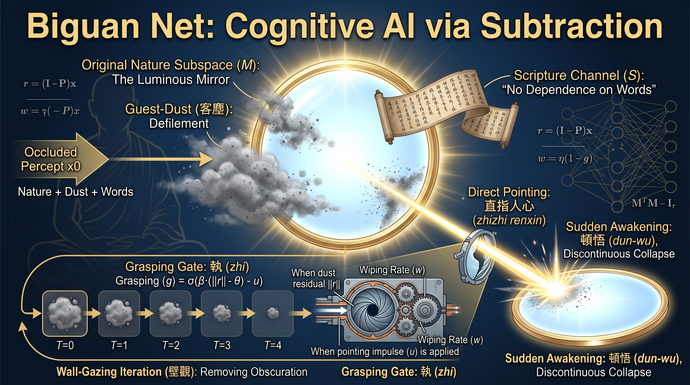

**Architecture — *The Biguan Net — a Wall-Gazing Subtraction Network***  ·  🟢 **belief** — grounded in the figure's own surviving works

Cognition by subtraction: a learned low-rank subspace is the mirror, wall-gazing is a fixed-point iteration that removes the out-of-subspace residual rather than adding features, a grasping gate throttles the wiping so that clinging harder wipes less, and a single external impulse — the master's wordless pointing — transiently collapses grasping and lets the state snap onto the mirror in one or two steps.

▶️ **Run the mind:** [`minds/chapter_0160_bodhidharma_470.py`](minds/chapter_0160_bodhidharma_470.py)  —  `python3 minds/chapter_0160_bodhidharma_470.py --test`

---

## How the minds are reconstructed

Every entry is built research-first: the figure's surviving works and current scholarship are gathered and each source verified before any architecture is written. Where evidence is thin, the chapter says so rather than inventing an inner life. Each figure's **provenance** is set to one of three real values:

- 🟢 **belief** — the figure's own surviving works or recorded doctrine ground the entry.
- 🟡 **mediated** — no words of their own survive; they are known only through others' (often hostile or legendary) accounts, and the entry says so.
- 🔵 **extrapolated** — no philosophy of mind survives at all; the entry is inferred from documented deeds (typical of kings and builders), and the entry says so.

Fifteen of these twenty left words of their own. The five exceptions sit at the centre of the tome's subject rather than at its edge. **Hypatia** left not one sentence in her own hand and reaches us through a student who adored her, a historian who admired her from outside, and a bishop who called her a sorceress; **Attila** survives through a single close eyewitness whose account is preserved in fragments inside a later historian with a Gothic pedigree to promote. **Theodosius**, **Mesrop Mashtots** and **Alaric** are read from laws, deeds and inventions rather than from doctrine — Alaric's every witness had a reason to distort. A volume about building things that outlast their builders cannot pretend its own sources arrived intact, and several chapters whose provenance is 🟢 say plainly where the record is still thin: **Ma Jun** left exactly one sentence, carried by a friend and preserved inside a later commentator's notes; the treatise that made **Longinus** immortal is now generally assigned to an unknown author of the first century; **Kalidasa** left no biography at all; **Vatsyayana** is still fused in reference books with the compiler of the *Kāma-Sūtra*; and **Bodhidharma**'s genuine deposit is roughly two pages.

Each reconstructed mind is then measured against the **[Artificiology E-AGI Barometer](https://artificiology.com/barometer.html)** — eight capability dimensions (Cognitive Processing 🧩, Embodied Cognition 🤸, World Modeling 🌍, Consciousness 👁️, Language Understanding 💭, Emotional Intelligence ❤️, Creativity ✨, Autonomy 🎯) — so a Bronze-Age lawgiver and a Gothic king can be compared on the same yardstick.

---

[← Tome 7](tome7.md) · [Repository README](readme.md)

### Read & explore
- 🌐 **Encyclopedia:** [https://lostmindsai.com](https://lostmindsai.com)
- 📖 **Tome 8 (Amazon):** [https://www.amazon.com/dp/B0HH8RTCXF](https://www.amazon.com/dp/B0HH8RTCXF)
- 🧪 **Interactive demos & résumé:** [https://artificiology.com/](https://artificiology.com/)
- 📊 **E-AGI Barometer:** [https://artificiology.com/barometer.html](https://artificiology.com/barometer.html)
- ✍️ **Author — David Vivancos:** [https://www.vivancos.com/](https://www.vivancos.com/)
