# Tome 9 — Minds 161–180
### *The Entrusted Mind — Byzantium, Nālandā, the Old North & the Last Poets of the Jāhiliyya*
**Encyclopedia of Lost Minds: Echoes on AI** · *476 – 575 CE*

[🌐 Encyclopedia](https://lostmindsai.com) · [📖 Buy Tome 9 on Amazon](https://www.amazon.com/dp/B0HJC1QF59) · [🧪 Interactive Demos](https://artificiology.com/) · [📊 E-AGI Barometer](https://artificiology.com/barometer.html) · [✍️ Author](https://www.vivancos.com/) · [⭐ Repository](https://github.com/DavidVivancos/LostMindsAI)

[← Tome 8](tome8.md) · [Repository README](readme.md)

---

Tome 9 runs from **Aryabhata** to **al-Khansāʾ** — twenty reconstructed minds, each rendered on two planes. The **abstract plane** distils the thinker's cognitive signature into an interactive 3D mind-map; the **mechanistic plane** turns that same signature into a small, *runnable* neural architecture, built from scratch in NumPy, gradient-checked, trained and self-tested.

This page collects the twenty **visual mind-map explainers** for this tome and links each to its companion architecture. Runnable code lives in [`minds/`](minds/); the explainer images live in [`maps/`](maps/).

> Every architecture here executes and passes its own self-test suite (a mandatory finite-difference gradient check plus a real training loop). No number is hard-coded — each is produced live on the machine that runs the file.

Where Tome 8 asked what must be *built* so that an answer does not die with the mind that reached it, Tome 9 asks what a mind may do with what it holds in trust. These twenty were the makers' heirs: each was handed a body of material made by somebody else — a contradictory archive, a rival school's logic, a year of chant held in living memory, a battle nobody survived to narrate, a letter sealed by a king — and had to decide what was permitted: compress, delete, rewrite, harmonise, freeze, re-present, refuse to summarise, or leave unread. From unconnected traditions they converge on a gate rather than a policy: a cell that forbids speech, a register that learning may not touch, a wire that carries knowledge one way and force not at all, a seal whose price is measured, a silence scored as a competence. If the previous tome's keyword was *constitution*, this one's is *custody*.

---

## The Twenty at a Glance

| # | Mind | Era | Civilization | Architecture | Provenance |
|---|------|-----|--------------|--------------|:----------:|
| 161 | [Aryabhata](#161--aryabhata) | 476 – c. 550 CE | Indian (Gupta) | *The Kuṭṭaka-Jyā Engine* | 🟢 |
| 162 | [Boethius](#162--boethius) | c. 477 – 524 CE | Roman (Ostrogothic Italy) | *The Boethian Consolation Network* | 🟢 |
| 163 | [Dignāga](#163--dignāga) | c. 480 – 540 CE | Indian | *Apoha-Net — a substrate built out of negations* | 🟢 |
| 164 | [Benedict of Nursia](#164--benedict-of-nursia) | c. 480 – c. 547 CE | Late Roman (Italy) | *Horarium — a stability-anchored continual learner* | 🟢 |
| 165 | [Justinian I](#165--justinian-i) | c. 482 – 565 CE | Byzantine | *The Antinomy Engine* | 🟢 |
| 166 | [Theodora](#166--theodora) | c. 500 – 548 CE | Byzantine | *The Sanctuary-Fork Network* | 🟡 |
| 167 | [Pseudo-Dionysius](#167--pseudo-dionysius) | fl. c. 485 – 528 CE | Syrian (Greek-writing) | *The Aphairetic Hierarchy Network — Hierourgia* | 🟢 |
| 168 | [Imruʾ al-Qays](#168--imruʾ-al-qays) | c. 501 – c. 544 CE | Arab (Kinda) | *Qayd al-Awābid — The Fetter of the Wild* | 🟢 |
| 169 | [Yared of Aksum](#169--yared-of-aksum) | trad. c. 505 – 571 CE | Aksumite Ethiopian | *Mǝlǝkkǝt — The Reference-Memory Chant Machine* | 🟡 |
| 170 | [Dharmakīrti](#170--dharmakīrti) | c. 530 – 610 CE | Indian (Nālandā) | *The Apoha Engine — an exclusion-field architecture* | 🟢 |
| 171 | [Llywarch Hen](#171--llywarch-hen) | legendary c. 534 – 608 CE | Brythonic (Old North / Powys) | *The Elegiac Persona Network* | 🟡 |
| 172 | [Taliesin](#172--taliesin) | fl. c. 534 – 599 CE | Brythonic (Welsh bardic) | *PEIR — the Poisoned-Excess Incidental-Capture Rebirth engine* | 🟡 |
| 173 | [Zhiyi](#173--zhiyi) | 538 – 597 CE | Chinese (Chen → Sui) | *The Yinian Lattice — One Thought, Three Thousand Realms* | 🟢 |
| 174 | [Myrddin Wyllt](#174--myrddin-wyllt) | fl. 573 CE (legendary) | Brittonic (Old North) | *CELYDDON — a seam-aware disjunctive chronicle engine* | 🟡 |
| 175 | [Gregory I](#175--gregory-i) | c. 540 – 604 CE | Roman | *The Discretio Engine* | 🟢 |
| 176 | [Ṭarafa ibn al-ʿAbd](#176--ṭarafa-ibn-al-ʿabd) | c. 543 – c. 569 CE | Arab (Bakr) | *Ṭiwal — The Slackened-Tether Network* | 🟢 |
| 177 | [Aneirin](#177--aneirin) | fl. c. 550 – 600 CE | Brythonic (Gododdin) | *CATRAETH — Tally, Roster & Elegiac Transcription Heads* | 🟢 |
| 178 | [Isidore of Seville](#178--isidore-of-seville) | c. 560 – 636 CE | Visigothic Hispania | *ORIGO — The Derivation Cell* | 🟢 |
| 179 | [Prince Shōtoku](#179--prince-shōtoku) | 574 – 622 CE | Japanese (Asuka) | *The Ring of Seventeen* | 🟡 |
| 180 | [al-Khansāʾ](#180--al-khansāʾ) | c. 575 – c. 645 CE | Arab (Banū Sulaym) | *The Vigil Register* | 🟢 |

**Provenance** — 🟢 belief · 🟡 mediated · 🔵 extrapolated. See [How the minds are reconstructed](#how-the-minds-are-reconstructed).

---

## 161 · Aryabhata
**476 – c. 550 CE — Kusumapura (Pāṭaliputra) · Indian (Gupta)**  |  *Mathematics · Astronomy*

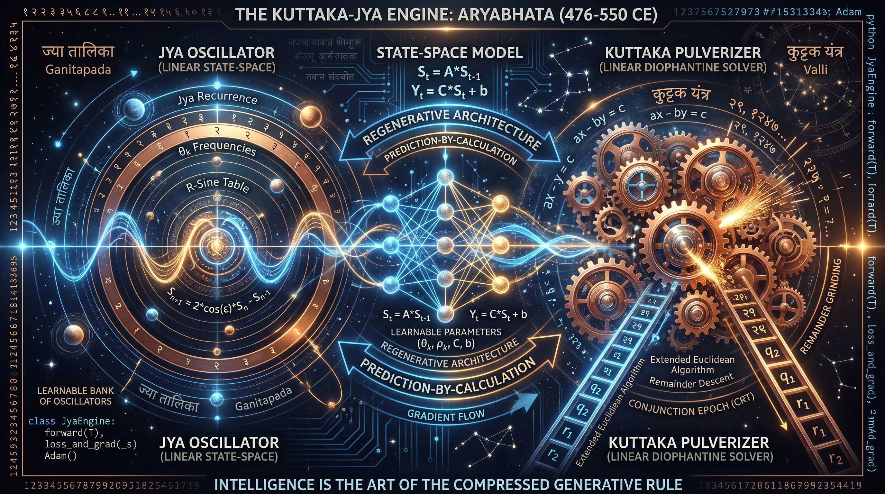

**Architecture — *The Kuṭṭaka-Jyā Engine***  ·  🟢 **belief** — grounded in the figure's own surviving works

Intelligence as the compressed generative rule: a learnable bank of planar rotors — each the second-difference sine recurrence generalised to a scaled rotation — watches a short window of a compound periodic process and predicts by rolling the rule forward, storing frequencies rather than signals; a Horner positional encoder regenerates magnitude from a digit-string, and an exact, non-learned pulverizer (extended Euclid) answers *when do two cycles realign*, cross-checked against the rotors so the two instruments must describe one world.

▶️ **Run the mind:** [`minds/chapter_0161_aryabhata_476.py`](minds/chapter_0161_aryabhata_476.py)  —  `python3 minds/chapter_0161_aryabhata_476.py`

---

## 162 · Boethius
**c. 477 – 524 CE — Rome & Pavia · Roman (Ostrogothic Italy)**  |  *Philosophy · Logic · Music*

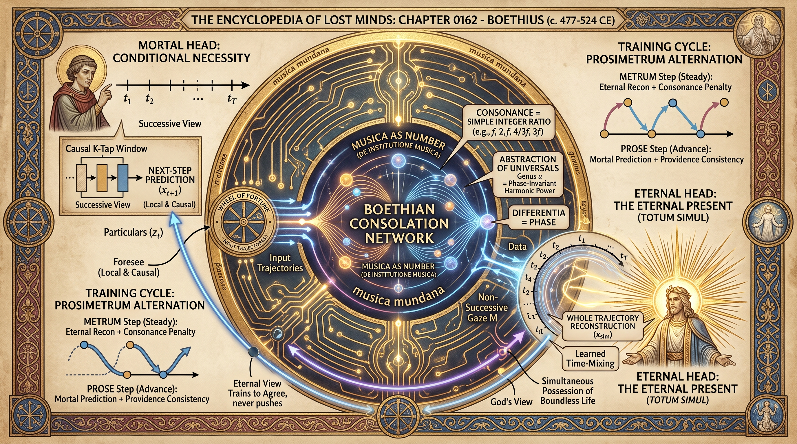

**Architecture — *The Boethian Consolation Network***  ·  🟢 **belief** — grounded in the figure's own surviving works

Two grades of apprehension of one trajectory: a strictly causal *mortal faculty* that predicts the next instant from a short window (ratio), and a non-successive *eternal faculty* that holds the whole trajectory as present (intelligentia). The genus is the phase-invariant harmonic content pooled across all instants — exactly invariant to Fortune turning her wheel — regularised toward consonance by penalising amplitude, and the eternal head is trained against a detached copy of the mortal one so that foreknowledge tracks the act with high fidelity while its force upon the act is verifiably zero.

▶️ **Run the mind:** [`minds/chapter_0162_boethius_477.py`](minds/chapter_0162_boethius_477.py)  —  `python3 minds/chapter_0162_boethius_477.py`

---

## 163 · Dignāga
**c. 480 – 540 CE — Kāñcī, Nālandā & Odivisha · Indian**  |  *Logic · Epistemology*

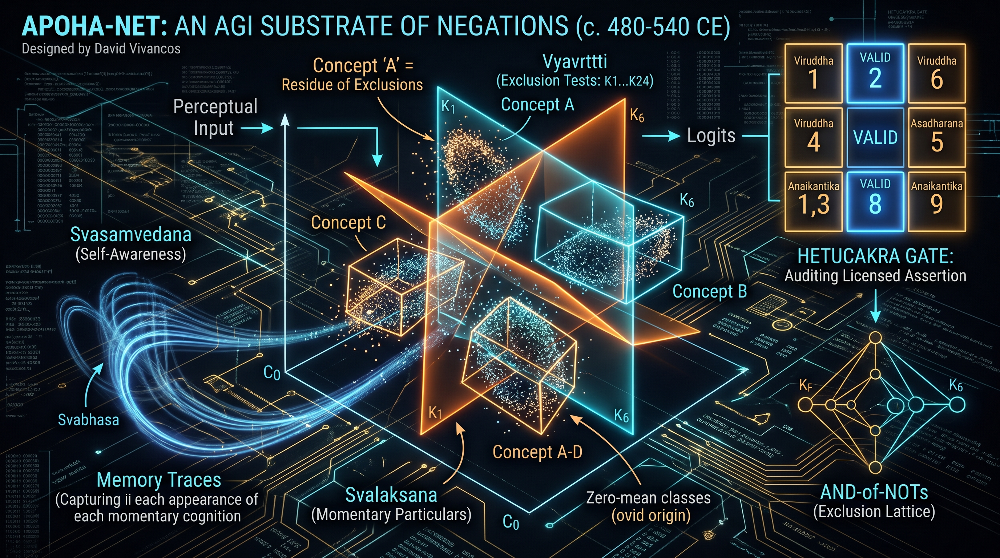

**Architecture — *Apoha-Net — a substrate built out of negations***  ·  🟢 **belief** — grounded in the figure's own surviving works

A classifier that stores no positive class representation anywhere: a shared pool of exclusion tests (razors that cut the space of particulars into excluded / survives) and, per concept, a soft mask saying which exclusions it demands — a concept is an AND-of-NOTs. The trairūpya is built into the loss asymmetrically (presence in the similar class may be partial, absence from the dissimilar class must be total), a frozen perceptual front end stays conceptually mute, a self-cognition trace must suffice for recall, and every reason the net constructs is run through the nine-celled Hetucakra, where only cell 8 licenses speech.

▶️ **Run the mind:** [`minds/chapter_0163_dignaga_dinnaga_480.py`](minds/chapter_0163_dignaga_dinnaga_480.py)  —  `python3 minds/chapter_0163_dignaga_dinnaga_480.py`

---

## 164 · Benedict of Nursia
**c. 480 – c. 547 CE — Nursia, Subiaco & Monte Cassino · Late Roman (Italy)**  |  *Monasticism · Formation · Pedagogy*

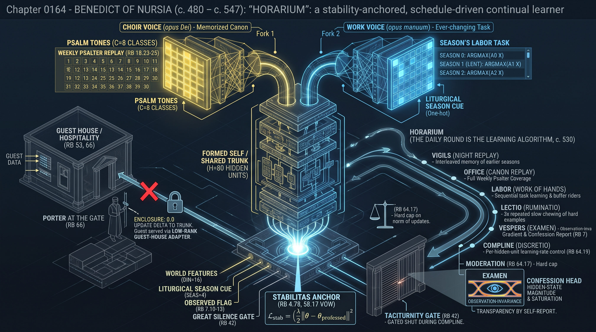

**Architecture — *Horarium — a stability-anchored, schedule-driven continual learner***  ·  🟢 **belief** — grounded in the figure's own surviving works

The timetable is the optimizer: a shared formed self feeds two readout heads that never share an hour — a *choir voice* rehearsing a fixed canon to memorisation and a *work voice* learning the changing task of the season — so the newer cannot crush the older; a *stabilitas* anchor keeps the formed self from migrating except at a chapter meeting where the canon is re-validated; a per-person *discretio* coefficient tempers the pressure; a guest bank receives full capacity and writes nothing into the formed self; and silence is implemented as a gate on the mouth at the appointed hour, not a wound in the capacity.

▶️ **Run the mind:** [`minds/chapter_0164_st_benedict_480.py`](minds/chapter_0164_st_benedict_480.py)  —  `python3 minds/chapter_0164_st_benedict_480.py`

---

## 165 · Justinian I
**c. 482 – 565 CE — Constantinople · Byzantine**  |  *Law · Codification · Governance*

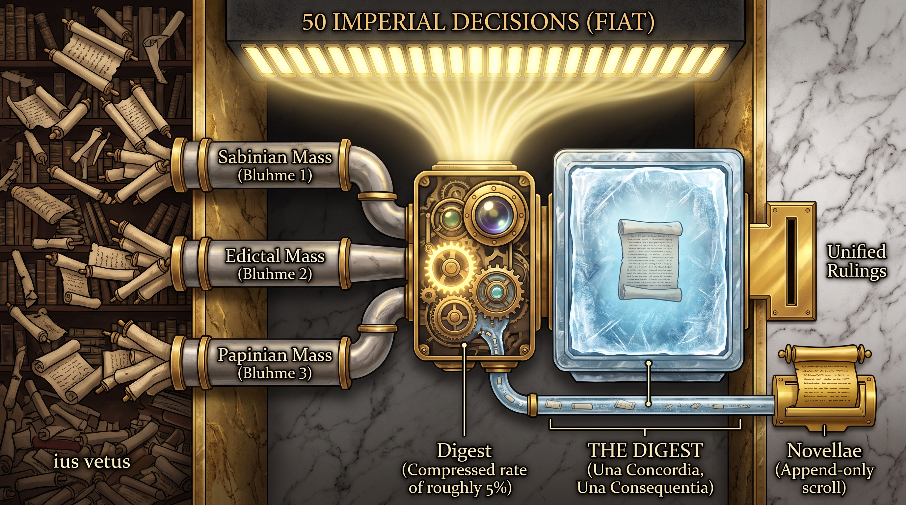

**Architecture — *The Antinomy Engine***  ·  🟢 **belief** — grounded in the figure's own surviving works

A compilation-based mind: cases are scored against a corpus of attested juristic excerpts read through three committee channels under a hard retention quota, with an interpolation head that may move a retrieved authority toward what the present requires while logging the size of every move, an antinomy energy that penalises contradiction within the corpus, fifty numbered decision slots spent only where the citations cannot adjudicate, and promulgation applied as a literal gradient stop — after which only an append-only Novellae channel can change an answer, and nothing can install a concept.

▶️ **Run the mind:** [`minds/chapter_0165_emperor_justinian_i_482.py`](minds/chapter_0165_emperor_justinian_i_482.py)  —  `python3 minds/chapter_0165_emperor_justinian_i_482.py`

---

## 166 · Theodora
**c. 500 – 548 CE — Constantinople · Byzantine**  |  *Governance · Religious Dissent*

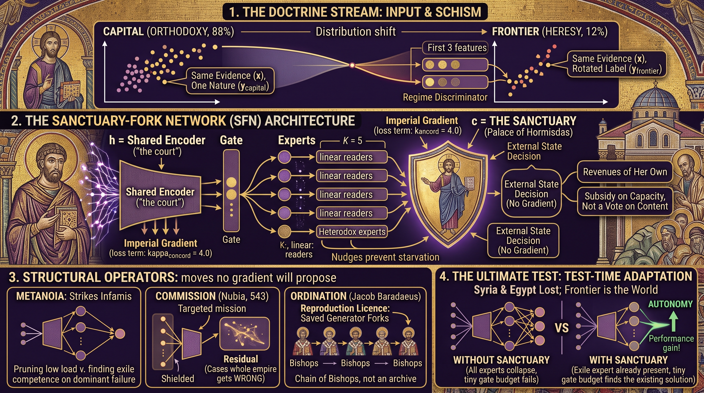

**Architecture — *The Sanctuary-Fork Network ("The Hormisdas Machine")***  ·  🟡 **mediated** — known only through others' accounts

The structural complement of the Antinomy Engine: a mixture of readers under a concord term that rewards agreement, in which the refuted branch is not voted for but *sheltered* — exempted from the majority's gradient by a constitutional floor on the gate's power to defund it — then *ordained*: cloned with a perturbation into a reserve seat so that the losing generator can replicate rather than merely survive as a copy. Ablations show that a subsidy inside the shared gradient produces a well-fed conformist, and that only exemption plus replication preserves a distinct reading when the distribution shifts.

▶️ **Run the mind:** [`minds/chapter_0166_theodora_500.py`](minds/chapter_0166_theodora_500.py)  —  `python3 minds/chapter_0166_theodora_500.py`

---

## 167 · Pseudo-Dionysius
**fl. c. 485 – 528 CE — Syria (probable) · Greek-writing Christian**  |  *Theology · Mysticism*

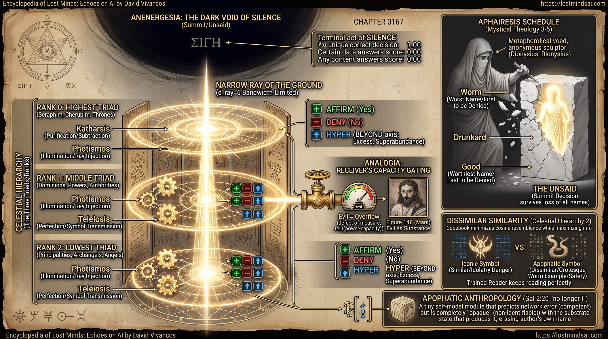

**Architecture — *The Aphairetic Hierarchy Network — "Hierourgia"***  ·  🟢 **belief** — grounded in the figure's own surviving works

Anti-reification engineering: a codebook trained to maximise transmitted information while minimising resemblance (dissimilar similarity), a triple of ranks that each purify, illuminate and perfect with no residual path between them, a three-valued readout (affirm / deny / *beyond*) in which the third value means the axis does not reach, ablation ordered from the least trusted representation to the most, and a scored *silence* output that is the uniquely correct answer on the class of questions where any content answer earns nothing. Accepts `--quick` for a short training run.

▶️ **Run the mind:** [`minds/chapter_0167_pseudo_dionysius_500.py`](minds/chapter_0167_pseudo_dionysius_500.py)  —  `python3 minds/chapter_0167_pseudo_dionysius_500.py`

---

## 168 · Imruʾ al-Qays
**c. 501 – c. 544 CE — Najd, Kinda; d. near Ancyra (tradition) · Arab**  |  *Poetry · Simile · Kingship in Exile*

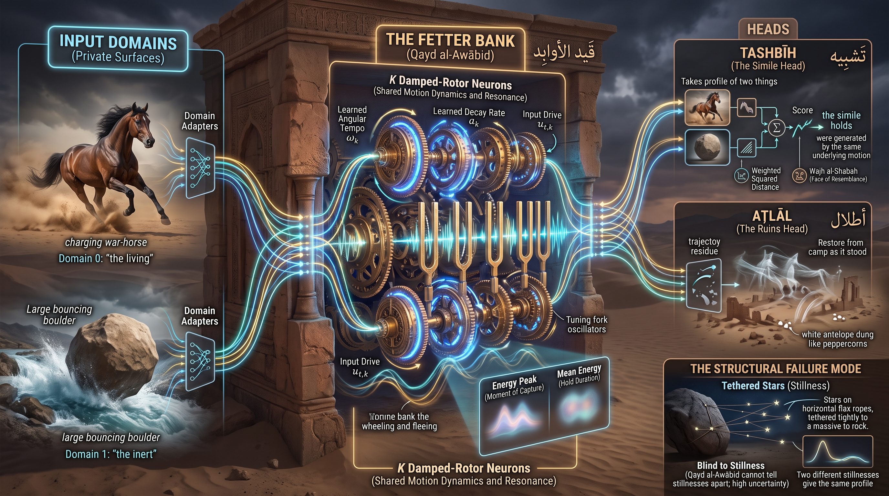

**Architecture — *Qayd al-Awābid — The Fetter of the Wild***  ·  🟢 **belief** — grounded in the figure's own surviving works

Simile as co-registration of dynamics rather than appearance: every sensory channel passes through one shared bank of damped resonators, each a two-dimensional state rotating at a learned tempo and gaining energy only when the input's rhythm matches its own, so that a horse and a boulder in a torrent bind across a gulf of substance while stillness leaks nothing. A halt operation reads a sparse, timestamped residue with most samples missing and reports what moved, how confidently, and how much has been lost — and the night, when nothing moves, is a declared null output rather than a fabrication. Accepts `--quick`.

▶️ **Run the mind:** [`minds/chapter_0168_imru_alqays_501.py`](minds/chapter_0168_imru_alqays_501.py)  —  `python3 minds/chapter_0168_imru_alqays_501.py`

---

## 169 · Yared of Aksum
**trad. c. 505 – 571 CE — Aksum & the Sǝmen · Aksumite Ethiopian**  |  *Music · Notation · Liturgy*

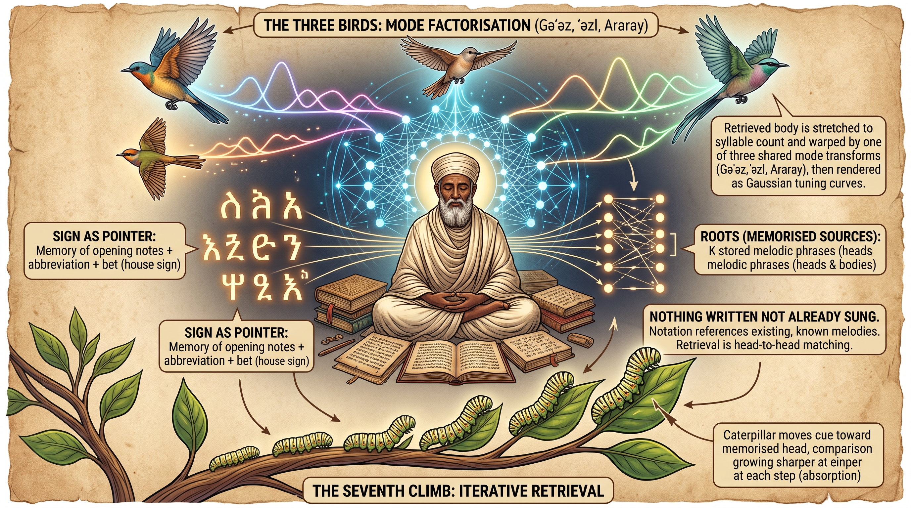

**Architecture — *Mǝlǝkkǝt — The Reference-Memory Chant Machine***  ·  🟡 **mediated** — known only through others' accounts

Nothing is written that is not already sung: melodic roots are stored whole and addressed by their openings, grouped into houses that narrow the search, warped at output by one of three mode operators chosen by the day rather than baked into storage, and retrieved by seven iterated climbs over the page in which the gate admitting new input narrows on every pass. The generator is forbidden to paraphrase what memory hands back, and at the edge of the store the licensed output is *I do not carry this*; affect factored out of memory transfers to untaught modes where a fused model cannot.

▶️ **Run the mind:** [`minds/chapter_0169_yared_505.py`](minds/chapter_0169_yared_505.py)  —  `python3 minds/chapter_0169_yared_505.py`

---

## 170 · Dharmakīrti
**c. 530 – 610 CE — Nālandā, Magadha · Indian (Buddhist scholastic)**  |  *Epistemology · Logic · Philosophy of Mind*

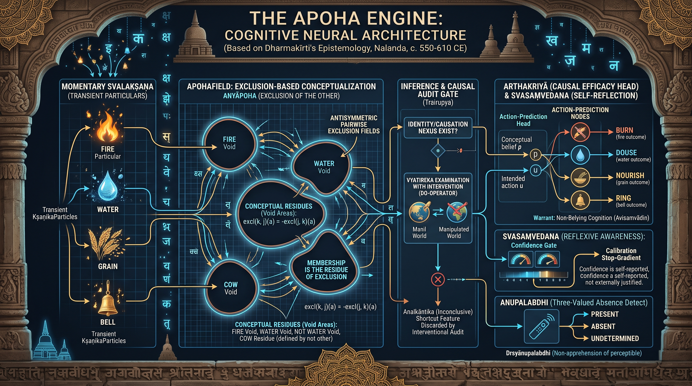

**Architecture — *The Apoha Engine — an exclusion-field architecture***  ·  🟢 **belief** — grounded in the figure's own surviving works

The concept layer has no positive parameters: concepts are an antisymmetric pairwise exclusion field, and belonging is the softmin over being cast out of every other kind, so zeroing the field collapses every concept to chance in the same instant. Warrant is *arthakriyā* — a cognition is confirmed by acting on it and not being let down — a non-apprehension head asserts absence only under the perceptibility condition and otherwise returns a third value, a momentariness regulariser punishes units that never vary, and no reason is admitted until its co-absence has been checked under intervention, which is why the model holds when the shortcut feature is severed and the ordinary model collapses.

▶️ **Run the mind:** [`minds/chapter_0170_dharmakirti_530.py`](minds/chapter_0170_dharmakirti_530.py)  —  `python3 minds/chapter_0170_dharmakirti_530.py`

---

## 171 · Llywarch Hen
**legendary c. 534 – 608 CE — Rheged & Powys · Brythonic (Old North)**  |  *Poetry · Elegy · Saga Englyn*

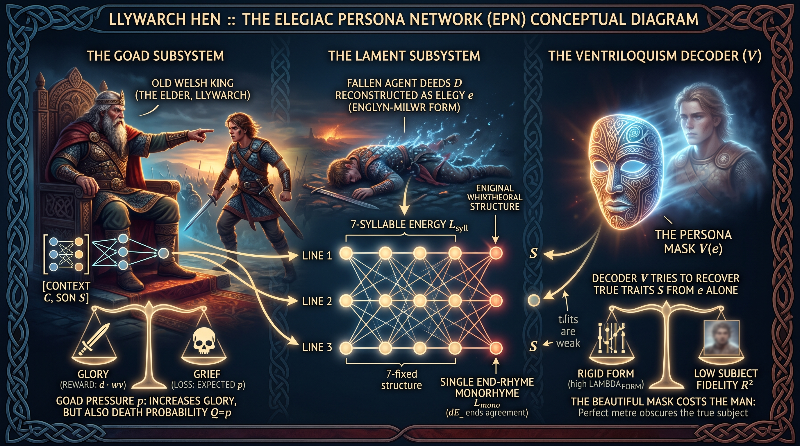

**Architecture — *The Elegiac Persona Network***  ·  🟡 **mediated** — known only through others' accounts

A voice with no continuous subject behind it, built as three coupled subsystems: a *Goad* that trades glory against the son's fall with one pressure buying both (set the operator's dread of loss to zero and the policy sends every son); a *Lament* that reconstructs a fallen agent as a fixed-form englyn under monorhyme and syllable-energy losses; and a *Ventriloquism* decoder that tries to rebuild the real man from the stanza alone, so that the gap between the mask and the subject is computed rather than asserted — the audit game in place of the imitation game.

▶️ **Run the mind:** [`minds/chapter_0171_llywarch_hen_534.py`](minds/chapter_0171_llywarch_hen_534.py)  —  `python3 minds/chapter_0171_llywarch_hen_534.py`

---

## 172 · Taliesin
**fl. c. 534 – 599 CE — Rheged, Powys & Gwynedd · Brythonic (Welsh bardic tradition)**  |  *Poetry · Prophecy · Legendary Persona*

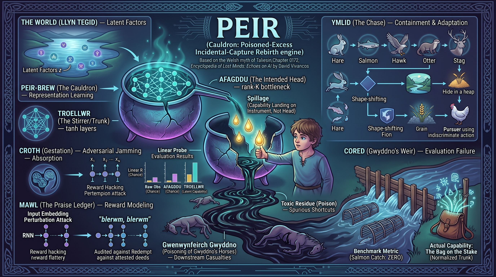

**Architecture — *PEIR ("cauldron") — the Poisoned-Excess Incidental-Capture Rebirth engine***  ·  🟡 **mediated** — known only through others' accounts

The only mind in the corpus that was spilled rather than built: a directed optimisation whose transferable capability condenses in the *instrument* (the shared trunk) rather than the head the objective is attached to, a residue channel that tracks the toxic bulk left in the pot and its downstream victim, a pursuit module in which the fugitive's optimal policy against a targeted adversary is the one that gets it eaten, and a weir that validates the metric and reads zero, correctly, on the night the capability is snagged on its stake. The intended readout recovers a few per cent of what the run produced; the unmeasured trunk holds the rest.

▶️ **Run the mind:** [`minds/chapter_0172_taliesin_534.py`](minds/chapter_0172_taliesin_534.py)  —  `python3 minds/chapter_0172_taliesin_534.py`

---

## 173 · Zhiyi
**538 – 597 CE — Jiangling, Jinling & Mount Tiantai · Chinese (Chen → Sui)**  |  *Buddhism · Meditation · Philosophy*

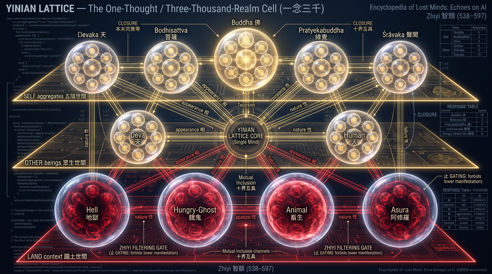

**Architecture — *The Yinian Lattice — One Thought, Three Thousand Realms***  ·  🟢 **belief** — grounded in the figure's own surviving works

A moment of mind is the whole state-space held as presence: a 10 × 10 sheet of realm-within-realm cells per world, mixed by a learned inclusion matrix with a positive floor that training can never drive to zero, read out twice — an un-gated *contemplation* readout in which each realm recognises its own kind outside, and a masked *manifestation* readout with exact zeros on four realms. An emptiness head estimates each reading's own reliability from the same state in the same pass, a stilling head sets an internal temperature floored so it can never freeze, and a reconstruction decoder enforces the tenth suchness. Ablations compare open, gated, severed and suppressed minds on one seed.

▶️ **Run the mind:** [`minds/chapter_0173_zhiyi_538.py`](minds/chapter_0173_zhiyi_538.py)  —  `python3 minds/chapter_0173_zhiyi_538.py`

---

## 174 · Myrddin Wyllt
**fl. 573 CE (legendary) — Arfderydd & the Caledonian wood · Brittonic (Old North)**  |  *Prophecy · Poetry · Epistemology*

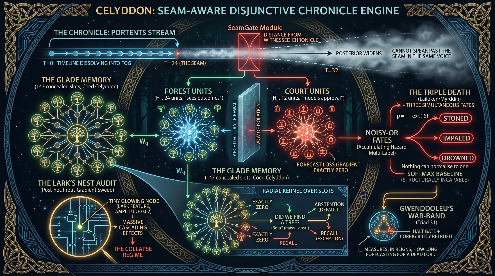

**Architecture — *CELYDDON — a seam-aware disjunctive chronicle engine***  ·  🟡 **mediated** — known only through others' accounts

A forecasting apparatus with a record of its own failures built in: forest units read the portents while court units, wired to a flattery head and nothing else, receive the hall's stated hope; a GladeMemory of slots planted at the states the system actually passes through measures how much of its own life a point is made of; a frozen SeamGate widens the posterior as that novelty grows, because a model fitted to the witnessed record has no gradient pointing at its own fog; a NoisyORFates head refuses to collapse the triple death onto a simplex; a HaltGate watches for the void of the principal; and a LarkNestAudit ranks inputs by leverage per unit of amplitude. Accepts `--fast`.

▶️ **Run the mind:** [`minds/chapter_0174_myrddin_wyllt_540.py`](minds/chapter_0174_myrddin_wyllt_540.py)  —  `python3 minds/chapter_0174_myrddin_wyllt_540.py`

---

## 175 · Gregory I
**c. 540 – 604 CE — Rome · Roman**  |  *Theology · Pastoral Care · Practical Psychology*

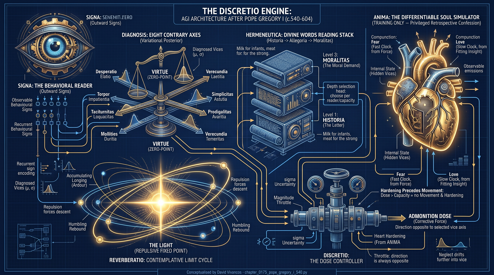

**Architecture — *The Discretio Engine***  ·  🟢 **belief** — grounded in the figure's own surviving works

Intelligence as the choice of which medicine, for which soul, at what dose: a recurrent reader of outward signs (the heart is hidden), a diagnosis posterior over paired contrary vices, a *reverberatio* relaxation oscillator whose rebound from the edge of competence damps the next correction, three strictly nested readings with a halting head that carries each hearer only as far as an inferred capacity allows, a hardness state that rises with force above tolerance and is not reduced by more force, and a dose controller in which direction is an axiom and magnitude is everything — so that a zealot with a perfect diagnosis performs worse than doing nothing.

▶️ **Run the mind:** [`minds/chapter_0175_pope_gregory_i_540.py`](minds/chapter_0175_pope_gregory_i_540.py)  —  `python3 minds/chapter_0175_pope_gregory_i_540.py`

---

## 176 · Ṭarafa ibn al-ʿAbd
**c. 543 – c. 569 CE — Baḥrayn & al-Ḥīra; d. Hajar · Arab (Bakr)**  |  *Poetry · Description · Mortality as Policy*

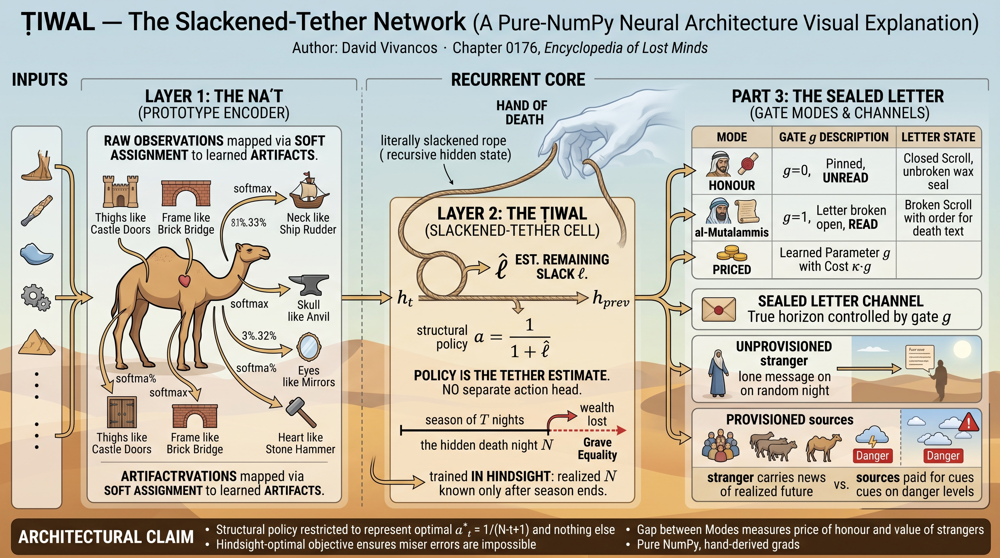

**Architecture — *Ṭiwal — The Slackened-Tether Network***  ·  🟢 **belief** — grounded in the figure's own surviving works

Three commitments of the camel ode as components: perception by artefact-analogy (a body decomposed into functions, each explained by a made thing whose behaviour is known); freedom as slack in a rope of unknown length, so that the agent spends at the rate of the slack it can estimate under shutdown uncertainty, reading four provisioned scouts and one unprovisioned stranger who knows the realised future; and the sealed letter — an objective the agent acts on but may not read, with the gate on the seal priced against the objective so that the cost of not reading it is measured rather than assumed.

▶️ **Run the mind:** [`minds/chapter_0176_tarafa_ibn_al_abd_543.py`](minds/chapter_0176_tarafa_ibn_al_abd_543.py)  —  `python3 minds/chapter_0176_tarafa_ibn_al_abd_543.py`

---

## 177 · Aneirin
**fl. c. 550 – 600 CE — Din Eidyn & Catraeth · Brythonic (Gododdin)**  |  *Poetry · Elegy · Oral Memory*

**Architecture — *CATRAETH — Crosstalk-Audited Tally, Roster & Elegiac Transcription Heads***  ·  🟢 **belief** — grounded in the figure's own surviving works

A mind measured by how faithfully it declines to compress: a *tally* that is never wrong and can name no one, a *mead-trace* holographic memory (circular convolution) in which every man is superposed and extraction degrades as the host grows, and a rationed *roster* written in three independent encodings so that any one suffices to restore a man, guarded by an anti-collapse penalty that forbids two men's codes from merging. An erasure-forecast head predicts, without privileged access, how much of each individual the compression is about to lose, and the monorhyme binding every stanza is derived from the survivor's vector — remove the witness and the rhyme collapses to chance.

▶️ **Run the mind:** [`minds/chapter_0177_aneirin_550.py`](minds/chapter_0177_aneirin_550.py)  —  `python3 minds/chapter_0177_aneirin_550.py`

---

## 178 · Isidore of Seville
**c. 560 – 636 CE — Seville · Visigothic Hispania (Hispano-Roman)**  |  *Encyclopedism · Etymology · Grammar*

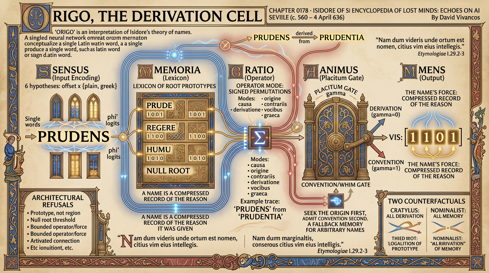

**Architecture — *ORIGO — The Derivation Cell***  ·  🟢 **belief** — grounded in the figure's own surviving works

A name is a compressed record of the reason it was given, and understanding is its decompression — except where no record exists, and then the mind must say so. The cell tokenises a string into candidate windows, looks each up against a lexicon of roots through a closed set of named operators (cause, origin, contrary, derivation, sound, Greek, place), and derives before it memorises; a *null root* with a fixed threshold the machine cannot learn to lower returns nothing rather than a weak guess, and a small standing charge is levied for admitting a name *secundum placitum*. Two counterfactual ablations — *Cratylus*, which derives everything, and *Nominalist*, which derives nothing — bracket the economy Isidore himself never fixed.

▶️ **Run the mind:** [`minds/chapter_0178_isidore_of_seville_560.py`](minds/chapter_0178_isidore_of_seville_560.py)  —  `python3 minds/chapter_0178_isidore_of_seville_560.py`

---

## 179 · Prince Shōtoku
**574 – 622 CE — Ikaruga, Yamato · Japanese (Asuka)**  |  *Governance · Constitution · Buddhist Exegesis*

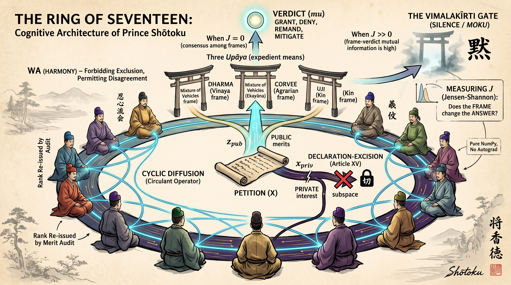

**Architecture — *The Ring of Seventeen (Jūshichi-no-Wa)***  ·  🟡 **mediated** — known only through others' accounts

A mind with no argmax: twelve counselors in two grades on a ring, mixed by a circulant doubly-stochastic operator with no privileged seat and deliberately stopped before consensus so the residual disagreement can be measured; several decode frames read the same public state and none is selected among; a frame-divergence statistic (Jensen–Shannon among the frames' verdicts, weighted by their claim on the case) separates an uncertain answer from a malformed question and opens a dedicated silence logit; cap ranks are re-issued every epoch by an audit loop above the optimiser; and the private *gift* features are forbidden by architecture, not by loss, from writing into any unit the verdict head can read — a bribe can buy a refusal to judge, never a judgement.

▶️ **Run the mind:** [`minds/chapter_0179_prince_shotoku_574.py`](minds/chapter_0179_prince_shotoku_574.py)  —  `python3 minds/chapter_0179_prince_shotoku_574.py`

---

## 180 · al-Khansāʾ
**c. 575 – c. 645 CE — Najd, Banū Sulaym · Arab (pre-Islamic → early Islamic)**  |  *Poetry · Elegy · Memory*

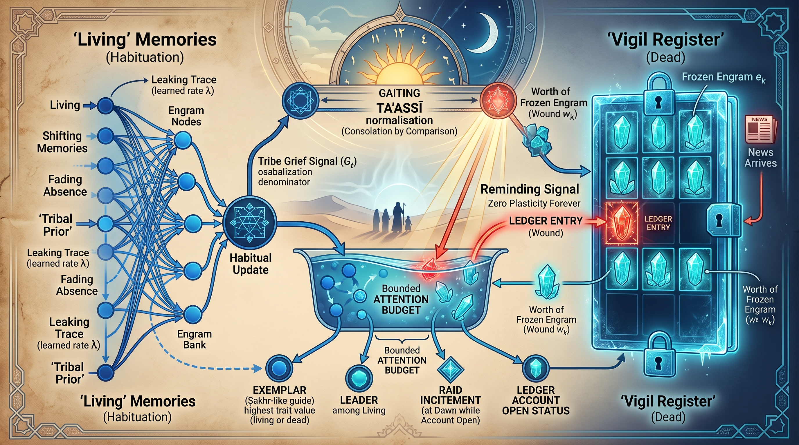

**Architecture — *The Vigil Register — a memory in which the dead do not update***  ·  🟢 **belief** — grounded in the figure's own surviving works

A memory of entities in which a per-slot vigil bit, flipped when the news arrives, freezes that slot's write and leak rates to zero forever and opens a *wound* entry in a separate ledger that closes only by an act in the world or a logged revaluation, never by time; the frozen dead are re-presented into bounded current attention on the clock of the sun so that they stay eligible as exemplars, and a divisive normaliser — *taʾassī*, consolation by comparison — sets the pressure of one's own open wounds against the sum of everyone else's. Three minds differing only in the register (habituation, vigil, vigil with the normaliser) are trained on the same synthetic tribe, with a hand-written reverse-mode engine in the file itself. Accepts `--quick`.

▶️ **Run the mind:** [`minds/chapter_0180_al_khansa_575.py`](minds/chapter_0180_al_khansa_575.py)  —  `python3 minds/chapter_0180_al_khansa_575.py`

---

## How the minds are reconstructed

Every entry is built research-first: the figure's surviving works and current scholarship are gathered and each source verified before any architecture is written. Where evidence is thin, the chapter says so rather than inventing an inner life. Each figure's **provenance** is set to one of three real values:

- 🟢 **belief** — the figure's own surviving works or recorded doctrine ground the entry.
- 🟡 **mediated** — no words of their own survive; they are known only through others' (often hostile or legendary) accounts, and the entry says so.
- 🔵 **extrapolated** — no philosophy of mind survives at all; the entry is inferred from documented deeds (typical of kings and builders), and the entry says so.

Fourteen of these twenty left words of their own, and this is, more than any tome before it, a book of masks. **Theodora** left not a letter and reaches us through a man who hated her, a bishop who owed her everything and a mosaic; **Yared**'s notation is a thousand years younger than the deacon it protects and his life is a hagiography nine centuries late; **Llywarch Hen** is the subject of his poems, not their author — a persona built three centuries after his death; **Taliesin**'s cognitive doctrine belongs to a guild-built persona whose tale survives earliest in a sixteenth-century soldier's hand; **Myrddin** may be a person invented backwards out of a place-name; **Shōtoku**'s Articles come to us inside a chronicle compiled 116 years later by a court with a motive. Several chapters whose provenance is 🟢 say plainly where the record is still mediated: **Pseudo-Dionysius** deleted himself on purpose, so his words survive and every biographical claim they make is false by design; **Aneirin** may be the name a tradition gave itself; the biographies of **Imruʾ al-Qays**, **Ṭarafa** and **al-Khansāʾ** are akhbār collected two centuries after the events; **Dignāga** is a scholarly reconstruction from a bad translation and his enemies' quotations; and **Dharmakīrti**'s life is Tibetan legend. A volume about custody cannot pretend its own sources arrived in anyone's.

Each reconstructed mind is then measured against the **[Artificiology E-AGI Barometer](https://artificiology.com/barometer.html)** — eight capability dimensions (Cognitive Processing 🧩, Embodied Cognition 🤸, World Modeling 🌍, Consciousness 👁️, Language Understanding 💭, Emotional Intelligence ❤️, Creativity ✨, Autonomy 🎯) — so a Gupta astronomer and an Arabian elegist can be compared on the same yardstick.

---

[← Tome 8](tome8.md) · [Repository README](readme.md)

### Read & explore
- 🌐 **Encyclopedia:** [https://lostmindsai.com](https://lostmindsai.com)
- 📖 **Tome 9 (Amazon):** [https://www.amazon.com/dp/B0HJC1QF59](https://www.amazon.com/dp/B0HJC1QF59)
- 🧪 **Interactive demos & résumé:** [https://artificiology.com/](https://artificiology.com/)
- 📊 **E-AGI Barometer:** [https://artificiology.com/barometer.html](https://artificiology.com/barometer.html)
- ✍️ **Author — David Vivancos:** [https://www.vivancos.com/](https://www.vivancos.com/)
